***

# Sprawozdanie zbiorcze z zajęć 05-07 – Metodyki DevOps
**Imię i nazwisko:** Kinga Sulej  
**Grupa:** 6  
**Dotyczy:** Wdrożenie kompletnego potoku CI/CD w środowisku Jenkins & Docker oraz przygotowanie środowiska Ansible.

---

## 1. Przygotowanie środowiska Jenkins i Docker-in-Docker (Zajęcia 5)

Pierwszym etapem prac było uruchomienie stabilnego środowiska serwera ciągłej integracji Jenkins, współpracującego ze środowiskiem Docker-in-Docker (DinD).

**1.1. Obraz eksponujący środowisko DinD i Blue Ocean**
Uruchomiono obraz eksponujący bezpieczne środowisko zagnieżdżone:
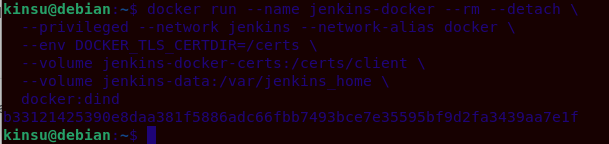

Następnie przygotowano dedykowany plik `Dockerfile` celem zbudowania obrazu zawierającego interfejs Blue Ocean, opierając się na oficjalnej dokumentacji:
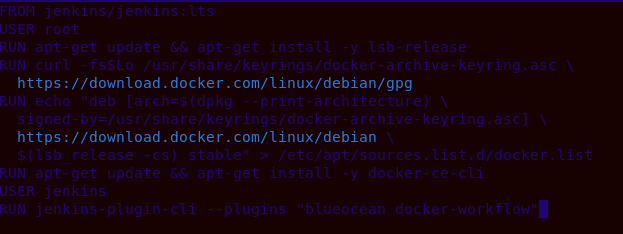

Zbudowano obraz poleceniem `docker build -t myjenkins-blueocean:latest .`. Bazowy obraz zawiera wyłącznie podstawowy serwer Jenkinsa. Przygotowany na jego podstawie nowy obraz różni się tym, że ma zainstalowanego klienta `docker-ce-cli` (co pozwala mu na komunikację ze środowiskiem zagnieżdżonym DinD) oraz preinstalowane wtyczki Blue Ocean, które znacząco poprawiają czytelność i nowoczesność interfejsu graficznego.


Uruchomienie kontenera Blue Ocean:
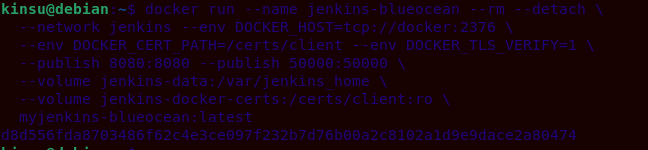

**1.2. Konfiguracja początkowa i archiwizacja danych**
Zabezpieczono dane serwera (logi, konfigurację, projekty) poprzez zmapowanie katalogu domowego do nazwanego woluminu Dockera `jenkins-data` (`--volume jenkins-data:/var/jenkins_home`). Dzięki temu zabiegowi, konfiguracja środowiska oraz dane historyczne przetrwają nawet w przypadku usunięcia i ponownego powołania kontenera. 

Po wyciągnięciu hasła startowego z logów (`docker logs jenkins-blueocean`), zainstalowano sugerowane wtyczki i utworzono konto administratora.

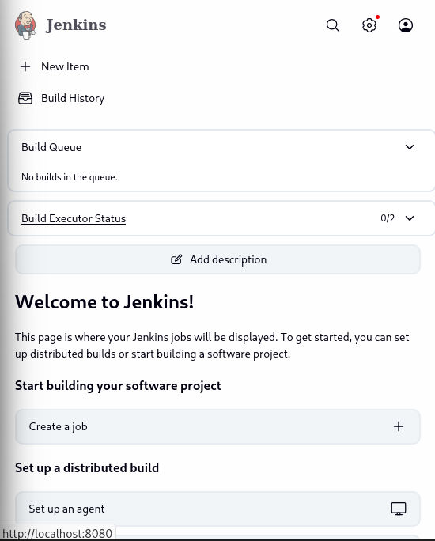

**1.3. Uruchomienia testowe obiektów typu Pipeline**
W celu weryfikacji poprawnego działania instancji utworzono eksperymentalne potoki (Pipeline):
* **Zadanie z `uname`:**
  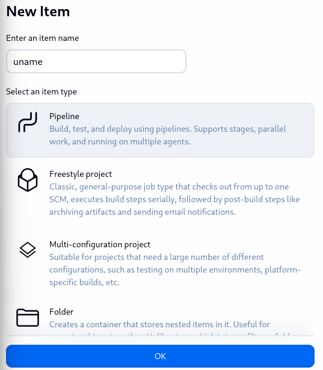  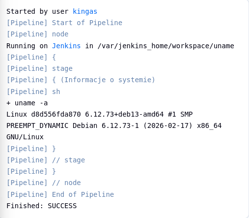
* **Zadanie walidujące parzystość godziny:**
  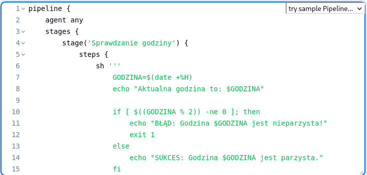 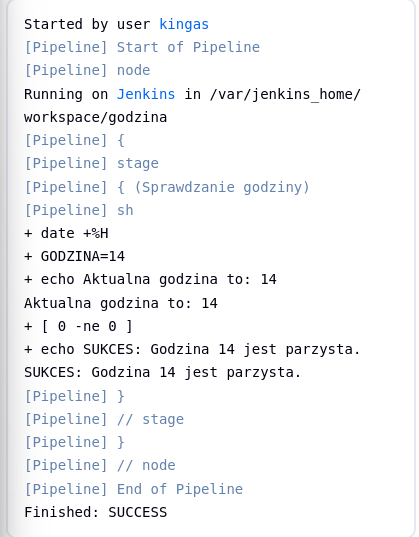 
* **Pobieranie obrazu poleceniem `docker pull`:**
  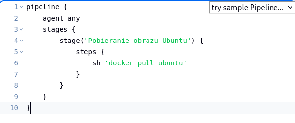 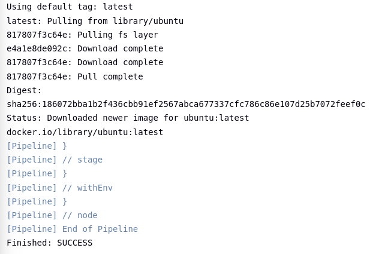
* **Pobranie kodu z SCM:** Stworzono obiekt `budowazrepo`, weryfikując poprawność działania klonowania plików infrastruktury i użycia pamięci podręcznej (cache) przy ponownym uruchomieniu potoku.
   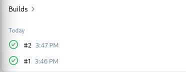

---

## 2. Architektura i projekt procesu CI/CD (Zajęcia 6)

### 2.1. Wymagania wstępne
* Działająca instancja serwera CI (Jenkins) uruchomiona jako kontener Docker.
* Skonfigurowane i połączone środowisko zagnieżdżone Docker-in-Docker (DinD).
* Repozytorium z kodem źródłowym wybranej aplikacji (`url-parse` w środowisku Node.js) z przypisanymi plikami `Dockerfile.build`, `Dockerfile.test` i `Jenkinsfile`.

### 2.2. Diagramy UML procesu CI
**Diagram aktywności (Kolejne etapy CI):**


**Diagram wdrożeniowy (Relacje i architektura):**


### 2.3. DinD vs klasyczny kontener CI
Instalacja narzędzi (np. kompilatorów, Git, npm) bezpośrednio na głównym kontenerze CI (Jenkins) prowadzi do zaśmiecania środowiska ("bałaganu") i konfliktów zależności między projektami. Zastosowanie środowiska **Docker-in-Docker (DinD)** rozwiązuje ten problem. Jenkins pełni w nim wyłącznie rolę orkiestratora. Sam proces budowania odbywa się w wyizolowanych kontenerach tworzonych ad-hoc przez DinD, które po wykonaniu zadania są natychmiast usuwane. Architektura ta gwarantuje powtarzalność, czystość i najwyższy standard bezpieczeństwa.

---

## 3. Implementacja kompletnego Pipeline'u CI/CD (Zajęcia 6 i 7)

Kroki potoku zostały zaprogramowane w pliku `Jenkinsfile` bezpośrednio w repozytorium. Składają się z 5 niezależnych etapów:

1. **Collect (Checkout SCM)**
   Pobranie kodu źródłowego z prywatnego repozytorium do przestrzeni roboczej Jenkinsa przy każdym uruchomieniu zlecenia.
2. **Build (Budowa środowiska z zależnościami)**
   Tworzony jest ciężki obraz budujący (Builder) w oparciu o pełen obraz kontenera i plik `Dockerfile.build`. W tym kontenerze zachodzi proces kompilacji i pobierania modułów zewnętrznych (`npm install`).
3. **Test**
   Z obrazu `Builder` budowany jest efemeryczny obraz do celów testowych (`Dockerfile.test`). Uruchamiana jest komenda walidująca (np. `npm test`), co potwierdzają pełne logi odłożone na Jenkinsie.
4. **Deploy (Wdrożenie docelowe i Smoke Test)**
   Do celów produkcyjnych odrzucono obraz `node` na rzecz **`node-slim`**. 
   *Różnica:* Obraz `node` jest "ciężki" (zawiera pełne środowisko i narzędzia deweloperskie – idealny jako Builder). Z kolei `node-slim` zawiera jedynie okrojony system operacyjny z niezbędnym silnikiem, stanowiąc optymalne, odseparowane od narzędzi deweloperskich środowisko uruchomieniowe. Zaimplementowano procedurę uruchomienia tzw. *Smoke Testu*, polegającego na powołaniu tego lekkiego kontenera do życia i zweryfikowaniu, czy aplikacja wstaje bez błędów.
   
5. **Publish (Pakowanie i udostępnienie artefaktu)**
   Podjęto decyzję biznesową, by wynikiem potoku była skompresowana paczka redystrybucyjna (`.tgz`). Jest to natywny i wysoce przenośny format w ekosystemie NPM. Omija on konieczność wypychania ciężkich obrazów na publiczne rejestry kontenerów. Po fazie Build artefakt wydobywany jest z kontenera (`docker cp`) i trwale eksportowany w widoku podsumowania serwera CI za pomocą dyrektywy `archiveArtifacts`.
   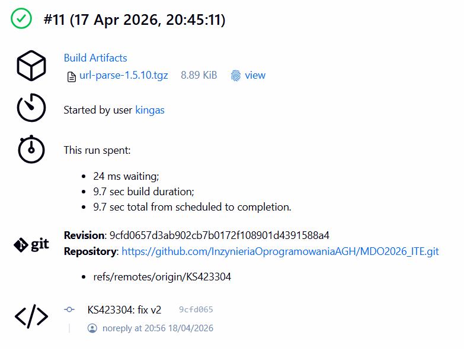

### Pliki konfiguracyjne potoku
Pliki zostały umieszczone w repozytorium, co czyni infrastrukturę w pełni kodowaną (Infrastructure as Code). 

<details>
<summary><b>Rozwiń: Dockerfile.build</b></summary>

```dockerfile
FROM node:18-slim
RUN apt-get update && apt-get install -y git
WORKDIR /app
RUN git clone https://github.com/unshiftio/url-parse.git .
RUN npm install 
```  
</details>

<details>
<summary><b>Rozwiń: Dockerfile.test</b></summary>
  
```dockerfile
FROM my-build:latest
CMD ["npm", "test"] 
```
</details>

<details>
<summary><b>Rozwiń: Jenkinsfile</b></summary>

```groovy
pipeline {
    agent any
    stages {
        stage('Collect') {
            steps {
                echo 'Pobieranie kodu z repozytorium'
                checkout scm
            }
        }
        stage('Build') {
            steps {
                dir('KS423304/Spr6') {
                    echo 'Budowanie obrazu bazowego'
                    sh 'docker build -t aplikacja-build:latest -f Dockerfile.build .'
                }
            }
        }
        stage('Test') {
            steps {
                dir('KS423304/Spr6') {
                    echo 'Budowanie obrazu testowego i uruchamianie testów'
                    sh 'docker build -t aplikacja-test:latest -f Dockerfile.test .'
                    sh 'docker run --rm aplikacja-test:latest'
                }
            }
        }
        stage('Deploy') {
            steps {
                dir('KS423304/Spr6') {
                    echo 'Wdrażanie'
                    sh 'docker run --rm node:18-slim node -e "console.log(\'Deploy udany\')"'
                }
            }
        }
        stage('Publish') {
            steps {
                dir('KS423304/Spr6') {
                    echo 'Pakowanie i publikacja artefaktu'
                    sh '''
                    docker rm -f temp-pack || true
                    docker run --name temp-pack aplikacja-build:latest npm pack
                    docker cp temp-pack:/app/url-parse-1.5.10.tgz .
                    docker rm temp-pack
                    '''
                }
                archiveArtifacts artifacts: 'KS423304/Spr6/*.tgz', fingerprint: true
            }
        }
    }
}
```  
</details>

---

## 4. Weryfikacja list kontrolnych i „Definition of Done”

### 4.1. Ścieżka krytyczna CI/CD
- [x] **commit** (automatyczne pobranie zmian z systemu kontroli Git)
- [x] **clone** (pobranie niezbędnych plików do przestrzeni roboczej)
- [x] **build** (zbudowanie środowiska z zależnościami)
- [x] **test** (wykonanie testów w dedykowanym środowisku)
- [x] **deploy** (weryfikacja na lekkim kontenerze docelowym)
- [x] **publish** (wygenerowanie i udostępnienie artefaktu na Jenkinsie)

### 4.2. Lista kontrolna Jenkinsfile
- [x] **Przepis dostarczany z SCM.** Konfiguracja potoku ustawiona na opcję *Pipeline script from SCM*.
  
- [x] **Pracujemy na najnowszym (a nie cache'owanym) kodzie.** Klonowanie fresh-kodu z GitHuba oraz stosowanie flagi `--rm` podczas uruchamiania kontenerów gwarantują brak stanów zapalnych po starych wykonaniach.
- [x] **Etap Build dysponuje plikami Dockerfile.** Realizowane poprzez wejście do katalogu roboczego dyrektywą `dir()`.
- [x] **Tworzenie obrazu buildowego.** Polecenie `docker build -t aplikacja-build:latest`.
- [x] **Etap Test.** Poprawne wywołanie polecenia walidującego w izolacji, pomyślne wykonanie pakietu unit-testów.
  
- [x] **Etap Deploy i Publish.** Wygenerowanie paczki, potwierdzenie gotowości środowiska (`node-slim`) i archiwizacja w strukturach potoku. Uruchomienie ponowne wielokrotnie kończy się zielonym statusem.
  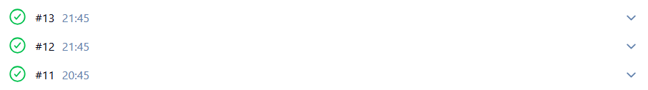

### 4.3. Definition of Done
Proces zrealizowano skutecznie. Na końcu powstaje gotowy, niezależny artefakt dystrybucyjny.
1. **Czy obraz może być uruchomiony w Dockerze bez modyfikacji?**
   Tak. Artefakt odpala się na zupełnie surowym kontenerze docelowym `node:18-slim`, co zostało udowodnione pomyślnym wykonaniem testu powdrożeniowego (Smoke Test). Nie wymaga to ze strony operatora modyfikacji jakiegokolwiek kodu, wykluczając syndrom "u mnie działa".
2. **Czy dołączony do jenkinsowego przejścia artefakt ma szansę zadziałać od razu na maszynie docelowej?**
   Tak. Wynikowym obiektem jest ustandaryzowana paczka ekosystemu (plik `url-parse-1.5.10.tgz`). Wystarczy w docelowym środowisku operacyjnym, posiadającym środowisko uruchomieniowe (np. silnik Node), wykonać prostą instalację, a aplikacja będzie natychmiast gotowa do działania.
   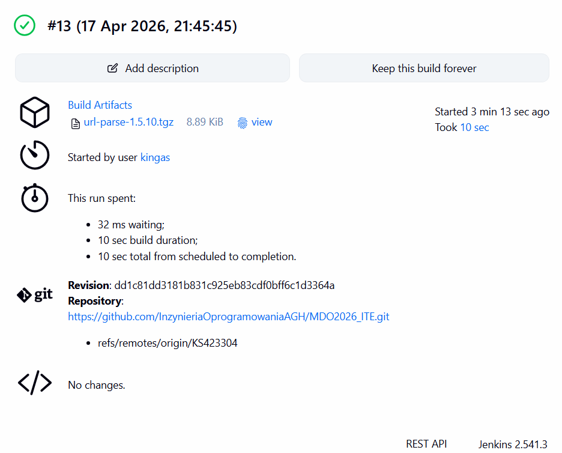

---

## 5. Przygotowanie środowiska pod narzędzie Ansible (Zajęcia 7)

Przygotowano maszynę wirtualną na potrzeby przyszłej konfiguracji zdalnej za pośrednictwem Ansible. Celem była maksymalna redukcja wagi systemu celowego.

**1. Utworzenie maszyny docelowej (`ansible-target`)**
Podczas instalacji systemu Debian GNU/Linux celowo pominięto graficzne środowisko pulpitu (GNOME/KDE), pozostawiając go jako maszynę typu *headless*.
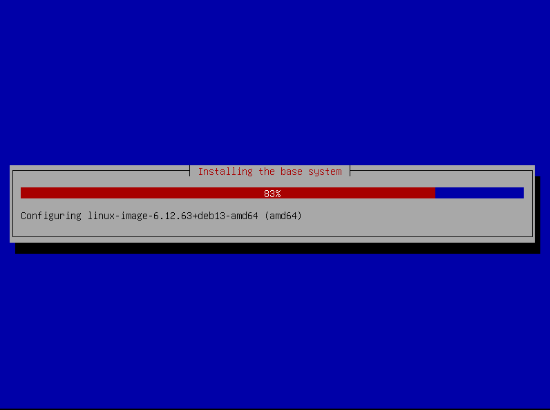

**2. Instalacja pakietów systemowych, zmiana nazwy hosta i konfiguracja konta**
Zainstalowano niezbędne moduły połączeniowe (`ssh` i serwer `sshd`) oraz program archiwizujący `tar`. Ustawiono wymaganą nazwę hosta i dodano dedykowanego użytkownika z uprawnieniami celowymi:
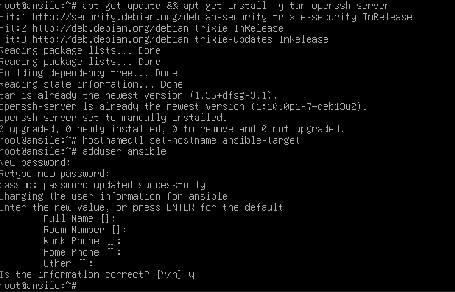

**3. Migawka środowiska**
Dla bezpieczeństwa utworzono migawkę (Snapshot) czystego systemu:
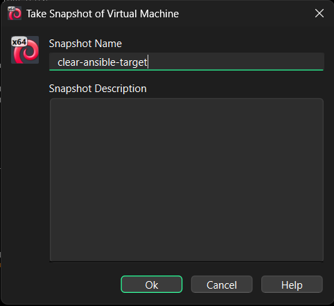

**4. Instalacja oprogramowania Ansible (Główny Host)**
Na podstawowej stacji roboczej wyposażonej w graficzny interfejs zainstalowano centralne oprogramowanie Ansible wykorzystując standardowe pule z repozytorium dystrybucji.


**5. Uwierzytelnianie na bazie pary kluczy asymetrycznych (Bezhasłowe SSH)**
W celu udostępnienia pełnej automatyzacji, Ansible musi posiadać transparentny dostęp do środowisk docelowych. 
Wygenerowano nową parę kluczy protokołu SSH (RSA):

Następnie klucz publiczny przeniesiono za pomocą instrukcji `ssh-copy-id` na docelowy serwer i zweryfikowano poprawność bezpośredniego, bezhasłowego logowania na sesję konta `ansible@ansible-target`. Logowanie do powłoki nowej maszyny przebiega poprawnie.

