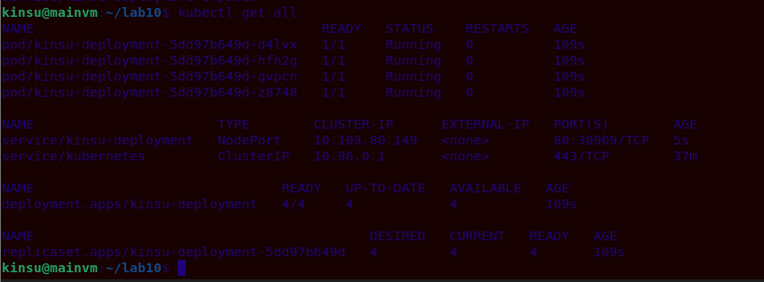
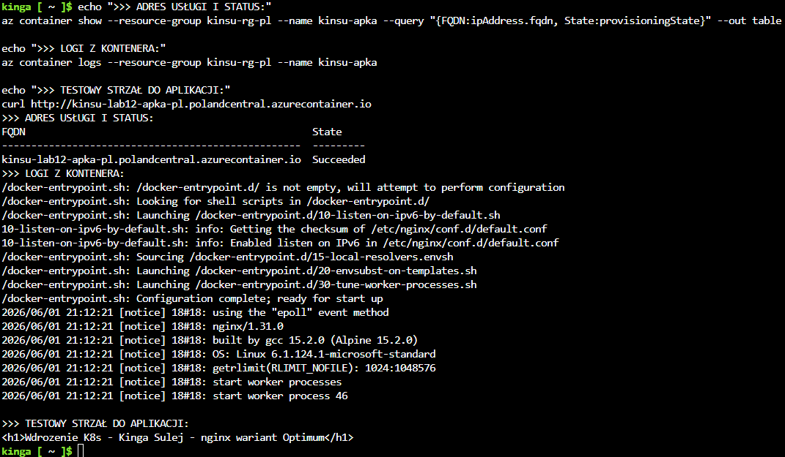

# Sprawozdanie z laboratoriów 8-12

**Imię i nazwisko:** Kinga Sulej

**Grupa:** 6

Automatyzacja konfiguracji, konteneryzacja, orkiestracja K8s oraz wdrożenia chmurowe.

## Laboratorium 8: Automatyzacja konfiguracji z narzędziem Ansible

**Cel zajęć:** Automatyzacja procesu instalacji środowiska i wdrożenie na nim aplikacji webowej za pomocą Ansible.

**Przebieg realizacji:**

* Przygotowano dwie maszyny wirtualne z systemem Debian – maszynę główną (`ansible-master`) oraz docelową (`ansible-target`). Skonfigurowano lokalne mapowanie nazw DNS w pliku `/etc/hosts`.
* Wygenerowano parę kluczy RSA poleceniem `ssh-keygen`, a następnie skopiowano klucz publiczny na węzeł docelowy za pomocą `ssh-copy-id`, co umożliwiło wykonywanie operacji bez podawania haseł.
* Utworzono plik `inventory.ini`, w którym zdefiniowano grupę hostów docelowych, co ułatwia zarządzanie wieloma serwerami jednocześnie.
* Wykorzystując strukturę katalogów wymuszaną przez narzędzie `ansible-galaxy`, utworzono rolę o nazwie `deploy_app`, co pozwoliło to na hermetyzację zadań (tasks), zmiennych (vars) oraz procedur obsługi (handlers).
* W głównym pliku zadań roli zdefiniowano kroki instalacyjne oparte na modułach Ansible. Użyto modułu `apt` do aktualizacji pakietów i instalacji silnika Docker.
* Zastosowano moduł `copy` do przesłania skompresowanego artefaktu aplikacji (`.tgz`) na zdalny serwer. Następnie wykorzystano moduł `docker_container`, aby uruchomić środowisko Node.js, podmontować przesłany kod (wolumeny) i wystawić aplikację na odpowiednim porcie.

Przeprowadzone testy wykazały, że ponowne wykonanie playbooka na Ansible nie wprowadza zbędnych zmian w już poprawnie skonfigurowanym systemie. Zastosowanie modułów Ansible zamiast poleceń shell wpłynęło pozytywnie na czytelność oraz bezpieczeństwo automatyzacji.

---

## Laboratorium 9: Automatyzacja instalacji systemu operacyjnego 

**Cel zajęć:** Nienadzorowana, w pełni zautomatyzowana instalacja i konfiguracja systemu operacyjnego Linux (Fedora)

**Przebieg realizacji:**

* Wykorzystano domyślny plik konfiguracyjny wygenerowany przez instalator Fedory jako bazę. Zmodyfikowano go pod kątem w pełni bezinteraktywnej instalacji, usuwając konieczność ręcznego potwierdzania licencji czy układu klawiatury.
* Zdefiniowano automatyczne czyszczenie dysku i przydział partycji (dyrektywa `clearpart --all --initlabel` oraz `autopart`). Skonfigurowano statyczny przydział interfejsu sieciowego.
* Wskazano minimalny zestaw oprogramowania do instalacji, dołączając niezbędne narzędzia oraz środowisko uruchomieniowe `nodejs`, które stanowiło rdzeń dla serwowanej aplikacji. W tej kluczowej sekcji pliku zaimplementowano kod powłoki uruchamiany na samym końcu instalacji. Skrypt wykorzystywał narzędzie `wget` do pobrania z sieci lokalnej (z maszyny hosta) paczki `.tgz` z kodem źródłowym aplikacji.
* Skrypt stworzył plik `/etc/systemd/system/pipeline-app.service`. Skonfigurowano w nim polecenie startowe oraz użytkownika.

Wykorzystanie takiego rozwiązania pozwala na skalowalne wdrażanie identycznych środowisk systemowych np. na serwerach, co może stanowić fundament pod budowę infrastrukury chmurowej czy wirtualnej dużo szybciej, niż przez manualne przechodzenie przez instalator, szczególnie gdy konieczna jest instalacja wielu środowisk. 

---

## Laboratorium 10: Konteneryzacja i wprowadzenie do Kubernetes

**Cel zajęć:** Uruchomienie lokalnego klastra, konteneryzacja prostej aplikacji webowej oraz ppowołanie jego zasobów.

* Z racji ograniczeń sprzętowych maszyny wirtualnej, klaster Kubernetes zainicjowano z rygorystycznymi limitami flagami `--memory=1800 --cpus=2`.
* Zdefiniowano plik `Dockerfile` oparty na lekkim obrazie serwera Nginx. Zastąpiono domyślną stronę powitalną autorskim plikiem `index.html` (wersja `v1`), a następnie zbudowano obraz lokalnie za pomocą polecenia `docker build`.
* Aby ominąć konieczność publikacji obrazu w globalnym rejestrze Docker Hub, wykorzystano polecenie `minikube image load`, które wstrzyknęło zbudowany artefakt bezpośrednio do wewnętrznego repozytorium klastra.
* Utworzono plik `deployment.yaml`. Zdefiniowano w nim obiekt K8s zarządzający aplikacją, żądając powołania dokładnie 4 replik. Wskazano selektory etykiet (`app: kinsu-apka`), które łączyły logicznie Pody z ich kontrolerem.
* Utworzono obiekt typu `Service` działający w trybie `NodePort`, który połączył port wewnętrzny kontenera (80) z wysokim portem na węźle hosta, umożliwiając ruch z zewnątrz.

Przejście od manualnego uruchamiania pojedynczych kontenerów do orkiestracji za pomocą Kubernetes pozwala na deklaratywne zarządzanie stanem aplikacji. Klaster automatycznie monitoruje Pody i w razie ich awarii uruchamia nowe, zachowując zadeklarowaną liczbę replik.

---

## Laboratorium 11: Zarządzanie cyklem życia w K8s i strategie wdrożeń

**Cel zajęć:** Zaawansowana manipulacja kontrolerem Deployment, skalowanie aplikacji w locie oraz implementacja i badanie różnych strategii aktualizacji (Rollout).

* Badano zachowanie klastra poprzez modyfikację parametru `replicas` w pliku YAML. Skutecznie skalowano wdrożenie z 4 do 8 replik, następnie minimalizowano do 1 i 0 instancji, obserwując natychmiastowe reakcje demona kubelet.
* Wdrożono nową wersję obrazu (`v2`). Kubernetes automatycznie rozpoczął wdrażanie płynne, bez przerywania dostępności usługi.
* Do klastra celowo zaaplikowano uszkodzony obraz Dockera (`error`), wymuszając awarię procesu głównego. Klaster zatrzymał aktualizację oznaczając wadliwe pody statusem `CrashLoopBackOff`. Środowisko naprawiono poleceniem `kubectl rollout undo`, które przywróciło poprzednią stabilną rewizję z historii wdrażania.
* Wdrożono konfigurację całkowicie ubijającą stare środowisko przed postawieniem nowego. Konfiguracja ta uchroniła aplikację przed równoległym działaniem dwóch różnych wersji oprogramowania kosztem wygenerowania przerwy w dostępie (downtime).
* Zmodyfikowano domyślne parametry płynnej aktualizacji, co pozwoliło na precyzyjną kontrolę narzutu na zasoby serwera podczas rotacji podów.
* Zbudowano rozdzielenie ruchu sieciowego. Utworzono dwa niezależne Deploymenty (`stable` i `canary`) połączone jednym serwisem i kierującym się wspólną etykietą. Pozwoliło to na skierowanie małego procenta żądań do nowej wersji aplikacji.

Kubernetes oferuje wbudowane, bardzo bezpieczne mechanizmy wdrażania aktualizacji. Poprawnie skonfigurowane parmetry chronią produkcję przed pomyłkami, nie dopuszczając do skierowania ruchu klienta na niedziałający kontener.

---

## Laboratorium 12: Wdrażanie w środowisku chmurowym (Microsoft Azure)

**Cel zajęć:** Przeniesienie lokalnej architektury kontenerowej do chmury publicznej w modelu zarządzanym (Serverless Containers) z użyciem usług Microsoft Azure.

* Wymogiem infrastruktury chmurowej jest dostępność obrazu w publicznej przestrzeni. Obraz aplikacji Nginx otagowano odpowiednim identyfikatorem i wypchnięto do globalnego rejestru Docker Hub za pomocą poleceń `docker tag` oraz `docker push`.
* Prace administracyjne zrealizowano z pominięciem interfejsu graficznego, logując się do terminala w przeglądarce (Bash).
* Utworzono izolowaną grupę zasobów wymaganą przez Azure do alokacji budżetu i regionu. Z powodu blokad dla subskrypcji studenckich aktywowano region `polandcentral`. Ponadto ręcznie zarejestrowano wtyczkę `Microsoft.ContainerInstance`.
* Powołano do życia Azure Container Instance komendą `az container create`. Skonfigurowano publiczny dostęp poprzez zdefiniowanie flagi `--dns-name-label`. Precyzyjnie określono żądania sprzętowe, alokując 1 rdzeń procesora (`--cpu 1`) oraz 1.5 GB pamięci RAM (`--memory 1.5`). Zdefiniowano, że aplikacja bazuje na środowisku Linux.
* Przy użyciu polecenia `az container show` wydobyto zewnętrzny adres FQDN. Narzędziem `az container logs` sprawdzono wejścia logów systemowych kontenera.
* Po zakończeniu testów potwierdzających dostępność strony (test `curl`), cała zagnieżdżona grupa zasobów została usunięta poleceniem `az group delete`.

Azure Container Instances pozwala na szybkie wdrożenie aplikacji w kontenerze, wyciągnięcie jej do globalnej sieci i automatyczne przypisanie adresu URL. Ściąga to z konieczność zarządzania systemem operacyjnym czy maszynami, pozwalając skupić się wyłącznie na działającym kodzie kontenera.
