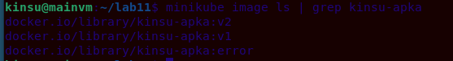
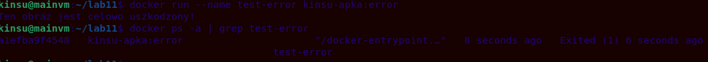
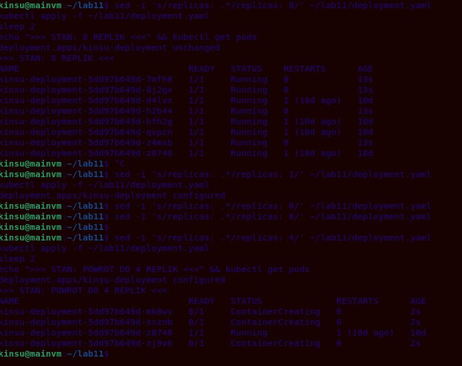
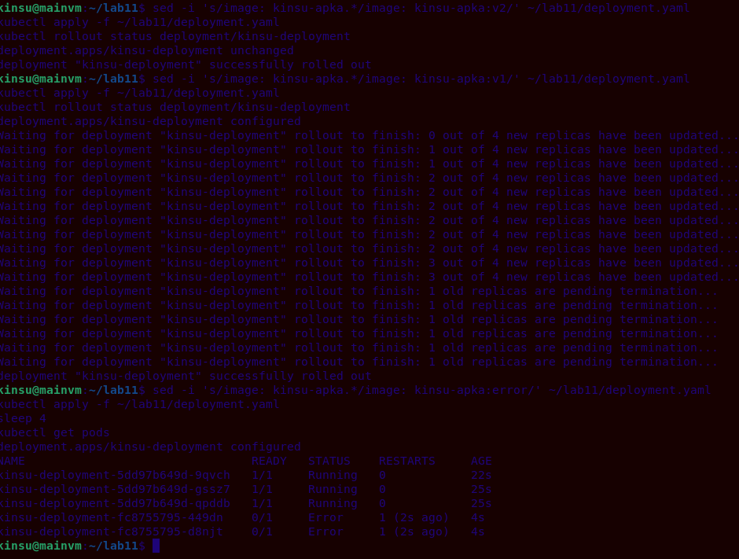
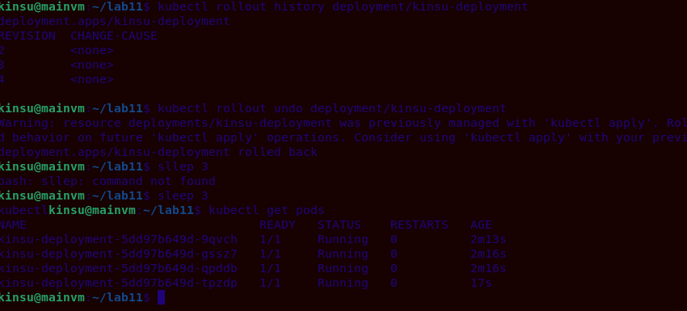
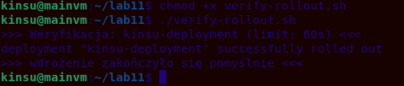

## Sprawozdanie z zajęć 11 – Kinga Sulej gr. 6

### Przygotowanie nowego obrazu 

Zgodnie z wariantem wybranym w poprzednim laboratorium, jako bazy użyto obrazu `nginx`, modyfikując go własnoręcznie. Na podstawie instrukcji zastosowano metodę ręcznego załadowania obrazów do pamięci klastra (`minikube image load`).

W celach testowych przygotowano: 

1. Wersja 2 (`kinsu-apka:v2`) – ze zmodyfikowaną zawartością pliku `index.html` (zmianan konfiguracji)
2. Wersja wadliwa (`kinsu-apka:error`) – uruchomienie obrazu kończy się błędem 

Komendy użyte do zbudowania i załadowania obrazów:
```
docker build -t kinsu-apka:v2 -f Dockerfile.v2 .
minikube image load kinsu-apka:v2
```

Wersja 2 - z błędem
```
docker build -t kinsu-apka:error -f Dockerfile.error .
minikube image load kinsu-apka:error
```

Środowisko Minikube poprawnie zaindeksowało wszystkie wymagane wersje:



W celu potwierdzenia zachowania wadliwego obrazu, przeprowadzono próbę jego uruchomienia - zgodnie z założeniami, nie podejmuje on pracy – zaraz po starcie zwraca komunikat i kończy proces ze statusem `Exited (1)`.



### Zmiany w deploymencie

Zaktualizowano plik YAML modyfikując parametr `replicas` i za każdym razem aplikując zmiany do klastra.

Przetestowano kolejno: 
* zwiększenie replik do 8
* zmniejszenie liczby replik do 1, a następnie do 0
* ponowne przeskalowanie w górę do 4 działających instancji



Kolejnym etapem była modyfikacja deklaracji obrazu w pliku wdrożenia.
Zastosowano kolejno
* nową wersję obrazu (`kinsu-apka:v2`)
* powrót do starszej wersji obrazu (`kinsu-apka:v1`)
* zastosowanie "wadliwego" obrazu (`kinsu-apka:error`)

Po wdrożeniu uszkodzonego obrazu, dwa pody wpadły w status Error



W celu naprawy środowiska, wyświetlono listę poleceniem `kubectl rollout history`, a następnie awaryjnie wycofano wdrożenie wadliwego obrazu za pomocą polecenia `kubectl rollout undo`, co spowodowąło natychmiastowe przywrócenie aplikacji do ostatniej poprawnej werjsi:  



### Kontrola wdrożenia 

Na podstawie polecenia `kubectl rollout history`, wykonanego w poprzednim punkcie (widocznego na zrzutach ekranu), można zauważyć, że wdrażanie stabilnych wertsji obrazów zakończyły się sukcesem - stare pody zostały usnięte, nowe zostały utworzone. 
Podczas wdrażania obrazu z błędem, aplikacja uległa awarii - k8s pozostawił część starszych podów przy życiu i wstrzymał rollout, pozostałe wpadły w "error".
Zastosowanie polecenia `kubectl rollout undo` spowodowało powrót do ostatniej stabilnej rewizji - problematyczne pody zostały usunięte, a klaster powrócił do pożądanego stanu.

Skrypt powłoki Bash (`verify-rollout.sh`), który weryfikuje, czy proces wdrażania zakończył się przed upływem 60s.  

Zawartość skryptu `verify-rollout.sh`:

```bash 
#!/bin/bash
DEPLOYMENT="kinsu-deployment"
TIMEOUT="60s"

echo ">>> Weryfikacja: $DEPLOYMENT (limit: $TIMEOUT) <<<"

if kubectl rollout status deployment/$DEPLOYMENT --timeout=$TIMEOUT; then
    echo ">>> wdrożenie zakończyło się pomyślnie <<<"
    exit 0
else
    echo ">>> wdrożenie nie zdążyło się wykonać w ciągu $TIMEOUT! <<<"
    exit 1
fi
```

Wykonanie skryptu w środowisku: 


### Strategie wdrożenia

W celu zaobserwowania różnic w zarządzaniu cyklem życia aplikacji, przygotowano trzy yamle implementujące główne strategie wdrażania.

1. Strategia Recreate - k8s najpierw całkowicie usuwa wszystkie działające pody w starszej wersji i dopiero gdy znikną, uruchamia je w nowej. 
Różnice - brak konfliktów wersji, za to wystąpi chwilowy downtime 

2. Strategia Rolling Update - płynna aktualizacja, stare pody są stopniowo usuwane i zastępowane nowymi.
Różnice - brak downtime, ale może wystąpić konflikt wersji 

3. Wdrożenie Canary - polegający na wypuszczeniu nowej wersji na fragmencie infrastruktury obok działającej stabilnej wersji - zrealizowano za pomocą dwóch niezależnych deploymentów i jednego punktu wejściowego.
- utworzono deployment *Stable* (3 repliki) oraz *Canary* (1 replika), oba posiadające wspólną etykietę główną, ale różniącą się etykietą "track"
* wykorzystano obiekt service, którego selektor odpytuje wyłącznie o etykietę `app: apka-canary`, dzięki czemu ~75% ruchu trafia na starą wersję, a ~25% na kanarka

Zainicjalizowanie wszystkich opisanych strategii na klastrze K8s: 


