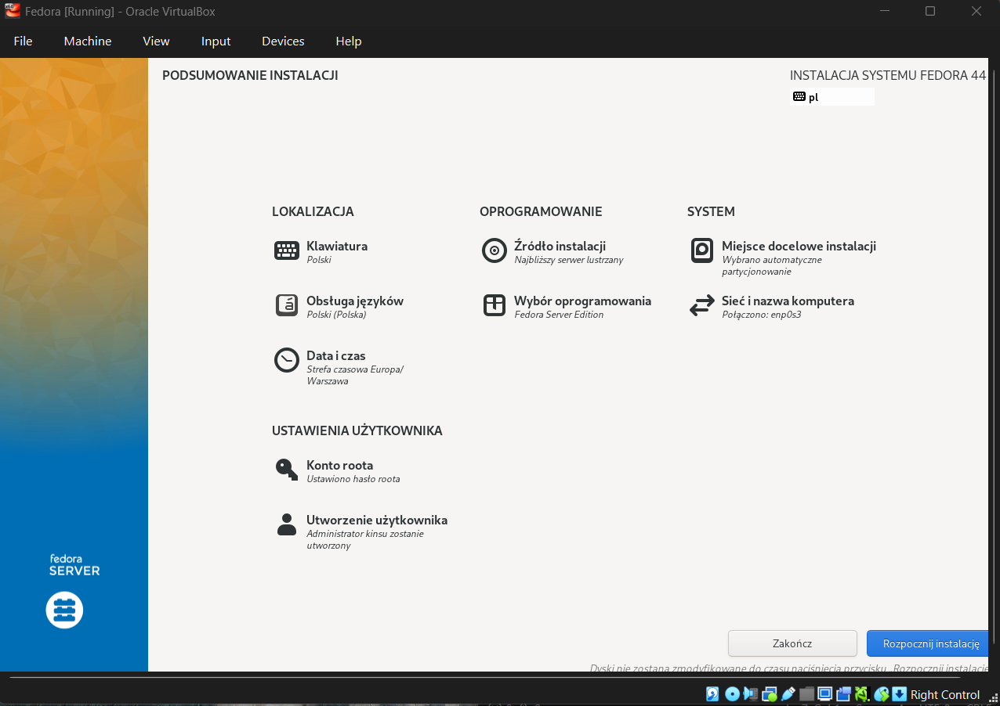
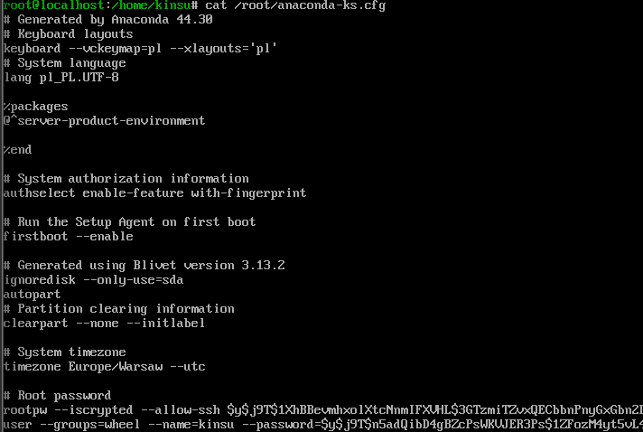
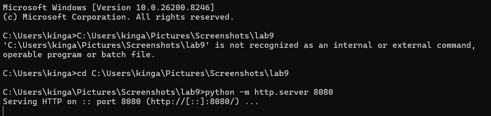
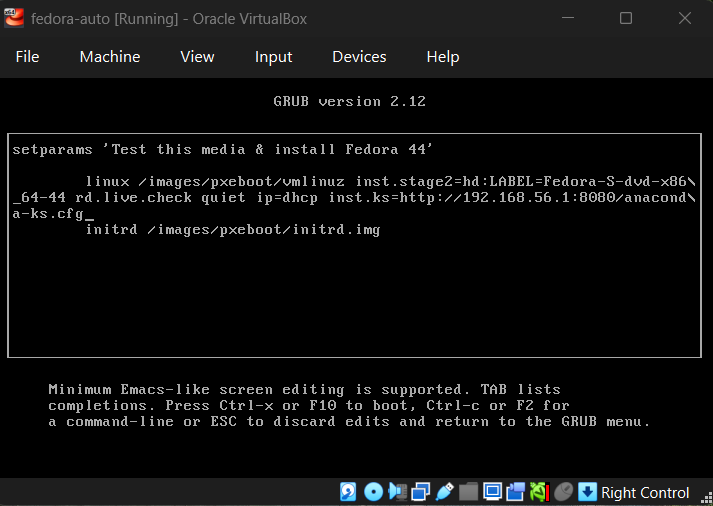
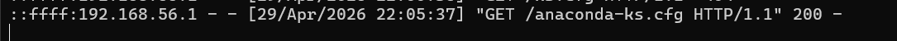
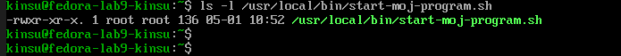
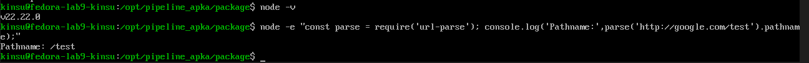
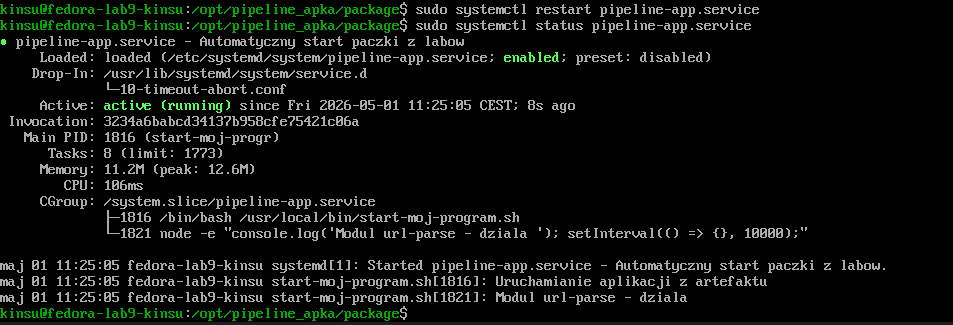

## Sprawozdanie z zajęć 09 – Kinga Sulej gr. 6


1. Instalacja systemu Fedora 

Pobrano obraz .iso ze strony https://fedoraproject.org/server/download/ - wersja Intel and AMD x86_64 systems

Instalacja



Po instalacji wyciągnięto plik ```anaconda-ks.cfg``` z maszyny, na zdjęciu poniżej mamy tylko podgląd 



Zgodnie z wymaganiami z instrukcji, do pliku .cfg dodano:
* linki do repozytoriów
* formatowanie dysku (```clearpart --all --initlabel```)
* zmiana hostname
* rozszerzenie o repozytoria i oprogramowanie (sekcja ```%packages```, w tym pakiet `node.js`)
* automatyczny restart na końcu instalacji
* konfigurację i włączenie usługi zapewniającej autostart aplikacji 

<details>
<summary><b>anaconda-ks.cfg</b></summary>

```
cdrom

url --mirrorlist=http://mirrors.fedoraproject.org/mirrorlist?repo=fedora-40&arch=x86_64
repo --name=update --mirrorlist=http://mirrors.fedoraproject.org/mirrorlist?repo=updates-released-f40&arch=x86_64

keyboard --vckeymap=pl --xlayouts='pl'
lang pl_PL.UTF-8

network --bootproto=dhcp --device=link --activate
network --hostname=fedora-lab9-kinsu

authselect enable-feature with-fingerprint
firstboot --disable
rootpw --iscrypted --allow-ssh $y$j9T$1XhBBevmhxolXtcNnmIFXVHL$3GTzmiTZvxQECbbnPnyGxGbn2DuunipE88KF4TIZ.d5
user --groups=wheel --name=kinsu --password=$y$j9T$n5adQibD4gBZcPsWKVJER3Ps$1ZFozM4yt5vL4AQCkDSlLlw8La8k4IHci.x0/bypzEB --iscrypted --gecos="kinsu"

clearpart --all --initlabel
autopart

timezone Europe/Warsaw --utc

reboot

%packages
@^server-product-environment
nodejs
wget
tar
%end

%post --log=/root/post-install.log
#zakres rozszerzony
exec < /dev/tty3 > /dev/tty3
chvt 3
echo ">>> POBIERANIE I INSTALACJA ARTEFAKTU Z PIPELINE <<<"

mkdir -p /opt/pipeline_apka
cd /opt/pipeline_apka

wget http://192.168.56.1:8080/url-parse-1.5.10.tgz -O url-parse-1.5.10.tgz
tar -xzf url-parse-1.5.10.tgz

echo ">>> INSTALACJA ZALEZNOSCI NPM <<<"
cd package
npm install
npm install url-parse

cat << 'EOF' > /usr/local/bin/start-moj-program.sh
#!/bin/bash
echo "Uruchamianie aplikacji z artefaktu"
cd /opt/pipeline_apka/package
node -e "const parse = require('url-parse'); console.log('Modul url-parse dziala! Pathname:', parse('http://google.com/test').pathname); setInterval(() => {}, 10000);"
EOF

chmod +x /usr/local/bin/start-moj-program.sh

cat << 'EOF' > /etc/systemd/system/pipeline-app.service
[Unit]
Description=Automatyczny start paczki z labow
After=network.target

[Service]
Type=simple
ExecStart=/usr/local/bin/start-moj-program.sh
Restart=always

[Install]
WantedBy=multi-user.target
EOF

systemctl enable pipeline-app.service

echo ">>> ZAKONCZONO KONFIGURACJE. RESTART SYSTEMU <<<"
sleep 5
chvt 1
%end
```  

</details>

Proces wdrażania przeprowadzono na lokalnym serwerze HTTP hostowanym na maszynie fizycznej 

 

Screen z bootowania - wskazanie instalatorowi lokalizację pliku z poziomu menu GRUB 



Dodatkowo, screen logu z serwera po poprawnym wyciągnięciu pliku przez instalator



Udana instalacja po zalogowaniu się do skonfigurowanego środowiska: 



Zgodnie z poleceniem z instrukcji, program został umieszczony w odpowiedniej ścieżce 

Na koniec - weryfikacja poprawnej instalacji Node.js, działanie biblioteki z pobranego artefaktu oraz aktywny status usługi systemowej zapewniającej automatyczny start programu 





Podsumowując, wdrożenie zakończyło się sukcesem, zautomatyzowano proces - od włączenia maszyny z plikiem iso, poprzez nienadzorowaną instalację systemu z dodanymi repozytoriami sieciowymi i sformatowanym dyskiem, aż po zdalne pobranie zbudowanego artefaktu (aplikacji). Aplikacja została skonfigurowana jako niezależna usługa systemowa. 
