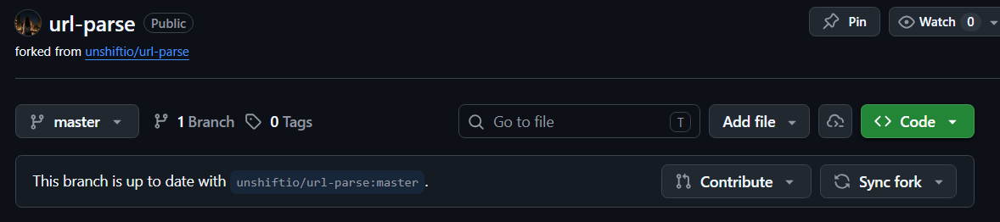
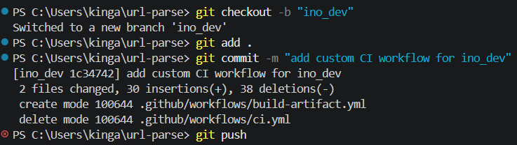
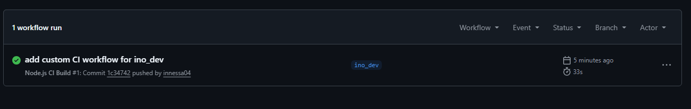
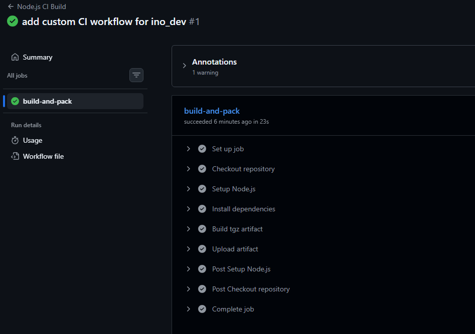
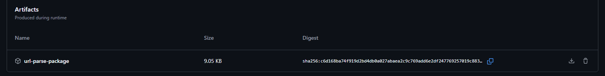

## Sprawozdanie z zajęć 13 – Kinga Sulej gr. 6

### GitHub Actions 

1. Fork repozytorium, te same zostało wykorzystane już na wcześniejszych zajęciach do stworzenia artefaktu 



2. Usunięcie obecnych workflows, dodanie swojego pliku `.yml` na utworzoną gałąź `ino_dev`




Zawartość pliku `build_artifact.yml`

<details>
<summary><b>build_artifact.yml</b></summary>

```
name: Node.js CI Build
on:
  push:
    branches: [ "ino_dev" ]

jobs:
  build-and-pack:
    runs-on: ubuntu-latest

    steps:
    - name: Checkout repository
      uses: actions/checkout@v4

    - name: Setup Node.js
      uses: actions/setup-node@v4
      with:
        node-version: '18'

    - name: Install dependencies
      run: npm install

    - name: Build tgz artifact
      run: npm pack

    - name: Upload artifact
      uses: actions/upload-artifact@v4
      with:
        name: url-parse-package
        path: "*.tgz"
        retention-days: 5

```  
</details>

Zgodnie z instrukcją, workflow używa triggera, w tym przypadku jest to `on: push: branches: [ "ino_dev" ]`. Dzięki temu akcja uruchamia się na osobnej gałęzi, nie w głównej projektu. Dodatkowo, zastosowano wirtualny kontener ubuntu dostarczany przez GitHub Actions.

W zakładce actions widoczny jest wpis z zieloną kropką sukcesu



Po kliknięciu w niego, następnie > `build-and-pack`widać potwierdzenie pomyślnego przejścia całego procesu. 



Dodatkowo, na samym dole strony wyświetla się poprawnie zbudowana paczka



Powyższe czynności potwierdzają, że akcja uruchomiła się po commicie do `ino_dev` (trigger), paczka została poprawnie zbudowana przez Node.js oraz dedykowana akcja (`upload_artifact`) skutecznie przechowała ten plik. 

Podsumowując, GitHub Actions jest kolejnym narzędziem stosowanym do automatyzacji, pozwalającym na przeniesienie całego procesu CI z maszyn na chmurę, dzięki czemu po każdym commicie artefakt buduje się sam. Gotową paczkę można później pobrać z sekcji artefaktów.  
