# Sprawozdanie z zajęć nr 01

- **Imię i nazwisko:** Kacper Strzesak
- **Indeks:** 423521
- **Kierunek:** Informatyka techniczna
- **Grupa**: 5

---

## 1. Środowisko pracy

Zadania wykonano na systemie Ubuntu Server 24.04.4 LTS uruchomionym na platformie VirtualBox. Połączenie z maszyną zrealizowano za pomocą protokołu SSH (użytkownik: kacper).

## 2. Konfiguracja maszyny wirtualnej

Maszyna wirtualna została przygotowana zgodnie z wymaganiami.

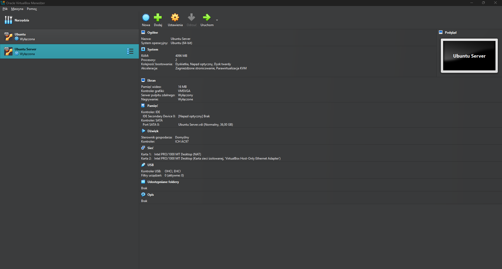

Dodatkowo zastosowano dwie karty sieciowe: NAT, zapewniającą dostęp do Internetu, oraz Host-Only, która gwarantuje połączenie SSH i SFTP między systemem operacyjnym hosta a maszyną wirtualną.

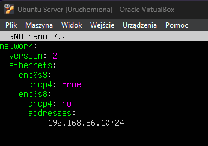

Pomyślnie zweryfikowano dostęp przez SSH, transfer plików SFTP (FileZilla), integrację z VS Code Remote SSH oraz możliwość klonowania repozytoriów GitHub.

---

## 3. Realizacja zadań

### 3.1. Git

Sklonowano repozytorium przedmiotowe. Podanie hasła/tokena nie było wymagane.

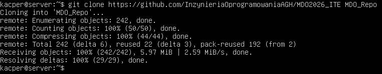

### 3.2. SSH

Wygenerowano dwa klucze: ed25519 oraz ecdsa. Klucz ed25519 został zabezpieczony hasłem.

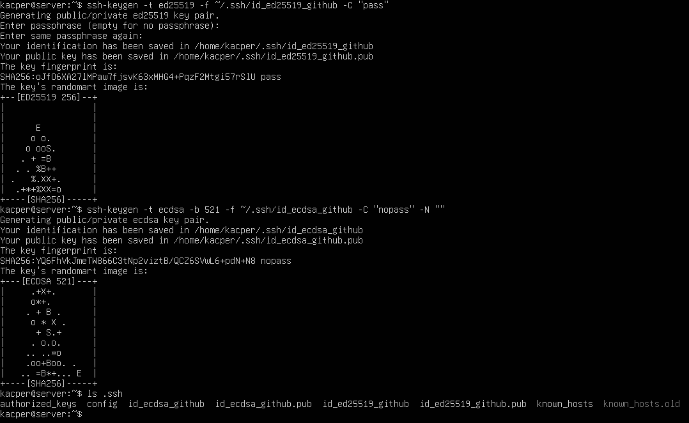

Klucz publiczny został dodany do profilu GitHub.

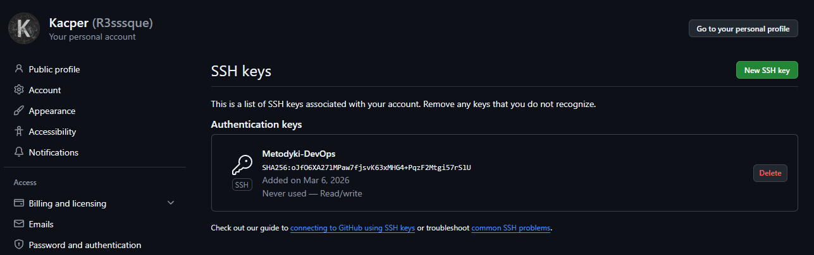

Przetestowano połączenie.

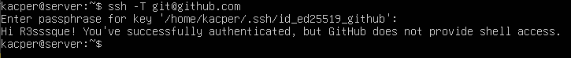

Sklonowano repozytorium przez protokół SSH.

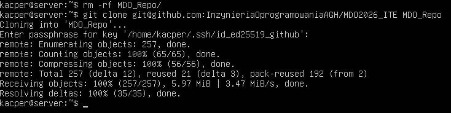

Przed rozpoczęciem wykonywania zadania na koncie GitHub było już włączone uwierzytelnianie dwuskładnikowe.

### 3.2. Konfiguracja narzędzi

Skonfigurowano połączenie ze środowiskiem Visual Studio Code za pomocą rozszerzenia Remote - SSH.

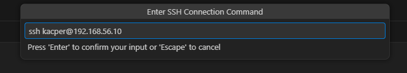

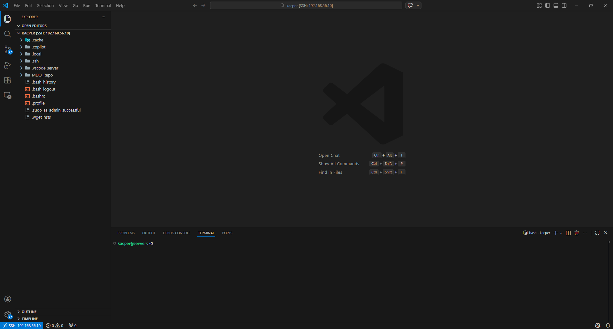

Za pomocą programu FileZilla nawiązano połączenie SFTP z maszyną wirtualną, co pozwoliło na pomyślne, testowe przesłanie pliku między hostem a serwerem.

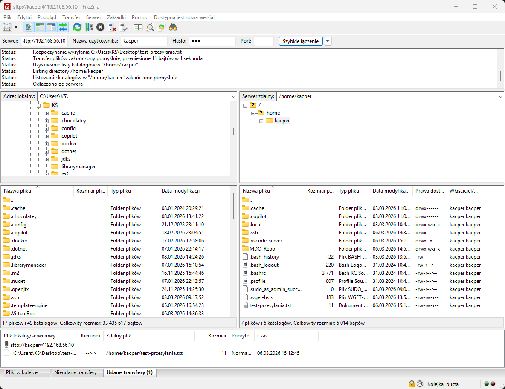

### 3.3. Praca z gałęziami i Git Hook

Przełączono się na gałąź grupową (`grupa5`), a następnie utworzono gałąź `KS423521`.

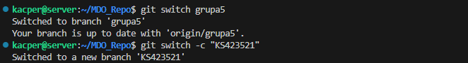

Napisano skrypt weryfikujący format wiadomości commita.

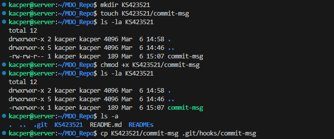

**Treść skryptu:**

```bash
#!/bin/bash

PREFIX="KS423521"

MSG_FILE="$1"
MSG=$(cat "$MSG_FILE")

if [[ "$MSG" != $PREFIX* ]]; then
  echo "Commit message must start with '$PREFIX'!"
  echo "Your message: $MSG"
  exit 1
fi

exit 0
```

Przetestowano wcześniej napisanego Git Hook'a

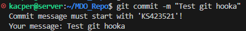

Stworzono odpowiednie katalogi oraz sprawozdanie.

Dodano pliki do staging area, a następnie stworzono i wypchnięto pierwszego commita (`git commit -m "KS423521: Wykonanie zadań z laboratorium nr 1"`).

Zainicjowano próbę wciągnięcia zmian do gałęzi grupowej `grupa5` poprzez utworzenie Pull Request w interfejsie GitHub.

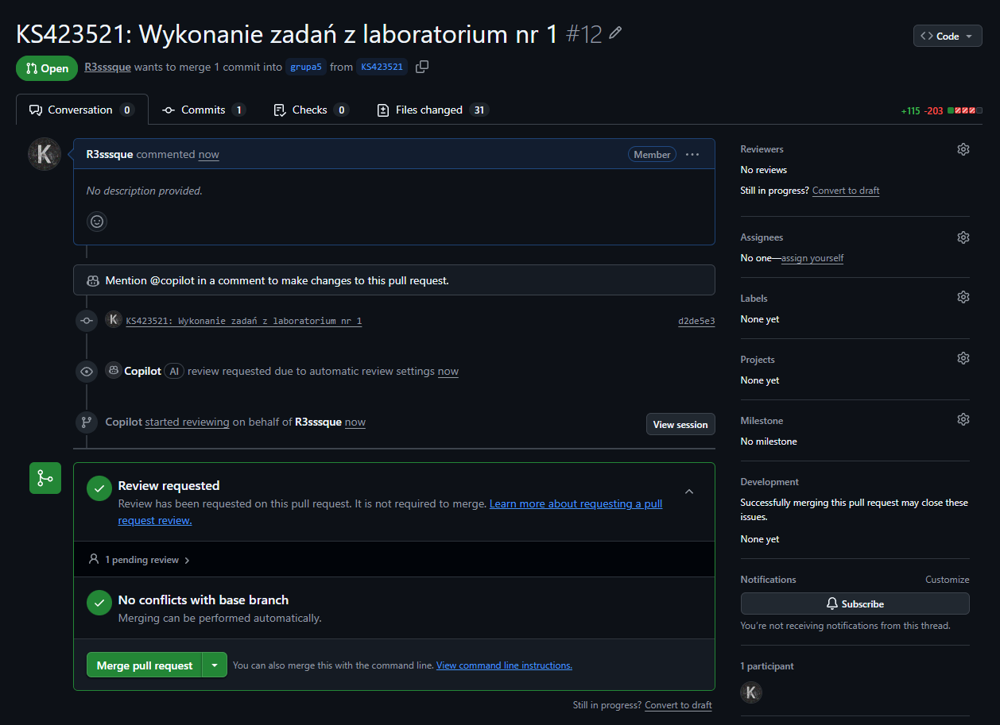