# Sprawozdanie z zajęć nr 10

- **Imię i nazwisko:** Kacper Strzesak
- **Indeks:** 423521
- **Kierunek:** Informatyka techniczna
- **Grupa**: 5

---

## 1. Środowisko pracy

Zadania wykonano na systemie Ubuntu Server 24.04.4 LTS uruchomionym na platformie VirtualBox. Połączenie z maszyną zrealizowano za pomocą protokołu SSH (użytkownik: kacper).

---

## 2. Instalacja środowiska Kubernetes

W pierwszym etapie zainstalowano środowisko Kubernetes w postaci lokalnego klastra **Minikube**. Instalacja została wykonana zgodnie z dokumentacją projektu Minikube. Następnie sprawdzono poprawność działania Dockera oraz dostępność wirtualizacji wymaganej do uruchomienia klastra.

Instalacja **Minikube**:

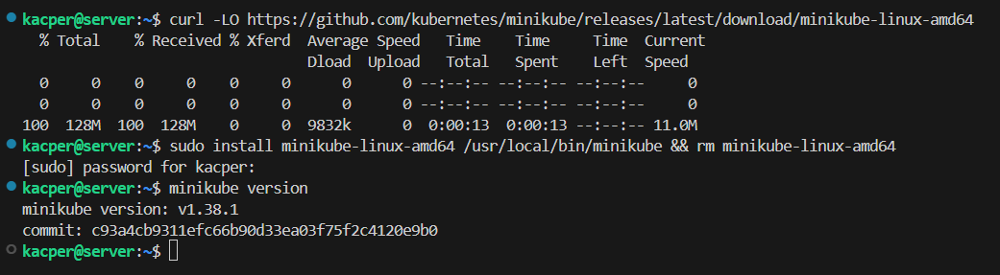

Instalacja narzędzia **kubectl**:

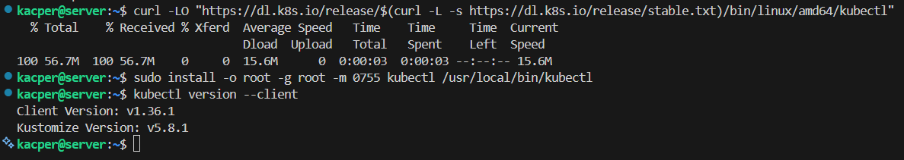

---

## 3. Uruchomienie klastra

Po zakończeniu instalacji uruchomiono lokalny klaster Kubernetes wykorzystujący sterownik Docker.

```bash
minikube start --driver=docker
```

Podczas uruchamiania klastra utworzona została maszyna minikube, pełniąca rolę pojedynczego workera oraz control plane.

Sprawdzenie również status klastra za pomocą poleceń:

```bash
minikube status
```

```bash
kubectl get nodes
```

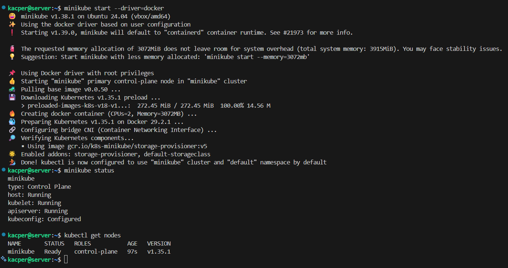

Polecenia potwierdzają poprawne uruchomienie klastra Kubernetes. Node minikube widoczny jest ze statusem Ready.

# 4. Dashboard Kubernetes

Kolejnym etapem było uruchomienie Dashboard Kubernetes umożliwiającego zarządzanie klastrem z poziomu przeglądarki.

```
minikube dashboard
```

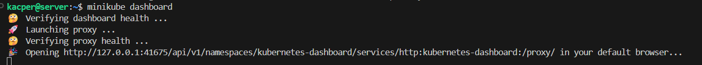

Po wykonaniu polecenia automatycznie został uruchomiony lokalny serwer proxy oraz otwarte zostało środowisko Dashboard w przeglądarce.

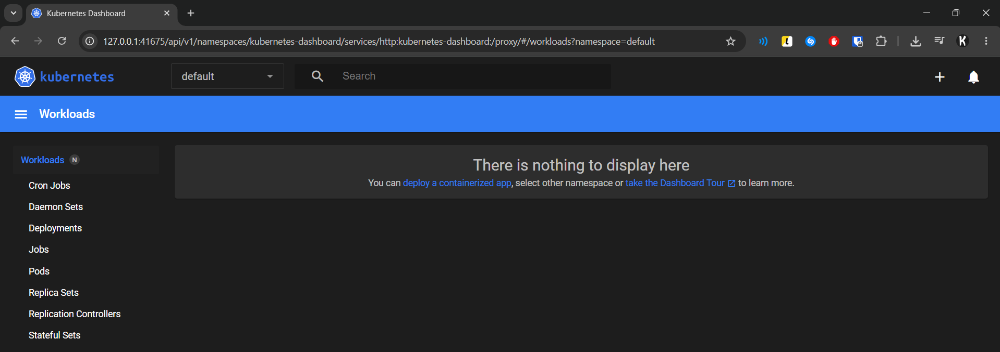

Dashboard umożliwia podgląd:

- node,
- podów,
- deploymentów,
- usług,
- wykorzystania zasobów.

# 5. Analiza podstawowych koncepcji Kubernetes

W trakcie ćwiczenia zapoznano się z podstawowymi elementami architektury Kubernetes.

### Pod

Pod stanowi najmniejszą jednostkę uruchomieniową Kubernetes. W jego wnętrzu znajdują się jeden lub więcej kontenerów współdzielących sieć oraz zasoby.

### Deployment

Deployment odpowiada za zarządzanie podami oraz utrzymywanie zadanej liczby replik aplikacji.

### Service

Service umożliwia udostępnienie aplikacji działającej wewnątrz klastra poprzez stabilny adres sieciowy.

### Namespace

Mechanizm logicznej izolacji zasobów w obrębie klastra. Domyślne przestrzenie: default, kube-system, kube-public.

### Node

Maszyna (fizyczna lub wirtualna) będąca częścią klastra. Zawiera: kubelet, kube-proxy oraz środowisko uruchomieniowe kontenerów.

# 6. Konteneryzacja i wdrożenie aplikacji w Kubernetes

## 6.1. Przygotowanie obrazu Docker

Na potrzeby zadania wykorzystano własny obraz Docker oparty o serwer Nginx z własną konfiguracją strony (Pliki: [Dockerfile](./files/Dockerfile) oraz [index.html](./files/index.html)).

Zbudowano obraz, a następnie sprawdzono poprawność jego działania.

```bash
docker build -t app-lab10 .

docker run -d --name test-app -p 8080:80 app-lab10
```

```bash
docker stop test-app && docker rm test-app
```

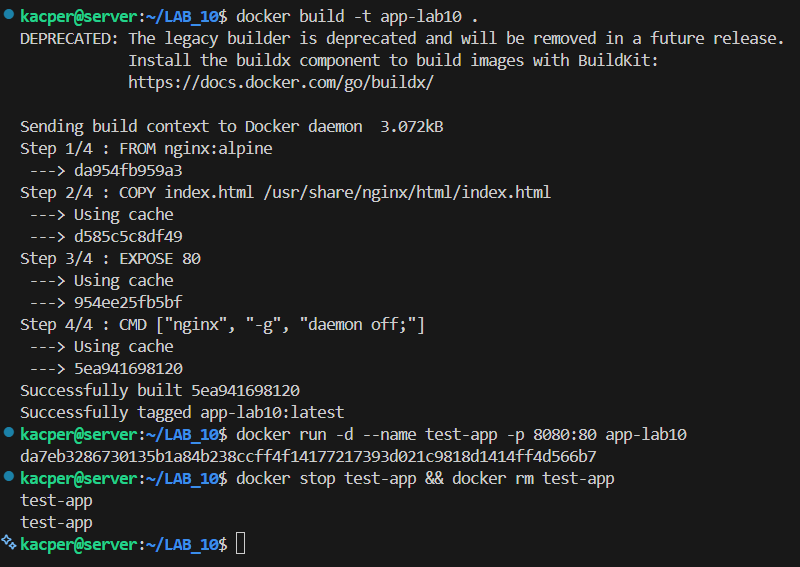

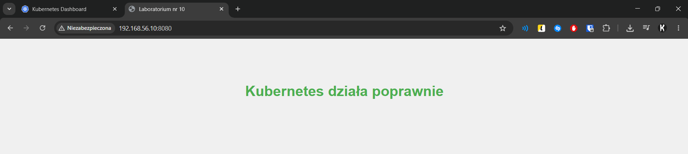

## 6.2. Uruchomienie aplikacji na stosie k8s

W celu wykorzystania lokalnego obrazu Docker w Kubernetes załadowano go do środowiska Minikube.

```bash
minikube image load app-lab10
```

Aplikację uruchomiono jako jednopodowe wdrożenie:

```bash
kubectl run myapp-lab10 --image=app-lab10 --port=80 --labels app=myapp-lab10 --image-pull-policy=Never
```

Flaga `--image-pull-policy=Never` zapewnia użycie lokalnie załadowanego obrazu zamiast próby pobrania z zewnętrznego rejestru.

Stan poda zweryfikowano poleceniami oraz w Dashboardzie:

```bash
kubectl get pods

kubectl describe pod myapp-lab10
```

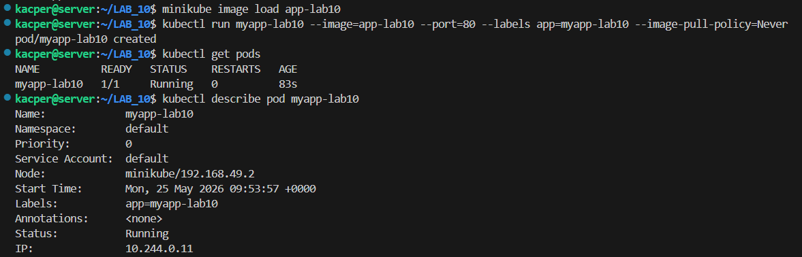

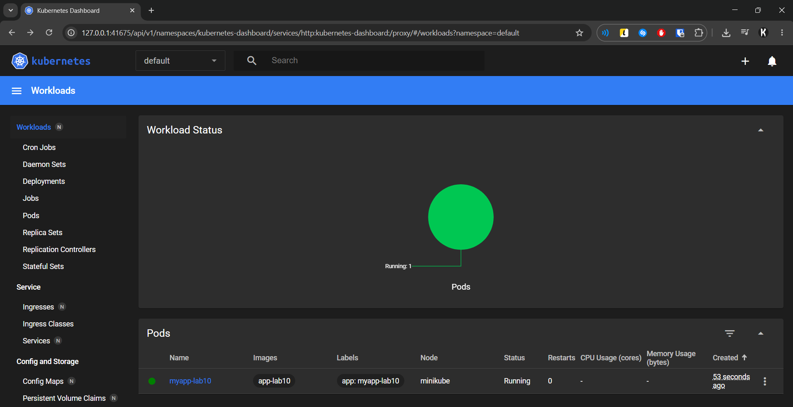

## 6.3. Wyprowadzenie portu i weryfikacja łączności

W celu uzyskania dostępu do aplikacji wykorzystano mechanizm przekierowania portów.

```bash
kubectl port-forward pod/myapp-lab10 8080:80
```

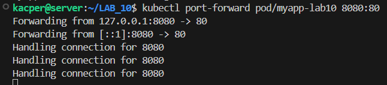

Po wykonaniu polecenia aplikacja była dostępna pod adresem: `http://localhost:8080`. Uzyskano poprawną komunikację z aplikacją uruchomioną wewnątrz klastra Kubernetes.

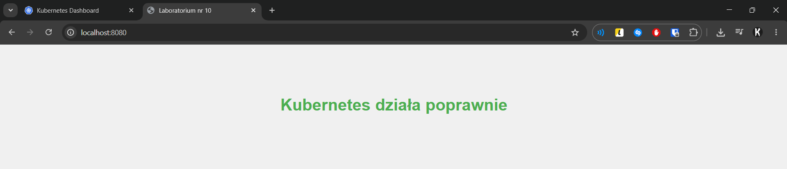

# 7. Przekucie wdrożenia manualnego w plik wdrożenia

Kolejnym etapem było przygotowanie wdrożenia w postaci pliku YAML (Plik [deployment.yaml](./files/deployment.yaml)).

```yaml
apiVersion: apps/v1
kind: Deployment
metadata:
  name: myapp-lab10
  labels:
    app: myapp-lab10
spec:
  replicas: 4
  selector:
    matchLabels:
      app: myapp-lab10
  template:
    metadata:
      labels:
        app: myapp-lab10
    spec:
      containers:
        - name: myapp-lab10
          image: app-lab10
          imagePullPolicy: Never
          ports:
            - containerPort: 80
```

Wdrożono deployment, a następnie sprawdzono jego stan.

W środowisku uruchomione zostały cztery repliki aplikacji.

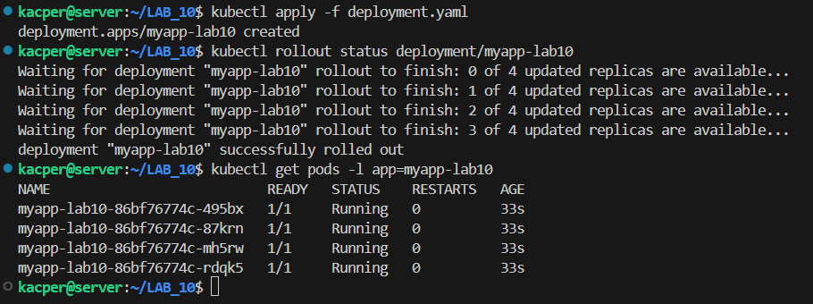

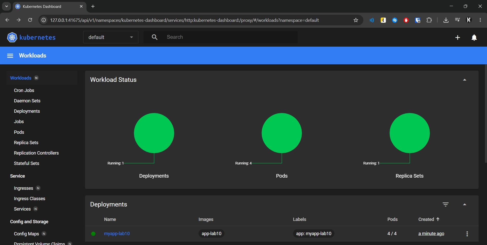

Deployment został wyeksponowany jako usługa Kubernetes.

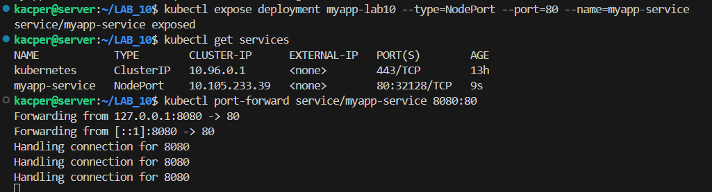

Następnie wykonano przekierowanie portu do serwisu. Aplikacja była dostępna lokalnie pod adresem: http://localhost:8080. Łączność przez serwis gwarantuje równomierne rozłożenie ruchu między wszystkie cztery repliki.

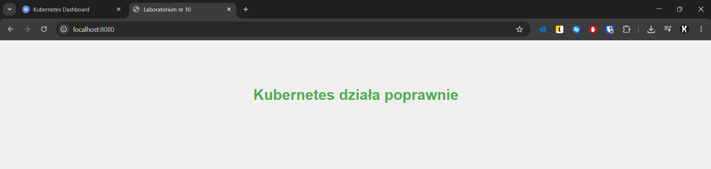

# 8. Wnioski

Ćwiczenie umożliwiło praktyczne zapoznanie się z podstawami platformy Kubernetes oraz środowiska Minikube. W trakcie realizacji zadania wykonano instalację klastra, uruchamianie kontenerów, tworzenie deploymentów oraz udostępnianie aplikacji za pomocą usług Kubernetes.

Zastosowanie deploymentów oraz replik umożliwia automatyczne zarządzanie stanem aplikacji oraz zwiększenie dostępności usług. Kubernetes znacząco upraszcza proces wdrażania i zarządzania aplikacjami kontenerowymi, szczególnie w środowiskach opartych o architekturę mikroserwisową.