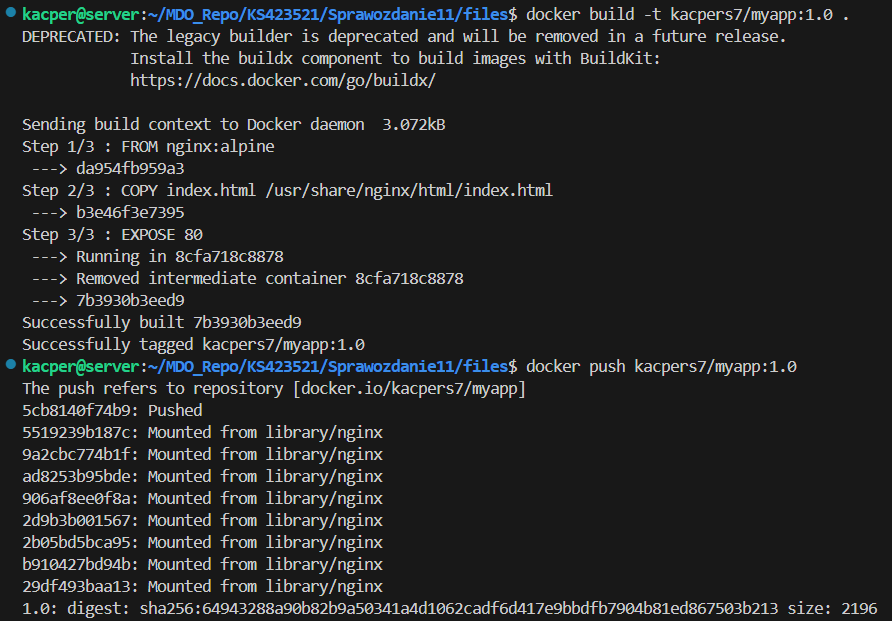
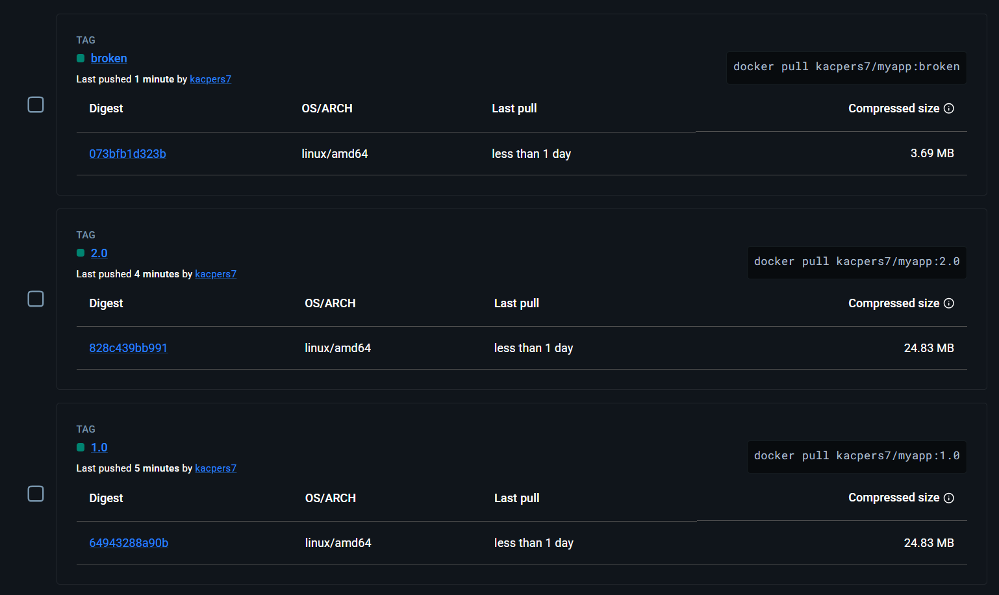
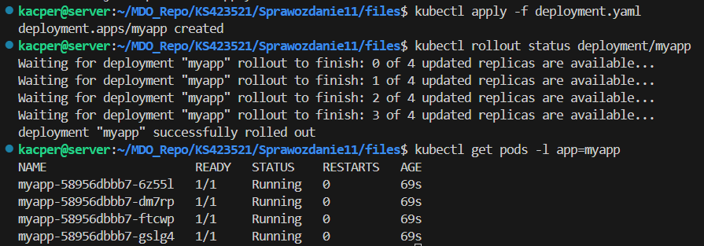
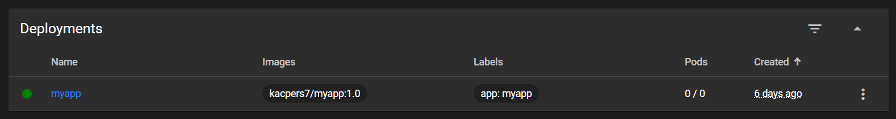
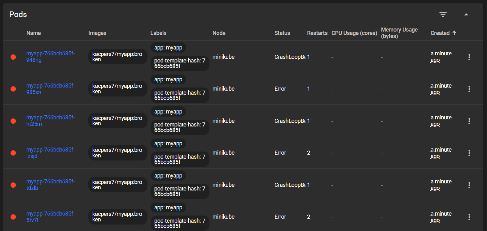
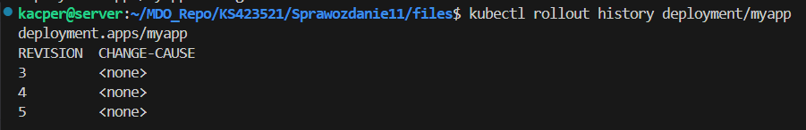
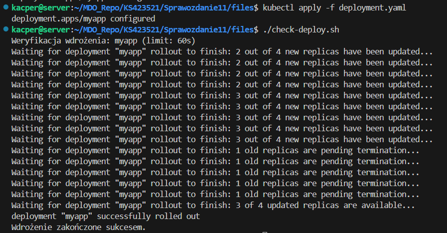

# Sprawozdanie z zajęć nr 11

- **Imię i nazwisko:** Kacper Strzesak
- **Indeks:** 423521
- **Kierunek:** Informatyka techniczna
- **Grupa**: 5

---

## 1. Środowisko pracy

Zadania wykonano na systemie Ubuntu Server 24.04.4 LTS uruchomionym na platformie VirtualBox. Połączenie z maszyną zrealizowano za pomocą protokołu SSH (użytkownik: kacper).

---

## 2. Przygotowanie nowych wersji obrazu

Na potrzeby ćwiczenia przygotowano trzy wersje obrazu `myapp`: stabilną `1.0`, zmodyfikowaną `2.0` (zmieniona treść strony) oraz celowo wadliwą `broken`, której kontener natychmiast kończy działanie z błędem.

```bash
docker build -t kacpers7/myapp:1.0 .
docker push kacpers7/myapp:1.0

docker build -t kacpers7/myapp:2.0 .
docker push kacpers7/myapp:2.0

docker build -f Dockerfile.broken -t kacpers7/myapp:broken .
docker push kacpers7/myapp:broken
```



Następnie wszystkie trzy obrazy załadowano do środowiska Minikube:

```bash
minikube image load kacpers7/myapp:1.0
minikube image load kacpers7/myapp:2.0
minikube image load kacpers7/myapp:broken
```



---

## 3. Zmiany w deploymencie

### 3.1. Plik wdrożenia bazowego

Podstawowy plik YAML wdrożenia (plik [deployment.yaml](./files/deployment.yaml)):

```yaml
apiVersion: apps/1.0
kind: Deployment
metadata:
  name: myapp
  labels:
    app: myapp
spec:
  replicas: 4
  selector:
    matchLabels:
      app: myapp
  template:
    metadata:
      labels:
        app: myapp
    spec:
      containers:
        - name: myapp
          image: kacpers7/myapp:1.0
          imagePullPolicy: Never
          ports:
            - containerPort: 80
```

```bash
kubectl apply -f deployment.yaml
kubectl get pods -l app=myapp
```



### 3.2. Skalowanie replik

Kolejno zaktualizowano pole `replicas` w pliku YAML i stosowano wdrożenie: zwiększenie do 8, zmniejszenie do 1, do 0, a następnie ponowne przeskalowanie do 4.

```bash
kubectl apply -f deployment.yaml
kubectl get pods
```

Kluczowym momentem było skalowanie do 0 (brak podów, deployment nadal istnieje):



### 3.3. Aktualizacja i cofanie wersji obrazu

Zaktualizowano pole `image` kolejno na `2.0`, z powrotem na `1.0`, a następnie na `broken`:

```bash
kubectl apply -f deployment.yaml
kubectl rollout status deployment/myapp
```

Po wdrożeniu `broken` pody weszły w pętlę `CrashLoopBackOff`:



---

## 4. Przywracanie poprzednich wdrożeń

```bash
kubectl rollout history deployment/myapp
```



Historia zawiera rewizje odpowiadające wszystkim wykonanym zmianom.

## 5. Kontrola wdrożenia

Skrypt sprawdza, czy wdrożenie zakończyło się sukcesem w ciągu 60 sekund, a w razie niepowodzenia automatycznie wykonuje rollback (plik [check-deploy.sh](./files/check-deploy.sh)):

```bash
#!/bin/bash

DEPLOYMENT="myapp"
TIMEOUT=60

echo "Weryfikacja wdrożenia: $DEPLOYMENT (limit: ${TIMEOUT}s)"

if kubectl rollout status deployment/$DEPLOYMENT --timeout=${TIMEOUT}s; then
    echo "Wdrożenie zakończone sukcesem."
    exit 0
else
    echo "Wdrożenie nie zakończyło się w ciągu ${TIMEOUT}s – rollback."
    kubectl rollout undo deployment/$DEPLOYMENT
    exit 1
fi
```

Skrypt uruchomiony dla poprawnej wersji:

