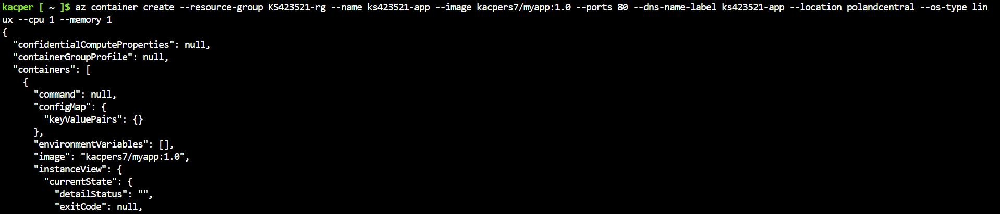
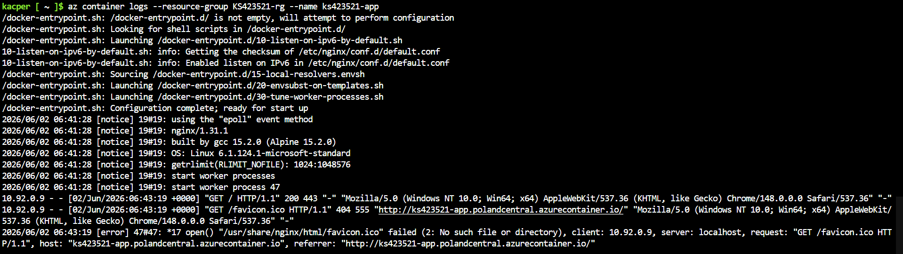
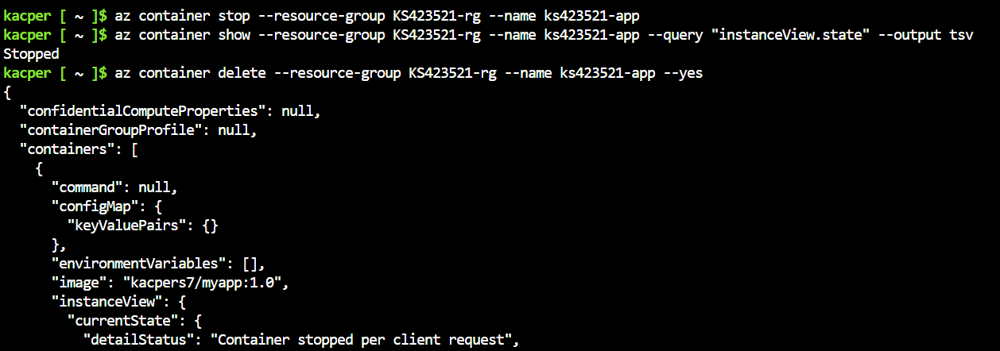
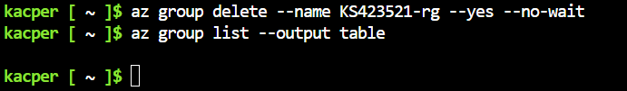

# Sprawozdanie z zajęć nr 12

- **Imię i nazwisko:** Kacper Strzesak
- **Indeks:** 423521
- **Kierunek:** Informatyka techniczna
- **Grupa**: 5

---

## 1. Środowisko pracy

Zadania wykonano na systemie Ubuntu Server 24.04.4 LTS uruchomionym na platformie VirtualBox. Połączenie z maszyną zrealizowano za pomocą protokołu SSH (użytkownik: kacper).

Wykorzystano Azure Cloud Shell dostępnego z poziomu portalu [portal.azure.com](https://portal.azure.com). Konto Azure aktywowano przez Panel AGH z wykorzystaniem studenckiego konta. Obraz kontenera pobierany był bezpośrednio z Docker Hub.

---

## 2. Utworzenie Resource Group

Przed wdrożeniem kontenera utworzono grupę zasobów w regionie Poland Central:

```bash
az group create --name KS423521-rg --location polandcentral
```
Poprawność utworzenia zweryfikowano poleceniem:

```bash
az group list --output table
```


---

## 3. Wdrożenie kontenera z Docker Hub

Kontener uruchomiono przy użyciu obrazu kacpers7/myapp:1.0 pobranego bezpośrednio z Docker Hub:

```bash
az container create --resource-group KS423521-rg --name ks423521-app --image kacpers7/myapp:1.0 --ports 80 --dns-name-label ks423521-app --location polandcentral --os-type linux --cpu 1 --memory 1
```



Po zakończeniu operacji sprawdzono stan kontenera oraz przydzielony adres:

```bash
az container show --resource-group KS423521-rg --name ks423521-app --query "{Status:instanceView.state, FQDN:ipAddress.fqdn}" --output table
```


Kontener osiągnął stan `Running` i został przydzielony adres:
`http://ks423521-app.polandcentral.azurecontainer.io/`

---

## 4. Weryfikacja działania

Dostępność aplikacji zweryfikowano w przeglądarce:


Serwer Nginx poprawnie obsłużył żądanie HTTP i zwrócił oczekiwaną stronę.

---

## 7. Pobranie logów

```bash
az container logs --resource-group KS423521-rg --name ks423521-app
```



W logach widoczne są żądania HTTP kierowane do kontenera, potwierdzające poprawne działanie aplikacji.

---

## 8. Zatrzymanie i usunięcie kontenera

Kontener zatrzymano, a następnie zweryfikowano zmianę stanu:

```bash
az container stop --resource-group KS423521-rg --name ks423521-app
```

```bash
az container show --resource-group KS423521-rg --name ks423521-app --query "instanceView.state" --output tsv
```



Stan zmienił się na `Stopped`. Następnie usunięto kontener oraz resource group, aby zaprzestać naliczania kosztów:

```bash
az container delete --resource-group KS423521-rg --name ks423521-app --yes

az group delete --name KS423521-rg --yes --no-wait
```

```bash
az group list --output table
```



Grupa zasobów `KS423521-rg` nie jest już widoczna na liście, co potwierdza całkowite usunięcie zasobów i zaprzestanie naliczania kosztów.

---

## 9. Wnioski

Ćwiczenie umożliwiło praktyczne wdrożenie własnego kontenera Docker w chmurze Azure przy użyciu usługi Azure Container Instances, z wykorzystaniem obrazu pobieranego bezpośrednio z Docker Hub. Pokazało to, że ACI pozwala szybko uruchomić aplikację bez zarządzania infrastrukturą, jednocześnie wymagając świadomego zarządzania zasobami, aby uniknąć niepotrzebnych kosztów.
