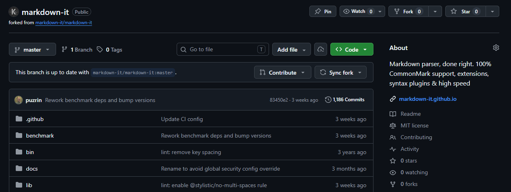
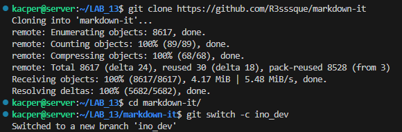
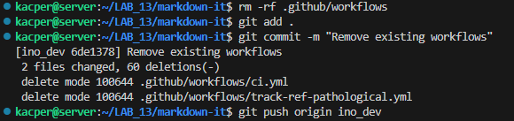
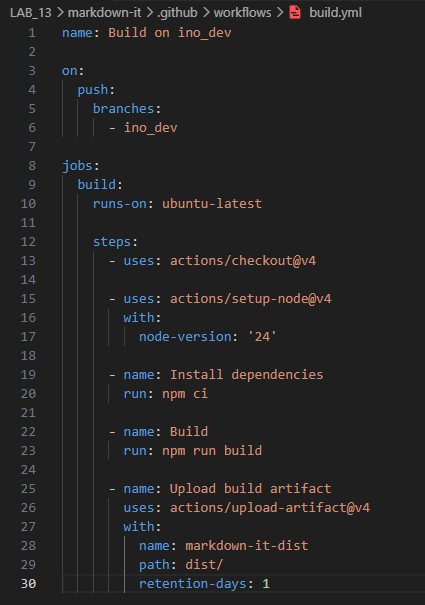
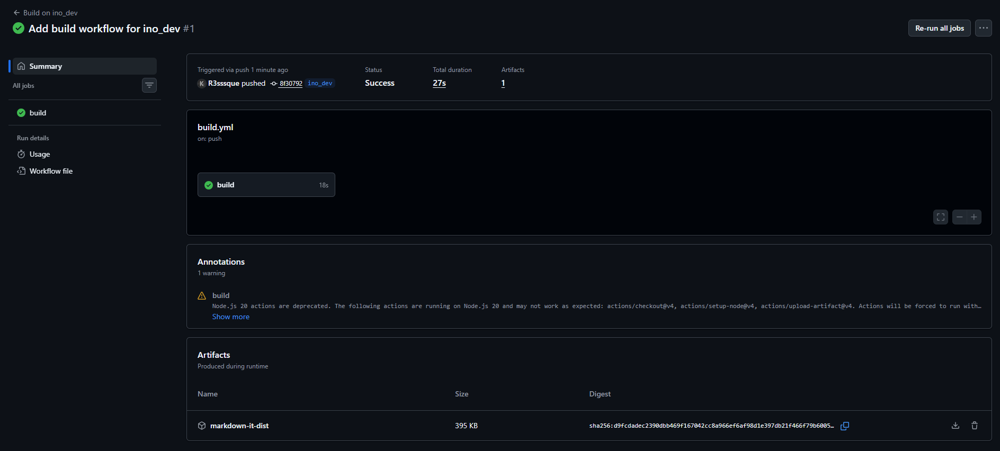
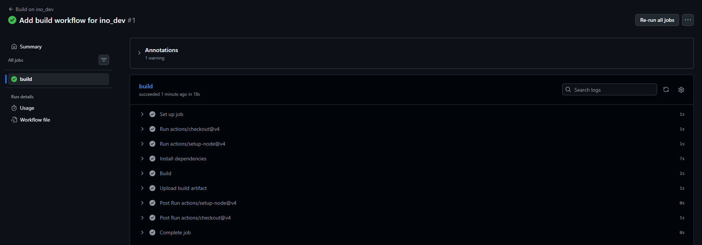

# Sprawozdanie z zajęć nr 13

- **Imię i nazwisko:** Kacper Strzesak
- **Indeks:** 423521
- **Kierunek:** Informatyka techniczna
- **Grupa**: 5

---

## 1. Środowisko pracy

Zadania wykonano na systemie `Ubuntu Server 24.04.4 LTS` uruchomionym na platformie `VirtualBox`. Połączenie z maszyną zrealizowano za pomocą protokołu SSH (użytkownik: kacper).

---

## 2. Wprowadzenie do GitHub Actions

GitHub Actions to system CI/CD wbudowany w GitHub. Workflow definiuje się w plikach YAML w katalogu `.github/workflows/`. Każdy workflow składa się z triggerów (sekcja `on`), jobów oraz kroków (`steps`) wykonywanych na wybranym runnerze.

Kluczowy trigger używany w tym zadaniu to `push` ograniczony do gałęzi `ino_dev`:

```yaml
on:
  push:
    branches:
      - ino_dev
```

Workflow odpala się wyłącznie po wysłaniu zmian na gałąź `ino_dev` - nie na każdy push do repozytorium. Na zajęciach omawiano tę formę triggera jako podstawową dla pipeline'ów deweloperskich izolowanych od głównej gałęzi projektu.

---

## 3. Analiza cennika GitHub Actions

Dla **repozytoriów publicznych** runnery GitHub-hosted (`ubuntu-latest`, `windows-latest`, `macos-latest`) są bezpłatne bez limitu minut. W repozytoriach prywatnych obowiązuje miesięczny limit darmowych minut oraz ograniczona przestrzeń na artefakty, z różnymi mnożnikami zależnymi od systemu operacyjnego.

Wniosek: fork ustawiono jako **publiczny**, runner jako `ubuntu-latest`. Artefaktom ustawiono `retention-days: 1`, żeby nie zajmować limitu storage ponad konieczność.

---

## 4. Fork repozytorium oraz usunięcie istniejących workflows

Repozytorium `markdown-it/markdown-it` zostało sforkowane na potrzeby tego zadania. Fork jest publiczny i dostępny pod adresem `https://github.com/R3sssque/markdown-it`.



Sklonowano istniejącego forka lokalnie i utworzono gałąź `ino_dev`.



Repozytorium zawierało istniejące pliki workflow w katalogu `.github/workflows/`. Zostały one usunięte, aby nie kolidowały z nowo tworzoną konfiguracją.



---

## 5. Workflow buildujący przy push na ino_dev

Projekt `markdown-it` używa `rollup` do budowania (`npm run build`), którego wynikiem jest katalog `dist/` zawierający paczki CJS i ESM.

Utworzono plik `.github/workflows/build.yml`:



Zmiany zacommitowano i wypchnięto na gałąź `ino_dev`.

---

## 6. Weryfikacja działania workflow

Po push zakładka „Actions" w repozytorium wykazała uruchomiony workflow. Wszystkie kroki zakończyły się sukcesem: instalacja zależności, build przez rollup, oraz upload artefaktu `markdown-it-dist`.





---

## 7. Artefakt zbudowanego projektu

Krok `actions/upload-artifact@v4` zapisał zawartość katalogu `dist/` jako artefakt `markdown-it-dist`. Jest on widoczny w podsumowaniu uruchomienia i dostępny do pobrania przez 1 dzień.

---

## 8. Podsumowanie

Sforkowano repozytorium `markdown-it` jako publiczne, utworzono gałąź `ino_dev` i skonfigurowano workflow reagujący na push do tej gałęzi. Pipeline instaluje zależności, buduje projekt za pomocą rollup (`npm run build`) i publikuje katalog `dist/` jako artefakt. Build przebiega pomyślnie w ramach darmowego planu GitHub Actions przy użyciu runnera `ubuntu-latest`.