# Sprawozdanie z zajęć nr 2

- **Imię i nazwisko:** Kacper Strzesak
- **Indeks:** 423521
- **Kierunek:** Informatyka techniczna
- **Grupa**: 5

---

## 1. Środowisko pracy

Zadania wykonano na systemie Ubuntu Server 24.04.4 LTS uruchomionym na platformie VirtualBox. Połączenie z maszyną zrealizowano za pomocą protokołu SSH (użytkownik: kacper).

## 2. Instalacja Docker'a

Zgodnie z zaleceniami, Docker został zainstalowany z repozytorium dystrybucji Ubuntu (`apt install docker.io`). Wcześniej wykonano `apt update` oraz `apt upgrade`.

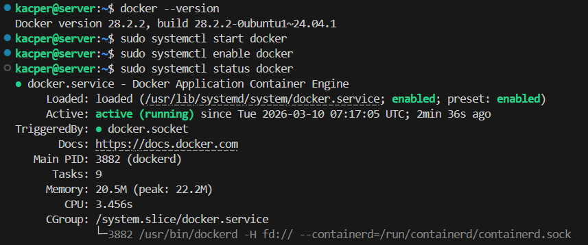

Zweryfikowanie działania przez uruchomienie kontenera Hello World.

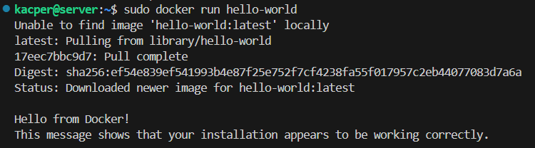

## 3. Stworzenie konta Docker Hub

## 4. Zapoznanie się z obrazami

Pobrano obrazy `hello-world`, `busybox` oraz `ubuntu`.

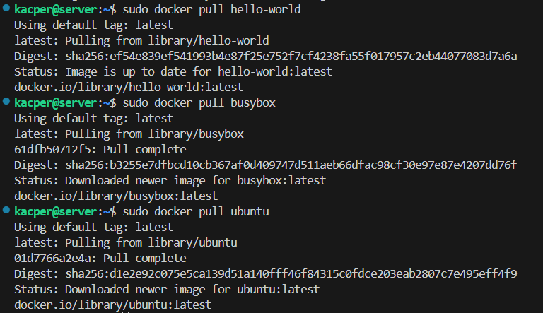

Następnie sprawdzono ich rozmiary za pomocą `docker images` oraz kody wyjścia `docker ps -a`.

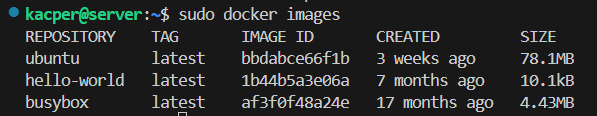

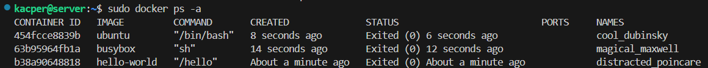

## 4. Praca z obrazem `busybox`

Uruchomiono kontener busybox w trybie interaktywnym `docker run -it busybox sh`, aby sprawdzić wersję systemu.

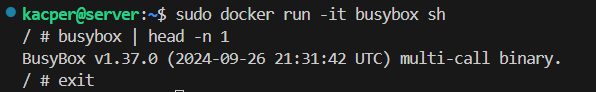

## 5. System w kontenerze (Ubuntu)

Uruchomiono kontener Ubuntu, a na nim sprawdzono procesy i zaktualizowano pakiety.

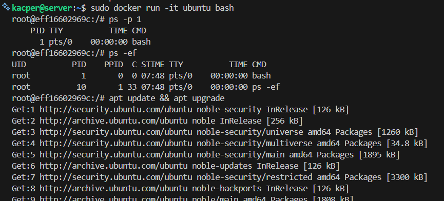

Sprawdzono procesy Dockera na hoście.

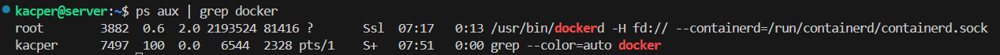

## 6. Własny Dockerfile

Napisano następujący Dockerfile:

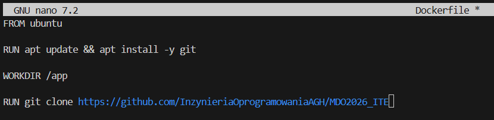

Obraz został zbudowany (`docker build -t app .`), a repozytorium zostało pomyślnie sklonowane.

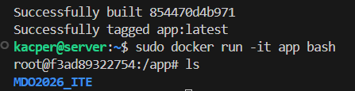

## 7. Usuwanie zakończonych kontenerów

Użyte polecenie `docker container prune` spowodowało usunięcie wszystkich zakończonych kontenerów.

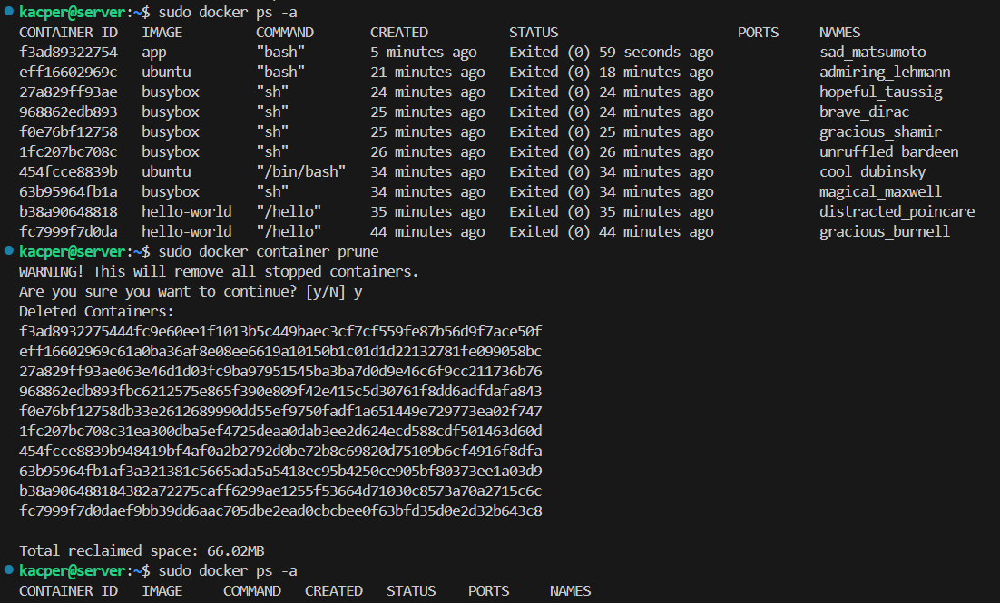

## 8. Usuwanie obrazów

Użyte polecenie `docker image prune -a` spowodowało usunięcie wszystkich obrazów.

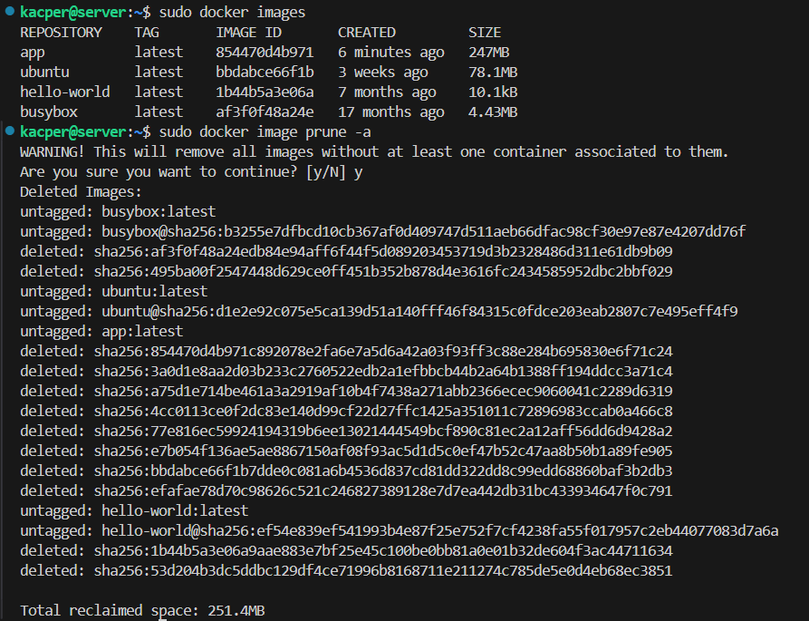