# Sprawozdanie z zajęć nr 3

- **Imię i nazwisko:** Kacper Strzesak
- **Indeks:** 423521
- **Kierunek:** Informatyka techniczna
- **Grupa**: 5

---

## 1. Środowisko pracy

Zadania wykonano na systemie Ubuntu Server 24.04.4 LTS uruchomionym na platformie VirtualBox. Połączenie z maszyną zrealizowano za pomocą protokołu SSH (użytkownik: kacper).

## 2. Wybór repozytorium

Wybrano repozytorium: [jest-nodejs-example-showcase](https://github.com/BaseMax/jest-nodejs-example-showcase)

Repozytorium spełnia wymagania:

- posiada otwartą licencję (**GPL-3**),

- wykorzystuje środowisko **Node.js**,

- zawiera testy jednostkowe (**Jest**),

- umożliwia wykonanie poleceń `npm install` oraz `npm test`.

## 3. Uruchomienie aplikacji lokalnie

### 3.1. Sklonowanie repozytorium

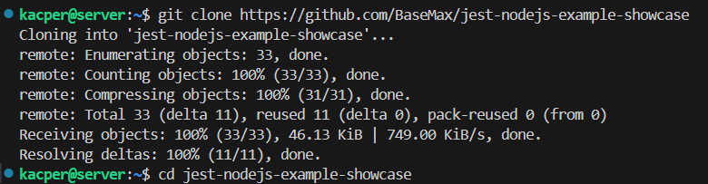

### 3.2. Instalacja zależności

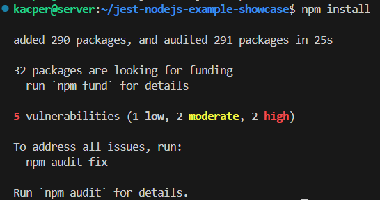

### 3.3. Uruchomienie testów

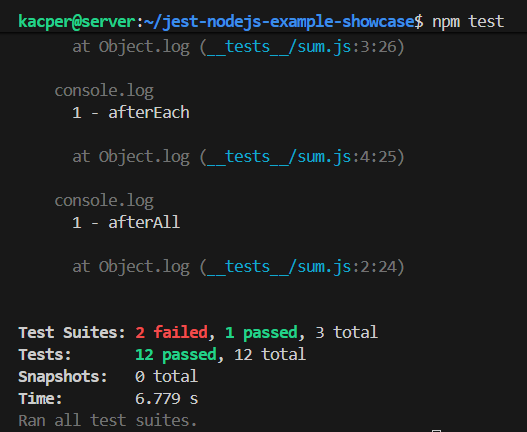

Testy w `sum.js` przeszły pomyślnie (**12 passed**). Pozostałe dwa zestawy zgłosiły błąd, ponieważ ich kod jest zakomentowany.

## 4. Budowanie i testowanie w kontenerze (tryb interaktywny)

## 4.1. Uruchomienie kontenera

Wykorzystano obraz Node.js.

`docker run -it node:20-slim bash`

Następnie zainstalowano `git`, by móc sklonować repozytorium.

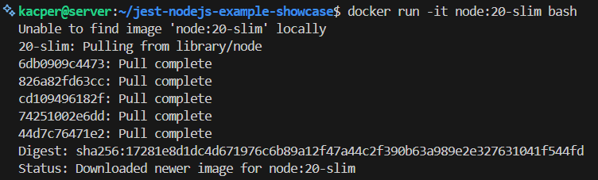

## 4.2. Klonowanie repozytorium

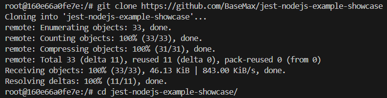

## 4.3. Build i test

Uruchomiono `npm install`, a następnie `npm test`.

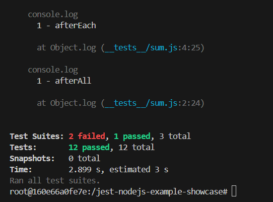

Proces zakończył się sukcesem, co potwierdza poprawność działania aplikacji w odizolowanym środowisku.

# 5. Automatyzacja przy użyciu Dockerfile

## 5.1. Dockerfile (budowanie)

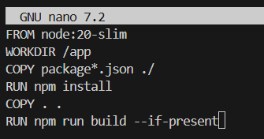

**Budowanie obrazu:**

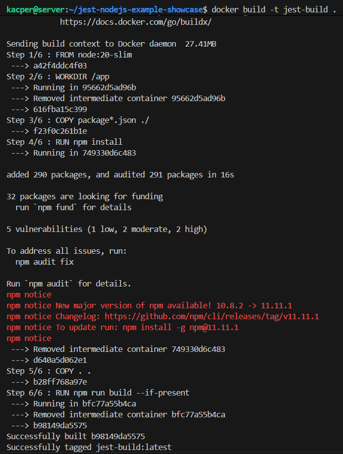

## 5.2. Dockerfile (testowanie)

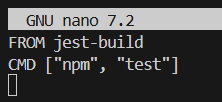

**Budowanie obrazu testowego:**

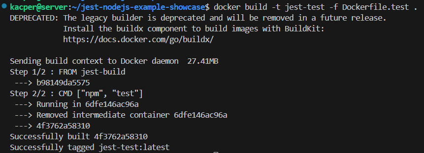

**Uruchomienie testów:**

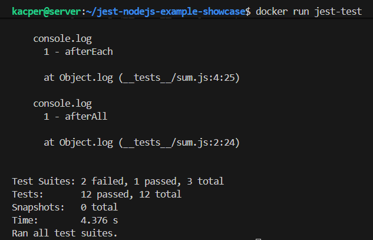

Kontener uruchamia skrypt testowy Jest oraz wyświetla raport z testów.
