# Sprawozdanie z zajęć nr 4

- **Imię i nazwisko:** Kacper Strzesak
- **Indeks:** 423521
- **Kierunek:** Informatyka techniczna
- **Grupa**: 5

---

## 1. Środowisko pracy

Zadania wykonano na systemie Ubuntu Server 24.04.4 LTS uruchomionym na platformie VirtualBox. Połączenie z maszyną zrealizowano za pomocą protokołu SSH (użytkownik: kacper).

## 2. Zachowywanie stanu między kontenerami

Utworzono dwa woluminy:
- **wolumin wejściowy** (na kod źródłowy) o nazwie `input_vol`,
- **wolumin wyjściowy** (na zbudowane pliki) o nazwie `output_vol`.

```bash
docker volume create input_vol
docker volume create output_vol
docker volume ls
```

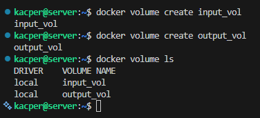

---

Uruchomiono kontener bazowy, który posiada środowisko Node.js do budowania projektu i uruchamiania testów.

```bash
docker run -it --name build_container -v input_vol:/input -v output_vol:/output node:20-slim bash
```

Sprawdzono, czy powstały odpowiednie katalogi oraz upewniono się, że git nie jest zainstalowany.

```bash
ls -l | grep -E "input|output"

git --version
```

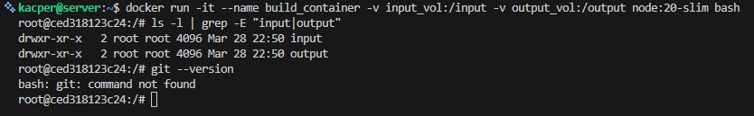

---

Repozytorium sklonowano poza kontenerem przy użyciu kontenera pomocniczego z git:

```bash
docker run --rm -v input_vol:/repo alpine/git clone https://github.com/BaseMax/jest-nodejs-example-showcase.git /repo
```

### Dlaczego tak?
Kontener bazowy nie miał zainstalowanego gita, dlatego użyto kontenera pomocniczego, który sklonował repozytorium bezpośrednio do woluminu. Dzięki temu kontener buildujący zawiera tylko narzędzia potrzebne do budowania projektu.


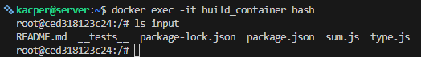

---

W kontenerze bazowym wykonano build projektu z katalogu `/input`, a wynik zapisano do `/output`.

```bash
cd /input
npm install
npm run build
npm test
cp -r . /output
```

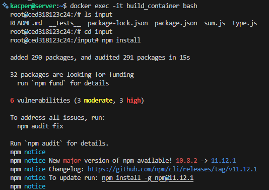

Po usunięciu kontenera pliki nadal były dostępne w woluminie.

```bash
docker rm build_container

docker run --rm -it -v input_vol:/data ubuntu ls /data
docker run --rm -it -v output_vol:/data ubuntu ls /data
```

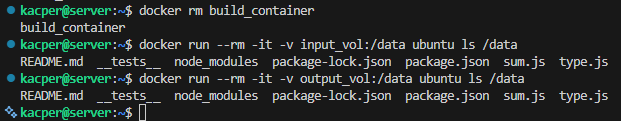

---

Ponownie wykonano operację, ale tym razem git został zainstalowany w kontenerze i repozytorium sklonowano z jego poziomu.

```bash
apt update && apt install git
mkdir repo
cd repo
git clone https://github.com/BaseMax/jest-nodejs-example-showcase.git .
npm install
npm test
```

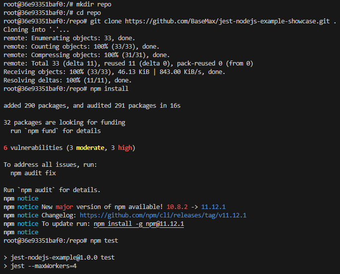

---

Możliwe jest wykonanie powyższych kroków za pomocą Dockerfile i `RUN --mount`:

```dockerfile
RUN --mount=type=volume,target=/input git clone https://github.com/BaseMax/jest-nodejs-example-showcase.git /input
```

---

# 3. Eksponowanie portu i łączność między kontenerami

### Test połączenia między kontenerami

W pierwszym kontenerze uruchomiono serwer iperf3, a w drugim klienta. Klient połączył się z serwerem po jego adresie IP, co pozwoliło przetestować przepustowość sieci między kontenerami.

Kontener 1:
```bash
docker run -it --name iperf_server ubuntu bash
apt update && apt install iperf3

apt install iproute2 -y
ip addr show

iperf3 -s
```

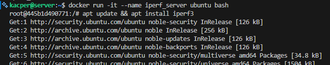

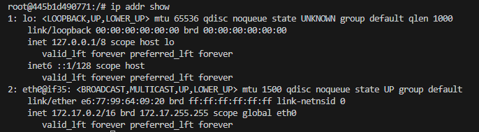

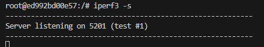

Kontener 2:
```bash
docker run -it --name iperf_client ubuntu bash
apt update && apt install iperf3

iperf3 -c 172.17.0.2
```


---

## Własna sieć mostkowa

Stworzenie własnej sieci my_network pozwoliło kontenerom komunikować się ze sobą po nazwach, zamiast używać adresów IP.

Utworzenie sieci:
```bash
docker network create my_network
```

Uruchomienie kontenerów:
```bash
docker run -d --network my_network --name iperf_server ubuntu sh -c "apt update && apt install -y iperf3 && iperf3 -s"
docker run -it --network my_network --name iperf_client ubuntu bash
```

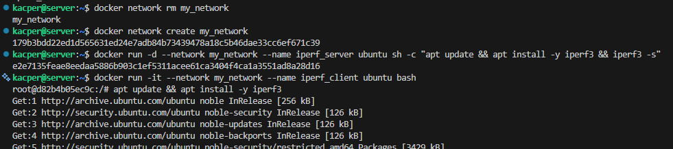

Połączenie po nazwie:
```bash
apt update && apt install -y iperf3
iperf3 -c iperf_server
```


---

## Połączenie spoza kontenera

Aby umożliwić dostęp do serwera iperf spoza hosta, zastosowano flagę -p 5201:5201. Powoduje to przekierowanie ruchu z interfejsu hosta do wnętrza kontenera.

Eksponowanie portu:
```bash
docker run -it --rm -p 5201:5201 --name iperf_server ubuntu bash

apt update && apt install -y iperf3
iperf3 -s
```

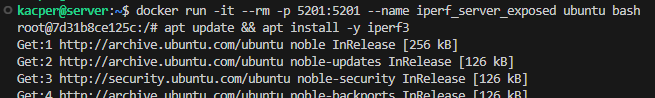

Połączenie z hosta:
```bash
sudo apt update && sudo apt install -y iperf3

iperf3 -c localhost
```


---

# 4. Usługi w kontenerze – SSH

W kontenerze Ubuntu skonfigurowano serwer ssh, co umożliwiło zdalne logowanie.

```bash
docker run -it --name ssh_server ubuntu bash
apt update && apt install openssh-server
service ssh start
passwd
echo "PermitRootLogin yes" >> /etc/ssh/sshd_config
service ssh restart
```

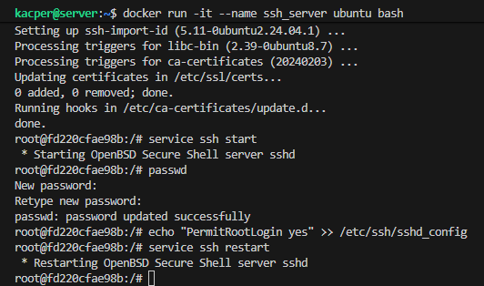

Połączenie:
```bash
ssh root@172.17.0.3
```


---

## Zalety i wady SSH w kontenerze

**Zalety:** możliwość zdalnego zarządzania kontenerem, możliwość debugowania, dostęp jak do normalnego serwera.

**Wady:** zwiększona powierzchnia ataku, łamanie idei kontenerów.

---

# 5. Jenkins + Docker-in-Docker

Ostatnim etapem było uruchomienie serwera CI/CD Jenkins w architekturze Docker-in-Docker (DinD).

Utworzono sieć:
```bash
docker network create jenkins
```

Uruchomiono kontener pomocniczy dind, który udostępnia silnik Dockera wewnątrz sieci.
```bash
docker run --name jenkins-docker --rm --detach --privileged --network jenkins docker:dind
```

Uruchomiono kontener jenkins/jenkins:lts, łącząc go z pomocnikiem.
```bash
docker run --name jenkins --rm --detach --network jenkins -p 8080:8080 -p 50000:50000 jenkins/jenkins:lts
```

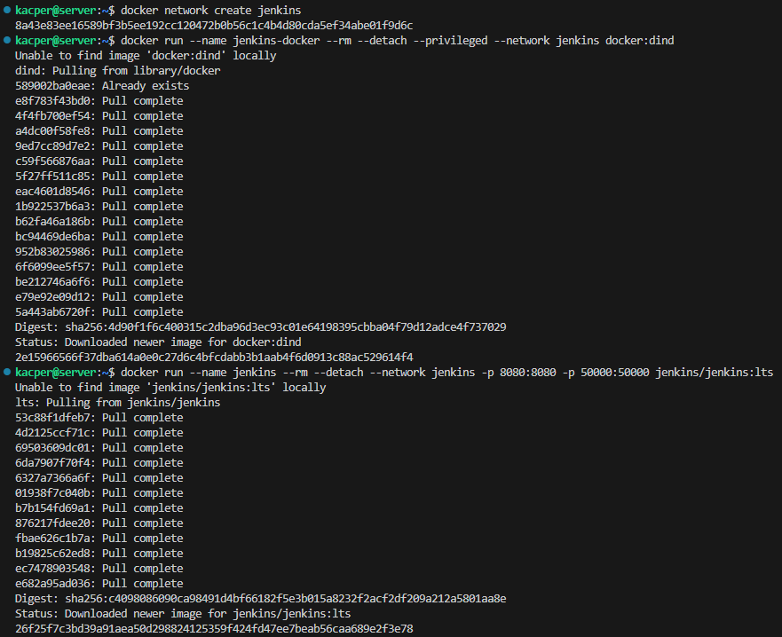

---

Hasło odczytano z logów kontenera
```bash
docker logs jenkins
```

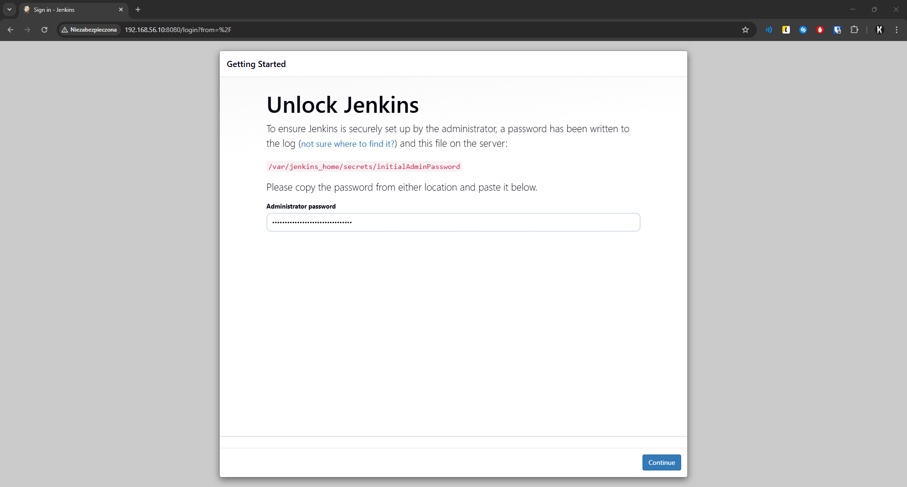


