# Sprawozdanie z zajęć nr 5

- **Imię i nazwisko:** Kacper Strzesak
- **Indeks:** 423521
- **Kierunek:** Informatyka techniczna
- **Grupa**: 5

---

## 1. Środowisko pracy

Zadania wykonano na systemie Ubuntu Server 24.04.4 LTS uruchomionym na platformie VirtualBox. Połączenie z maszyną zrealizowano za pomocą protokołu SSH (użytkownik: kacper).

---

## 2. Przygotowanie: Instalacja i konfiguracja Jenkins (Blue Ocean)

Zastosowano obraz Jenkins z dodatkiem Blue Ocean, który posiada wbudowany nowoczesny interfejs graficzny ułatwiający wizualizację etapów Pipeline.

Aby umożliwić Jenkinsowi budowanie obrazów kontenerowych, skorzystano z sieci `jenkins` utworzonej na wcześniejszych zajęciach i uruchomiono kontener `docker:dind`. Pełni on rolę izolowanego silnika wykonawczego, z którym serwer Jenkins komunikuje się przy operacjach kontenerowych.

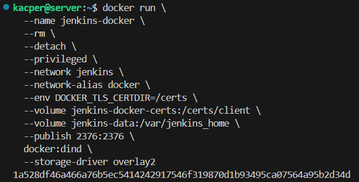

Przygotowano plik `Dockerfile`, aby rozszerzyć bazowy obraz Jenkinsa o niezbędne narzędzia i wtyczkę Blue Ocean.

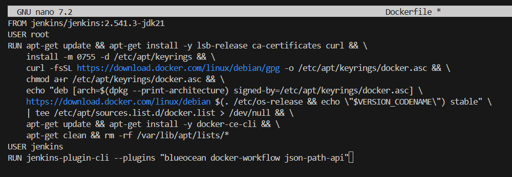

Następnie zbudowano obraz:

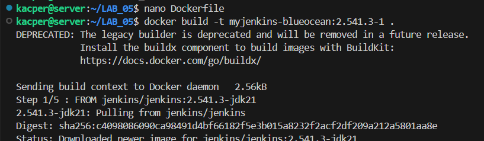

Uruchomiono kontener `jenkins-blueocean`. Kontener wystawiono na porcie `8080`.

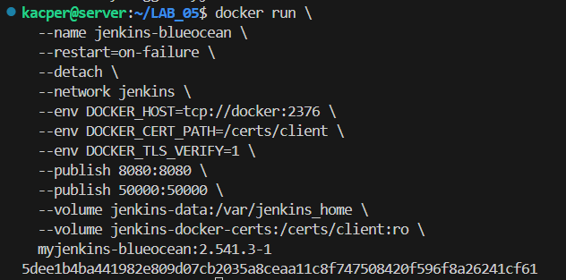

Odczytano hasło początkowe administratora z logów kontenera.

```bash
docker exec jenkins-blueocean cat /var/jenkins_home/secrets/initialAdminPassword
```

Dashboard był dostępny pod adresem `192.168.56.10:8080`.

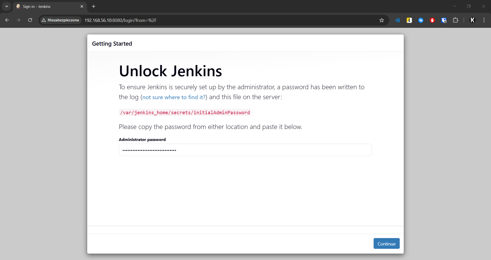

Przeprowadzono instalację sugerowanych wtyczek (Plugins).

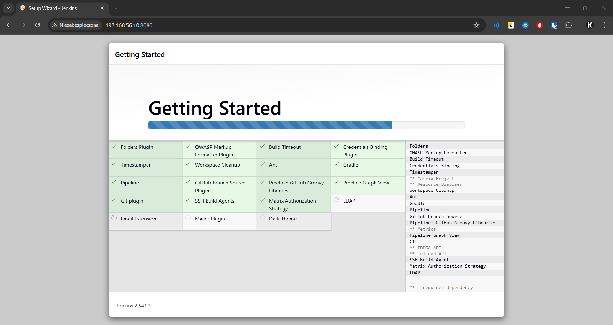

Odpowiednio skonfigurowano logi.

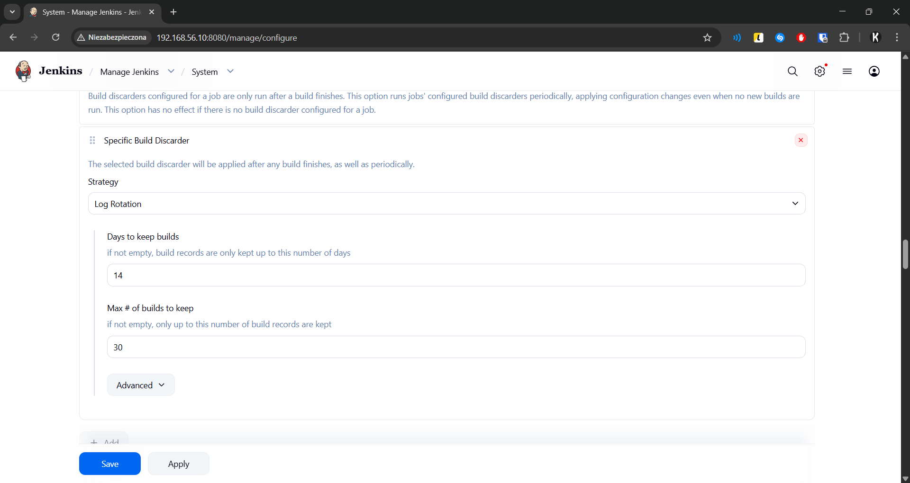

---

## 3. Pierwsze uruchomienia

Zweryfikowano poprawność komunikacji Jenkinsa z systemem operacyjnym oraz demonem Dockera poprzez zadania typu "Freestyle project".

### 3.1. Projekt zwracający `uname`

Utworzono zadanie typu "Freestyle project". W sekcji Build Steps dodano skrypt powłoki execute shell z komendą:

```bash
uname -a
```

Wynik w konsoli potwierdził architekturę systemu operacyjnego kontenera.

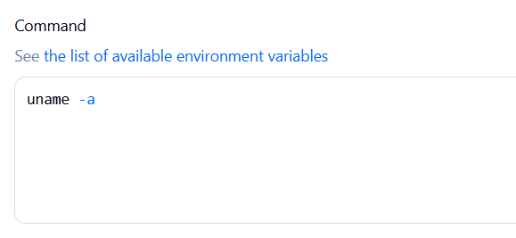

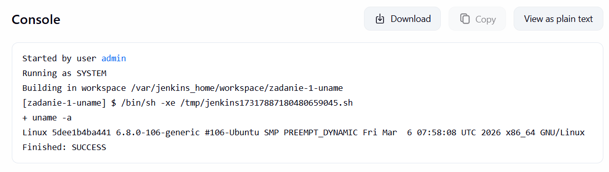

### 3.2. Projekt zwracający błąd przy nieparzystej godzinie

Utworzono skrypt warunkowy w Bashu:

```bash
HOUR=$(date +%H)
if [ $((10#$HOUR % 2)) -eq 1 ]; then
	echo "Godzina nieparzysta ($HOUR) - build FAIL"
	exit 1
fi
echo "Godzina parzysta ($HOUR) - build OK"
```

Potwierdza to poprawną obsługę statusów wyjścia w Jenkinsie.

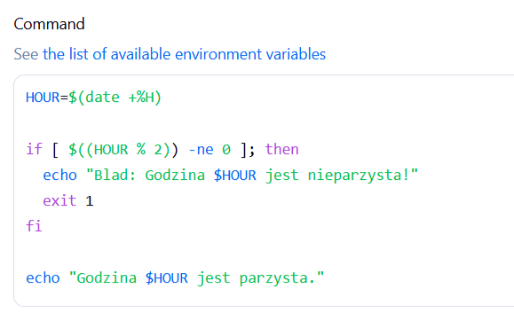

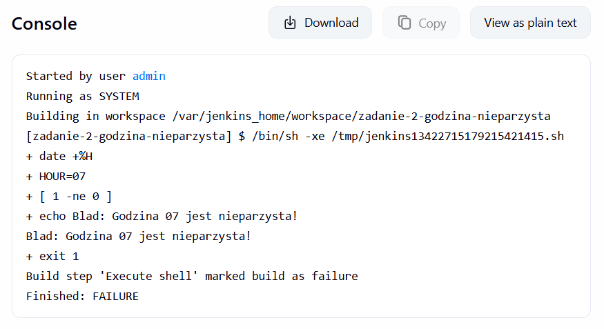

### 3.3. Projekt pobierający obraz `ubuntu`

Trzeci projekt uruchamia:

```bash
docker pull ubuntu
```

Operacja zakończyła się sukcesem, co potwierdziło, że Jenkins ma uprawnienia do komunikacji z demonem Dockera.

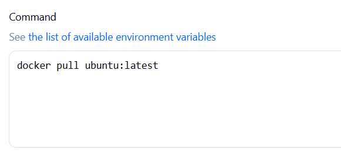

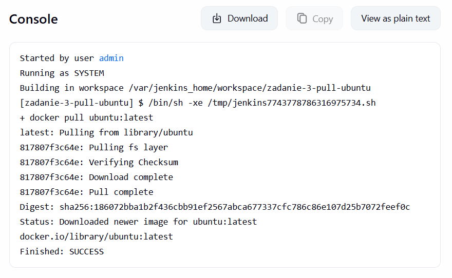

Podsumowanie trzech zadań:

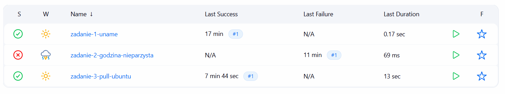

---

## 4. Obiekt typu pipeline

Na wcześniejszych zajęciach wykorzystywane było inne repozytorium, jednak w trakcie realizacji zadania stwierdzono, że nie jest ono wystarczające do pełnej realizacji procesu budowania aplikacji w kontenerze Docker. W związku z tym zdecydowano się na zmianę repozytorium na: [markdown-it](https://github.com/markdown-it/markdown-it). Spełnia ono wymagania, zawarte w instrukcji do zajęć nr 3. Przygotowano odpowiednie pliki **Dockerfile**, które umieszczono w katalogu `Sprawozdanie3`.

Utworzono nowy obiekt typu Pipeline. Potok składa się z dwóch kluczowych etapów:

1. Pobranie kodu z gałęzi `KS423521` repozytorium przedmiotowego.

2. Uruchomienie budowania obrazu `app-build` na podstawie przygotowanego pliku `Dockerfile.build`.

Treść skryptu:

```groovy
pipeline {
    agent any
    stages {
        stage('Clone repo') {
            steps {
                git branch: 'KS423521', 
                    url: 'https://github.com/InzynieriaOprogramowaniaAGH/MDO2026_ITE'
            }
        }
        stage('Build Dockerfile') {
            steps {
                sh 'docker build -t app-build -f KS423521/Sprawozdanie3/Dockerfile.build .'
            }
        }
    }
}
```

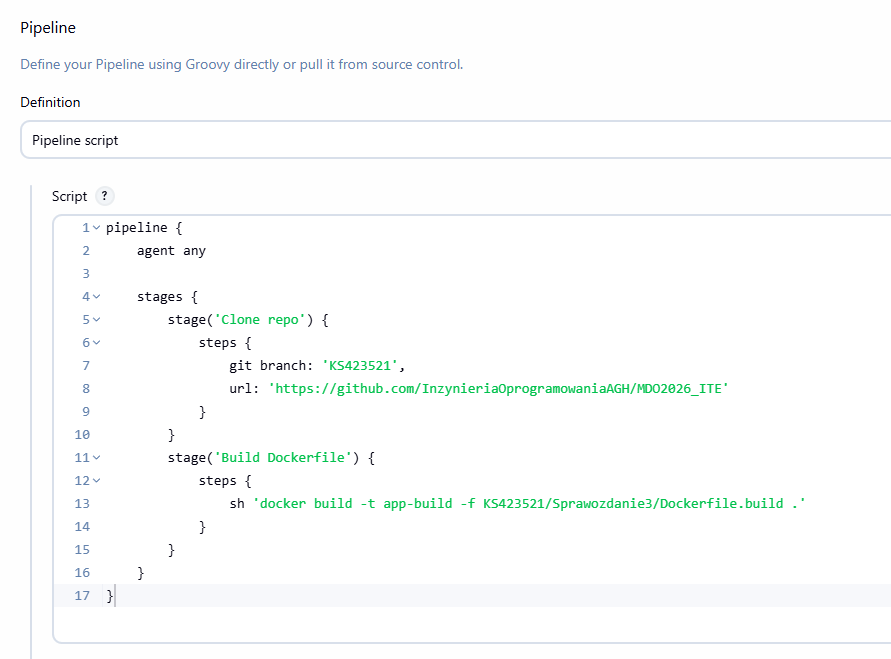

Pierwsze uruchomienie pipeline - pobranie i pełne zbudowanie obrazu.

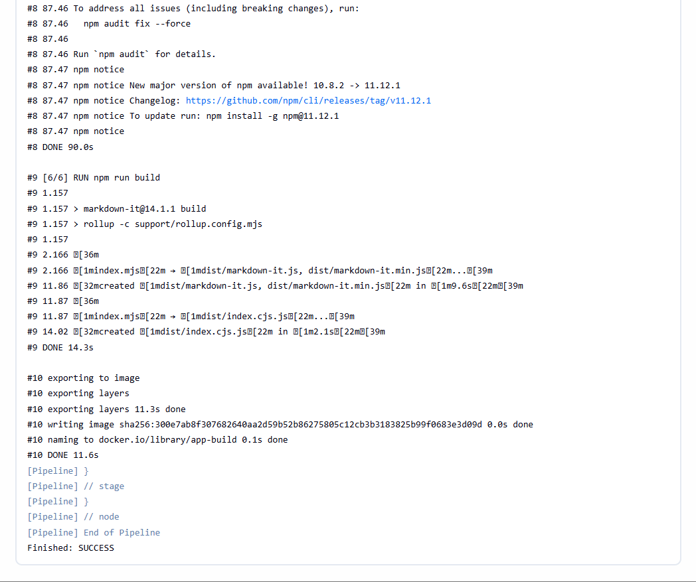

Ponownie uruchomiono stworzony pipeline. Wykonał się on szybciej niż wcześniejszy dzięki cachowaniu.

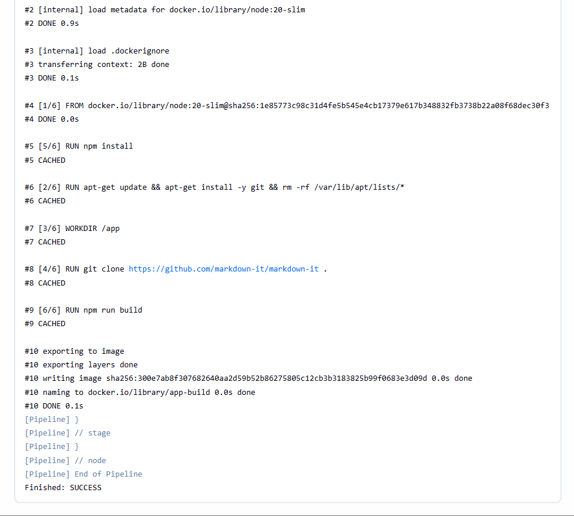