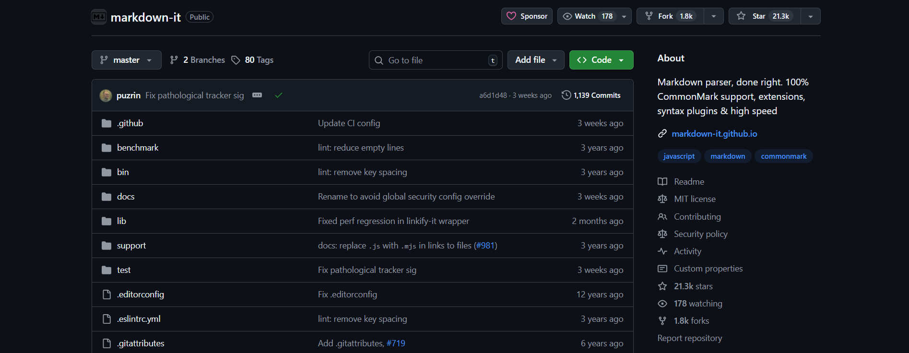
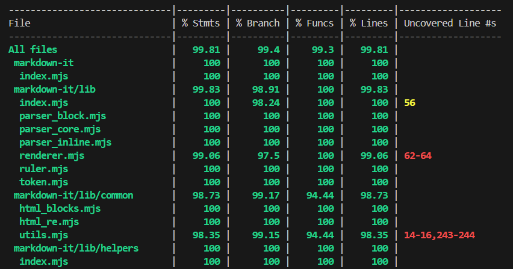
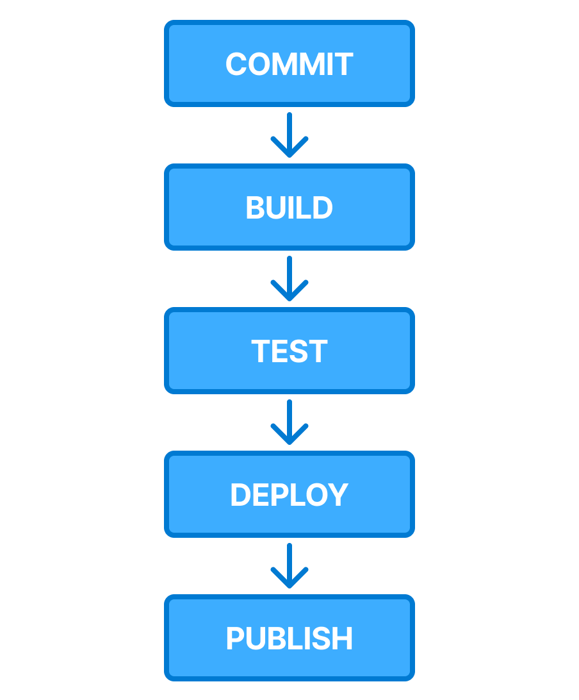

# Sprawozdanie z zajęć nr 6

- **Imię i nazwisko:** Kacper Strzesak
- **Indeks:** 423521
- **Kierunek:** Informatyka techniczna
- **Grupa**: 5

---

## 1. Środowisko pracy

Zadania wykonano na systemie Ubuntu Server 24.04.4 LTS uruchomionym na platformie VirtualBox. Połączenie z maszyną zrealizowano za pomocą protokołu SSH (użytkownik: kacper).

---

## 2. Wybór aplikacji z odpowiednią licencją

Wybrana aplikacja:

- Nazwa: **markdown-it**

- Repozytorium: `https://github.com/markdown-it/markdown-it`

- Opis: Parser Markdown napisany w JavaScript, przeznaczony do środowiska Node.js.

- Licencja: Projekt markdown-it jest udostępniony na licencji **MIT**, która pozwala na swobodne używanie, modyfikowanie oraz rozpowszechnianie kodu źródłowego.

- Nie było potrzeby tworzenia forka, ponieważ aplikacja spełnia wszystkie wymagania.

[x] Aplikacja została wybrana

[x] Licencja potwierdza możliwość swobodnego obrotu kodem na potrzeby zadania

[x] Zdecydowano, czy jest potrzebny fork własnej kopii repozytorium

---

## 3. weryfikacji poprawności działania projektu

W celu weryfikacji poprawności działania projektu wykonano instalację zależności oraz uruchomiono testy.

Testy zostały uruchomione poprawnie i zakończyły się sukcesem, co potwierdza poprawność działania aplikacji.

[x] Wybrany program buduje się

[x] Przechodzą dołączone do niego testy

---

## 4. Diagram UML procesu CI/CD

[x] Stworzono diagram UML zawierający planowany pomysł na proces CI/CD

---

## 5. Przygotowanie kontenera bazowego (build)

## 6. Wykonanie build i testów w kontenerze

## 7. Logi jako artefakty

## 8. Przygotowanie kontenera deploy