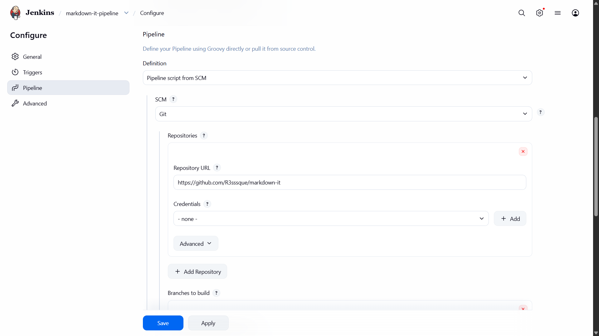

# Sprawozdanie z zajęć nr 6

- **Imię i nazwisko:** Kacper Strzesak
- **Indeks:** 423521
- **Kierunek:** Informatyka techniczna
- **Grupa**: 5

---

## 1. Środowisko pracy

Zadania wykonano na systemie Ubuntu Server 24.04.4 LTS uruchomionym na platformie VirtualBox. Połączenie z maszyną zrealizowano za pomocą protokołu SSH (użytkownik: kacper).

---

## 2. Wybór aplikacji z odpowiednią licencją

**Wybrana aplikacja:**

- **Nazwa:** markdown-it

- **Repozytorium (oryginalne):** <https://github.com/markdown-it/markdown-it>

- **Repozytorium (fork):** <https://github.com/R3sssque/markdown-it>

- **Opis:** Parser Markdown napisany w JavaScript, przeznaczony do środowiska Node.js.

- **Licencja:** Projekt markdown-it jest udostępniony na licencji **MIT**, która pozwala na swobodne używanie, modyfikowanie oraz rozpowszechnianie kodu źródłowego.

**Decyzja o forku:**

Stworzono fork oryginalnego repozytorium w celu umieszczenia w nim plików Dockerfile'ów i Jenkinsfile'a, które pobierane będą przez pipeline w Jenkins'ie.


- [x] Aplikacja została wybrana

- [x] Licencja potwierdza możliwość swobodnego obrotu kodem na potrzeby zadania

- [x] Zdecydowano, czy jest potrzebny fork własnej kopii repozytorium

---

## 3. weryfikacji poprawności działania projektu

Przed przystąpieniem do automatyzacji, przeprowadzono lokalną weryfikację integralności kodu. W tym celu wykonano instalację zależności oraz uruchomiono testy.


Testy zostały uruchomione poprawnie i zakończyły się sukcesem, co potwierdza poprawność działania aplikacji.

- [x] Wybrany program buduje się

- [x] Przechodzą dołączone do niego testy

---

## 4. Diagram UML procesu CI/CD

Opracowano diagram UML przedstawiający planowany przebieg pipeline'u CI/CD. Schemat uwzględnia pełną ścieżkę krytyczną: od pobrania kodu (checkout), przez budowanie i testy wewnątrz kontenerów, aż po wdrożenie testowe i publikację artefaktu.


- [x] Stworzono diagram UML zawierający planowany pomysł na proces CI/CD

---

## 5. Konteneryzacja (Dockerfile)

Proces budowania obrazu oparto na mechanizmie multi-stage build, co pozwoliło na ścisłą izolację środowisk. Wykorzystano trzy etapy:

1. **Build:** Użycie `node:20-slim` do instalacji zależności.

2. **Test:** Etap bazujący na warstwie build, w którym wykonywane są testy automatyczne.

3. **Deploy:** Wykorzystanie minimalistycznego obrazu `node:20-alpine`.

Plik **[Dockerfile](./Dockerfile)**:

```dockerfile
# BUILD
FROM node:20-slim AS build
WORKDIR /app
COPY package*.json ./
RUN npm install
COPY . .
RUN npm run build

# TEST
FROM build AS test
RUN npm test

# DEPLOY
FROM node:20-alpine AS deploy
WORKDIR /app
COPY --from=build /app/dist ./dist 
COPY --from=build /app/package*.json ./
ENTRYPOINT ["node", "bin/markdown-it.js"]
```

**Uzasadnienie wyboru kontenerów:**

Kontener budowy (build) nie nadaje się do roli produkcyjnej, ponieważ zawiera zbędne narzędzia (kompilatory, pliki źródłowe, pamięć podręczną npm), które zwiększają rozmiar obrazu i podatność na ataki. Zastosowanie obrazu Alpine w ostatnim kroku pozwoliło zredukować rozmiar z 180 MB do 150 MB, co optymalizuje czas deploymentu i zużycie zasobów.

#### Build

- [x] Wybrano kontener bazowy lub stworzono odpowiedni kontener wstepny (runtime dependencies)
- [x] *Build* został wykonany wewnątrz kontenera

#### Test

- [x] Testy zostały wykonane wewnątrz kontenera (kolejnego)
- [x] Kontener testowy jest oparty o kontener build

#### Deploy

- [x] Zdefiniowano kontener typu 'deploy' pełniący rolę kontenera, w którym zostanie uruchomiona aplikacja (niekoniecznie docelowo - może być tylko integracyjnie)
- [x] Uzasadniono czy kontener buildowy nadaje się do tej roli/opisano proces stworzenia nowego, specjalnie do tego przeznaczenia

---

## 6. Automatyzacja (Jenkinsfile)

Logika pipeline została zdefiniowana w pliku Jenkinsfile. Proces automatycznie pobiera kod, buduje obraz testowy, a następnie obraz wdrożeniowy.

Plik **[Jenkinsfile](./Jenkinsfile)**:

```groovy
pipeline {
    agent any

    environment {
        VERSION = "1.0.${BUILD_NUMBER}"
        IMAGE = "markdown-it"
        CONTAINER = "md-${BUILD_NUMBER}"
    }

    stages {

        stage('Checkout') {
            steps {
                checkout scm
            }
        }

        stage('Build & Test') {
            steps {
                sh "docker build --target test -t ${IMAGE}:${VERSION}-test ."
            }
        }

        stage('Build Image (Deploy)') {
            steps {
                sh "docker build --target deploy -t ${IMAGE}:${VERSION} ."
            }
        }

        stage('Run Deploy Container') {
            steps {
                sh "docker run -d --name ${CONTAINER} ${IMAGE}:${VERSION}"
            }
        }

        stage('Archive') {
            steps {
                sh "docker save ${IMAGE}:${VERSION} -o ${IMAGE}-${VERSION}.tar"
                archiveArtifacts artifacts: '*.tar', fingerprint: true
            }
        }
    }

    post {
        always {
            sh "docker rm -f ${CONTAINER} || true"
            sh "docker rmi ${IMAGE}:${VERSION} || true"
        }
    }
}
```

**Konfiguracja w Jenkins**



---

## 7. Wyniki i Artefakty

Pipeline zakończył się pełnym sukcesem.


Jako artefakt publikowane jest **archiwum .tar** zawierające gotowy obraz Docker. Wybór ten jest podyktowany chęcią dostarczenia kompletnego środowiska uruchomieniowego, niezależnego od konfiguracji docelowego hosta.

**Wersjonowanie i identyfikacja:**

Zastosowano numerowanie artefaktów oparte na zmiennej `${BUILD_NUMBER}` (np. `1.0.5`), co pozwala na jednoznaczne powiązanie pliku z konkretnym przebiegiem w Jenkinsie. Dodatkowo, logi z każdego procesu są automatycznie odkładane przez Jenkinsa jako numerowany artefakt systemowy, co umożliwia analizę pochodzenia i przebiegu budowy.


Po zakończeniu prac zweryfikowano zgodność z planem: otrzymany efekt końcowy jest w pełni zbieżny z założeniami przedstawionymi na wstępnym diagramie UML.

- [x] Następuje weryfikacja, że aplikacja pracuje poprawnie (*smoke test*) poprzez uruchomienie kontenera 'deploy'
- [x] Zdefiniowano, jaki element ma być publikowany jako artefakt
- [x] Uzasadniono wybór: kontener z programem, plik binarny, flatpak, archiwum tar.gz, pakiet RPM/DEB
- [x] Opisano proces wersjonowania artefaktu (można użyć *semantic versioning*)
- [x] Dostępność artefaktu: publikacja do Rejestru online, artefakt załączony jako rezultat builda w Jenkinsie
- [x] Przedstawiono sposób na zidentyfikowanie pochodzenia artefaktu
- [x] Pliki Dockerfile i Jenkinsfile dostępne w sprawozdaniu w kopiowalnej postaci oraz obok sprawozdania, jako osobne pliki
- [x] Zweryfikowano potencjalną rozbieżność między zaplanowanym UML a otrzymanym efektem