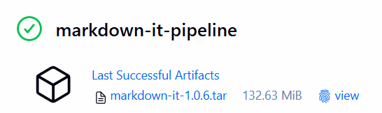

# Sprawozdanie z zajęć nr 6

- **Imię i nazwisko:** Kacper Strzesak
- **Indeks:** 423521
- **Kierunek:** Informatyka techniczna
- **Grupa**: 5

---

## 1. Środowisko pracy

Zadania wykonano na systemie Ubuntu Server 24.04.4 LTS uruchomionym na platformie VirtualBox. Połączenie z maszyną zrealizowano za pomocą protokołu SSH (użytkownik: kacper).

---

## 2. Weryfikacja Jenkinsfile w repozytorium

Przeprowadzono analizę oraz dopracowanie pliku `Jenkinsfile` przygotowanego podczas poprzednich zajęć, w ramach których proces CI/CD został zapisany w modelu **Pipeline as Code** jako część repozytorium projektu.

Następnie zweryfikowano poprawność wdrożonego rozwiązania oraz sprawdzono kompletność ścieżki obejmującej proces budowania, testowania, wdrażania i publikacji artefaktu.

- [x] Przepis dostarczany z SCM, a nie wklejony w Jenkinsa lub sprawozdanie (co załatwia nam `clone` )

---

## 3. Rozwinięcie pipeline'u CI/CD – Jenkinsfile

Na podstawie analizy checklisty wprowadzono usprawnienia w pliku `Jenkinsfile`.

Plik **[Jenkinsfile](./Jenkinsfile)**:

```groovy
pipeline {
    agent any

    environment {
        VERSION = "1.0.${BUILD_NUMBER}"
        IMAGE = "markdown-it"
        CONTAINER = "md-${BUILD_NUMBER}"
    }

    stages {

        stage('Clean Workspace') {
            steps {
                deleteDir()
            }
        }

        stage('Checkout') {
            steps {
                checkout scm
            }
        }

        stage('Build & Test') {
            steps {
                sh "docker build --target test -t ${IMAGE}:${VERSION}-test ."
            }
        }

        stage('Build Image (Deploy)') {
            steps {
                sh "docker build --target deploy -t ${IMAGE}:${VERSION} ."
            }
        }

        stage('Run Deploy Container') {
            steps {
                sh "docker run -d --name ${CONTAINER} ${IMAGE}:${VERSION}"
            }
        }

        stage('Archive') {
            steps {
                sh "docker save ${IMAGE}:${VERSION} -o ${IMAGE}-${VERSION}.tar"
                archiveArtifacts artifacts: '*.tar', fingerprint: true
            }
        }
    }

    post {
        always {
            sh "docker rm -f ${CONTAINER} || true"
            sh "docker rmi ${IMAGE}:${VERSION} || true"
        }
    }
}
```

- [x] Przepis dostarczany z SCM, a nie wklejony w Jenkinsa lub sprawozdanie (co załatwia nam `clone` )

---

## 4. Opis pipeline’u

#### Clean (usunięcie cache)

```groovy
stage('Clean') {
    steps {
        deleteDir()
    }
}
```

Zapewnia pracę na świeżym kodzie i eliminuje problem cache.

- [x] Posprzątaliśmy i wiemy, że odbyło się to skutecznie - mamy pewność, że pracujemy na najnowszym (a nie *cache'owanym* kodzie)

#### Checkout (clone repozytorium)

```groovy
stage('Checkout') {
    steps {
        checkout scm
    }
}
```

Pipeline pobiera aktualny kod z repozytorium.

- [x] Etap `Build` dysponuje repozytorium i plikami `Dockerfile`

#### Build i Test

```groovy
stage('Build & Test') {
    steps {
        sh "docker build --target test -t ${IMAGE}:${VERSION}-test ."
    }
}
```

Tworzony jest obraz buildowy (testowy), wykorzystywany w kolejnych etapach. Wykonywane są testy.


- [x] Etap `Build` tworzy obraz buildowy, np. `BLDR`
- [x] Etap `Build` (krok w tym etapie) lub oddzielny etap (o innej nazwie), przygotowuje artefakt - **jeżeli docelowy kontener ma być odmienny**, tj. nie wywodzimy `Deploy` z obrazu `BLDR`
- [x] Etap `Test` przeprowadza testy

---

#### Build (Deploy Image)

```groovy
stage('Build Image (Deploy)') {
    steps {
        sh "docker build --target deploy -t ${IMAGE}:${VERSION} ."
    }
}
```

Tworzony jest finalny obraz aplikacji przeznaczony do wdrożenia.

- [x] Etap `Deploy` przygotowuje **obraz lub artefakt** pod wdrożenie. W przypadku aplikacji pracującej jako kontener, powinien to być obraz z odpowiednim entrypointem. W przypadku buildu tworzącego artefakt niekoniecznie pracujący jako kontener (np. interaktywna aplikacja desktopowa), należy przesłać i uruchomić artefakt w środowisku docelowym.

#### Deploy

```groovy
stage('Run Deploy Container') {
    steps {
        sh "docker run -d --name ${CONTAINER} ${IMAGE}:${VERSION}"
    }
}
```

Kontener aplikacji zostaje uruchomiony (wdrożenie w środowisku testowym).

- [x] Etap `Deploy` przeprowadza wdrożenie (start kontenera docelowego lub uruchomienie aplikacji na przeznaczonym do tego celu kontenerze sandboxowym)

#### Publish

```groovy
stage('Archive') {
    steps {
        sh "docker save ${IMAGE}:${VERSION} -o ${IMAGE}-${VERSION}.tar"
        archiveArtifacts artifacts: '*.tar', fingerprint: true
    }
}
```

- [x] Etap `Publish` wysyła obraz docelowy do Rejestru i/lub dodaje artefakt do historii builda

#### Uruchomienie

Pipeline Jenkins zakończył się poprawnym wykonaniem wszystkich etapów procesu CI/CD. Wszystkie kroki, w tym checkout, build, test, deploy oraz publish, zakończyły się sukcesem. Potwierdza to poprawne działanie procesu integracji i budowania aplikacji.


Zakładka artefaktów Jenkins zawiera wygenerowany plik .tar z obrazem Docker (np. `markdown-it-1.0.6.tar`). Potwierdza to prawidłowe wykonanie etapu publikacji oraz zapisanie wyniku builda w historii Jenkins.



- [x] Ponowne uruchomienie naszego *pipeline'u* powinno zapewniać, że pracujemy na najnowszym (a nie *cache'owanym*) kodzie. Innymi słowy, *pipeline* musi zadziałać więcej niż jeden raz


## 5. Definition of Done

1. > Czy opublikowany obraz może być pobrany z Rejestru i uruchomiony w Dockerze **bez modyfikacji** (acz potencjalnie z szeregiem wymaganych parametrów, jak obraz DIND)? Nie chcemy posyłać w świat czegoś, co działa tylko u nas!

2. > Czy dołączony do jenkinsowego przejścia artefakt, gdy pobrany, ma szansę zadziałać **od razu** na maszynie o oczekiwanej konfiguracji docelowej?

Operacja `docker load -i markdown-it-1.0.6.tar` zakończyła się sukcesem i obraz został poprawnie zaimportowany do lokalnego środowiska Docker. Wskazuje to, że artefakt został prawidłowo wygenerowany i może być przenoszony pomiędzy środowiskami.


Uruchomienie kontenera na podstawie załadowanego obrazu zakończyło się błędem `Cannot find module '/app/bin/markdown-it.js'`.

Wykryto, że obecna konfiguracja kontenera zakłada istnienie binarnego entrypointu, którego projekt nie dostarcza. W konsekwencji artefakt wymaga dostosowania warstwy runtime, aby spełniał warunek uruchamialności po wdrożeniu.

