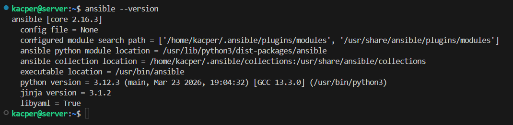
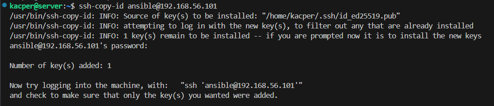
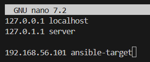
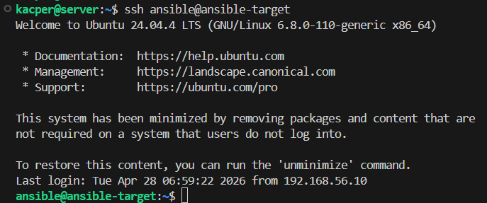
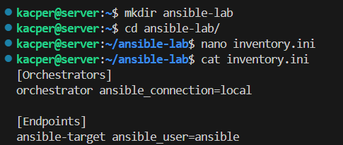

# Sprawozdanie z zajęć nr 8

- **Imię i nazwisko:** Kacper Strzesak
- **Indeks:** 423521
- **Kierunek:** Informatyka techniczna
- **Grupa**: 5

---

## 1. Środowisko pracy

Ćwiczenie zostało wykonane w środowisku wirtualnym `VirtualBox`. Wykorzystano dwie maszyny wirtualne o systemie operacyjnym `Ubuntu Server 24.04.4 LTS`:

- maszyna zarządzająca (orchestrator) - główny system z zainstalowanym `Ansible`
- maszyna docelowa (endpoint) - ansible-target

Komunikacja pomiędzy maszynami odbywała się za pomocą protokołu `SSH`.

---

## 2. Instalacja zarządcy Ansible

### Utworzenie maszyny docelowej

Utworzono drugą maszynę wirtualną, na której zainstalowano ten sam system operacyjny co na maszynie głównej, czyli `Ubuntu Server 24.04.4 LTS`.
Zapewniono usługi `OpenSSH Server` oraz obecność programu `tar`. Nadano maszynie nazwę `ansible-target` i utworzono konto użytkownika `ansible`.


Po zakończeniu instalacji sprawdzono działanie systemu oraz usługę `SSH`. Następnie wykonano migawkę maszyny wirtualnej, aby umożliwić szybkie odtworzenie środowiska.

### Instalacja Ansible na maszynie zarządzającej



### Konfiguracja uwierzytelniania SSH

W kolejnym kroku wygenerowano klucze SSH na maszynie głównej oraz skopiowano klucz publiczny na konto `ansible` maszyny docelowej.

```bash
ssh-copy-id ansible@192.168.56.101
```



Dzięki temu możliwe było logowanie bez hasła:

```bash
ssh ansible@ansible-target
```


---

## 3. Inwentaryzacja

### Konfiguracja nazw hostów

Aby umożliwić komunikację po nazwach zamiast adresów IP, zmodyfikowano plik `/etc/hosts` na obu maszynach.

**`server (192.168.56.10):`**



**`ansible-target (192.168.56.101):`**


### Weryfikacja łączności

Przetestowano komunikację między maszynami z wykorzystaniem nazw hostów: `server` oraz `ansible-target`.

**Test z `serwera`:**



**Test z `ansible-target`:**


Testy potwierdziły prawidłowe działanie rozwiązywania nazw oraz łączności między systemami.

### Plik inwentaryzacji Ansible

`Plik inventory w Ansible` to plik konfiguracyjny zawierający listę hostów oraz ich podział na grupy, wykorzystywany do określenia maszyn zarządzających i docelowych.

Utworzono plik `inventory` (plik **[inventory.ini](./ansible-lab/inventory.ini)**.) zawierający dwie grupy:

- `Orchestrators` - maszyna zarządzająca
- `Endpoints` - maszyna docelowa



### Test inwentaryzacji

Wykonano test dostępności wszystkich hostów za pomocą modułu `ping` Ansible:


Wynik potwierdził poprawną konfigurację inwentaryzacji.

---

## 4. Zdalne wywoływanie procedur

Do realizacji kolejnych zadań użyto `playbooka Ansible`, czyli pliku `YAML` służącego do automatyzacji i zdalnego wykonywania poleceń na wielu maszynach jednocześnie. Umożliwia on zarządzanie konfiguracją systemów w sposób powtarzalny i zautomatyzowany.

Stworzono playbooka (plik **[playbook-remote.yml](./ansible-lab/playbook-remote.yml)**), w ramach wykonano następujące operacje:

- wysłanie żądania `ping` do wszystkich maszyn w celu weryfikacji łączności,
- skopiowanie pliku inwentaryzacji na maszyny z grupy `Endpoints`,
- aktualizacja pakietów systemowych,
- zdalne zarządzanie usługami poprzez restart `ssh` oraz `rng`,


#### Wyłączenie usługi SSH na maszynie ansible-target

W ramach testu odporności środowiska sprawdzono działanie playbooka po wyłączeniu usługi `SSH` na maszynie `ansible-target`. W takim przypadku Ansible nie jest w stanie nawiązać połączenia z hostem, co skutkuje jego oznaczeniem jako niedostępny (`unreachable`), jednak pozostałe zadania wykonywane są poprawnie na dostępnych maszynach.


