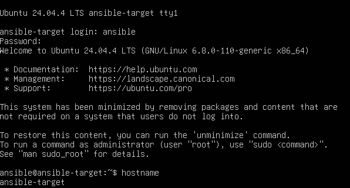
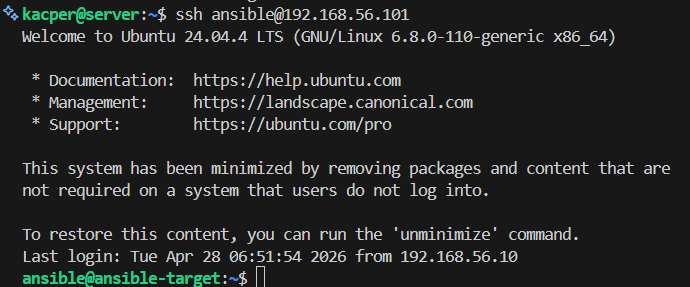
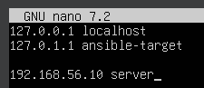
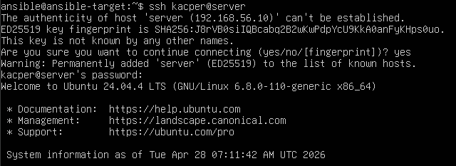

# Sprawozdanie z zajęć nr 8

- **Imię i nazwisko:** Kacper Strzesak
- **Indeks:** 423521
- **Kierunek:** Informatyka techniczna
- **Grupa**: 5

---

## 1. Środowisko pracy

Zadania wykonano na systemie Ubuntu Server 24.04.4 LTS uruchomionym na platformie VirtualBox. W ćwiczeniu wykorzystano dwie maszyny wirtualne. Pierwsza pełniła rolę serwera zarządzającego, natomiast druga była hostem docelowym o nazwie `ansible-target`. Połączenie z maszyną zrealizowano za pomocą protokołu SSH.

---

## 2. Instalacja zarządcy Ansible

Utworzono drugą maszynę wirtualną, na której zainstalowano ten sam system operacyjny co na maszynie głównej, czyli `Ubuntu Server 24.04.4 LTS`.
Zapewniono obecność programu tar oraz usługi OpenSSH Server. Nadano maszynie nazwę ansible-target i utworzono konto użytkownika ansible.

Po zakończeniu instalacji sprawdzono działanie systemu oraz usługę SSH. Następnie wykonano migawkę maszyny wirtualnej, aby umożliwić szybkie odtworzenie środowiska.

W kolejnym kroku wygenerowano klucze SSH na maszynie głównej oraz skopiowano klucz publiczny na konto ansible maszyny docelowej. Dzięki temu możliwe było logowanie poleceniem ssh ansible@ansible-target bez podawania hasła.

---

## 3. Inwentaryzacja

Zmodyfikowano plik `/etc/hosts` na obu maszynach, dodając wpisy umożliwiające komunikację po nazwach domenowych zamiast adresów IP.

**server:**

**ansible-target:**

Po wprowadzeniu zmian zweryfikowano poprawność konfiguracji poprzez połączenie SSH.

Wykonano sprawdzenie dostępności obu maszyn z poziomu `serwera` oraz z hosta `ansible-target`.

**server:**

**ansible-target:**

Testy potwierdziły prawidłowe działanie rozwiązywania nazw oraz łączności między systemami.

---

## 4. Zdalne wywoływanie procedur

---

## 5. Zarządzanie stworzonym artefaktem
