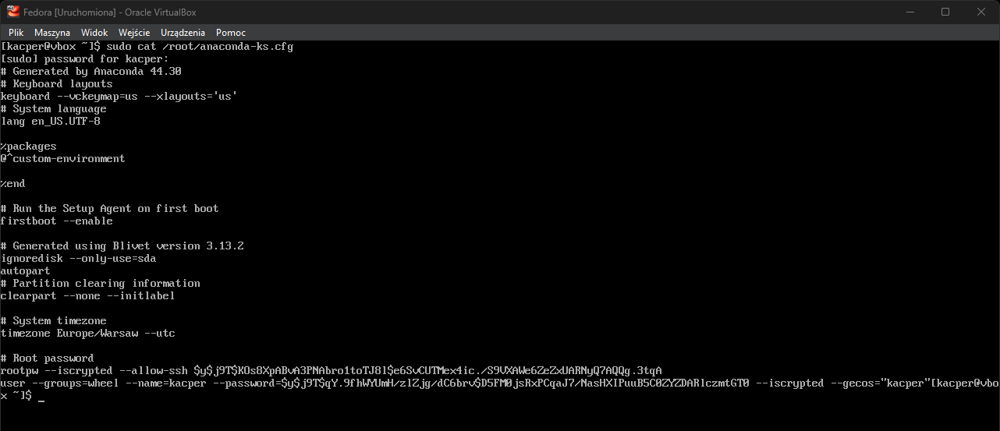
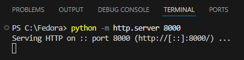
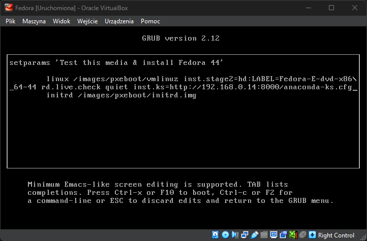
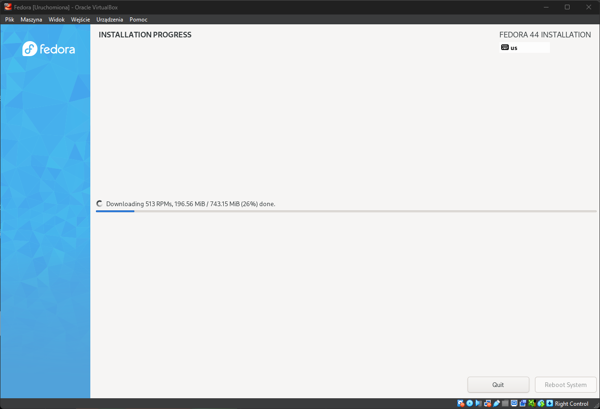
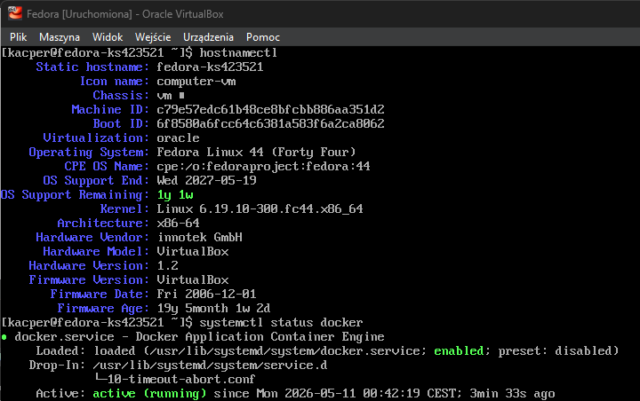
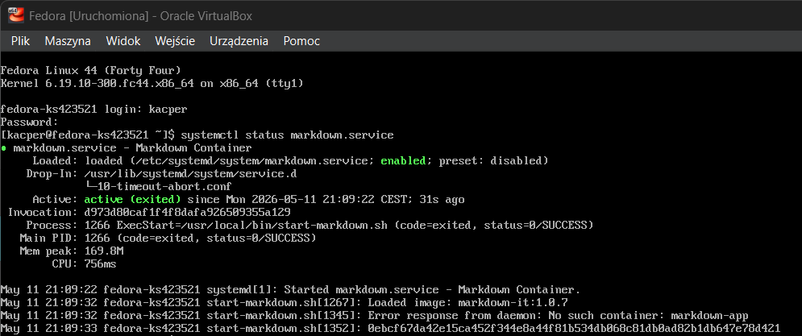
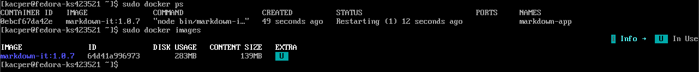

# Sprawozdanie z zajęć nr 9

- **Imię i nazwisko:** Kacper Strzesak
- **Indeks:** 423521
- **Kierunek:** Informatyka techniczna
- **Grupa**: 5

---

## 1. Środowisko pracy

W ramach zadania wykorzystano maszynę wirtualną z systemem **Fedora** w wersji **Fedora Everything 44**, który został użyty do przygotowania oraz przeprowadzenia instalacji nienadzorowanej z wykorzystaniem mechanizmu Kickstart.

---

## 2. Instalacja początkowa systemu Fedora

W pierwszym etapie wykonano standardową, ręczną instalację systemu Fedora na maszynie wirtualnej. Celem tego kroku było wygenerowanie przykładowego pliku Kickstart zawierającego poprawną konfigurację instalatora.

Do instalacji wykorzystano obraz:

`Fedora-Everything-netinst-x86_64-44-1.7`

Po zakończeniu instalacji system Fedora automatycznie wygenerował plik odpowiedzi instalatora Anaconda:



---

### 3. Konfiguracja pliku Kickstart

Plik `anaconda-ks.cfg` został odpowiednio zmodyfikowany w celu automatycznej instalacji systemu Fedora bez udziału użytkownika.

Zawiera on:

- źródła instalacji (repozytoria Fedora 44 i aktualizacji),
- podstawowe ustawienia systemu (język, klawiatura, strefa czasowa, restart po instalacji),
- konfigurację sieci (DHCP oraz hostname `fedora-ks423521`),
- utworzenie kont użytkowników (root oraz użytkownik `kacper` z uprawnieniami administratora),
- automatyczne partycjonowanie dysku z jego wcześniejszym wyczyszczeniem,
- listę instalowanych pakietów (`@core`, `docker`, `wget`, `git`).

```bash
keyboard --vckeymap=us --xlayouts='us'
lang en_US.UTF-8

network --bootproto=dhcp --hostname=fedora-ks423521

firstboot --disable

ignoredisk --only-use=sda

clearpart --all --initlabel
autopart

timezone Europe/Warsaw --utc

reboot

url --mirrorlist=http://mirrors.fedoraproject.org/mirrorlist?repo=fedora-44&arch=x86_64

repo --name=updates --mirrorlist=http://mirrors.fedoraproject.org/mirrorlist?repo=updates-released-f44&arch=x86_64

rootpw root
user --groups=wheel --name=kacper --password=123

%packages
@core
docker
wget
git
%end

%post
systemctl enable docker
%end
```

Plik ten zapewnia pełną automatyzację procesu instalacji w środowisku sieciowym.

---

## 4. Udostępnienie pliku Kickstart

Plik **[anaconda-ks.cfg](./anaconda-ks.cfg)**: został umieszczony lokalnie:

```
C:\Fedora
```

Do jego udostępnienia wykorzystano prosty serwer HTTP uruchomiony za pomocą Pythona:

```bash
python -m http.server 8000
```

Serwer został uruchomiony na adresie: `192.168.0.14:8000`



---

## 5. Integracja z instalatorem

Podczas uruchamiania maszyny wirtualnej z obrazu ISO, instalator Fedora został skonfigurowany do użycia pliku Kickstart poprzez parametr:

```
inst.ks=http://192.168.0.14:8000/anaconda-ks.cfg
```



Dzięki temu instalator automatycznie pobiera plik konfiguracyjny i przeprowadza instalację bez interakcji użytkownika.



Proces instalacji przebiegł poprawnie. Po pierwszym uruchomieniu dostępna była działająca usługa Docker.



---

# 6. Rozszerzenie pliku Kickstart

Plik Kickstart został rozszerzony o konfigurację umożliwiającą automatyczne wdrożenie aplikacji kontenerowej po zakończeniu instalacji systemu.

W sekcji `%post` skonfigurowano:

- automatyczne włączenie usługi Docker,
- pobranie obrazu Docker z lokalnego serwera HTTP,
- utworzenie skryptu uruchamiającego kontener,
- utworzenie usługi systemd,
- automatyczne uruchamianie aplikacji po starcie systemu.

Dodana sekcja `%post`:

```bash
%post --log=/root/ks-post.log

exec > /dev/tty3 2>&1

echo "Start konfiguracji post-install"

echo "Wlaczanie Docker"
systemctl enable docker

echo "Pobieranie obrazu Docker"
wget http://192.168.0.234:8000/markdown-it-1.0.7.tar -O /opt/markdown-it.tar

echo "Tworzenie skryptu startowego"

cat > /usr/local/bin/start-markdown.sh << 'EOF'
#!/bin/bash

docker load -i /opt/markdown-it.tar

docker rm -f markdown-app || true

docker run -d \
  --name markdown-app \
  --restart=always \
  markdown-it:1.0.7
EOF

chmod +x /usr/local/bin/start-markdown.sh

echo "Tworzenie uslugi systemd"

cat > /etc/systemd/system/markdown.service << 'EOF'
[Unit]
Description=Markdown Container
After=docker.service network-online.target
Requires=docker.service

[Service]
ExecStart=/usr/local/bin/start-markdown.sh
Restart=on-failure
RemainAfterExit=yes

[Install]
WantedBy=multi-user.target
EOF

echo "Wlaczanie uslugi"

systemctl enable markdown.service

echo "Konfiguracja zakonczona"

%end
```

### Wyświetlanie działań sekcji `%post`

W celu spełnienia wymagań zakresu rozszerzonego zastosowano przekierowanie wyjścia sekcji `%post` na terminal instalatora:

`exec > /dev/tty3 2>&1`

---

# 7. Automatyczne uruchamianie aplikacji

Po zakończeniu instalacji system automatycznie uruchamiał usługę markdown.service, która odpowiadała za załadowanie obrazu Docker oraz uruchomienie kontenera aplikacji.





---

# 8. Wnioski

Mechanizm Kickstart umożliwia pełną automatyzację procesu instalacji oraz wdrażania środowisk systemowych. Połączenie Kickstart, Docker oraz pipeline CI/CD pozwoliło na przygotowanie rozwiązania realizującego automatyczną instalację systemu, instalację wymaganych zależności, pobieranie artefaktów wdrożeniowych oraz automatyczne uruchamianie aplikacji po starcie systemu. Przygotowana konfiguracja umożliwia również szybkie tworzenie kolejnych środowisk testowych bez konieczności ręcznej konfiguracji systemu. Zastosowane rozwiązanie znacząco upraszcza proces wdrażania oraz zarządzania nowymi maszynami wirtualnymi.
