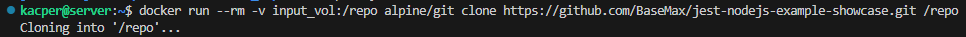
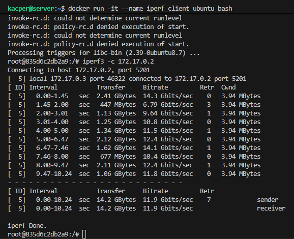
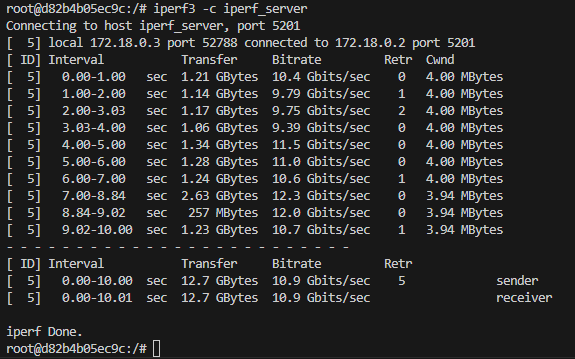
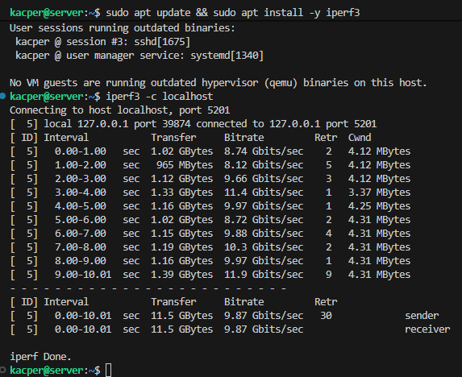
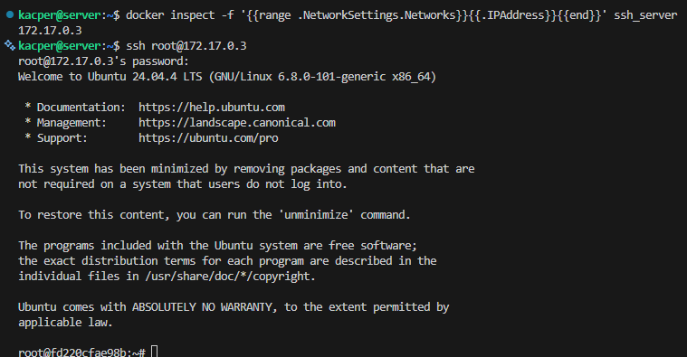
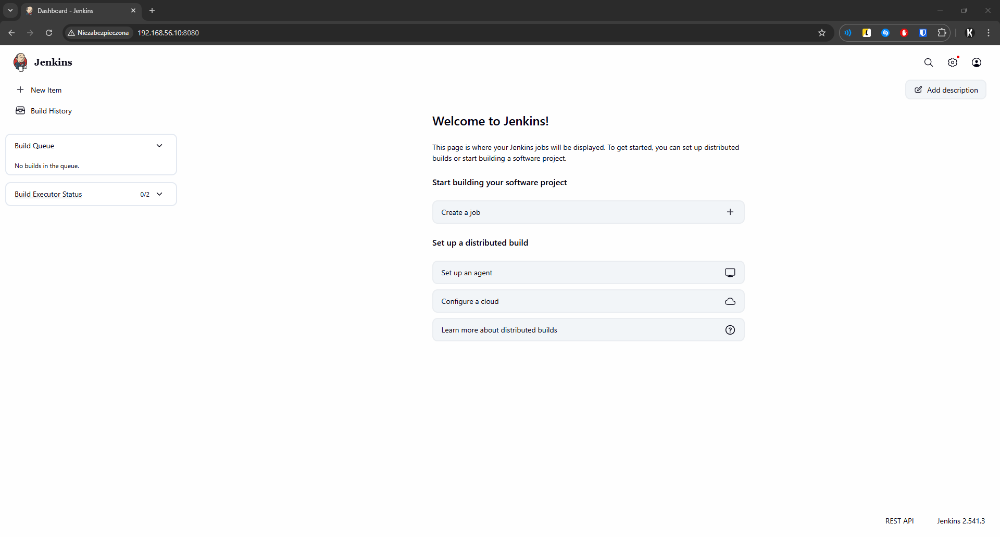

# Sprawozdanie Zbiorcze z Zajęć 1-4

- **Imię i nazwisko:** Kacper Strzesak
- **Indeks:** 423521
- **Kierunek:** Informatyka techniczna
- **Grupa**: 5

---

## Spis treści

1. [Przygotowanie środowiska](#przygotowanie)
2. [Zajęcia 01: Git, Gałęzie i SSH](#zajęcia-01)
3. [Zajęcia 02: Docker - Kontenery](#zajęcia-02)
4. [Zajęcia 03: Dockerfile](#zajęcia-03)
5. [Zajęcia 04: Zaawansowana Konteneryzacja](#zajęcia-04)

---

## Przygotowanie środowiska

**Maszyna wirtualna (VM)** to emulacja pełnego systemu komputerowego działająca jako oprogramowanie na fizycznym komputerze (hoście). Pozwala uruchomić drugi system operacyjny (tutaj Ubuntu) niezależnie od systemu głównego, bez konieczności zmian w partycjach dysku czy bootowania. VirtualBox to darmowy hypervisor umożliwiający tworzenie i zarządzanie maszynami wirtualnymi.

**Platforma:** Maszyna wirtualna VirtualBox  
**System operacyjny:** Ubuntu Server 24.04.4 LTS  
**Dostęp:** SSH (użytkownik: kacper, bez dostępu root)

**Konfiguracja karty sieciowej:**

- **Karta 1 (NAT)** - dostęp do Internetu, pobieranie pakietów, dostęp do GitHub
- **Karta 2 (Host-Only)** - łączność między hostem a maszyną wirtualną, komunikacja SSH i SFTP

## Zajęcia 01: Git, Gałęzie i SSH

### 1.1. Przegląd Technologii

#### **Git**

Git to rozproszczony system kontroli wersji (DVCS) używany do śledzenia zmian w kodzie źródłowym. Umożliwia współpracę wielu developerów nad projektem, zarządzanie historią zmian oraz pracę na niezależnych gałęziach kodu.

W DVCS każdy deweloper ma pełną kopię repozytorium, co umożliwia pracę offline, gdzie wszystkie operacje (commit, history, branching) działają bez dostępu do sieci, zapewnia pełną historię dostępną lokalnie oraz zdecentralizowany workflow bez jednego głównego serwera.

Systemy kontroli wersji różnią się architekturą:

- **Scentralizowane (CVS, SVN)** - jeden serwer, klienci pobierają zmiany, wymagają dostępu online
- **Rozproszczone (Git, Mercurial, Bazaar)** - każdy ma pełną kopię, offline-friendly
- **Hybrydowe** - kombinacja obu podejść

**Ważne komendy:**

- Klonowanie repozytorium

  `git clone https://github.com/InzynieriaOprogramowaniaAGH/MDO2026_ITE.git`

- Tworzenie nowej gałęzi

  `git checkout -b KS423521`

- Sprawdzenie statusu

  `git status`

- Dodanie plików do staging area

  `git add <file>`

- Commit ze wiadomością

  `git commit -m "KS423521: Wiadomość commita"`

- Push do zdalnego repozytorium

  `git push origin KS423521`

W tych zajęciach sklonowano repozytorium przedmiotowe za pomocą HTTPS i personal access token.

#### **SSH**

SSH (Secure Shell) to protokół sieciowy umożliwiający bezpieczną, zaszyfrowaną komunikację z serwerami zdalnymi. Przy pracy z Git może być używany zamiast HTTPS do autentykacji bez konieczności wpisywania hasła przy każdej operacji.

**Typy kluczy:**

- **RSA** - klasyczny, ale powoli wycofywany
- **Ed25519** - nowoczesny, krótsze klucze, silniejsza kryptografia
- **ECDSA** - alternatywa dla RSA

**Generowanie kluczy:**

- Generowanie klucza ed25519 z hasłem

  `ssh-keygen -t ed25519 -f ~/.ssh/id_ed25519_github -N "hasło"`

- Generowanie klucza ecdsa bez hasła

  `ssh-keygen -t ecdsa -f ~/.ssh/id_ecdsa`

- Dodanie klucza do SSH agenta

  `ssh-add ~/.ssh/id_ed25519_github`

- Testowanie połączenia

  `ssh -T git@github.com`

- Klonowanie repozytorium przez SSH

  `git clone git@github.com:InzynieriaOprogramowaniaAGH/MDO2026_ITE.git`

**Generowanie kluczy podczas zajęć:**


Zastosowanie dwóch kluczy SSH (Ed25519 i ECDSA), z co najmniej jednym zabezpieczonym hasłem, oraz skonfigurowanie klucza jako metody dostępu do GitHub umożliwia bezpieczne klonowanie repozytorium przez protokół SSH, eliminując potrzebę wpisywania poświadczeń przy każdej operacji.

#### **Git Hooks**

Git hooki to skrypty, które mogą być uruchamiane automatycznie w określonych momentach cyklu życia Git (np. przed committem, po push). Umożliwiają egzekwowanie standardów kodowania i polityk projektowych.

**Lokalizacja:** `.git/hooks/`

**Przykład z zajęć - Weryfikacja Formatu Wiadomości Commita:**

```bash
#!/bin/bash

PREFIX="KS423521"

MSG_FILE="$1"
MSG=$(cat "$MSG_FILE")

if [[ "$MSG" != $PREFIX* ]]; then
  echo "Commit message must start with '$PREFIX'!"
  echo "Your message: $MSG"
  exit 1
fi

exit 0
```

**Przetestowanie git hooka stworzonego podczas zajęć**


**Instalacja hooka:**

- Skopiowanie skryptu do katalogu hooks

  `cp commit-msg-hook ~/.git/hooks/commit-msg`

- Nadanie praw wykonywania

  `chmod +x ~/.git/hooks/commit-msg`

Skrypt weryfikujący format commit message (wymagający, aby każda wiadomość zaczynała się od inicjałów i numeru indeksu) umieszczony w `.git/hooks/commit-msg` automatycznie uruchamia się przy każdym commit'cie, egzekwując standardy kodowania zespołu.

---

## Zajęcia 02: Docker - Kontenery

### 2.1. Przegląd Technologii

#### **Docker - Podstawowe Koncepty**

Docker to platforma do konteneryzacji aplikacji, czyli pakowania aplikacji wraz ze wszystkimi zależnościami w izolowane, przenośne środowiska zwane kontenerami. W odróżnieniu od maszyn wirtualnych (VM), kontenery są lekkie, ponieważ dzielą kernel systemu operacyjnego hosta, a nie emulują cały system operacyjny.

**Kluczowe pojęcia:**

- **Obraz (Image)** to szablon zawierający aplikację, system plików, zależności i zmienne środowiskowe. Jest to static blueprint do tworzenia kontenerów.
- **Kontener (Container)** to uruchomiona instancja obrazu, działająca w izolacji z własnymi procesami i przestrzenią dyskową.
- **Registry** to repozytorium obrazów (Docker Hub jest publicznym repozytorium zawierającym tysiące gotowych obrazów).
- **Dockerfile** to plik tekstowy z instrukcjami (FROM, RUN, COPY, CMD), który definiuje jak ma być zbudowany obraz.

### 2.2. Ważne Obrazy Dockera

Podczas zajęć testowano trzy popularne obrazy:

1. **hello-world** - Minimalny obraz do testowania instalacji Docker `docker run hello-world`
2. **busybox** - Kompletny Linux w ~4 MB z podstawowymi narzędziami, uruchomiony interaktywnie `docker run -it busybox sh`
3. **ubuntu** - Pełny system Ubuntu, pozwalający testować instalacje pakietów `docker run -it ubuntu bash`


### 2.3. Tworzenie Dockerfile

**Dockerfile** zawiera instrukcje budowania obrazu:

- `FROM` - wybór obrazu bazowego (np. `ubuntu:24.04`)
- `RUN` - wykonanie poleceń podczas budowania (np. `apt install`)
- `COPY` - skopiowanie plików z hosta do kontenera
- `WORKDIR` - ustawienie katalogu roboczego
- `CMD` - domyślne polecenie przy uruchomieniu kontenera

Każda instrukcja tworzy nową warstwę (layer) w obrazie, co pozwala na efektywne cachowanie.


---

## Zajęcia 03: Dockerfile - Automatyzacja Buildowania {#zajęcia-03}

### 3.1. Przegląd Technologii

#### **Multi-Stage Builds - Optymalizacja Obrazów**

**Opis:**
Multi-stage build to technika budowania obrazów Docker, w której jeden Dockerfile zawiera wiele etapów (`FROM`). Każdy etap może coś zbudować, a ostatni etap zawiera tylko niezbędne artefakty. Pozwala na znaczne zmniejszenie rozmiaru finalnego obrazu.

**Zalety:**

- Mniejsze obrazy (szybsze transfery i uruchamianie)
- Oddzielenie procesów budowania i deploymentu
- Brak pozostałości po buildzie w obrazie produkcyjnym
- Bezpieczeństwo - narzędzia buildowania nie docierają do produkcji

#### **Repozytorium Testowe**

Wybrano repozytorium [jest-nodejs-example-showcase](https://github.com/BaseMax/jest-nodejs-example-showcase) spełniające wymagania:

- Otwarta licencja (**GPL-3**)
- Środowisko **Node.js** z testami **Jest**
- Obsługa `npm install` i `npm test`

Testy w `sum.js` przeszły pomyślnie (**12 passed**). Pozostałe zestawy zgłosiły błędy, ponieważ ich kod jest zakomentowany.

### 3.2. Budowanie w Kontenerze

Proces budowania aplikacji Node.js w Dockerze obejmuje trzy etapy: najpierw interaktywne przetestowanie procesu w kontenerze na żywo, następnie automatyzacja za pomocą Dockerfile'a i zastosowanie **multi-stage builds** do optymalizacji obrazów.

**Dockerfile Builder** (etap 1): Automatyzacja kroków - `FROM node:20-slim`, ustawienie `WORKDIR /app`, skopiowanie `package*.json`, uruchomienie `npm install`, skopiowanie całego kodu i wykonanie `npm run build --if-present`. Każda warstwa (FROM, RUN, COPY) jest cachowana, co przyspiesza powtórzenia.

**Multi-Stage Builds** (etap 2): Drugi etap bazuje na image'u z etapu 1 (`FROM jest-build`) i uruchamia testy za pomocą `CMD ["npm", "test"]`. To podejście oddziela proces budowania od testowania i zmniejsza rozmiar obrazu finalnego.


---

## Zajęcia 04: Zaawansowana Konteneryzacja {#zajęcia-04}

### 4.1. Przegląd Technologii

#### **Woluminy Docker - Persystencja Danych**

Woluminy to mechanizm Docker do przechowywania danych, które przetrwają cykl życia kontenera. Istnieją trzy typy: **Woluminy** (zarządzane przez Docker, polecane dla produkcji), **Bind Mounts** (mapowanie katalogów hosta bezpośrednio do kontenera), i **tmpfs** (pamięć RAM, dane tracimy po wyrażeniu kontenera). Woluminy mogą być dzielone między wieloma kontenerami i są zarządzane niezależnie od ich cyklu życia.

Woluminy umożliwiają efektywne oddzielenie kodu źródłowego od artefaktów zbudowanych. Repozytorium można sklonować poziomu hosta przy użyciu kontenera pomocniczego (gdy main kontener ich nie ma). Zbudowane pliki zapisane na wolumin wyjściowy przetrwają usunięcie kontenera, co umożliwia ciągłość workflow'u. Automatyzacja całego procesu za pomocą `RUN --mount` w Dockerfile'u pozwala na integrację woluminów w etapie budowania obrazu.



#### **iPerf3**

iPerf3 to standardowe narzędzie do pomiaru przepustowości, latencji i utraty pakietów w sieciach. Pracuje w modelu klient-serwer: jeden kontener uruchamia serwer (`iperf3 -s`), drugi uruchamia klienta (`iperf3 -c server_name`). Wynik pokazuje przepustowość w Gbits/sec, jitter i procent utracionych pakietów. W Dockerze kontenery muszą być w tej samej sieci aby mogły się komunikować.

**Konfiguracje rozważane na zajęciach:**

- **Sieć domyślna (Bridge)** - testowanie z wykorzystaniem adresów IP kontenerów, kontenery w tej samej domyślnej sieci, komunikacja bezpośrednia po IP



- **Dedykowana sieć mostkowa** - utworzenie własnej sieci za pomocą `docker network create`, komunikacja między kontenerami po nazwie zamiast IP dzięki wbudowanemu DNS



- **Testowanie z hosta** - mapowanie portu serwera iPerf na port hosta (`-p host:container`), połączenie klienta z hosta do kontenera



Sieci Docker'a (domyślny bridge, dedykowane mosty) umożliwiają elastyczną komunikację. DNS w sieciach mostkowych eliminuje potrzebę operowania adresami IP.

#### **SSH w Kontenerze**

SSH (Secure Shell) pozwala na bezpieczne, zdalne logowanie do kontenera. Wymaga instalacji pakietu `openssh-server` oraz konfiguracji (zmiana `PermitRootLogin yes` w `/etc/ssh/sshd_config`). W praktyce SSH jest rzadko używane w Dockerze, preferuje się `docker exec` dla dostępu do działającego kontenera.



#### **Jenkins**

Jenkins to serwer Continuous Integration/Deployment automatyzujący budowanie, testowanie i wdrażanie. Koncept użycia: **Pipeline** (sekwencja kroków), **Job** (jednostka pracy, np. build), **Agent** (maszyna/kontener wykonujący job), **Webhook** (trigger z GitHub/GitLab uruchamiający job). Jenkins uruchamia się w kontenerze przez `docker run`, dostępny na porcie 8080. Opcja `Dind` (Docker in Docker) pozwala Jenkins'owi budować obrazy Docker, poprzez zalogu socket'u Docker hosta (`-v /var/run/docker.sock:/var/run/docker.sock`).


Jenkins w architekturze DinD umożliwia w pełni zautomatyzowany pipeline CI/CD - budowanie, testowanie i deployment kontenerów w jednym procesie.
