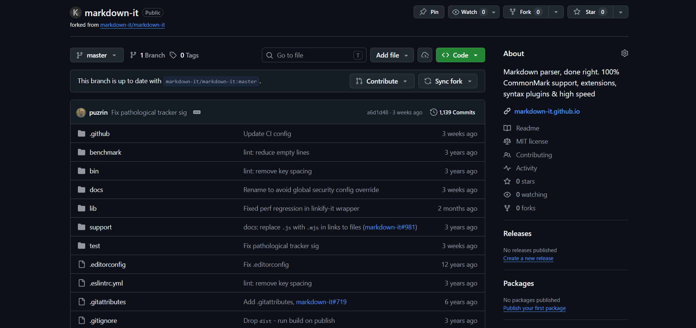
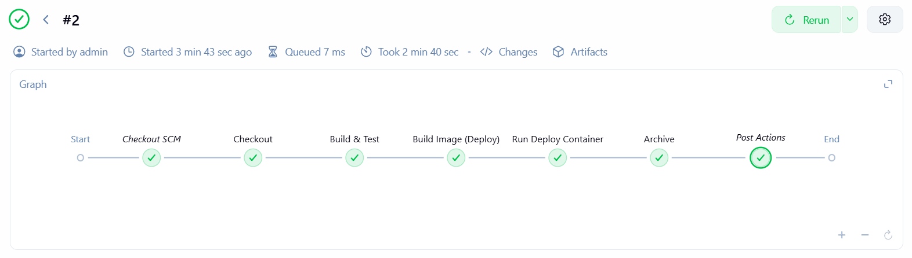
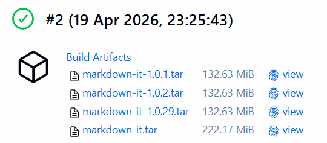
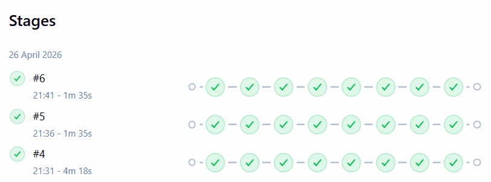
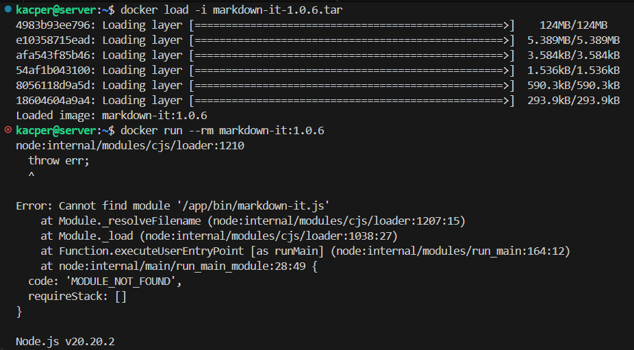

# Sprawozdanie Zbiorcze z Zajęć 5-7

- **Imię i nazwisko:** Kacper Strzesak
- **Indeks:** 423521
- **Kierunek:** Informatyka techniczna
- **Grupa**: 5

---

## Spis treści

1. [Przygotowanie środowiska](#przygotowanie-środowiska)
2. [Zajęcia 05: Konfiguracja Jenkins](#zajęcia-05-konfiguracja-jenkins)
3. [Zajęcia 06: Projektowanie procesu CI/CD](#zajęcia-6-projektowanie-procesu-cicd)
4. [Zajęcia 07: Jenkinsfile i "Definition of Done"](#zajęcia-07-jenkinsfile-i-definition-of-done)
5. [Wnioski końcowe](#wnioski-końcowe)

---

## Przygotowanie środowiska

Zadania (zajęcia 5-7) wykonano na maszynie wirtualnej Ubuntu Server 24.04.4 LTS uruchomionej w VirtualBox, z dostępem przez SSH (użytkownik `kacper`). Jenkins działał w kontenerze, a operacje Docker realizowano w izolacji przez **Docker-in-Docker (DIND)** (`docker:dind`).

---

## Zajęcia 05: Konfiguracja Jenkins

### Przebieg prac

#### Uruchomienie Jenkinsa z Blue Ocean i DIND

Na tym etapie ważne było nie tylko uruchomienie Jenkinsa, ale też przygotowanie go do pracy z kontenerami w kontrolowany sposób. DIND zapewnił izolację operacji Docker oraz powtarzalność konfiguracji.


Do logowania użyto hasła inicjalnego z kontenera:

```bash
docker exec jenkins-blueocean cat /var/jenkins_home/secrets/initialAdminPassword
```

Skonfigurowano retencję logów/buildów, aby środowisko nie wymagało ręcznego sprzątania.

#### Minimalne testy działania (freestyle)

Zamiast od razu budować złożony pipeline, wykonano trzy proste zadania, które potwierdziły fundamenty działania środowiska.

- Jenkins uruchamia komendy i publikuje logi (`uname -a`),
- statusy błędów są poprawnie mapowane na FAIL/OK (skrypt zależny od nieparzystej godziny),
- Jenkins ma realny dostęp do Dockera (`docker pull ubuntu`).

Te testy pokazały, że problemy w kolejnych krokach zwykle wynikają z konfiguracji Dockera i uprawnień, a nie ze składni pipeline.

#### Pierwszy pipeline i obserwacja cache

Utworzono pierwszy obiekt Pipeline (checkout + build obrazu). Drugie uruchomienie było szybsze dzięki cache Dockera, dlatego trzeba było pilnować pracy na aktualnym kodzie i przewidywalnym stanie środowiska.


### Wnioski z laboratorium nr 5

Laboratorium 5 potwierdziło, że stabilne CI to nie tylko uruchomienie Jenkinsa, ale też logi, retencja buildów i możliwość diagnozy z historii uruchomień. Krótkie testy Freestyle pozwoliły szybko potwierdzić działanie Dockera, a obserwacja cache pokazała potrzebę kontroli „świeżości” workspace.

---

## Zajęcia 6: Projektowanie procesu CI/CD

### Założenia projektu

#### Wybór aplikacji i model pracy z repozytorium

Wybrano projekt **markdown-it** (licencja MIT) oraz wykonano fork, aby trzymać `Dockerfile` i `Jenkinsfile` w repozytorium (SCM).



Fork ułatwił wprowadzanie zmian infrastrukturalnych niezależnie od upstream.

W praktyce oznaczało to, że pipeline w Jenkinsie mógł wykonywać pełny proces (checkout → build → test → deploy → publish) bez ręcznego dopinania konfiguracji w GUI oraz bez ryzyka rozjechania się wersji plików infrastrukturalnych z kodem aplikacji.

### Diagram UML planowanego procesu

Na podstawie wymagań laboratoriów zaprojektowano ścieżkę krytyczną procesu CI/CD (od checkout po publikację artefaktu). Diagram pomógł ustalić kolejność etapów i to, które elementy muszą być wykonywane w izolacji kontenerowej.


Wersja procesu z diagramu odpowiadała następującym krokom:

- pobranie kodu z SCM (checkout),
- budowa i testy w kontenerach (multi-stage),
- zbudowanie lekkiego obrazu runtime,
- uruchomienie kontenera runtime jako smoke test,
- zapisanie obrazu jako artefakt i archiwizacja w Jenkinsie.

#### Izolacja etapów build/test/deploy przez multi-stage Dockerfile

Zastosowano multi-stage build z jawnymi tagami wersji Node.

```dockerfile
# BUILD
FROM node:20-slim AS build
WORKDIR /app
COPY package*.json ./
RUN npm install
COPY . .
RUN npm run build

# TEST
FROM build AS test
RUN npm test

# DEPLOY
FROM node:20-alpine AS deploy
WORKDIR /app
COPY --from=build /app/dist ./dist
COPY --from=build /app/package*.json ./
ENTRYPOINT ["node", "bin/markdown-it.js"]
```

Multi-stage zapewnił spójność zależności (test bazuje na build) i pozwolił utrzymać lekki obraz runtime.

### Automatyzacja w Jenkins (Jenkinsfile)

Pipeline w Jenkinsie odwzorował założenia z diagramu. Kluczowe elementy:

- wersjonowanie na podstawie `BUILD_NUMBER` (np. `1.0.5`),
- osobne budowanie obrazu **test** i **deploy** (`--target`),
- smoke test poprzez uruchomienie kontenera runtime,
- archiwizacja obrazu jako plik `.tar` z `fingerprint: true`.

Wynik uruchomienia pipeline (build zakończony sukcesem):



#### Publish jako artefakt obrazu Docker

Artefaktem był obraz zapisany do pliku `.tar` (`docker save`), archiwizowany przez Jenkinsa z fingerprintem. Wersjonowanie oparto o `${BUILD_NUMBER}`, co ułatwia identyfikację i odtworzenie builda.



Taki artefakt można przenieść na inne środowisko i uruchomić po `docker load`.

### Wnioski z laboratorium nr 6

Laboratorium 6 pokazało, że poprawnie zaprojektowany pipeline jest czytelniejszy i łatwiejszy do diagnozowania, gdy:

- testy wykonywane są w oparciu o identyczne zależności (test bazuje na build),
- artefakt ma jednoznaczną wersję oraz "ślad pochodzenia" (fingerprint + `${BUILD_NUMBER}`),
- smoke test jest częścią ścieżki krytycznej (uruchomienie obrazu runtime).

Efektem było uzyskanie w Jenkinsie artefaktu w postaci `.tar`, który można przenieść i odtworzyć na innym hoście (po `docker load`).

---

## Zajęcia 07: Jenkinsfile i "Definition of Done"

### Usprawnienia w Jenkinsfile

W `Jenkinsfile` dodano czyszczenie workspace przed `checkout scm`, aby kolejne uruchomienia pipeline nie pracowały na stanie z poprzednich buildów.

```groovy
stage('Clean Workspace') {
    steps {
        deleteDir()
    }
}
```

To poprawia powtarzalność uruchomień. Czyszczenie dotyczy workspace (plików po `checkout`), ale nie usuwa cache warstw Dockera.



### Test „Definition of Done”

Artefakt miał być **deployable**, czyli po pobraniu miał dać się uruchomić bez ręcznych poprawek.

Załadowanie obrazu z artefaktu.

```bash
docker load -i markdown-it-1.0.6.tar
```

Operacja importu zakończyła się sukcesem.



Jednocześnie uruchomienie kontenera wykazało błąd runtime.

`Cannot find module '/app/bin/markdown-it.js'`

### Wniosek z „Definition of Done”

Test pokazał, że sukces etapów build/test/archive nie oznacza, że artefakt da się uruchomić. Błąd `Cannot find module '/app/bin/markdown-it.js'` wynikał z problemu warstwy runtime (niezgodny entrypoint).

Wniosek: smoke test powinien uruchamiać artefakt tak samo jak po publikacji, aby wykrywać błędy entrypointu i brakujących plików.

---

## Wnioski

Głównym efektem laboratoriów 5–7 było zbudowanie procesu CI, który jest powtarzalny i możliwy do diagnozowania (logi, historia buildów, artefakty).

Na podstawie wykonanych ćwiczeń można sformułować następujące wnioski:

- Proste zadania typu Freestyle są dobrym „testem bazowym” środowiska: szybko potwierdzają działanie poleceń, mapowanie statusów oraz dostęp do Dockera, zanim zacznie się rozwijać złożony pipeline.
- Trzymanie plików `Jenkinsfile` i `Dockerfile` w repozytorium (SCM) ułatwia odtworzenie procesu oraz wprowadzanie zmian bez ręcznej konfiguracji w Jenkinsie.
- Publikacja obrazu jako artefaktu `.tar` archiwizowanego w Jenkinsie wraz z fingerprintem zapewnia przenośność.
- Czyszczenie workspace przed `checkout` zmniejsza ryzyko pracy na stanie z poprzednich buildów.
- Kluczowy wniosek jakościowy: pipeline zakończony sukcesem nie gwarantuje, że artefakt jest deployable. Definition of Done powinna obejmować test uruchomieniowy artefaktu (np. `docker load` + próba uruchomienia kontenera), ponieważ dopiero wtedy wychodzą błędy warstwy runtime.
