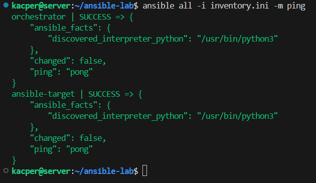
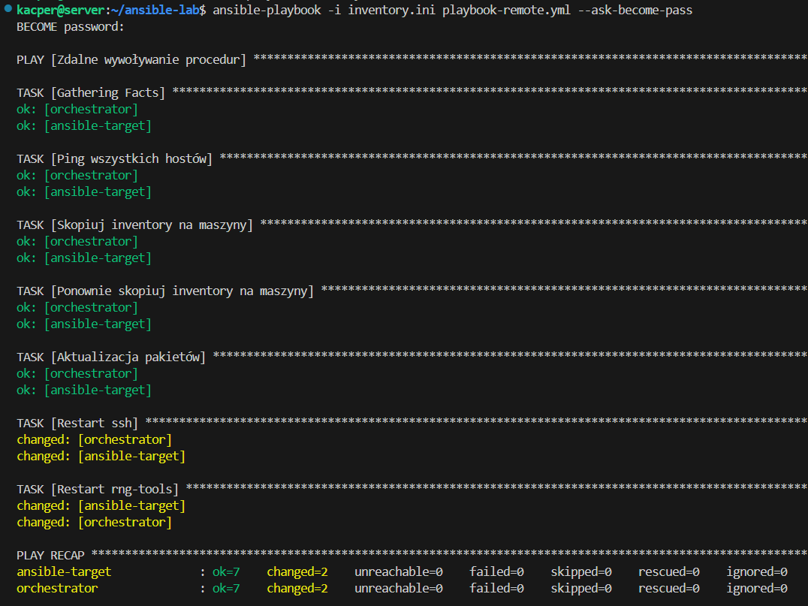
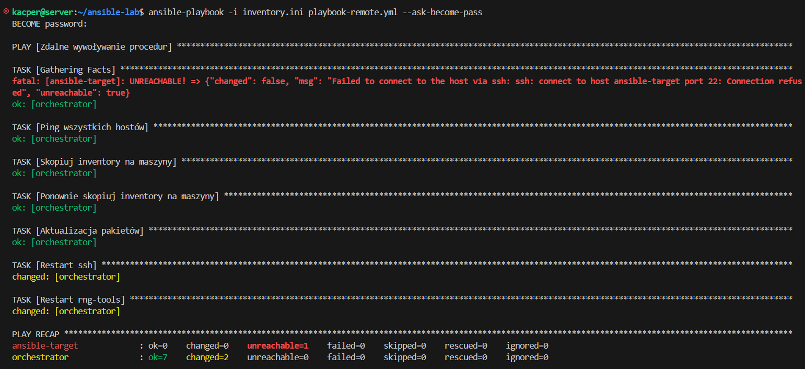
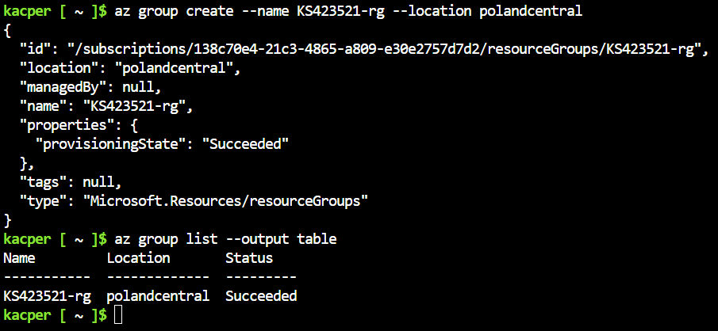
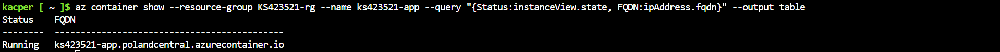
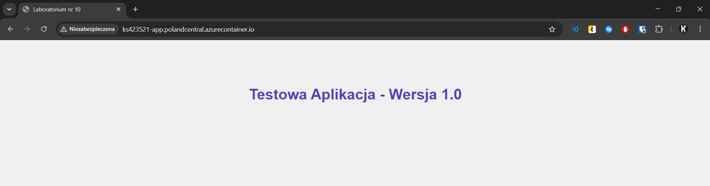

# Sprawozdanie zbiorcze z zajęć nr 8–12

* **Imię i nazwisko:** Kacper Strzesak
* **Indeks:** 423521
* **Kierunek:** Informatyka techniczna
* **Grupa:** 5

---

## Wprowadzenie

Ćwiczenia obejmowały tematykę automatyzacji, nienadzorowanej instalacji systemów oraz orkiestracji aplikacji przy użyciu narzędzi Ansible, Kickstart, Kubernetes (Minikube) oraz Azure Container Instances.

---

## Zajęcia nr 8: Ansible - zarządzanie konfiguracją

**Ansible** to narzędzie do automatyzacji konfiguracji systemów i zarządzania infrastrukturą działające w modelu bezagentowym. Nie wymaga instalacji dodatkowego oprogramowania na maszynach docelowych, a komunikacja odbywa się przez SSH.

### Inventory

Centralnym elementem konfiguracji Ansible jest **plik inventory**, czyli lista hostów podzielona na nazwane grupy logiczne. Ansible wykorzystuje go do określenia, na których maszynach wykonywać zadania. W ćwiczeniu zdefiniowano dwie grupy: `Orchestrators` jako maszynę zarządzającą oraz `Endpoints` jako maszynę docelową `ansible-target`. Dostępność hostów można sprawdzić modułem `ping`, który weryfikuje połączenie SSH oraz działanie interpretera Pythona.

Plik inventory utworzony podczas zajęć: **[`inventory.ini`](../Sprawozdanie8/ansible-lab/inventory.ini)**.

Test `ping`:



### Playbook i idempotentność

**Playbook** to plik YAML opisujący sekwencję zadań wykonywanych na wybranych hostach. Kluczową cechą Ansible jest **idempotentność**, czyli fakt że każde zadanie opisuje pożądany stan systemu zamiast konkretnej operacji. Jeśli system już spełnia wymagania, zadanie nie wprowadza zmian. Dzięki temu ten sam playbook można uruchamiać wielokrotnie bez ryzyka niepożądanych efektów. W podsumowaniu wykonania (`PLAY RECAP`) pole `changed` wskazuje liczbę zmian, a `ok` liczbę zadań pominiętych jako już spełnione.

Zdefiniowany playbook **[`playbook-remote.yml`](../Sprawozdanie8/ansible-lab/playbook-remote.yml)** wykonał aktualizację pakietów, skopiowanie pliku inventory na hosty z grupy `Endpoints` oraz restart usług `ssh` i `rng`. W przypadku niedostępności hosta Ansible oznacza go jako `unreachable` i kontynuuje działanie na pozostałych maszynach. Zjawisko to sprawdzono poprzez wyłączenie SSH na maszynie `ansible-target`.

Wykonanie playbooka `playbook-remote.yml`:



Wyłączone SSH na hoście `ansible-target`:



---

## Zajęcia nr 9: Kickstart - instalacja nienadzorowana Fedory

**Kickstart** to mechanizm automatycznej instalacji systemów Fedora i RHEL. Wykorzystuje plik odpowiedzi `anaconda-ks.cfg`, który przetwarza instalator Anaconda. Plik zawiera konfigurację języka, klawiatury, strefy czasowej, sieci, partycjonowania, pakietów oraz skryptów poinstalacyjnych. Instalacja może dzięki temu przebiegać bez udziału użytkownika.

### Generowanie i dystrybucja pliku Kickstart

Najprostszy sposób uzyskania pliku to ręczna instalacja systemu. Anaconda zapisuje wtedy konfigurację w `/root/anaconda-ks.cfg`. Plik można później zmodyfikować i wykorzystać jako szablon. Aby udostępnić go instalatorowi, uruchomiono prosty serwer HTTP `python -m http.server 8000`.

Zmodyfikowany plik odpowiedzi: **[anaconda-ks.cfg](../Sprawozdanie9/anaconda-ks.cfg)**.

Wygenerowany plik:


Lokalizacja pliku przekazywana jest instalatorowi jako parametr jądra `inst.ks`, który odczytywany jest przez GRUB przed startem systemu:

```
inst.ks=http://192.168.0.14:8000/anaconda-ks.cfg
```


### Sekcja `%post` i systemd

Kickstart umożliwia wykonanie poleceń powłoki po instalacji systemu w sekcji `%post`, jeszcze przed pierwszym uruchomieniem. Pozwala to na pełną automatyzację konfiguracji środowiska.

**systemd** to system inicjalizacji i menedżer usług w Linuksie, który kontroluje uruchamianie procesów i ich zależności. Użycie `systemctl enable` powoduje automatyczne uruchamianie usługi przy starcie systemu. W sekcji `%post` skonfigurowano usługę `markdown.service`, która uruchamia kontener Docker z aplikacją. Poprawne działanie potwierdzono po uruchomieniu systemu:


---

## Zajęcia nr 10: Kubernetes - podstawy i wdrożenie aplikacji

**Kubernetes (k8s)** to platforma do automatycznego wdrażania, skalowania i zarządzania aplikacjami kontenerowymi. Do ćwiczenia wykorzystano **Minikube**, który uruchamia lokalny jednowęzłowy klaster Kubernetes przeznaczony do nauki i testów. Klaster uruchomiono ze sterownikiem Docker i zweryfikowano narzędziem **kubectl**:

```bash
minikube start --driver=docker
```

Kubernetes udostępnia także Dashboard do monitorowania zasobów takich jak węzły, pody, deploymenty oraz usługi.

Na potrzeby ćwiczenia zbudowano własny obraz Docker oparty na Nginx i uruchomiono go jako **Pod**, czyli podstawową jednostkę wdrożeniową zawierającą kontener i zasoby sieciowe. Dostęp uzyskano przez przekierowanie portów:

```bash
kubectl port-forward pod/myapp-lab10 8080:80
```


Następnie ręczne uruchomienie zastąpiono deklaratywnym plikiem [`deployment.yaml`](../Sprawozdanie10/files/deployment.yaml). **Deployment** zarządza replikami Podów i zapewnia utrzymanie zadanej liczby instancji. Uruchomiono cztery repliki:

```bash
kubectl apply -f deployment.yaml
```


Deployment udostępniono jako **Service**, który zapewnia stały adres sieciowy niezależnie od cyklu życia Podów. Ruch był równomiernie rozdzielany między cztery repliki:


---

## Zajęcia nr 11: Kubernetes - aktualizacje i rollback

Ćwiczenie dotyczyło zarządzania cyklem życia wdrożeń, w tym skalowania, aktualizacji obrazów oraz przywracania poprzednich wersji. Przygotowano trzy obrazy `kacpers7/myapp`: stabilny `1.0`, zmodyfikowany `2.0` oraz wersję `broken`, której kontener natychmiast kończył działanie z błędem.

Przetestowano skalowanie Deploymentu poprzez zmianę pola `replicas` w pliku YAML na wartości 8, 1, 0 oraz ponownie 4. Szczególnie istotne było skalowanie do zera, ponieważ Deployment nadal istnieje, ale żaden Pod nie działa. Umożliwia to szybkie wznowienie działania aplikacji bez ponownego tworzenia zasobów:


Po wdrożeniu wersji `broken` pody przechodziły w stan **CrashLoopBackOff**. Kubernetes wykrywał cykliczne awarie kontenerów i wydłużał odstępy między kolejnymi próbami ich uruchomienia:


Kubernetes przechowuje historię zmian Deploymentu, co umożliwia wykonanie rollbacku do wcześniejszej wersji:

```bash
kubectl rollout history deployment/myapp
kubectl rollout undo deployment/myapp
```


Dodatkowym elementem był skrypt [`check-deploy.sh`](../Sprawozdanie11/files/check-deploy.sh), który automatycznie weryfikował wdrożenie w ciągu 60 sekund i wykonywał rollback w przypadku błędu. Działanie skryptu dla poprawnej wersji obrazu:


---

## Zajęcia nr 12: Azure Container Instances

**Azure Container Instances (ACI)** to usługa chmurowa umożliwiająca uruchamianie kontenerów Docker bez zarządzania maszynami wirtualnymi ani klastrem orkiestracyjnym. Jest to model serverless, w którym użytkownik definiuje jedynie obraz kontenera, zasoby oraz konfigurację sieci, a platforma zajmuje się całą infrastrukturą. Rozliczanie odbywa się wyłącznie za czas działania kontenera, co wymaga kontroli jego cyklu życia.

### Resource Group i Azure CLI

**Resource Group** to logiczny kontener w Azure służący do grupowania powiązanych zasobów. Ułatwia zarządzanie nimi oraz ich wspólne usuwanie. Pracę wykonano przy użyciu **Azure CLI** dostępnego w Azure Cloud Shell:

```bash
az group create --name KS423521-rg --location polandcentral
```



### Wdrożenie i weryfikacja

Polecenie `az container create` uruchamia kontener w chmurze i przypisuje mu zasoby oraz opcjonalną nazwę DNS. W ćwiczeniu uruchomiono obraz `kacpers7/myapp:1.0` w regionie `polandcentral`:

```bash
az container create --resource-group KS423521-rg --name ks423521-app --image kacpers7/myapp:1.0 --ports 80 --dns-name-label ks423521-app --location polandcentral --os-type linux --cpu 1 --memory 1
```

Stan instancji sprawdzano poleceniem `az container show` z filtrowaniem JSON i formatowaniem tabelarycznym:



Aplikacja była dostępna pod adresem `http://ks423521-app.polandcentral.azurecontainer.io/`, a Nginx poprawnie obsługiwał ruch HTTP:



Po zakończeniu testów kontener i Resource Group zostały usunięte, aby uniknąć kosztów:

```bash
az container delete --resource-group KS423521-rg --name ks423521-app --yes
az group delete --name KS423521-rg --yes --no-wait
```

---

## Wnioski

1. Automatyzacja infrastruktury zmniejsza liczbę błędów, ponieważ narzędzia takie jak Ansible i Kickstart pozwalają opisać docelowy stan systemu. Dzięki temu można utrzymać spójną konfigurację wielu maszyn i ograniczyć ręczne, nieudokumentowane zmiany.

2. Kubernetes zwiększa niezawodność i skalowalność aplikacji. Deploymenty, replikacje i rollbacki umożliwiają aktualizacje bez przestojów oraz szybkie przywracanie stabilnych wersji.

3. Usługi chmurowe, takie jak ACI, pozwalają szybko uruchamiać aplikacje bez zarządzania infrastrukturą, ale wymagają kontroli zasobów, aby uniknąć niepotrzebnych kosztów.
