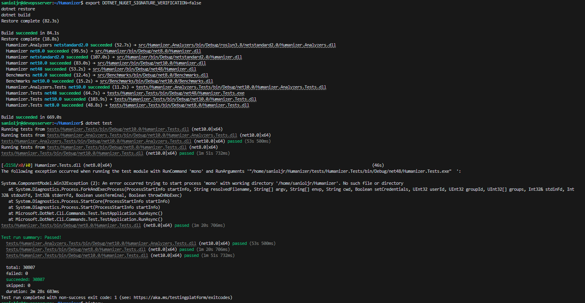
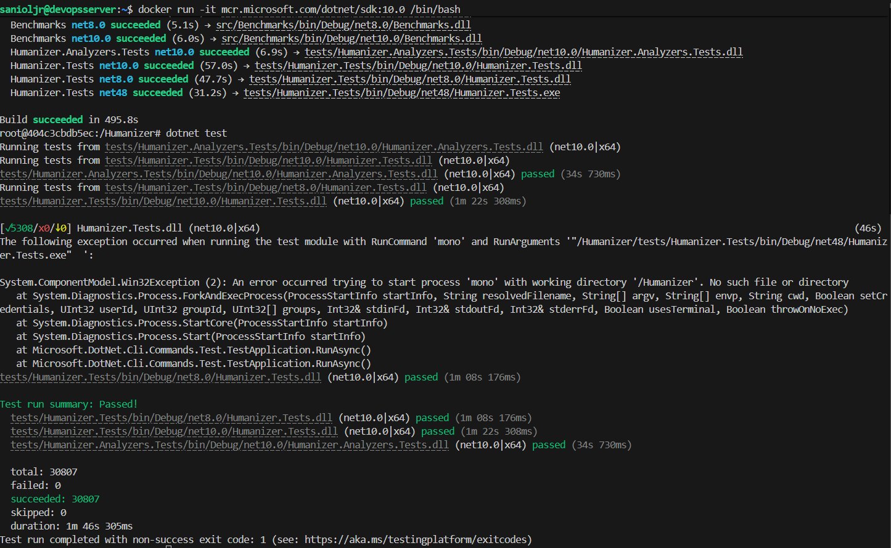
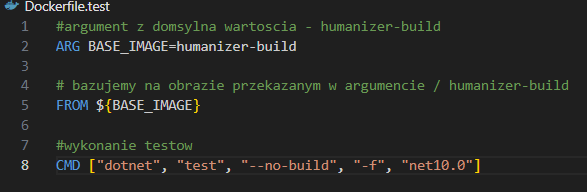
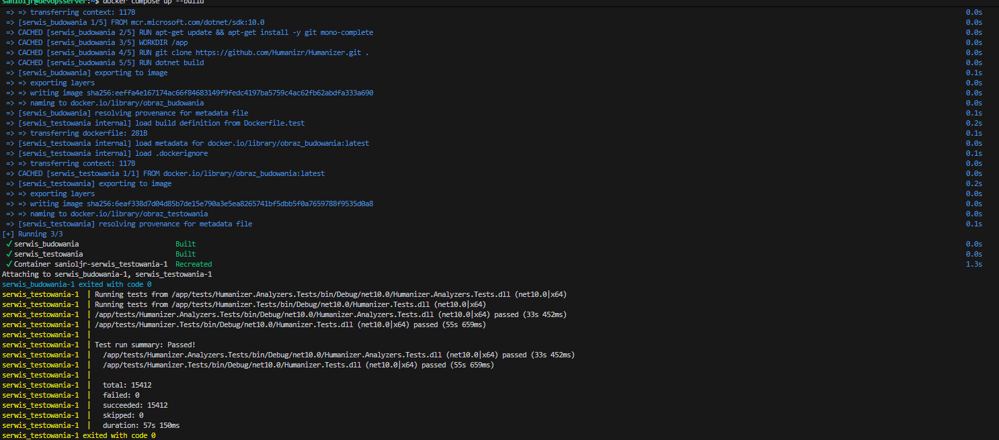

# Mateusz Sadowski - Labolatorium 3

### Środowisko wykonania

Maszyna wirtualna Oracle Virtual Box 7.2.6a z obrazem ISO Ubuntu 24.04.4 LTS. Maszyna posiada dostęp do 40 GB dostępnego obszaru na dysku, 2 rdzenie CPU oraz 4 GB pamięci ram.
Zastosowano przekierowanie portów (port forwarding), gdzie port 2222 na maszynie fizycznej (host) przekierowuje ruch na port 22 maszyny wirtualnej (guest), na którym pracuje serwer SSH.

### Wybór oprogramowania na zajęcia
Wybrano repozytiroum: https://github.com/Humanizr/Humanizer
jest to repozytiroum .NET na licencji MIT, które zawiera testy automatyczne.

Sklonowanie repozytorium wykonano przy pomocy polecenia

        git clone https://github.com/Humanizr/Humanizer

Aby projekt działał należało zainstalować sdk .NET, wykonano to poleceniem

        sudo apt install dotnet-sdk-10.0

Sprawdzono też wersje .NET aby upewnić się czy instalacja przebiegła poprawnie

        dotnet --version
        
Następnie zbudowano projekt przed buildem należało wyłączyć wymagania certyfikatów, które uniemożliwiały builda

        export DOTNET_NUGET_SIGNATURE_VERIFICATION=false
        dotnet build

w folderze zawierającym plik **.sln** lub **.slnx** oraz testów przy pomocy

        dotnet test

### Izolacja i powtarzalność: build w kontenerze

Wybrano obraz, w tym przypadku jest to po prostu obraz sdk-dotnet-10.0, uruchomiono go również, przy pomocy:

                docker run -it mcr.microsoft.com/dotnet/sdk:10.0 /bin/bash

Z racji an wybrany obraz, instalacja .NETa nie była w nim wymagana. Dlatego wykonano

                dotnet build
                dotnet tests

w głownym katalogo repozytodium po jego popraniu, tak jak w poprzednim przypadku. W obrazie projekt zbudował się znacznie szybciej, podobnie jak znacznie szybciej wykonały się testy automatyczne.

Następnie stworzono dwa plicki Dockerfile, pierwszy odpowiedzialny za budowanie w obrazie proejktu, drugi na podstawie obrazu z peirwszego Dockerfile wykonuje testy.

W przypadku drugiego pliku, nazwa obrazu jest przekazywana w argumencie.

Wdrożenie tych kontenerów zostało wykonane w ramach pliku docker-compose, który służy do uruchamiania wielu kontenerów na raz. Ma on dobre zastosowanie m.in w przypadku aplikacji trójwarstwowych gdzie jest osobny kontener na baze danych, frontend oraz backend. W tym przapadku najpierw uruchomiony dostał kontener do budowania projektu, a później na jego bazie kontener do wykonania testów. Poniżej znajduje się kod docker-compose.yml który był użyty.

Aby kontenery zostały wykonane w odpowiedniej kolejności kluczowe było przekazanie odpowiedniego argumentu do konteneru testów, którego kod to uwzględnia. Następnie należało dodać kontekst informujący, że kontener ma wykonać się na podstawie obrazu wcześniej (wyżej w docker-compose) zbudowanego. Takie wdrożenie wymagało instalacji docker-compose-v2 przy pomocy

                sudo apt install docker-compose-v2

Następnie aby uruchomić plik docker-compose.yml trzeba było wpisać komendę odpowiednią dla docker-compose-v2 oraz za pomocą flagi --build wymuszenie ponownego zbudowania obrazów przed startem kontenerów ignorując przy tym niechciane zapisane wersje w pamięci podręcznej:

                docker compose up --build

### Propmty użyte do LLM:
  - Na czym polegało pokazanie, że kontenery w dockerze są wdrażane i pracują poprawnie? Co w nich paracuje, jak się je wdraża ręcznie a jak przez docker-compose?
  - przypomnij mi jak się pisało docker compose

### Historia z terminala:
                259  dotnet build
  
                260  dotnet test
                
                261  history
                
                262  clear
                
                263  cd ..
                
                264  docker run -it mcr.microsoft.com/dotnet/sdk:10.0 /bin/bash
                
                265  exit
                
                266  ls
                
                267  cd MDO*
                
                268  ls
                
                269  git status
                
                270  git branch
                
                271  exit
                
                272  docker run -it mcr.microsoft.com/dotnet/sdk:10.0 /bin/bash
                
                273  ls
                
                274  exit
                
                275  ls
                
                276  history
                
                277  ls
                
                278  docker ps
                
                279  docker-compose up
                
                280  docker-compose up --build
                
                281  docker compose up --build
                
                282  docker --version
                
                283  sudo apt update && sudo apt install docker-compose-plugin
                
                284  docker --version
                
                285  sudo apt install docker-compose-v2
                
                286  docker compose version
                
                287  docker compose up --build
                
                288  docker ps
                
                289  docker compose up --build
                
                290  docker ps
                
                291  histort
                
                292  history
