# Mateusz Sadowski - sprawozdanie z laboratoriów 6

## Środowisko wykonania

Maszyna wirtualna Oracle Virtual Box 7.2.6a z obrazem ISO Ubuntu 24.04.4 LTS. Maszyna posiada dostęp do 40 GB dostępnego obszaru na dysku, 2 rdzenie CPU oraz 4 GB pamięci ram.
Zastosowano przekierowanie portów (port forwarding), gdzie port 2222 na maszynie fizycznej (host) przekierowuje ruch na port 22 maszyny wirtualnej (guest), na którym pracuje serwer SSH.

## Realizacja laboratorium

#### Wybranie aplikacji

Jako aplikację wybrano inną niż ta, która była używana w poprzednich laboratoriach. Humanizer jest biblioteką, a biblioteki nie wdraża się na produkcję w taki sposób jak aplikacji, przez co trudniej byłoby przetestować wdrożenie. Po wielu próbach i problemach technicznych przy innych projektach .NET zdecydowano się na lekki szkielet Web API w TypeScript, który jest opakowany w testy.

https://github.com/nestjs/typescript-starter

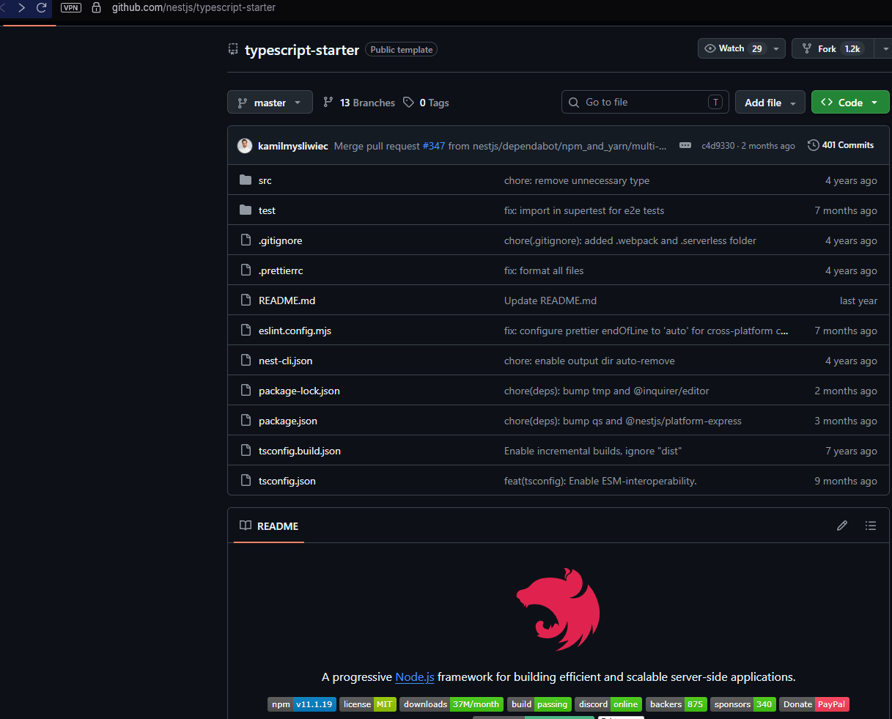

Aplikacja jest na licencji MIT, dzięki czemu można jej używać do pracy na zajęciach.

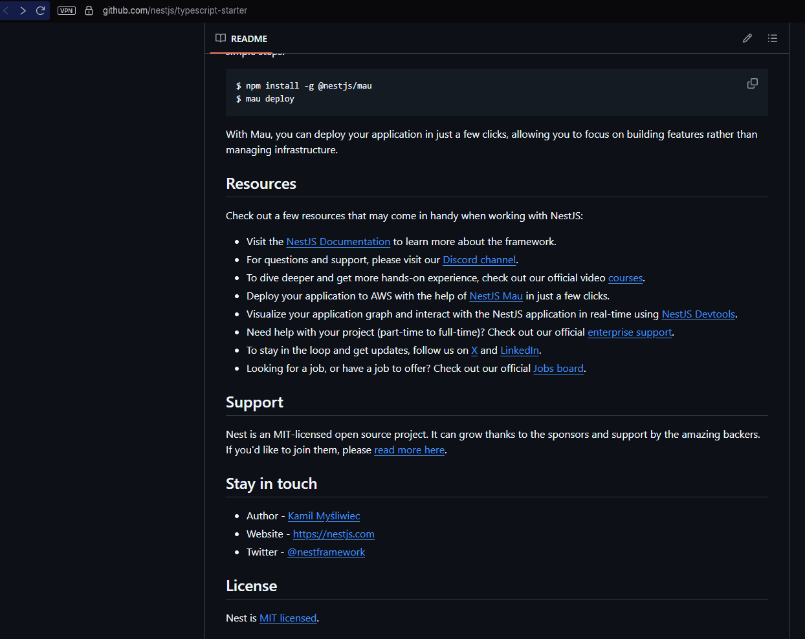

#### Budowanie i testowanie aplikacji

Poleceniem `npm run start` wykonanym w folderze aplikacji uruchomiono aplikację.

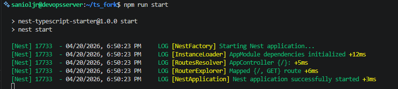

Poleceniem `npm run test` w tym samym folderze sprawdzono, czy testy działają, a poleceniem `npm run test:e2e` sprawdzono również testy end-to-end.

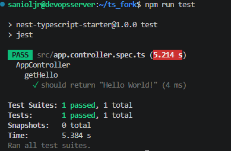
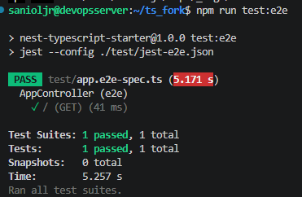

#### Przechowywanie aplikacji

Utworzenie forka było niezbędne do uzyskania pełnej kontroli nad cyklem życia aplikacji, co było bardzo przydatne w późniejszych krokach laboratorium.

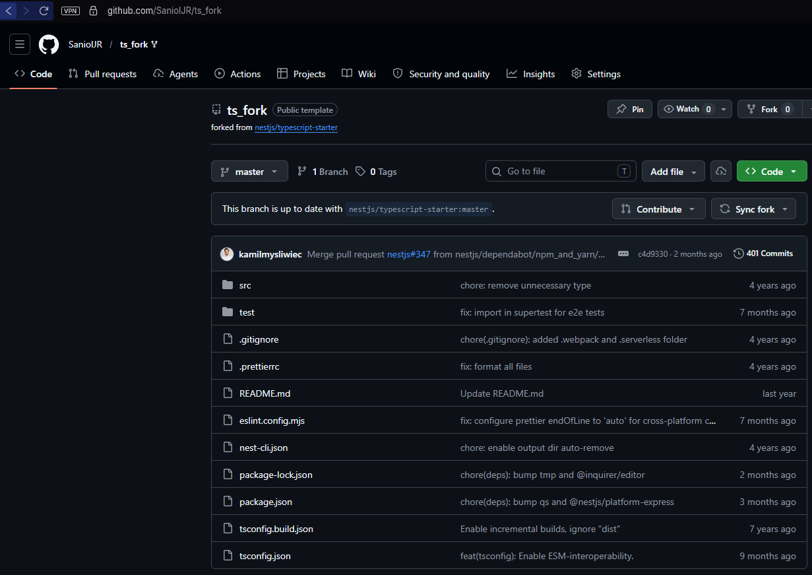

#### Diagram UML

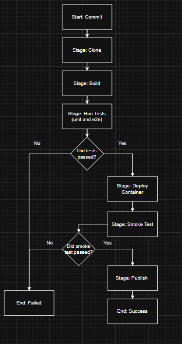

#### Kontener bazowy i wstępny

Jako obraz bazowy wybrano `node:20-alpine`. Zastosowano architekturę **Multi-stage build, składającą się z dwóch etapów**. W pierwszym etapie (wstępnym) pobierane są wszystkie zależności oraz narzędzia deweloperskie niezbędne do skompilowania projektu.
W drugim etapie (uruchomieniowym) proces instalacji ograniczono wyłącznie do środowiska produkcyjnego za pomocą flagi `--only=production`. Dzięki temu Node.js pomija zbędne pakiety deweloperskie i instaluje tylko minimum potrzebnych bibliotek. Do tak odchudzonego, bezpiecznego kontenera kopiowany jest wyłącznie gotowy, skompilowany kod z pierwszego etapu.
Oba kroki zrealizowano w jednym pliku konfiguracyjnym:

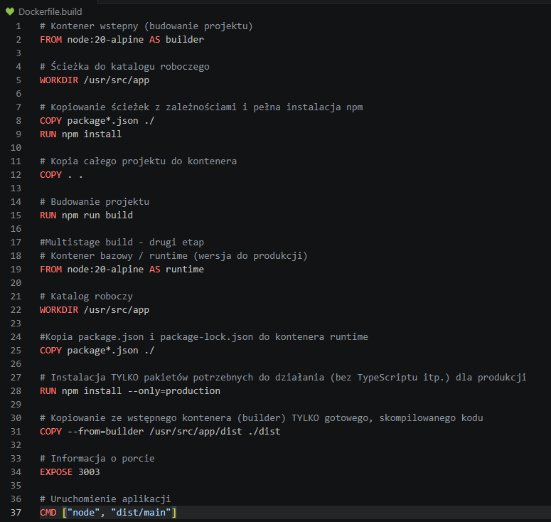

#### Wykonanie buildu wewnątrz kontenera

Poniżej przedstawiono efekt uruchomienia powyższego pliku Dockerfile.build.

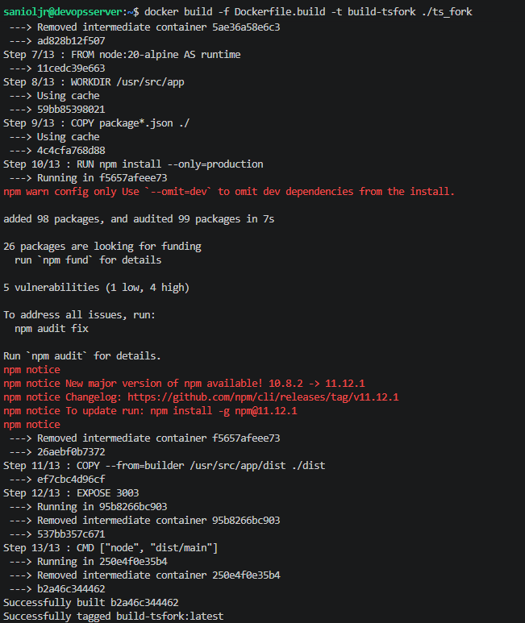

#### Testy w kontenerze oparte na obrazie budowania

Aby wykonać testy w kontenerze opartym na obrazie budowania, należało zedytować wcześniejszy plik Dockerfile.build i dodać do niego kolejny etap, który odpowiada za testowanie oprogramowania.
Etap ten został dodany pomiędzy etapem budowania oraz produkcji z dwóch powodów:
1. Testy powinny być wykonywane przed wdrożeniem kodu na produkcję, aby mieć pewność, że kod działa.
2. Testy potrzebują plików i narzędzi, które są usuwane w obrazie produkcyjnym w celu oszczędności.

Po zbudowaniu projektu wstawiono poniższy kod do Dockerfile.build:

        #Multistage build - drugi etap
        # Kontener testowy oparty o kontener build
        FROM builder AS tester
        # Odpalenie testów, w tym e2e, po zbudowaniu projektu
        RUN npm run test && npm run test:e2e

Poniżej widać efekty kompilacji zedytowanego już pliku:

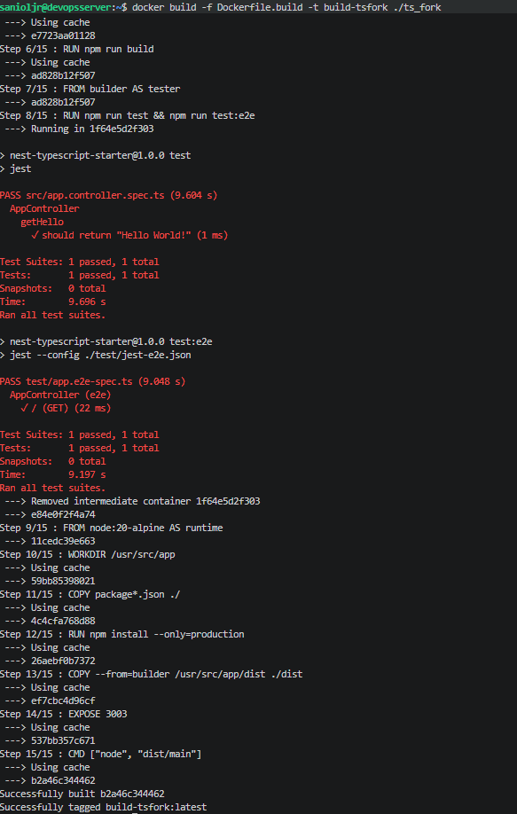

#### Logi z procesu
Wymóg został spełniony natywnie przez wykorzystanie środowiska Jenkins. Serwer CI automatycznie przechwytuje standardowe wyjście (stdout) oraz błędy (stderr) ze wszystkich etapów potoku i archiwizuje je w postaci tzw. Console Output. Każdy taki log jest trwale powiązany z unikalnym, inkrementowanym numerem budowania (np. Build #12), co odpowiada wersjonowanemu artefaktowi bez konieczności dodatkowej konfiguracji w pliku Jenkinsfile.

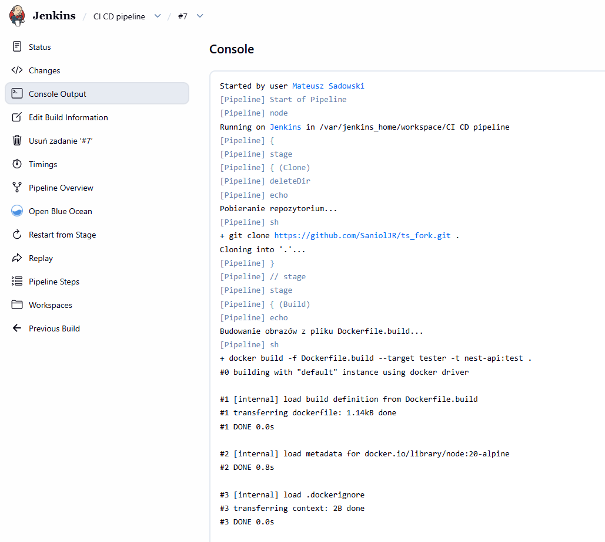

#### Kontener deploy 

Jako kontener 'deploy' zdefiniowano trzeci, finalny etap (runtime) z pliku Dockerfile. Kontener budujący (builder) z pierwszego etapu nie nadawał się do roli uruchomieniowej ze względu na nadmiarowość narzędzi deweloperskich (np. kompilator TypeScript) oraz zbyt dużą wagę, co łamie zasady bezpieczeństwa i optymalizacji. W związku z tym stworzono wyizolowane środowisko produkcyjne (Multi-stage build), do którego skopiowano wyłącznie skompilowany kod.

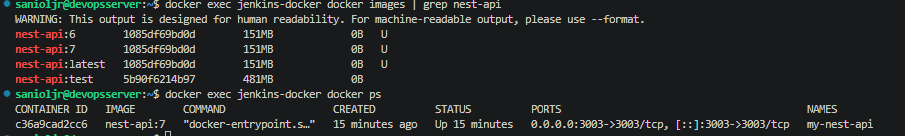

Jak również widać, dostępność artefaktu jest realizowana poprzez lokalny rejestr obrazów na serwerze budującym, co umożliwia natychmiastowe wdrożenie kontenera bez konieczności transferu plików przez sieć. Finalny obraz z tagiem :latest jest zawsze gotowy do uruchomienia bezpośrednio po pomyślnym zakończeniu pipeline'u, stanowiąc jedyne "źródło prawdy" o aktualnej wersji aplikacji.

Powyższy zrzut ekranu dokumentuje również poprawne wersjonowanie artefaktów (tag :7 zgodny z :latest) oraz działającą instancję kontenera my-nest-api na porcie 3003. Widoczna różnica w rozmiarze obrazu produkcyjnego (151 MB) względem testowego (481 MB) potwierdza skuteczną optymalizację środowiska runtime przy użyciu techniki Multi-stage build.

#### Jenkins

Przy pomocy projektu typu pipeline w Jenkinsie oraz skryptu Groovy zrealizowano pipeline CI/CD zgodny z tym przedstawionym w diagramie UML.

        pipeline {
            agent any
            stages {
                stage('Clone') {
                    steps {
                        deleteDir()
                        echo 'Pobieranie repozytorium...'
                        sh 'git clone https://github.com/SaniolJR/ts_fork.git .'
                    }
                }
                stage('Build') {
                    steps {
                        echo 'Budowanie obrazów z pliku Dockerfile.build...'
                        sh 'docker build -f Dockerfile.build --target tester -t nest-api:test .'
                        sh "docker build -f Dockerfile.build --target runtime -t nest-api:${BUILD_NUMBER} -t nest-api:latest ."
                    }
                }
                stage('Run Tests') {
                    steps {
                        echo 'Uruchamianie testów...'
                        sh 'docker run --rm nest-api:test'
                    }
                }
                stage('Deploy Container') {
                    steps {
                        echo 'Wdrażanie...'
                        sh 'docker rm -f my-nest-api || true'
                        sh "docker run -d -p 3003:3003 --name my-nest-api nest-api:${BUILD_NUMBER}"
                    }
                }
                stage('Smoke Test') {
                    steps {
                        echo 'Smoke Test (Inżynierska weryfikacja)...'
                        sh 'curl -f http://localhost:3003 || echo "Aplikacja działa, ale Jenkins nie widzi jej po localhost - to normalne w Dockerze!"'
                    }
                }
                stage('Publish') {
                    steps {
                        echo "Wersja ${BUILD_NUMBER} gotowa!"
                    }
                }
            }
            post {
                success { echo "✅ NARESZCIE SUKCES!" }
                failure { echo "❌ Coś jeszcze nie tak, ale jesteśmy blisko" }
            }
        }

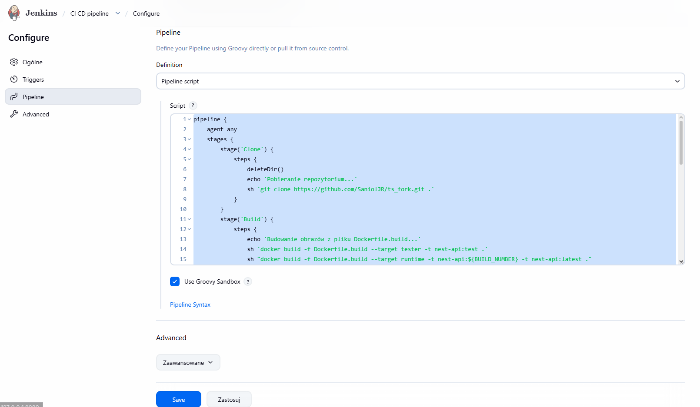

Jako artefakt jest publikowany obraz kontenera Dockera o nazwie **nest-api**, otagowany unikalnym numerem kompilacji. Obraz ten zawiera nie tylko kod, ale też całe środowisko. Dzięki temu nic nie trzeba instalować na serwerze docelowym, a pakiet i rezultaty jego wykonania pozostaną niezmienne.

Artefakt jest tworzony poprzez automatyczne wersjonowanie sekwencyjne, zintegrowane bezpośrednio z cyklem życia pipeline.
Każdy zbudowany artefakt (obraz Dockera) otrzymuje unikalny tag na podstawie zmiennej środowiskowej ${BUILD_NUMBER}. Zapewnia to niezmienność artefaktów i pełną odtwarzalność środowiska.
Równolegle z wersją numerowaną rurociąg zawsze aktualizuje tag **:latest**. Pełni on rolę aliasu wskazującego na ostatni pomyślnie zbudowany i przetestowany artefakt, co upraszcza proces wdrażania najnowszych zmian bez konieczności ręcznej zmiany konfiguracji.

Pochodzenie artefaktu jest identyfikowane za pomocą unikalnego tagu obrazu odpowiadającego numerowi kompilacji w Jenkinsie.

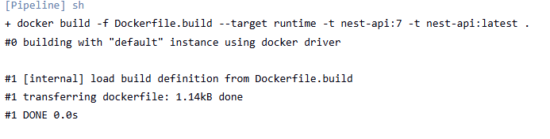

## Wnioski

W trakcie laboratorium udało się przygotować działający proces budowania, testowania i wdrażania aplikacji w modelu CI/CD. Zastosowanie Multi-stage build pozwoliło oddzielić etap budowania, testów i uruchamiania, co uprościło konfigurację oraz zmniejszyło rozmiar finalnego obrazu.

Najważniejszym wnioskiem jest to, że automatyzacja w Jenkinsie znacząco ułatwia kontrolę nad jakością i powtarzalnością wdrożeń. Dzięki wersjonowaniu obrazów i publikacji artefaktu w postaci kontenera można łatwo odtworzyć konkretną wersję aplikacji oraz bezpiecznie wdrażać kolejne zmiany.

## Historia konsoli
        816  git clone https://github.com/SaniolJR/ts_fork
        
        817  ls
        
        818  clear
        
        819  cd ts_*
        
        820  npm run start
        
        821  sudo apt install npm
        
        822  ip addr
        
        823  ls
        
        824  exit
        
        825  ip addr
        
        826  exit
        
        827  ls
        
        828  cd ts_fork
        
        829  npm run start
        
        830  npm install
        
        831  npm run start
        
        832  npm run test
        
        833  npm run test:e2
        
        834  npm run test:e2e
        
        835  docker build -dockerfile.build
        
        836  docker build -f Dockerfile.build -t build-tsfork ./ts_fork
        
        837  cd..
        
        838  clear
        
        839  docker build -f Dockerfile.build -t build-tsfork 
        
        840  clear
        
        841  cd .
        
        842  cd ..
        
        843  docker build -f Dockerfile.build -t build-tsfork 
        
        844  docker build -f Dockerfile.build -t build-tsfork ./ts_fork
        
        845  docker ls
        
        846  docker ps
        
        847  docker stop build-tsfork
        
        848  docker build -f Dockerfile.build -t build-tsfork ./ts_fork
        
        849  docker ps -a
        
        850  docker rm -f e3f9ed6cb024
        
        851  docker rm -f e59e5dd27ce5
        
        852  docker rm -f ubuntu
        
        853  docker rm -f epic_agnesi
        
        854  docker rm -f dazzling_mendel
        
        855  docker rm -f e3f9ed6cb024
        
        856  docker rm -f e59e5dd27ce5
        
        857  clear
        
        858  docker ps -a
        
        859  docker build -f Dockerfile.build -t build-tsfork ./ts_fork
        
        860  docker builder prune
        
        861  docker build -f Dockerfile.build -t build-tsfork ./ts_fork
        
        862  clear
        
        863  docker build -f Dockerfile.build -t build-tsfork ./ts_fork
        
        864  docker ps -a
        
        865  docker restart jenkins-blueocean
        
        866  docker run --name jenkins-docker --rm --detach   --privileged --network jenkins --network-alias docker   --env DOCKER_TLS_CERTDIR=/certs   --volume 
        jenkins-docker-certs:/certs/client   --volume jenkins-data:/var/jenkins_home   --publish 2376:2376   docker:dind --storage-driver overlay2
        
        
        867  docker ps -a
        868  cd ts_fork
        
        869  git status
        
        870  cd
        
        871  docker status
        
        872  docker stats
        
        
        873  docker stop jenkins-blueocean
        874  docker rm jenkins-blueocean
        
        875  docker restart jenkins-docker
        
        876  curl -I http://127.0.0.1:8080/login
        
        877  docker stop jenkins-docker
        
        878  docker rm jenkins-docker
        
        879  docker network create jenkins
        
        880  docker run   --name jenkins-docker   --rm   --detach   --privileged   --network jenkins   --network-alias docker   --env DOCKER_TLS_CERTDIR=/certs   --volume jenkins-docker-certs:/certs/client   --volume jenkins-data:/var/jenkins_home   --publish 2376:2376   docker:dind   --storage-driver 
        overlay2
        
        881  FROM jenkins/jenkins:2.555.1-jdk21
        
        882  USER root
        
        883  RUN apt-get update && apt-get install -y lsb-release ca-certificates curl &&     install -m 0755 -d /etc/apt/keyrings &&     curl -fsSL https://
        download.docker.com/linux/debian/gpg -o /etc/apt/keyrings/docker.asc &&     chmod a+r /etc/apt/keyrings/docker.asc &&     echo "deb [arch=$(dpkg --print-architecture) signed-by=/etc/apt/keyrings/docker.asc] \
            https://download.docker.com/linux/debian $(. /etc/os-release && echo \"$VERSION_CODENAME\") stable"     | tee /etc/apt/sources.list.d/docker.list > /dev/null &&     apt-get update && apt-get install -y docker-ce-cli &&     apt-get clean && rm -rf /var/lib/apt/lists/*
        
        884  USER jenkins
        
        885  RUN jenkins-plugin-cli --plugins "blueocean docker-workflow json-path-api"
        
        886  docker run   --name jenkins-blueocean   --restart=on-failure   --detach   --network jenkins   --env DOCKER_HOST=tcp://docker:2376   --env DOCKER_CERT_PATH=/certs/client   --env DOCKER_TLS_VERIFY=1   --publish 8080:8080   --publish 50000:50000   --volume jenkins-data:/var/jenkins_home   --volume jenkins-docker-certs:/certs/client:ro   myjenkins-blueocean:2.555.1-1
        887  cd /home/sanioljr
        
        888  docker build -f Dockerfile.jenkins -t myjenkins-blueocean:2.555.1-1 .
        
        889  docker run   --name jenkins-blueocean   --restart=on-failure   --detach   --network jenkins   --env DOCKER_HOST=tcp://docker:2376   --env DOCKER_CERT_PATH=/certs/client   --env DOCKER_TLS_VERIFY=1   --publish 8080:8080   --publish 50000:50000   --volume jenkins-data:/var/jenkins_home   --volume jenkins-docker-certs:/certs/client:ro   myjenkins-blueocean:2.555.1-1
        890  docker ps --format "table {{.Names}}\t{{.Status}}\t{{.Ports}}"
        
        891  docker logs --tail=80 jenkins-blueocean
        
        892  docker images | grep nest-api
        
        893  docker exec jenkins-docker docker images | grep nest-api
        
        894  docker exec jenkins-docker docker ps
        
        895  docker exec jenkins-docker docker images | grep nest-api
        
        896  clear
        
        897  history