# Mateusz Sadowski - sprawozdanie z laboratoriów 10

## Środowisko wykonania

Maszyna wirtualna Oracle Virtual Box 7.2.6a z obrazem ISO Ubuntu 24.04.4 LTS. Maszyna posiada dostęp do 40 GB dostępnego obszaru na dysku, 2 rdzenie CPU oraz 4 GB pamięci RAM.
Zastosowano przekierowanie portów (port forwarding), gdzie port 2222 na maszynie fizycznej (host) przekierowuje ruch na port 22 maszyny wirtualnej (guest), na którym pracuje serwer SSH.

## Instalacja klastra Kubernetes
Zaczęto od pobrania **minikube**, zrobiono to za pomocą poniższych poleceń:

1. Pobranie pliku wykonalnego

        curl -LO https://github.com/kubernetes/minikube/releases/latest/download/minikube-linux-amd64

2. Pobrano sumę kontrolną

        curl -LO https://github.com/kubernetes/minikube/releases/download/v1.38.1/minikube-linux-arm64.sha256

3. Sprawdzono obecność sumy kontrolnej, aby wykazać bezpieczeństwo instalacji (np. czy pobrany plik nie został podmieniony podczas pobierania)

        echo "$(cat minikube-linux-amd64.sha256) minikube-linux-amd64" | sha256sum --check

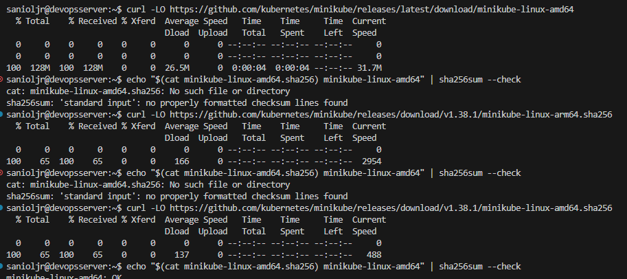

4. Dopiero następnie przeprowadzono instalację z pliku.

        sudo install minikube-linux-amd64 /usr/local/bin/minikube && rm minikube-linux-amd64

Jak widać suma kontrolna się zgadza, więc pobrany plik można uznać za nienaruszony i bezpieczny do instalacji.

Następnie stworzono alias kubectl:

        alias kubectl="minikube kubectl --"

Alias ten pozwala na wygodne korzystanie z `kubectl` bez instalowania osobnego klienta Kubernetes.

Kolejnym krokiem było uruchomienie klastra Kubernetes przy pomocy polecenia

        minikube start

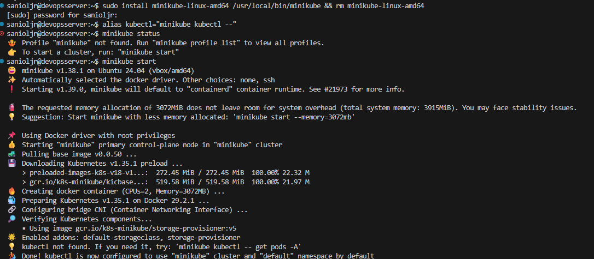

Aby pokazać działający kontener/worker użyto polecenia

        kubectl get nodes

To polecenie potwierdza, że klaster został uruchomiony poprawnie i widoczny jest aktywny węzeł roboczy.

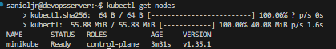

Wymagania sprzętowe minikube opisane w dokumentacji to:
- 2 rdzenie CPU
- 2 GB wolnej pamięci RAM
- 20 GB wolnego miejsca na dysku
- Połączenie internetowe
- Maszyna wirtualna
Wymagania te są spełnione przez maszynę wirtualną wykorzystywaną na laboratoriach. Tak jak powyżej opisano w sekcji `Środowisko wykonania`, posiada ona dostęp do 40 GB dostępnego obszaru na dysku, 2 rdzeni CPU oraz 4 GB pamięci RAM.

Aby uruchomić dashboard, z uwagi na brak interfejsu graficznego w zainstalowanej maszynie wirtualnej uruchomiono polecenie `minikube dashboard` (ono uruchamia dashboard samo w sobie), wraz z flagą `--url` (ona powoduje, że zamiast próby wyświetlania graficznego interfejsu dashboardu polecenie zwróci link do niego).

        minikube dashboard --url

Jak widać na poniższych zdjęciach polecenie zwróciło link, który po wpisaniu w przeglądarkę uruchamia dashboard, jest on w tej chwili pusty, ponieważ Kubernetes jest na świeżo po instalacji.

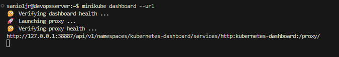

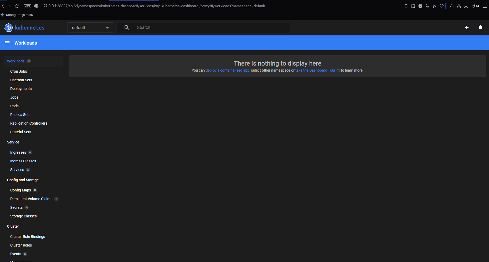

Koncepcje funkcji Kubernetesa:
- pod: Najmniejsza jednostka wykonywalna w Kubernetes, jest to jeden lub więcej kontenerów współdzielących zasoby (sieć, wolumeny). Pody są krótkotrwałe i zwykle zarządzane przez wyższe obiekty (np. Deployment).
 - deployment: Zarządza podami odpowiadając za skalowanie, aktualizacje i utrzymanie zadanej liczby replik.
 - service: Zapewnia stały punkt dostępu (adres IP/DNS) i równoważenie obciążenia do podów, umożliwia komunikację wewnątrz klastra i zewnętrzny dostęp.

Na tym etapie laboratoriów działał tylko `service`, co przedstawiono na zrzucie ekranu poniżej.

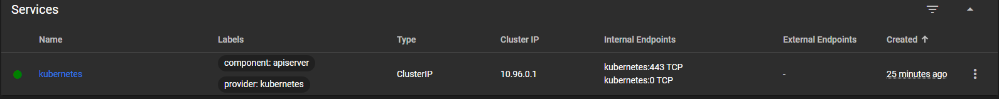

## Analiza posiadanego kontenera

Jedyna wykonana zmiana w Jenkinsfile z poprzednich laboratoriów to zmiana nazwy stage'a z `Deploy Container` na `Deploy Container to cloud`.
Aby wykazać, że kontener deploy nie kończy pracy natychmiastowo wykonano kroki:

1. Uruchomiono kontener dind

        docker run --name jenkins-docker --rm --detach \
            --privileged --network jenkins --network-alias docker \
            --env DOCKER_TLS_CERTDIR=/certs \
            --volume jenkins-docker-certs:/certs/client \
            --volume jenkins-data:/var/jenkins_home \
            --publish 2376:2376 \
            docker:dind

2. Uruchomiono pipeline CI/CD w UI Jenkinsa
3. Sprawdzono czy kontener aplikacji dalej pracuje w kontenerze dind oraz łączność z aplikacją

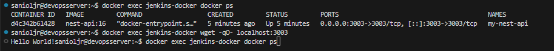

Jak widać na zdjęciu, to aplikacje działa jako kontener w sposób stabilny, nie jednorazowo lecz ciągle oraz łączność z aplikacją również działa na porcie 3003, aplikacja zwraca string "Hello World!" bez '\n'.
Kontener nie kończy pracy po wdrożeniu, ponieważ w wewnętrznej definicji obrazu `Dockerfile.build`, na ostatnim etapie budowania (`runtime`) zdefiniowano proces główny kontenera za pomocą `CMD ["node", "dist/main"]`. Z racji, że aplikacja w NestJS to serwer HTTP, instrukcja ta uruchamia nieskończoną pętlę nasłuchującą żądań na porcie 3003, co uniemożliwia samoczynne zakończenie procesu.

## Uruchomienie oprogramowania

Aby uruchomić kontener z aplikacją na stosie k8s, przy włączonym minikube (`minikube start`), uruchomiono polecenie:

        minikube image build -t nest-api:k8s -f Dockerfile.build .

Kontener został automatycznie utworzony jako Pod, dlatego aby uruchomić odizolowanego poda z aplikacją bezpośrednio wewnątrz klastra Kubernetes dodano flagę `--image-pull-policy=Never`, aby wymusić użycie lokalnie zbudowanego obrazu.

        minikube kubectl -- run moje-api --image=nest-api:k8s --image-pull-policy=Never --port=3003 --labels app=moje-api

Następnie zweryfikowano, czy proces faktycznie działa w klastrze przy pomocy polecenia

                minikube kubectl -- get pods

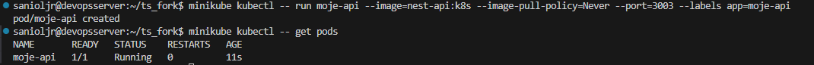

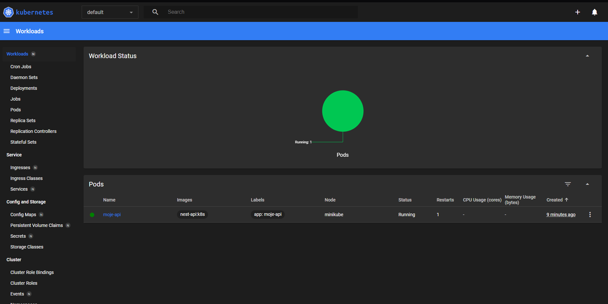

Później wprowadzono port celem dotarcia do eksponowanej funkcjonalności przy pomocy polecenia:

                minikube kubectl -- port-forward pod/moje-api 3003:3003

Następnie sprawdzono komunikację, co widać na poniższym zrzucie ekranu

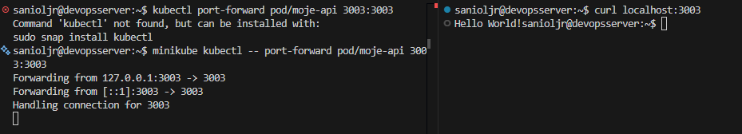

## Przekształcenie wdrożenia manualnego w plik wdrożeniowy

#### Plik deploymentu

Stworzono plik `nginx-deployment.yaml`:

                apiVersion: apps/v1
                kind: Deployment
                metadata:
                name: nginx-deployment
                labels:
                app: nginx
                spec:
                replicas: 4
                selector:
                matchLabels:
                app: nginx
                template:
                metadata:
                labels:
                        app: nginx
                spec:
                containers:
                - name: nginx
                        image: nginx:1.14.2
                        ports:
                        - containerPort: 80

#### Składnia pliku

**apiVersion: apps/v1** wskazuje wersję API Kubernetes, z której korzysta ten zasób.
**kind: Deployment** określa typ obiektu i definiuje wdrożenie, co oznacza, że Kubernetes ma automatycznie zarządzać replikami Podów.
**metadata:** otwiera sekcję danych identyfikacyjnych obiektu.
        - **name: nginx-deployment** nadaje nazwę własną całemu wdrożeniu.
        - **labels:** rozpoczyna zestaw etykiet przypisanych do tego Deploymentu.
                - **app: nginx** to główna etykieta, po której można filtrować i grupować zasób.
**spec:** to sekcja, w której definiujemy stan pożądany (desired state) wdrożenia.
        - **replicas: 4** informuje klaster, że mają nieprzerwanie działać 4 identyczne kopie Poda.
        - **selector:** definiuje regułę wskazującą, które dokładnie Pody są nadzorowane przez ten Deployment.
                - **matchLabels:** zawęża wyszukiwanie do Podów z pasującymi etykietami.
                        - **app: nginx** oznacza, że selekcja i nadzór odbywają się po etykiecie **app** o wartości **nginx**.
        - **template:** zawiera szablon strukturalny, z którego Kubernetes powołuje do życia nowe Pody.
                - **metadata:** sekcja metadanych dla tworzonych Podów.
                        - **labels:** przypisuje etykiety do nowych Podów.
                                - **app: nginx** nadaje Podom naklejkę identyfikacyjną zgodną z selektorem.
                - **spec:** określa konfigurację techniczną samych kontenerów w Podzie.
                        - **containers:** rozpoczyna listę kontenerów uruchamianych wewnątrz każdego Poda.
                                - **name: nginx** definiuje nazwę kontenera wewnątrz Poda.
                                - **image: nginx:1.14.2** wskazuje dokładny obraz z rejestru, z którego kontener ma zostać uruchomiony.
                                - **ports:** opisuje porty udostępniane przez środowisko kontenera.
                                        - **containerPort: 80** informuje, że aplikacja wewnątrz kontenera nasłuchuje na porcie 80.
#### Wdrożenie pliku

Następnie nakazano Kubernetesowi przetworzenie tego pliku

                minikube kubectl -- apply -f nginx-deployment.yaml

Polecenie **apply** przekazuje manifest do klastra i mówi Kubernetesowi, że ma utworzyć albo zaktualizować obiekt opisany w pliku YAML. 
W tym przypadku kontroler odczytuje definicję Deploymentu, tworzy wymagane zasoby i zaczyna dążyć do stanu opisanego w pliku.

Później sprawdzono, czy klaster pobrał obraz Nginx i uruchomił wszystkie cztery repliki:

                minikube kubectl -- rollout status deployment/nginx-deployment

Polecenie **rollout status** sprawdza, czy wdrożenie zakończyło się pomyślnie i czy wszystkie repliki zostały poprawnie uruchomione. Dzięki temu można potwierdzić, że Kubernetes pobrał obraz `nginx`, utworzył cztery Pody i doprowadził je do stanu gotowości.

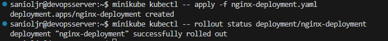

Aby wyeksportować wdrożenie jako Service, stworzono obiekt typu Service, który przekazuje ruch z portu 8080 na port 80 kontenerów Nginx.

                minikube kubectl -- expose deployment nginx-deployment --type=NodePort --port=8080 --target-port=80 --name=nginx-service

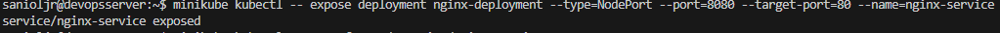

Następnie przekierowano ruch z portu 8080 serwisu na port 8888 systemu:

                minikube kubectl -- port-forward service/nginx-service 8888:8080
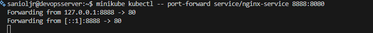

W UI Kubernetesa pojawił się również stan wdrożenia nginx-deployment oraz powiązane obiekty. Widoczne są tam statusy wszystkich 4 replik Podów, a także obecność serwisu sieciowego nginx-service. Jest to dowód na to, że kontroler klastra pomyślnie przetworzył deklaratywny plik YAML, zsynchronizował stan pożądany z rzeczywistym i prawidłowo zarządza ruchem wewnątrz stosu Kubernetes.

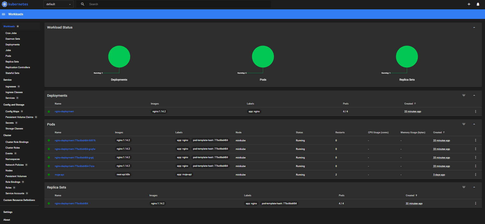

Dodatkowo, przy pomocy polecenia `curl` wywołanego na porcie lokalnym 8888 sprawdzono poprawne działanie całego stosu sieciowego. W odpowiedzi serwer zwrócił czysty kod HTML domyślnej strony powitalnej Nginx, co udowadnia, że port forwarding działa pomyślnie i przekierowuje ruch do jednego z czterech działających Podów.

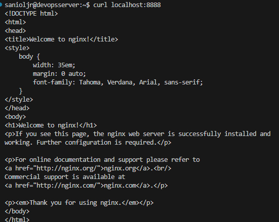

## Wnioski

W trakcie laboratorium udało się przygotować środowisko minikube, uruchomić klaster oraz zweryfikować jego działanie zarówno z poziomu poleceń, jak i dashboardu. Następnie sprawdzono zachowanie gotowego kontenera, a także wykonano proste wdrożenie deklaratywne przy użyciu pliku YAML i serwisu typu NodePort. Cały etap pokazał, że Kubernetes pozwala wygodnie opisywać i odtwarzać stan aplikacji w sposób powtarzalny.

## Historia poleceń

                7  clear
                
                8  curl -LO https://github.com/kubernetes/minikube/releases/latest/download/minikube-linux-amd64
                
                9  echo "$(cat minikube-linux-amd64.sha256) minikube-linux-amd64" | sha256sum --check
                
                10  curl -LO https://github.com/kubernetes/minikube/releases/download/v1.38.1/minikube-linux-arm64.sha256
                
                11  echo "$(cat minikube-linux-amd64.sha256) minikube-linux-amd64" | sha256sum --check
                
                12  curl -LO https://github.com/kubernetes/minikube/releases/download/v1.38.1/minikube-linux-amd64.sha256
                
                13  echo "$(cat minikube-linux-amd64.sha256) minikube-linux-amd64" | sha256sum --check
                
                14  alias kubectl="minikube kubectl --"
                
                15  minikube status
                
                16  sudo install minikube-linux-amd64 /usr/local/bin/minikube && rm minikube-linux-amd64
                
                17  alias kubectl="minikube kubectl --"
                
                18  minikube status
                
                19  minikube start
                
                20  docker ps
                
                21  kubectl get nodes
                
                22  minikube dashboard --url
                
                23  clear
                
                24  minikube dashboard --url
                
                25  history
                
                26  clear
                
                27  docker run --name jenkins-docker --rm --detach   --privileged --network jenkins --network-alias docker   --env 
                DOCKER_TLS_CERTDIR=/certs   --volume jenkins-docker-certs:/certs/client   --volume jenkins-data:/var/jenkins_home   
                --publish 2376:2376   docker:dind
                
                28  docker restart jenkins-blueocean
                
                29  docker ps
                
                30  minikube stop
                
                31  docker ps | grep my-nest-api
                
                32  docker ps
                
                33  clear
                
                34  docker ps
                
                35  minikube start
                
                36  docker ps
                
                37  docker exec jenkins-docker docker ps
                
                38  docker exec jenkins-docker curl localhost:3003
                
                39  docker exec jenkins-docker wget -qO- localhost:3003
                
                40  clear
                
                41  docker exec jenkins-docker docker ps
                
                42  docker exec jenkins-docker wget -qO- localhost:3003
                
                43  clear
                
                44  minikube start
                
                45  minikube image build -t nest-api:k8s -f Dockerfile.build --target runtime .
                
                46  clear
                
                47  minikube image build -t nest-api:k8s -f Dockerfile.build .
                
                48  clear
                
                49  minikube image build -t nest-api:k8s -f Dockerfile.build .
                
                50  minikube image build -t nest-api:k8s -f Dockerfile.build .
                
                51  clear
                
                52  minikube image build -t nest-api:k8s -f Dockerfile.build .
                
                53  exit
                
                54  minikube image build -t nest-api:k8s -f Dockerfile.build .
                
                55  ls
                
                56  rm -d Humanizer
                
                57  rm -r Humanizer
                
                58  rm -rf  Humanizer
                
                59  ls
                
                60  clear
                
                61  clear
                
                62  ls
                
                63  minikube image build -t nest-api:k8s -f Dockerfile.build .
                
                64  ls -l
                
                65  clear
                
                66  ls -l
                
                67  ls -la
                
                68  ls -l
                
                69  rm -rf output
                
                70  clear
                
                71  rm -f /tmp/build.*.tar
                
                72  docker system prune -af --volumes
                
                73  minikube ssh -- docker system prune -af --volumes
                
                74  df -h
                
                75  clear
                
                76  df -h
                
                77  clear
                
                78  docker run   --name jenkins-docker   --rm   --detach   --privileged   --network jenkins   --network-alias docker   
                --env DOCKER_TLS_CERTDIR=/certs   --volume jenkins-docker-certs:/certs/client   --volume jenkins-data:/var/jenkins_home   --publish 2376:2376   docker:dind   --storage-driver 
                
                79          overlay2
                
                80  docker run   --name jenkins-blueocean   --restart=on-failure   --detach   --network jenkins   --env DOCKER_HOST=tcp://docker:2376   --env DOCKER_CERT_PATH=/certs/client   --env DOCKER_TLS_VERIFY=1   --publish 8080:8080   --publish 50000:50000   --volume jenkins-data:/var/jenkins_home   --volume jenkins-docker-certs:/certs/client:ro   myjenkins-blueocean:2.555.1-1
                
                81  docker run   --name jenkins-blueocean   --restart=on-failure   --detach   --network jenkins   --env DOCKER_HOST=tcp://docker:2376   --env DOCKER_CERT_PATH=/certs/client   --env DOCKER_TLS_VERIFY=1   --publish 8080:8080   --publish 50000:50000   --volume jenkins-data:/var/jenkins_home   --volume jenkins-docker-certs:/certs/client:ro   myjenkins-blueocean:2.555.1-1
                
                82  docker ps
                
                83  clear
                
                84  docker ps
                
                85  cd ts_fork
                
                86  minikube image build -t nest-api:k8s -f Dockerfile.build .
                
                87  rm -f /tmp/build.*.tar
                
                88  minikube image build -t nest-api:k8s -f Dockerfile.build .
                
                89  clear
                
                90  cd
                
                91  rm -rf output
                
                92  sudo rm -rf output
                
                93  clear
                
                94  df -h
                
                95  minikube image build -t nest-api:k8s -f Dockerfile.build .
                
                96  cd ~/ts_fork
                
                97  minikube image build -t nest-api:k8s -f Dockerfile.build .
                
                98  cd ts_fork
                
                99  ls
                
                100  cd /ts*
                
                101  clear
                
                102  ls
                
                103  clear
                
                104  minikube image build -t nest-api:k8s -f Dockerfile.build .
                
                105  minikube kubectl run --my_api --image-<obraz> --port-3003 --labels app=moje_api
                
                106  minikube kubectl run --my_api --image=nest-api:k8s --port-3003 --labels app=moje_api
                
                107  clear
                
                108  minikube kubectl -- run -cleary_api --image=nest-api:k8s --port-3003 --labels app=moje_api
                
                109  minikube kubectl -- run moje-api --image=nest-api:k8s --image-pull-policy=Never --port=3003 --labels app=moje-api
                
                110  minikube kubectl -- get pods
                
                111  exit
                
                112  curl localhost:3003
                
                113  kubectl port-forward pod/moje-api 3003:3003
                
                114  minikube kubectl -- port-forward pod/moje-api 3003:3003
                
                115  minikube kubectl -- get pods
                
                116  clear
                
                117  docker run --name jenkins-docker --rm --detach             --privileged --network jenkins --network-alias docker             --env DOCKER_TLS_CERTDIR=/certs             --volume jenkins-docker-certs:/certs/client             --volume jenkins-data:/var/jenkins_home             --publish 2376:2376             docker:dind
                
                118  minikube start
                
                119  minikube kubectl -- get pods
                
                120  minikube dashboard --url
        
                121  curl localhost:8888
                
                122  history