# Mateusz Sadowski - sprawozdanie z laboratoriów 11

## Środowisko wykonania

Maszyna wirtualna Oracle VirtualBox 7.2.6a z obrazem ISO Ubuntu 24.04.4 LTS. Maszyna posiadała początkowo 40 GB dostępnego miejsca na dysku, 2 rdzenie CPU oraz 4 GB pamięci RAM.
Zastosowano przekierowanie portów (port forwarding), gdzie port 2222 na hoście przekierowuje ruch na port 22 maszyny wirtualnej (guest), na którym działa serwer SSH.
**Laboratoria rozpoczęto od wyczyszczenia danych tymczasowych oraz nieużywanych obrazów Dockera, aby odzyskać miejsce na dysku.**
W trakcie zajęć rozmiar dysku maszyny wirtualnej został zwiększony do 70 GB.

## Przygotowanie nowego obrazu

Aby zarejestrować nową wersję obrazu aplikacji, uruchomiono klastra Minikube, a następnie zbudowano obraz:

                minikube start

                minikube image build -t nest-api:v2 -f Dockerfile.build .

W niektórych uruchomieniach użyto opcji `--no-cache`, aby uniknąć problemów spowodowanych przez stare warstwy build'a.
Budowanie wykonano z poziomu katalogu projektu.
Następnie zweryfikowano, czy obraz został poprawnie zarejestrowany:

        minikube image ls | grep nest-api

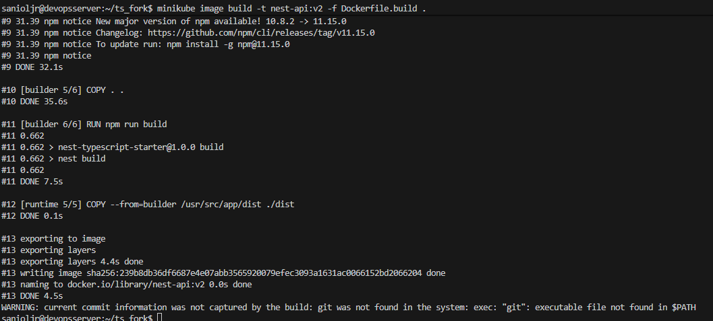

Z powodu wcześniejszego oczyszczenia lokalnego środowiska, dostępna była tylko jedna wersja obrazu. Aby uzyskać możliwość testowania dwóch wersji bez duplikowania warstw, otagowano istniejący obraz jako `nest-api:v1` wskazując tym samym na te same warstwy co `nest-api:v2`:

                minikube image tag nest-api:v2 nest-api:v1

Z perspektywy klastra Kubernetes są to dwie niezależne tagi/wersje, mimo fizycznego współdzielenia warstw obrazu, co oszczędza miejsce na dysku.

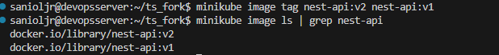

Przygotowano również wersję obrazu, która zawsze kończy działanie z błędem — w tym celu stworzono plik `Dockerfile.error`:

                FROM nest-api:v2
                CMD ["sh", "-c", "exit 1"]

Obraz bazuje na działającym `nest-api:v2`, ale jako komendę startową uruchamia polecenie `exit 1`, co powoduje natychmiastowe zakończenie procesu z kodem błędu.

W efekcie zbudowano obraz testowy:

                minikube image build -t nest-api:v3 -f Dockerfile.error .

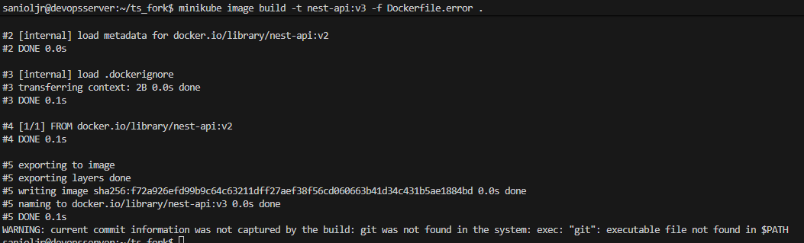

## Zmiany we wdrożeniu

Aby przeprowadzać zmiany we wdrożeniu, edytowano plik `nginx-deployment.yaml`. Przed modyfikacjami fragment wyglądał następująco:

                apiVersion: apps/v1
                kind: Deployment
                metadata:
                    name: nginx-deployment
                    labels:
                        app: nginx
                spec:
                    replicas: 4
                    selector:
                        matchLabels:
                            app: nginx
                    template:
                        metadata:
                            labels:
                                app: nginx
                        spec:
                            containers:
                            - name: nginx
                                image: nginx:1.14.2
                                ports:
                                - containerPort: 80

### Zmiana liczby replik

Aby zmieniać liczbę replik, edytowano linię `replicas: 4` i ponownie aplikowano konfigurację:

                minikube kubectl -- apply -f nginx-deployment.yaml

Weryfikację przeprowadzano poleceniem:

                minikube kubectl -- get pods

Testowano różne konfiguracje replik (np. 8, 1, 0, 4) i weryfikowano wynik działania klastra.

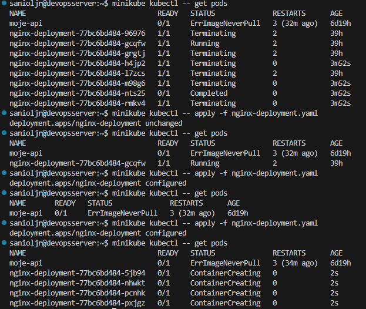

### Stosowanie różnych wersji obrazu

Stosowanie różnych wersji obrazu polegało na zmianie wartości pola `image` (np. `nest-api:v1`, `nest-api:v2`, `nest-api:v3`). Dodatkowo dodano `imagePullPolicy: Never`, co oznacza, że Kubernetes nie będzie pobierać obrazu z zewnętrznego rejestru — jeśli obraz nie będzie dostępny lokalnie w Minikube, Pod nie uruchomi się.

**Wersja nest-api:v1**

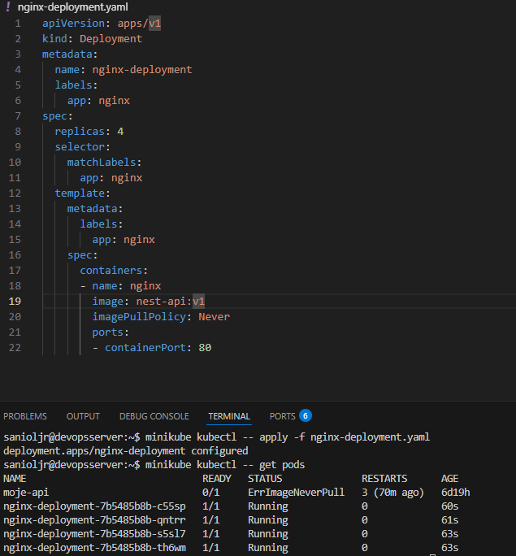

**Wersja nest-api:v2**

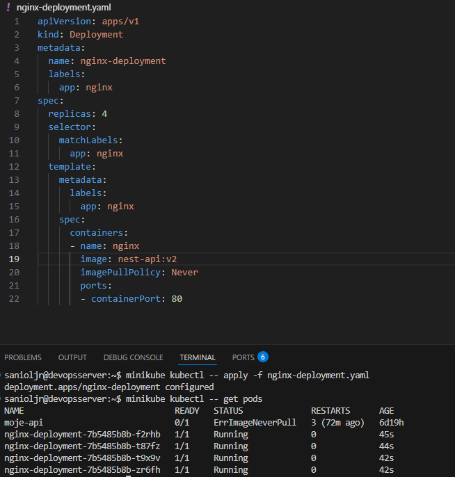

**Wersja nest-api:v3**

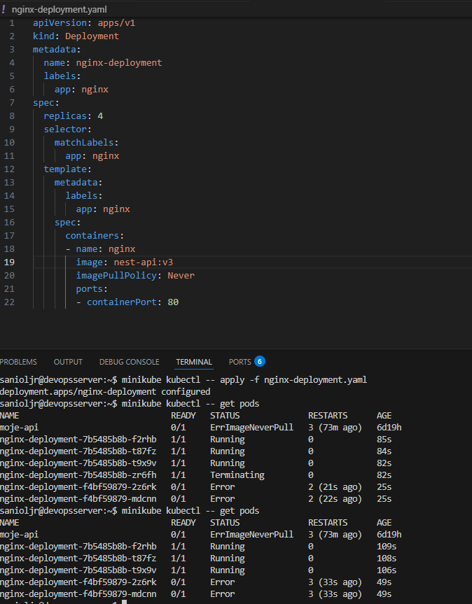

Następnie sprawdzono historię wdrożeń dla deploymentu `nginx-deployment`:

                minikube kubectl -- rollout history deployment/nginx-deployment

Wykorzystano też mechanizm przywracania (rollback) do poprzedniej rewizji, np. z `v3` na `v2`:

                minikube kubectl -- rollout undo deployment/nginx-deployment

                minikube kubectl -- get pods

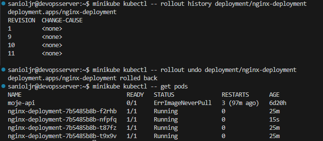

## Kontrola wdrożenia

Na podstawie historii rolloutu zidentyfikowano kolejne rewizje wdrożenia:

- Rewizja 1: stan początkowy — bazowy obraz `nginx`.
- Rewizje 2–8: zmiany związane z dynamicznym skalowaniem liczby replik.
- Rewizje 9–10: aktualizacje do sprawnych wersji aplikacji (`nest-api:v2` i `nest-api:v1`).
- Rewizja 11: wdrożenie wadliwego obrazu `nest-api:v3` — kontenery zakończyły działanie z kodem błędu (wykonując `exit 1`), co spowodowało awarię i wymusiło rollback.

### Skrypt weryfikujący czas wdrożenia

W celu weryfikacji czasu wdrożenia przygotowano skrypt `verify_deploy_time.sh`, który używa polecenia `kubectl rollout status` z flagą `--timeout`:

                #!/bin/bash

                set -euo pipefail

                # Konfiguracja parametrów
                DEPLOYMENT_NAME="nginx-deployment"
                TIMEOUT_LIMIT="60s"

                echo "=== Rozpoczęcie weryfikacji wdrożenia: ${DEPLOYMENT_NAME} ==="
                echo "Oczekiwanie na zakończenie rolloutu (Max: ${TIMEOUT_LIMIT})..."

                if ./minikube kubectl -- rollout status deployment/${DEPLOYMENT_NAME} --timeout=${TIMEOUT_LIMIT}; then
                    echo " [SUKCES] Wdrożenie zakończyło się powodzeniem w wyznaczonym czasie!"
                    exit 0
                else
                    echo " [AWARIA] Przekroczono limit 60 sekund lub wdrożenie zakończyło się błędem."
                    echo " Aktualny stan podów:"
                    ./minikube kubectl -- get pods
                    exit 1
                fi

Skrypt sprawdza, czy rollout dla deploymentu `nginx-deployment` zakończy się w ciągu 60 sekund, używając lokalnej binarki `minikube` dostępnej w środowisku.

W `Jenkinsfile` dodano etap przygotowujący Minikube, ponieważ agent Jenkins działający w kontenerze nie miał dostępu do binarki `minikube` na hoście. Przykładowy etap:

                stage('Prepare Minikube') {
                    steps {
                        echo 'Pobieranie i uruchamianie Minikube lokalnie w środowisku Jenkinsa...'
                        sh '''
                            if [ ! -f ./minikube ]; then
                                curl -LO https://storage.googleapis.com/minikube/releases/latest/minikube-linux-amd64
                                chmod +x minikube-linux-amd64
                                mv minikube-linux-amd64 minikube
                            fi
                            
                            # Wymuszenie startu klastra z driverem docker
                            ./minikube start --force --driver=docker
                        '''
                    }
                }

Zaktualizowano również etapy wdrażania (`Deploy Container`) i testowania (`Smoke Test`), aby korzystały z mechanizmów Minikube i przygotowanego pliku `nginx-deployment.yaml`:

                stage('Deploy Container') {
                    steps {
                        echo 'Budowanie obrazu wdrożeniowego v2...'
                        sh "docker build -f Dockerfile.build --target runtime -t nest-api:v2 -t nest-api:${BUILD_NUMBER} ."

                        echo 'Ładowanie obrazu do runtime Minikube...'
                        sh './minikube image load nest-api:v2'

                        echo 'Wdrażanie do Minikube...'
                        sh './minikube kubectl -- apply -f nginx-deployment.yaml'
                    }
                }
                stage('Smoke Test') {
                    steps {
                        echo 'Uruchamianie skryptu weryfikacyjnego (Timeout 60s)...'
                        sh './verify_deploy_time.sh'
                    }
                }

Dzięki temu Minikube przygotowuje klaster na żądanie w środowisku CI/CD, obraz ładowany jest do lokalnego cache za pomocą `minikube image load`, a następnie uruchamiane są Pody. Zmiany zostały zatwierdzone w repozytorium i uruchomiono pipeline.

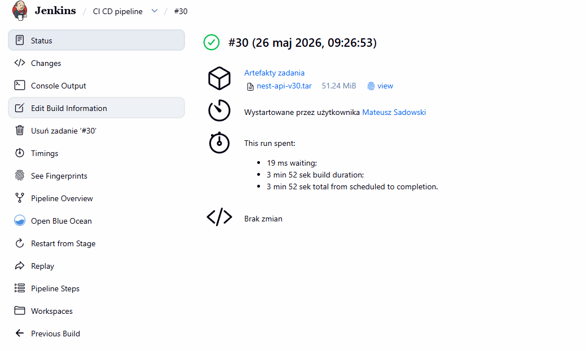

## Strategie wdrożenia

### Recreate

Strategia ta polega na usunięciu wszystkich starych Podów, a następnie utworzeniu nowych. Jest to rodzaj pełnego restartu, w którym aplikacja może być chwilowo niedostępna.
Aby zastosować tę strategię, w pliku YAML należy ustawić:

                                spec:
                                    replicas: 4
                                    strategy:
                                        type: Recreate

Po zastosowaniu zmian i ponownym wdrożeniu (np. zmieniając obraz z `v1` na `v2`), najpierw usuwane są stare Pody, a dopiero potem tworzone nowe.

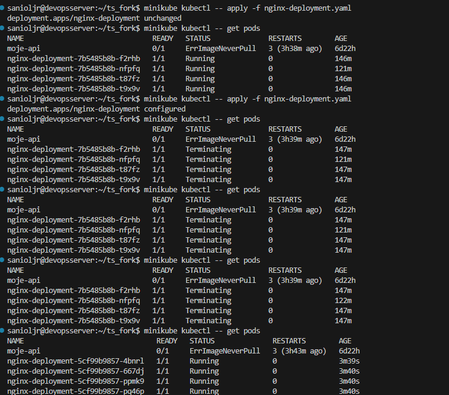

### Rolling Update z dodatkowymi warunkami

Strategia ta jest domyślną strategią Kubernetesa. Parametry `maxUnavailable` i `maxSurge` kontrolują, ile starych Podów może być niedostępnych jednocześnie oraz ile nowych może być utworzonych ponad aktualny stan.

Przykład konfiguracji:

                                spec:
                                    replicas: 4
                                    strategy:
                                        type: RollingUpdate
                                        rollingUpdate:
                                            maxUnavailable: 2
                                            maxSurge: 25%

W praktyce proces aktualizacji przebiega asynchronicznie: nowe Pody są tworzone, stare usuwane dopiero po osiągnięciu gotowości nowych. Dzięki `imagePullPolicy: Never` klaster korzysta z lokalnego cache Minikube, co często skraca czas uruchamiania.

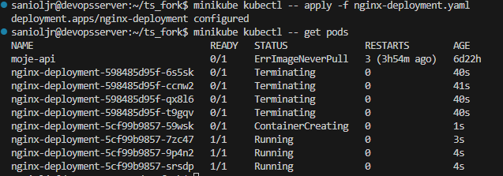

### Canary deployment (workload)

Canary deployment polega na uruchomieniu równolegle dwóch deploymentów: stabilnego (np. 75% ruchu) i kanarkowego (np. 25% ruchu). Oba deploymenty mogą być eksponowane przez ten sam Service, który wybiera Pody po etykiecie `app=nginx`.

Przykład: deployment produkcyjny (`track: production`) z 3 replikami oraz deployment kanarkowy (`track: canary`) z 1 repliką. Service kieruje ruch do wszystkich Podów oznaczonych `app=nginx`.

Po wdrożeniu wszystkich plików:

        minikube kubectl -- apply -f nginx-deployment.yaml
        minikube kubectl -- apply -f nginx-canary.yaml
        minikube kubectl -- apply -f nginx-service.yaml

Sprawdzono status Podów i etykiety:

        minikube kubectl -- get pods --show-labels

oraz szczegóły Service:

                minikube kubectl -- describe service nginx-service

Na zrzucie widać, że Pody z etykietą `track=production` (3 repliki) oraz `track=canary` (1 replika) są obsługiwane przez ten sam Service dzięki wspólnej etykiecie `app=nginx`.

W sekcji `Endpoints` Service pokazuje powiązane adresy IP Podów — w przykładowym przypadku jest ich 8, co wskazuje na wiele uruchomionych instancji.

Dzięki takiemu ustawieniu ruch można stopniowo kierować na nową wersję w celach testowych, minimalizując wpływ na dostępność usługi.

## Wnioski

Tagowanie istniejącego obrazu pozwoliło testować kilka wersji bez duplikowania warstw, co oszczędza przestrzeń dyskową.
Mechanizm `kubectl rollout` oraz rollback poprawnie wykrył i cofnął wadliwe wdrożenie (obraz z `exit 1`), co dowodzi skuteczności kontroli stanu w klastrze. 

Strategia `Recreate` jest prosta, lecz powoduje przestój, natomiast `RollingUpdate` z kontrolą `maxUnavailable`/`maxSurge` minimalizuje przestoje, a podejście canary umożliwia bezpieczne testy nowej wersji przy ograniczonym wpływie na produkcję.

Uruchamianie Minikube w pipeline oraz użycie `minikube image load` jest praktyczne do testów integracyjnych w izolowanym środowisku Jenkins, choć na produkcji warto stosować rejestr obrazów.

Udało się zintegrować pipeline z minikube w potoku Jenkinsa, możliwe to było za pomocą zapewnienia Jenkinsowi dostępowi do minikube, do czego został oddzielony specjalny stage.

Pipeline był wyposażony w praktyczny skrpty, któy weryfikował czy wdrożenie nie zajmuje więcej niż 60 sekund, w myśl, że jeżeli wdrożenie jest zdyt długioe należy poprawić aplikację lub sam proces wdrażania.

## Historia poleceń

                minikube image build -t nest-api:v2 -f Dockerfile.build .

                148  minikube start
                
                149  minikube image build -t nest-api:v2 -f Dockerfile.build .
                
                150  cat .dockerignore
                
                151  minikube stop
                
                152  minikube start
                
                153  docker system prune -af --volumes
                
                154  minikube ssh -- docker system prune -af --volumes
                
                155  minikube start
                
                156  minikube image build -t nest-api:v2 -f Dockerfile.build .
                
                157  cd /ts_fork
                
                158  ls
                
                159  cd ts*
                
                160  minikube image build -t nest-api:v2 -f Dockerfile.build .
                
                161  minikube image ls | grep nest-api
                
                162  minikube image tag nest-api:v2 nest-api:v1
                
                163  minikube image ls | grep nest-api
                
                164  cd
                
                165  minikube kubectl -- apply -f nginx-deployment.yaml
                
                166  minikube kubectl -- get pods
                
                167  minikube kubectl -- apply -f nginx-deployment.yaml
                
                168  minikube kubectl -- get pods
                
                169  minikube kubectl -- apply -f nginx-deployment.yaml
                
                170  minikube kubectl -- get pods
                
                171  minikube kubectl -- apply -f nginx-deployment.yaml
                
                172  minikube kubectl -- get pods
                
                173  minikube kubectl -- apply -f nginx-deployment.yaml
                
                174  minikube kubectl -- get pods
                
                175  sudo apt-get clean
                
                176  sudo apt-get autoremove -y
                
                177  sudo rm -rf /tmp/build.*.tar
                
                178  sudo journalctl --vacuum-size=50M
                
                179  docker system prune -af --volumes
                
                180  df -h
                
                181  clear
                
                182  cd ts*
                
                183  minikube image build -t nest-api:v3 -f Dockerfile.build --dockerfile <(echo -e "FROM nest-api:v2\nCMD [\"sh\", \"-c\", 
                \"exit 1\"]") .
                
                184  cd
                
                185  minikube image build -t nest-api:v3 -f Dockerfile.build --dockerfile <(echo -e "FROM nest-api:v2\nCMD [\"sh\", \"-c\", \"exit 1\"]") .
                
                186  minikube image build -t nest-api:v3 -f Dockerfile.broken .
                
                187  minikube image build -t nest-api:v3 -f Dockerfile.error .
                
                188  minikube stop
                
                189  cd ts*
                
                190  git add .
                
                191  git commit -m "depl;oyment with k8s"
                
                192  git push origin
                
                193  git add .
                
                194  git commit -m "deployment with k8s reformed"
                
                195  git push origin
                
                196  git add .
                
                197  git commit -m "getting kubernetes durning pipeline"
                
                198  git push origin
                
                199  git add .
                
                200  git commit -m "yaml file"
                
                201  git push origin
                
                202  git add .
                
                203  git commit -m "kubectl path"
                
                204  git push origin
                
                205  git add .
                
                206  git commit -m "poprawki"
                
                207  git push origin
                
                208  git add .
                
                209  git commit -m "poprawki na v2"
                
                210  git push origin
                
                211  git add .
                
                212  git commit -m "poprawki dalcze"
                
                213  git push origin
                
                214  git add .
                
                215  git commit -m "poprawki dalcze 2"
                
                216  git push origin
                
                217  git add .
                
                218  git commit -m "poprawki dalcze 3"
                
                219  git push origin
                
                220  clear
                
                221  history