# Mateusz Sadowski - sprawozdanie z laboratoriów 12

## Środowisko wykonania

Maszyna wirtualna Oracle VirtualBox 7.2.6a z obrazem ISO Ubuntu 24.04.4 LTS. Maszyna posiadała początkowo 70 GB dostępnego miejsca na dysku, 2 rdzenie CPU oraz 8 GB pamięci RAM.
Zastosowano przekierowanie portów (port forwarding), gdzie port 2222 na hoście przekierowuje ruch na port 22 maszyny wirtualnej (guest), na którym działa serwer SSH.
Zwiększono z 4 GB na 8 GB pamięci RAM, ponieważ UI Jenkinsa dotychczas działało bardzo mozolnie, co utrudniało wykonywanie laboratorium.

## Przygotowanie kontenera

Aby przygotować kontener oraz wrzucić jego aktualną wersję na Docker Hub, zdecydowano się zaktualizować pipeline CI/CD używany na poprzednich laboratoriach, tak aby sam aktualizował wersję kontenera z aplikacją na platformie Docker Hub.
W tym celu na początku wygenerowano Personal Access Token w Docker Hub (aby umożliwić późniejsze logowanie).

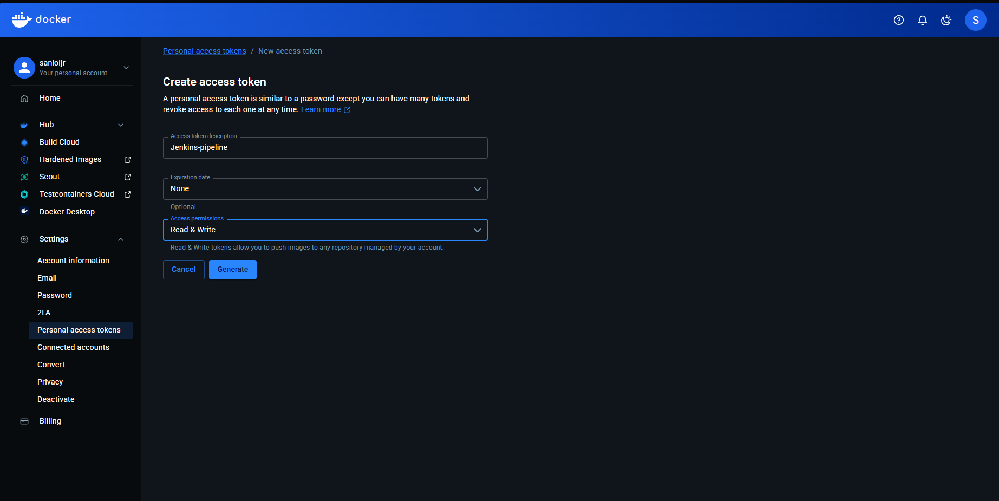

Następnie w UI Jenkinsa, w ustawieniach w sekcji `credentials` dodano globalny dostęp do konta na Docker Hub poprzez PAT o ID `dockerhub-creds`.

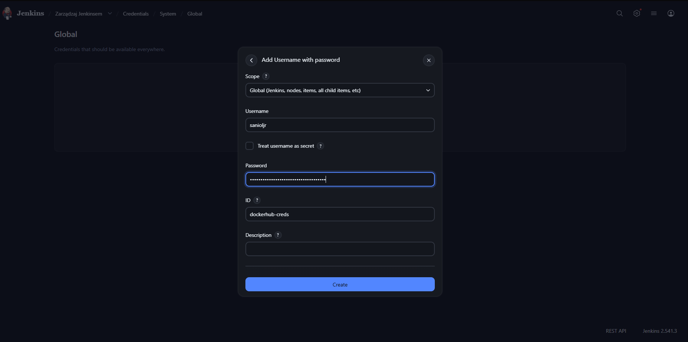

Po tym kroku dodano do pipeline w stage'u **Publish** eksport obrazu na Docker Hub, wraz z logowaniem przy użyciu credentials:

        stage('Publish') {
                    steps {
                        echo "Eksportowanie obrazu do pliku .tar i archiwizacja w Jenkinsie..."
                        // Zapisywanie obrazu do pliku .tar
                        sh "docker save nest-api:v2 nest-api:${BUILD_NUMBER} -o nest-api-v${BUILD_NUMBER}.tar"
                        // Archiwizacja pliku w Jenkinsie - to dodaje go do historii builda
                        archiveArtifacts artifacts: "nest-api-v${BUILD_NUMBER}.tar", fingerprint: true

                        echo "Eksportowanie obrazu do Docker Hub..."
                        //eksport obrazu do dockerhub, logowanie jest też zautomatyzowane
                        withCredentials([usernamePassword(credentialsId: 'dockerhub-creds', usernameVariable: 'DOCKER_USER', passwordVariable: 'DOCKER_PASS')]) {
                            sh '''
                                docker login -u "$DOCKER_USER" -p "$DOCKER_PASS"
                                docker tag nest-api:v2 "$DOCKER_USER/nest-api:${BUILD_NUMBER}"
                                docker tag nest-api:v2 "$DOCKER_USER/nest-api:latest"
                                docker push "$DOCKER_USER/nest-api:${BUILD_NUMBER}"
                                docker push "$DOCKER_USER/nest-api:latest"
                            '''
                        }
                    }
                }

Następnie zmiany wrzucono na repozytorium zawierające aplikację, po czym odpalono pipeline w UI Jenkinsa.

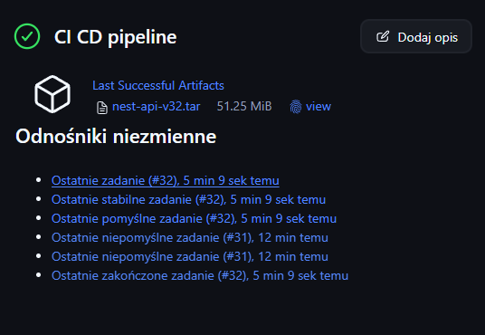

Pipeline przeszedł, co potwierdziło UI Jenkinsa; sprawdzono, czy obraz pojawił się na Docker Hub.

Poprzez UI Docker Hub:

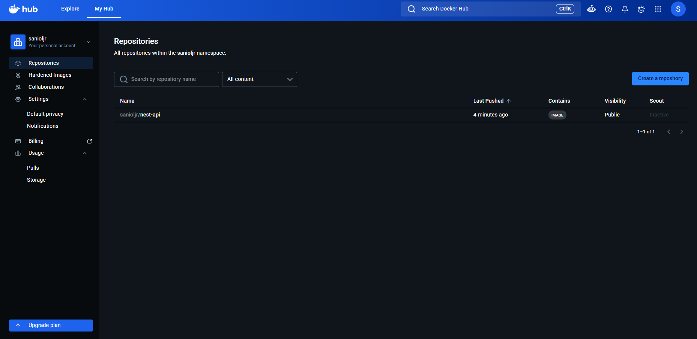

oraz poprzez terminal poleceniem, które pobrało obraz z Docker Hub:

        docker pull sanioljr/nest-api:latest
    
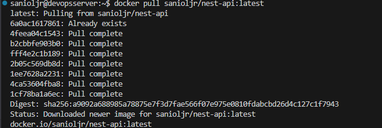

## Zapoznanie z platformą

Po dodaniu uwierzytelniania dwuetapowego do konta UPEL oraz zapoznaniu się z cennikiem, zarejestrowano Microsoft Cloud Shell — jest to przeglądarkowe, interaktywne środowisko powłoki udostępnione przez Microsoft w ramach usługi Azure, które pozwala na uruchamianie Azure CLI, PowerShell i narzędzi DevOps bez potrzeby instalowania lokalnych zależności.

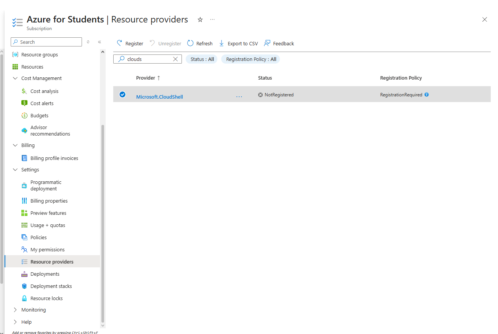

Następnie stworzono konto magazynu Azure w regionie Poland Central.

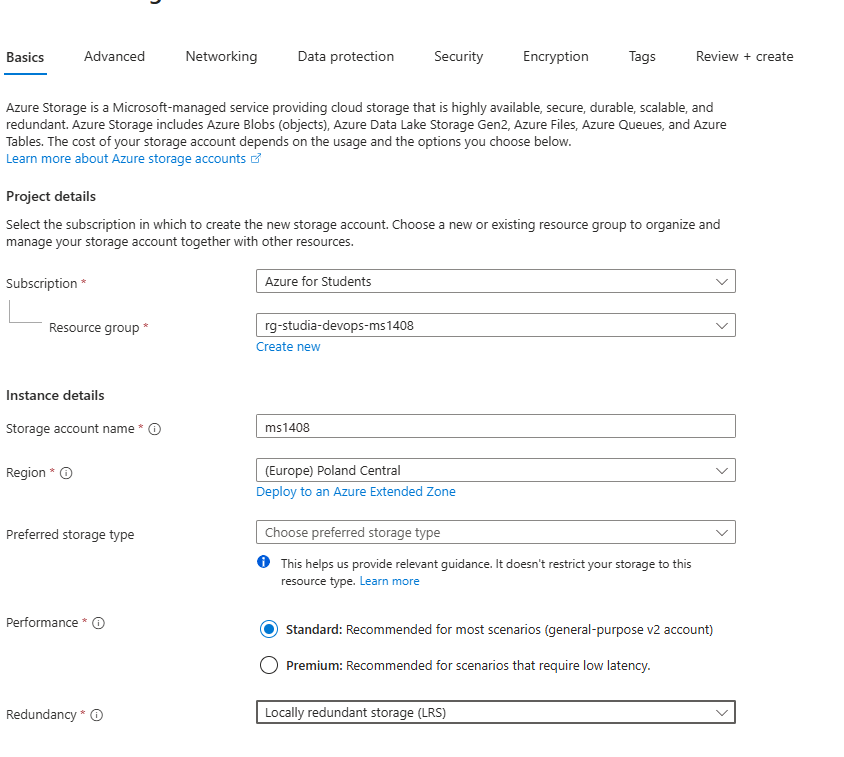

Następnie uruchomiono terminal basha (`no storage mounted`) i wyświetlono listę dostępnych subskrypcji.

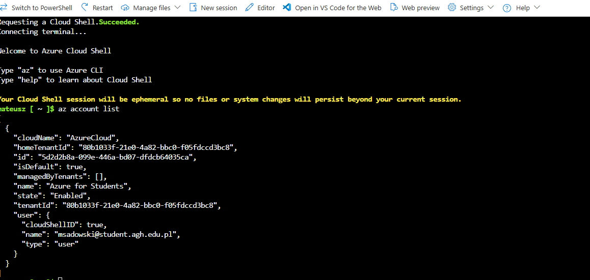

#### Wdrażanie kontenera

Zainstalowano Azure CLI i przystąpiono do dalszych części laboratorium.

Następnie zalogowano się oraz uruchomiono Azure CLI przy pomocy

        az login

Później, ze względu na problemy z `Microsoft.ContainerInstance`, zarejestrowano go przy pomocy

        az provider register --namespace Microsoft.ContainerInstance

Po zarejestrowaniu stworzono kontener do deploya

        az container create \
        --resource-group rg-studia-devops-ms1408 \
        --name my-nest-api \
        --image sanioljr/nest-api:latest \
        --dns-name-label devops-nest-sanioljr \
        --ports 3003 \
        --os-type linux \
        --memory 1.5 \
        --cpu 1 \
        --location polandcentral

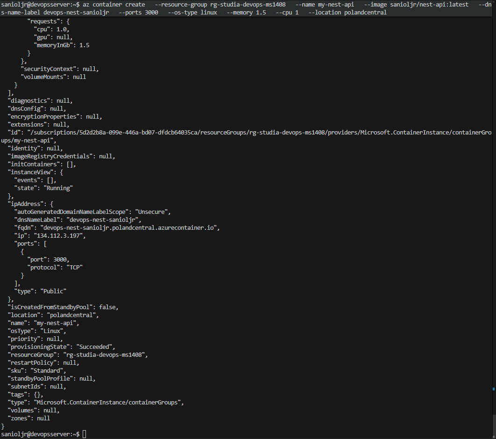

Następnie wyświetlono status.

        az container show --resource-group rg-studia-devops-ms1408 --name my-nest-api --query "{FQDN:ipAddress.fqdn,ProvisioningState:provisioningState}" --out table

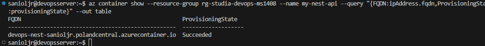

W celu pobrania logów uruchomiono polecenie

        az container logs --resource-group rg-studia-devops-ms1408 --name my-nest-api

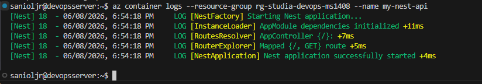

Od tego momentu było możliwe połączenie się z aplikacją poprzez wejście na URL w przeglądarce:

http://devops-nest-sanioljr.polandcentral.azurecontainer.io:3003

lub przetestowanie połączenia poleceniem `curl`:

curl -v http://74.248.249.193:3003

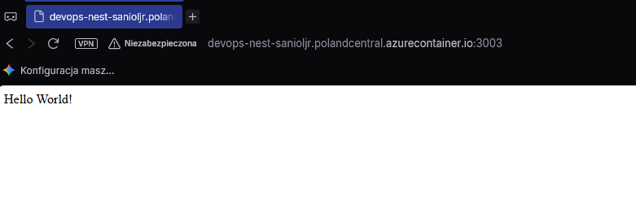

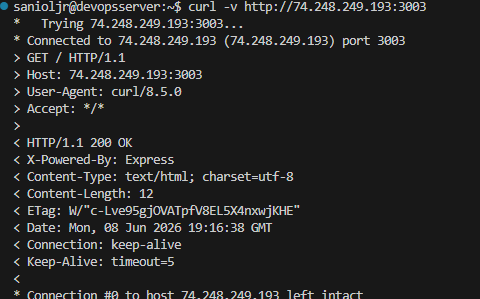

#### Sprzątanie zasobów

Po zakończeniu testów usunięto utworzony kontener oraz utworzoną resource group.

Usunięcie samego kontenera:

        az container delete \
        --resource-group rg-studia-devops-ms1408 \
        --name my-nest-api \
        --yes

Usunięcie całej resource group:

        az group delete \
        --name rg-studia-devops-ms1408 \
        --yes --no-wait

## Wnioski

Zaktualizowanie pipeline'u CI/CD (Jenkins) w celu automatycznego budowania obrazu i publikowania go w Docker Hub z użyciem bezpiecznych poświadczeń (credentials) umożliwiło proste wdrożenie i wersjonowanie aplikacji. W trakcie laboratoriów udostępniono aplikację w chmurze Azure, dzięki czemu była ona osiągalna globalnie, a nie tylko w środowisku lokalnym (localhost). Ponieważ Azure jest platformą komercyjną, gdzie utrzymanie infrastruktury wiąże się z kosztami, po zakończeniu ćwiczeń usunięto utworzone zasoby (kontener oraz całą resource group). Pozwala to zachować odpowiednią higienę operacyjną i zminimalizować koszty utrzymania środowiska testowego.