# Mateusz Sadowski - Laboratorium 4

### Środowisko wykonania

Maszyna wirtualna Oracle Virtual Box 7.2.6a z obrazem ISO Ubuntu 24.04.4 LTS. Maszyna posiada dostęp do 40 GB dostępnego obszaru na dysku, 2 rdzenie CPU oraz 4 GB pamięci ram.
Zastosowano przekierowanie portów (port forwarding), gdzie port 2222 na maszynie fizycznej (host) przekierowuje ruch na port 22 maszyny wirtualnej (guest), na którym pracuje serwer SSH.

### Woluminy
Stworzono i przygotowano wolumin wejściowy oraz wyjściowy poprzez bind mount w Docker Compose:

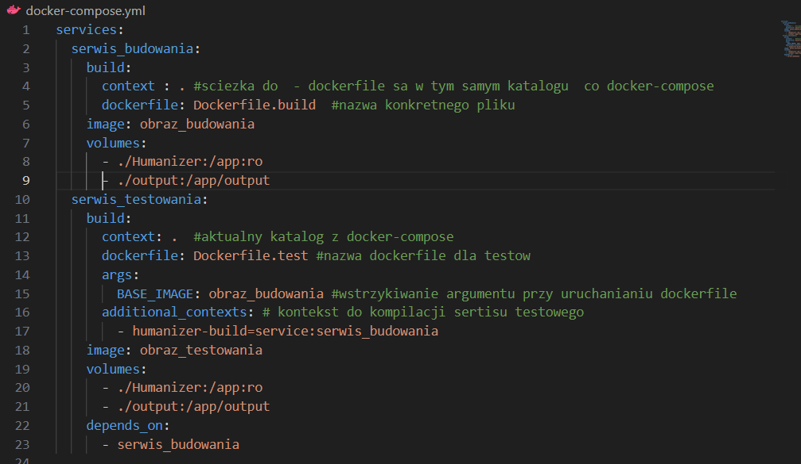

Woluminy znajdują się w katalogu /app oraz odpowiadających mu katalogach hosta. Wolumin wejściowy był ustawiony jako read-only (`:ro`), czyli możliwy był wyłącznie odczyt, bez możliwości zapisu.

Następnie usunięto pobieranie repozytorium i Gita w pliku Dockerfile.build oraz uruchomiono kontener, co skutkowało błędem ze względu na brak repozytorium.

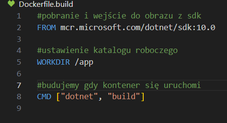

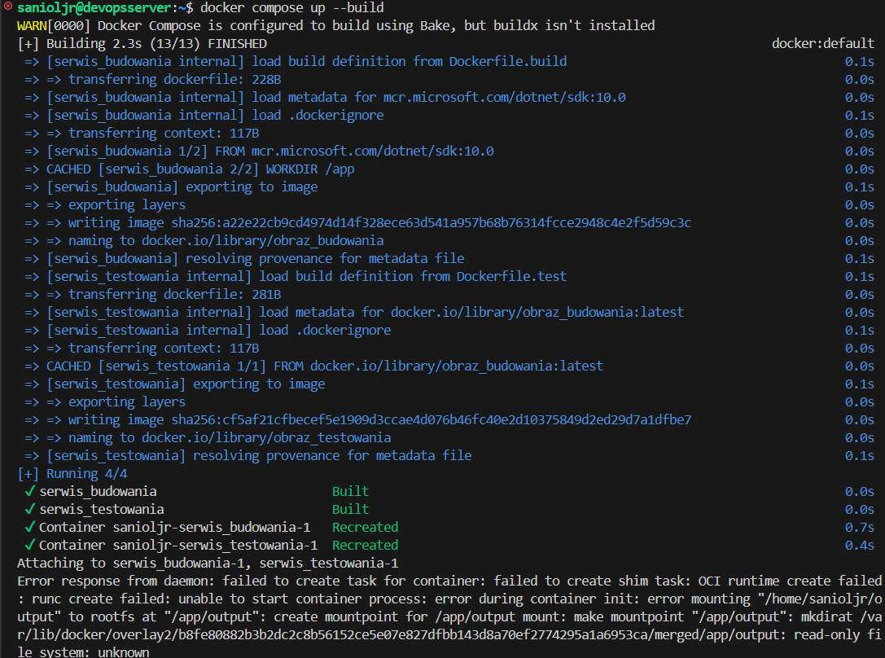

Aby zapewnić dostęp do kodu, należało dodać wolumin w docker-compose.yml. Okazało się jednak, że flaga read-only blokowała budowanie, więc została usunięta. Wynika to z tego, że w trakcie budowania w .NET kod jest zarówno odczytywany, jak i zapisywane są pliki tymczasowe. Jest to ważne spostrzeżenie, które może łatwo umknąć.
Następnie uruchomiono build w kontenerze przy pomocy:

        docker compose up

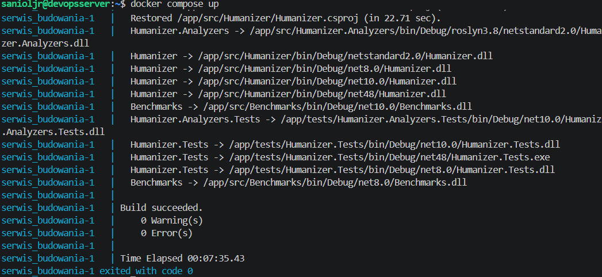

Przy pomocy polecenia w Dockerfile.build:

        CMD ["bash", "-c", "dotnet build && cp -r src tests /output/"]

zrealizowano budowanie projektu oraz kopiowanie plików wykonawczych do folderu output. Obecność tych plików umożliwia uruchamianie projektu bez każdorazowego ponownego budowania, ponieważ są one zapisywane na hoście w folderze `/output`. Flaga **&&** w komendzie powoduje, że kopiowanie zostanie wykonane tylko wtedy, gdy build zakończy się powodzeniem. Kopiowane są foldery `/src` i `/tests`.

Następnie przy pomocy poniższych komend usunięto obraz budowania, aby go przebudować, a następnie ponownie wykonano build. Było to wymagane, ponieważ Docker cache korzystał ze starszej wersji pliku Dockerfile.

        docker compose down
        docker rmi obraz_budowania
        docker compose up
    
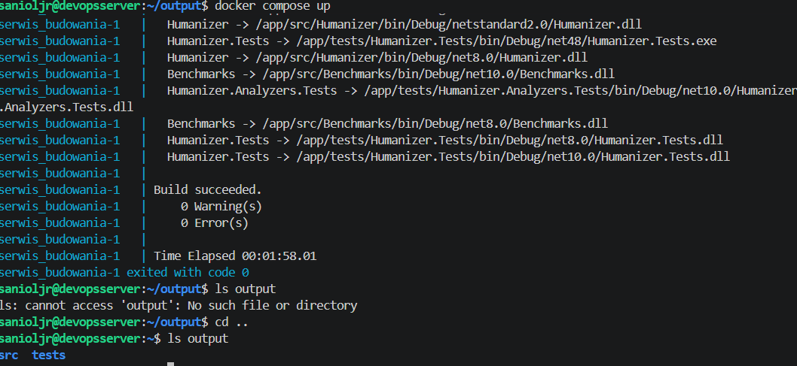

Aby przeprowadzić tę samą operację, ale z klonowaniem kodu wewnątrz kontenera, usunięto z 
docker-compose.yml wolumin dla Humanizera, czyli:

        - ./Humanizer:/app

zarówno z obrazu budowania, jak i testowania. W Dockerfile.build dodano natomiast polecenie pobrania repozytorium z Gita:

        RUN git clone https://github.com/Humanizr/Humanizer.git .

Następnie ponownie usunięto stary obraz budowania i uruchomiono Docker Compose.

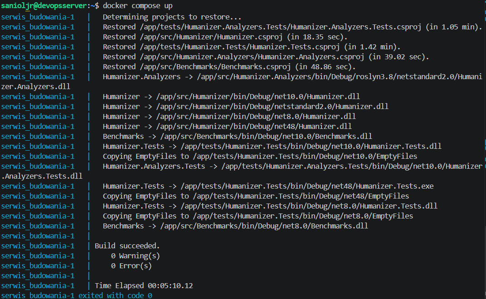

Dotychczas wykonywanie `docker compose up` powodowało budowanie od nowa. Gdyby jednak wykorzystać:

        RUN --mount

obraz byłby budowany raz, a później `docker compose up` jedynie uruchamiałby gotowy kontener. Jest to podejście bardziej optymalne, ponieważ unika wielokrotnego budowania: artefakty są zapisane w obrazie, a kolejne uruchomienia tylko je wykorzystują.

### Eksponowanie portu i łączność między kontenerami

#### Połączenie przez adresy IP

Na początku należało utworzyć kontenery i otworzyć ich interfejs konsoli. Należało to zrobić w osobnych terminalach (w przypadku VS Code: kliknięcie znaku **+** w obszarze terminala).

                docker run -it --name <nazwa kontenera> ubuntu bash

Przy pomocy:

                hostname -I

sprawdzono adresy IP kontenerów. Następnie w obu zaktualizowano pakiety i zainstalowano iperf3:

                apt update && apt install -y iperf3

po czym na jednym z nich uruchomiono serwer:

                iperf3 -s

Połączenie wykonuje się przy pomocy następującego polecenia:

                iperf3 -c <adres IP kontenera w którym jest serwer>

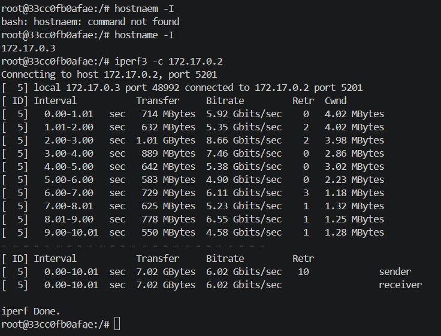

#### Połączenie przy pomocy `docker network create`

##### Stawianie serwera iperf
Najpierw utworzono sieć, przez którą miały się łączyć kontenery.

                docker network create <nazwa sieci>

Następnie uruchomiono kontener w trybie interaktywnym:

                docker run -it --name <nazwa kontenera> --network <nazwa sieci> <obraz> bash

W tym przypadku obrazem był `ubuntu`, a `bash` dodany na końcu uruchamiał terminal. Po wykonaniu tej komendy Docker sprawdza, czy obraz Ubuntu istnieje lokalnie. Jeśli nie, pobiera go automatycznie.

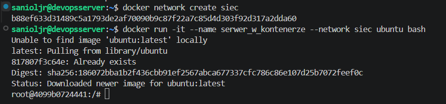

W kontenerze zaktualizowano listę pakietów:

        apt update

Następnie zainstalowano iperf3:

                apt install -y iperf3

Flaga `-y` oznacza automatyczną zgodę na pytania instalatora. Następnie uruchomiono serwer przy pomocy flagi `-s`:

                iperf3 -s

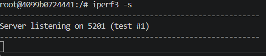

##### Podpinanie klienta do serwera iperf

Na początku utworzono kontener klienta. Wykonano to przy pomocy tej samej komendy co dla serwera, ale z inną nazwą kontenera. Sieć musiała pozostać ta sama, aby połączenie mogło zostać zrealizowane. **Ważne: ten proces musiał przebiegać w nowym terminalu.** Dzięki temu w VS Code można pracować jednocześnie na terminalu serwera i klienta bez wychodzenia z trybu interaktywnego.

Przy pomocy polecenia:

        hostname -I

sprawdzono adresy IP klienta i serwera. W terminalu klienta zaktualizowano pakiety i zainstalowano iperf3. Połączenie z serwerem zrealizowano przy pomocy:

                iperf3 -c <nazwa serwera>

Komenda ta uruchamia test przesyłu danych, mierząc ilość przesłanych danych, średnią prędkość transmisji, liczbę retransmisji oraz wyniki po stronie nadawcy (sender) i odbiorcy (receiver).

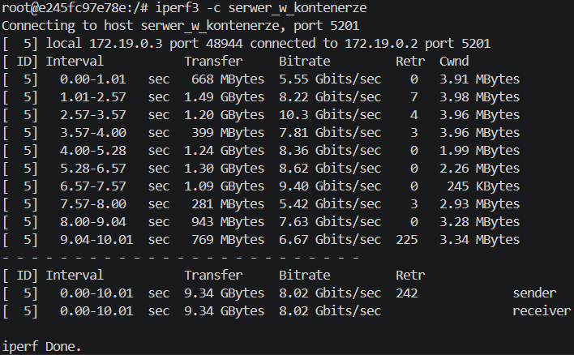

##### Połączenie spoza kontenera
Aby to wykonać, serwer iperf3 musiał być uruchomiony. W tym przypadku istotne było sprawdzenie, na którym porcie nasłuchuje serwer.
**Połączenie spoza kontenera z hosta realizuje się przy pomocy**

                iperf3 -c <IP_kontenera_serwera> -p <port na którym serwer nasłuchuje>

Oczywiście iperf3 musi być zainstalowany w środowisku, w którym wykonuje się to polecenie.

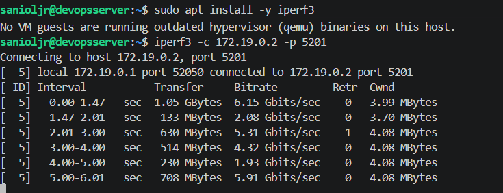

**Połączenie spoza kontenera spoza hosta:**
Przy realizacji tego rodzaju połączenia wymagane było ustawienie dodatkowego port forwardingu w ustawieniach maszyny wirtualnej.

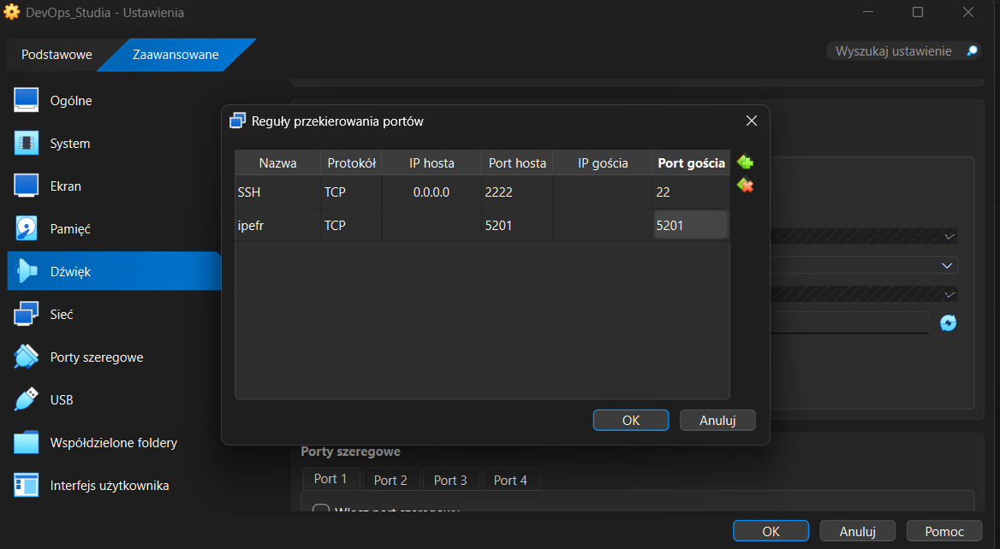

Aby zrealizować połączenie spoza hosta, należało ponownie utworzyć kontener z serwerem, tym razem z odpowiednią konfiguracją sieciową oraz zgodnością z forwardingiem maszyny wirtualnej. Jest to wymagane, ponieważ domyślnie serwer nasłuchuje tylko wewnątrz sieci kontenera. Wystawienie usługi na hosta umożliwia połączenie z zewnątrz.

                docker run -it --name <nazwa kontenera> --network host ubuntu bash

Następnie w terminalu kontenera uruchomiono serwer iperf3.

                iperf3 -s

Kolejno, należało połączyć się z zewnątrz z serwerem. W przypadku systemu Windows po instalacji iperf3 polecenie wykonano w folderze programu:

                .\iperf3.exe -c 127.0.0.1 -p 5201

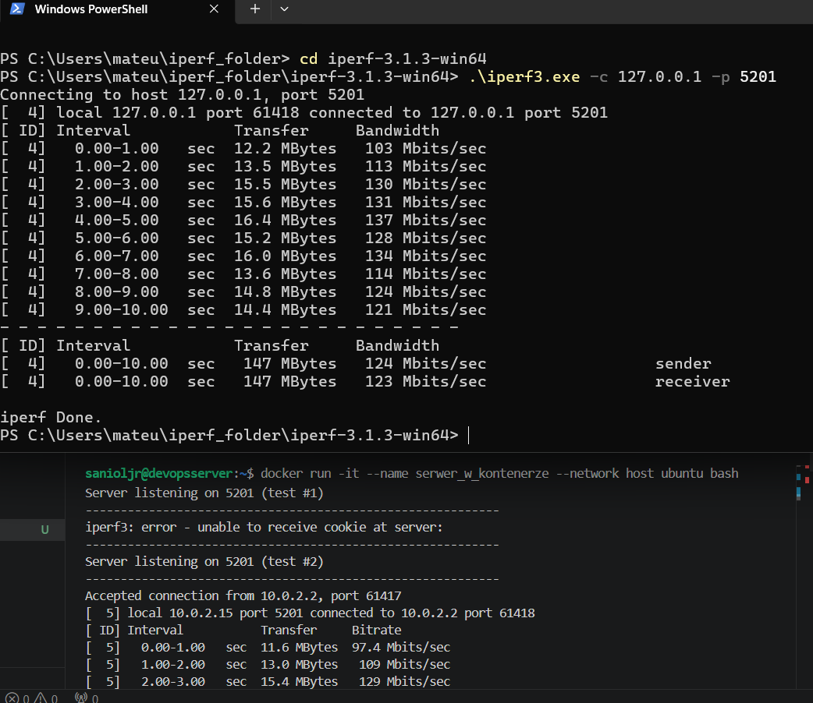

#### Usługi w rozumieniu systemu, kontenera i klastra
Utworzono kontener na obrazie Ubuntu wraz z mapowaniem portów: port 2222 hosta na port 22 kontenera, aby możliwe było połączenie z zewnątrz. Następnie wewnątrz kontenera zaktualizowano pakiety oraz zainstalowano OpenSSH:

                apt update && apt install -y openssh-server

W trakcie instalacji skonfigurowano strefę czasową (wybrano kontynent i miasto). Następnie utworzono katalog wymagany do poprawnego startu SSH:

                mkdir /var/run/sshd

Następnie skonfigurowano hasło użytkownika root poleceniem:

                echo 'root:<HASŁO>' | chpasswd

Później zmodyfikowano plik `sshd_config`, zmieniając domyślny zakaz logowania hasłem na konto administratora na pełny dostęp. Dokonano tego poprzez zmianę parametru **PermitRootLogin** z **prohibit-password** na **yes**. Flaga **-i** wykonuje zmianę bezpośrednio w pliku.

                sed -i 's/#PermitRootLogin prohibit-password/PermitRootLogin yes/' /etc/ssh/sshd_config

Na końcu uruchomiono usługę ręcznie, ponieważ kontener Docker nie korzysta z klasycznego menedżera usług systemowych.

                /usr/sbin/sshd

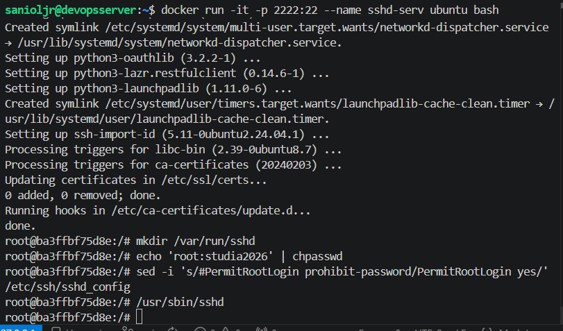

Połączenie zrealizowano z kolejnego terminala, podłączonego do maszyny wirtualnej w VS Code, przy pomocy:

                ssh root@localhost -p 2222

`root@localhost` w tym przypadku oznacza logowanie na konto administratora przez interfejs pętli zwrotnej (loopback), co dzięki przekierowaniu portu 2222 umożliwia połączenie z usługą SSH wewnątrz kontenera.

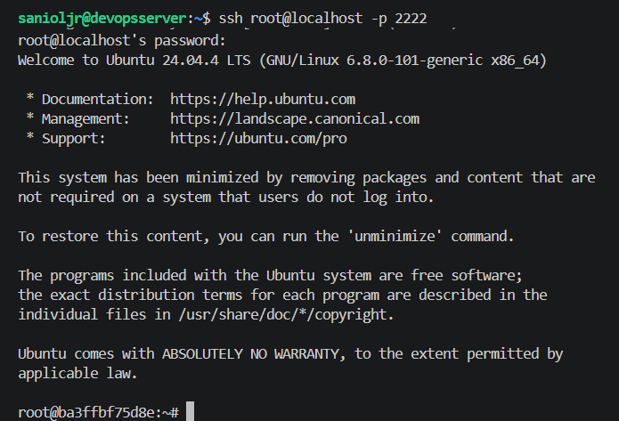

###### Zalety i wady komunikacji z kontenerem z wykorzystaniem SSH

**SSHD (SSH Daemon)** to usługa serwerowa umożliwiająca zdalne logowanie i administrację przez SSH. W typowej pracy z Dockerem zwykle nie uruchamia się SSHD wewnątrz kontenera, ponieważ do wejścia do działającego kontenera wygodniej i bezpieczniej użyć bez utrzymywania dodatkowej usługi bash lub 

                docker exec -it <kontener> sh
                
**Zaletami SSHD są:** znany sposób pracy administracyjnej, możliwość użycia kluczy SSH, polityk dostępu i narzędzi audytowych oraz wygoda w scenariuszach, gdzie kontener ma działać jak mini-host.

**Wadami są:** większa złożoność obrazu i konfiguracji (utrzymanie sshd, użytkowników i kluczy), odejście od modelu „jeden proces = jeden kontener” oraz zwiększenie powierzchni potencjalnego ataku.

#### Jenkins

Część ta polegała głównie na podążaniu za dokumentacją Jenkinsa
 `https://www.jenkins.io/doc/book/installing/docker/`
Ukończenie jej poskutkowało zainstalowaniem skonteneryzowanej instancji Jenkinsa z pomocnikiem DIND (Docker in Docker - polega na uruchomieniu silnika docker w dockerze) oraz zainicjowaniu jej instancji. Później dopiero dodano port forwarding aby wyświetlić obraz logowania.

Na początku utworzono dedykowaną sieć Docker dla Jenkinsa:

                docker network create jenkins

Następnie pobrano obraz DIND:

                docker image pull docker:dind

Uruchomiono kontener DIND:

                docker run \
                --name jenkins-docker \
                --rm \
                --detach \
                --privileged \
                --network jenkins \
                --network-alias docker \
                --env DOCKER_TLS_CERTDIR=/certs \
                --volume jenkins-docker-certs:/certs/client \
                --volume jenkins-data:/var/jenkins_home \
                --publish 2376:2376 \
                docker:dind \
                --storage-driver overlay2

Następnie utworzono plik Dockerfile.jenkins.

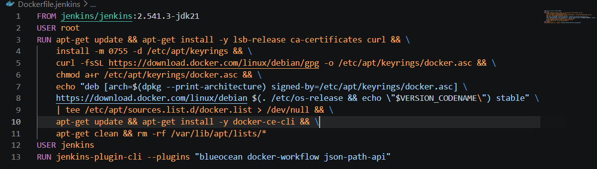

Kolejno zbudowano obraz Jenkins:

                docker build -f Dockerfile.jenkins -t myjenkins-blueocean:2.541.3-1 .

Następnie uruchomiono kontener Jenkins:

                docker run \
                --name jenkins-blueocean \
                --restart=on-failure \
                --detach \
                --network jenkins \
                --env DOCKER_HOST=tcp://docker:2376 \
                --env DOCKER_CERT_PATH=/certs/client \
                --env DOCKER_TLS_VERIFY=1 \
                --publish 8080:8080 \
                --publish 50000:50000 \
                --volume jenkins-data:/var/jenkins_home \
                --volume jenkins-docker-certs:/certs/client:ro \
                myjenkins-blueocean:2.541.3-1

Później należało ustawić port forwarding lokalnie na laptopie. Na początku sprawdzono nazwę uruchomionej maszyny wirtualnej:

                "C:\Program Files\Oracle\VirtualBox\VBoxManage.exe" list runningvms    
                
Następnie ustawiono port forwarding:

                "C:\Program Files\Oracle\VirtualBox\VBoxManage.exe" controlvm "acd6e4fd-4396-4b46-b28e-62a70925f438" natpf1 "jenkins-web,tcp,127.0.0.1,8080,,8080"
                
Przetestowano połączenie:

                powershell -command "Test-NetConnection 127.0.0.1 -Port 8080"

Następnie otworzono w przeglądarce *http://127.0.0.1:8080*. W ten sposób został wyświetlony ekran logowania Jenkinsa.

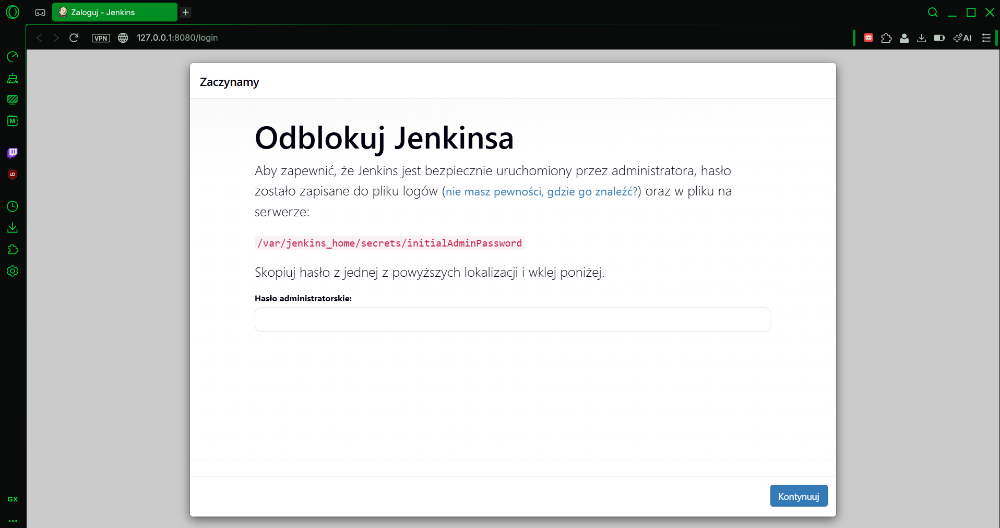

Poniżej znajduje się zdjęcie przedstawiające działające kontenery.

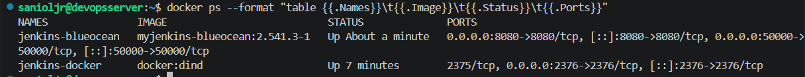

### Propty do LLM
- Co to wolumin wejściowy a co to wyjściowy? Czym się różnią i jak się je tworzy?
- Z czego to wynika, że flaga read-only w docker-compose.yml blokuje dostęp do builda?
- Co jest potrzebne by uruchomić serwer iperf w kontenerze i dlaczego?
- Co to usługa SSHD, jak się ją zestawia, jak się z nią łączy, na czym polega ta usługa i jakie daje możliwości?

### Historia z command line:
                docker compose up
                
                417  clear
                
                418  docker compose up
                
                419  ls
                
                420  cd output
                
                421  ls
                
                422  ls -a
                
                423  cd .
                
                424  ls -a
                
                425  ls
                
                426  cd ..
                
                427  ls -la /home/sanioljr/output/
                
                428  docker exec sanioljr-serwis_budowania-1 find /app -name "*.dll" -o -name "*.exe"
                
                429  docker compose up
                
                430  ls -la /home/sanioljr/output/
                
                431  docker compose up
                
                432  docker compose down
                
                433  docker rmi obraz_budowania
                
                434  docker compose up
                
                435  ls output
                
                436  ls
                
                437  cd output
                
                438  ls
                
                439  rm -d src
                
                440  rm -fd src
                
                441  rm -r src
                
                442  rm -rf src
                        
                443  ls
        
                444  ls src
                
                445  rm -rf src
                
                446  suto rm -rf src
                
                447  sudo rm -rf src
        
                448  ls
                
                449  sudo rm -rf tests
                
                450  clear
                
                451  docker compose down
                
                452  docker rmi obraz_budowania
                
                453  docker compose up
                
                454  ls output
                
                455  cd ..
                
                456  ls output
                
                457  docker compose down
                
                458  docker rmi obraz_budowania
                
                459  docker compose up
                
                460  exit
                
                461  docker ps
                
                462  dotnet run -it
                
                463  ls
                
                464  cd H*
                
                465  ls
                
                466  dotnet run -- name serwer
                
                467  cd ..
                
                468  clear
                
                469  docker run -it serwer
                
                470  docker run -it --name serwer
                
                471  docker network create siec
                
                472  docker run -it --name serwer_w_kontenerze --network siec ubuntu bash
                
                473  docker ps
                
                474  docker run -it --name klient --network isec ubuntu bash
                
                475  docker run -it --name klient --network siec ubuntu bash
                
                476  docker ps
                
                477  docker start klient
                
                478  docker rm -f klient
                
                479  clear
                
                480  docker run -it --name klient --network siec ubuntu bash
                
                481  docker ps
                
                482  clear
                
                483  docker network create siec
                
                484  docker run -it --name serwer_w_kontenerze --network siec ubuntu bash
                
                485  clear
                
                486  docker ps -a
                
                487  docker start serwer_w_kontenerze
                
                488  docker start serwer_w_kontenerze -it
                
                489  docker exec -it serwer_w_kontenerze bash
                
                490  docker stop serwer_w_kontenerze
                
                491  docker run -it --name serwer_w_kontenerze --network siec -p 5201:5201 ubuntu bash
                
                492  docker rm -f serwer_w_kontenerze
                
                493  docker run -it --name serwer_w_kontenerze --network siec -p 5201:5201 ubuntu bash
                
                494  docker run -it --name serwer_w_kontenerze --network siec -p 5201:5202 ubuntu bash
                
                495  docker run -it --name serwer_w_kontenerze --network siec -p 5202:5202 ubuntu bash
                
                496  docker rm -f serwer_w_kontenerze
                
                497  docker run -it --name serwer_w_kontenerze --network siec -p 5202:5202 ubuntu bash
                
                498  exit
                
                499  exit
                
                500  iperf3 -c 172.19.0.2 -p 5201
                
                501  clear
                
                502  apt install iperf3
                
                503  sudo apt install -y iperf3
                
                504  iperf3 -c 172.19.0.2 -p 5201
                
                505  docker run klient
                
                506  docker ps -a
                
                507  docker start klient
                
                508  docker exec -it klient bash
                
                509  docker ps
                
                510  sudo ss -itnp 'spot = :5201'
                
                511  sudo ss -itnp 'sport = :5201'
                
                512  iperf3 -c 127.0.0.1 -p 5201
                
                513  sudo ss -itnp 'sport = :5201'
                
                514  docker start serwer_w_kontenerze
                
                515  docker exec -it serwer_w_kontenerze bash
                
                516  docker rm -f serwer_w_kontenerze
                
                517  docker run -it --name serwer_w_kontenerze --network siec -p 5201:5201 ubuntu bash
                
                518  docker ps
                
                519  docker ps -a
                
                520  sudo ss -ltnp 'sport = :5201'
                
                521  sudo kill 606
                
                522  sudo ss -ltnp 'sport = :5201'
                
                523  docker run -it --name serwer_w_kontenerze --network siec -p 5201:5201 ubuntu bash
                
                524  docker rm -f serwer_w_kontenerze
                
                525  docker run -it --name serwer_w_kontenerze --network siec -p 5201:5201 ubuntu bash
                
                526  docker rm -f serwer_w_kontenerze
                
                527  sudo ss -ltnp 'sport = :5201'
                
                528  sudo kill 2824
                
                529  sudo ss -ltnp 'sport = :5201'
                
                530  docker rm -f serwer_w_kontenerze
                
                531  docker run -it --name serwer_w_kontenerze --network siec -p 5201:5201 ubuntu bash
                
                532  docker rm -f serwer_w_kontenerze
                
                533  docker run -it --name serwer_w_kontenerze --network host ubuntu bash
                
                534  docker rm -f serwer_w_kontenerze
                
                535  sudo ss -ltnp 'sport = :5201'
                
                536  sudo kill 4655
                
                537  docker run -it --name serwer_w_kontenerze --network host ubuntu bash
                
                538  clear
                
                539  sudo systemctl stop iperf3
                
                540  sudo systemctl disable iperf3
                
                541  sudo pkill -9 iperf3
                
                542  sudo ss -ltnp 'sport = :5201'
                
                543  docker run -it --name serwer_w_kontenerze --network host ubuntu bash
                
                544  docker rm -f serwer_w_kontenerze
                
                545  sudo ss -ltnp 'sport = :5201'
                
                546  docker run -it --name serwer_w_kontenerze --network host ubuntu bash
                
                547  clear
                
                548  docker run -it --serwerIP ubuntu bash
                
                549  clear
                
                550  docker run -it --name serwerIP ubuntu bash
                
                551  ssh root@localhost -p 2222
                
                552  exit
                
                553  exit
                
                554  docker run -it --name klientIP ubuntu bash
                
                555  docker run -it --name sshd-server ubuntu bash
                
                556  docker stop sshd-server
                
                557  clear
                
                558  docker run -it -p 2222:22 --name sshd-serv ubuntu bash
                
                559  docker network create jenkins
                
                560  docker image pull docker:dind
                
                561  docker run   --name jenkins-docker   --rm   --detach   --privileged   --network 
                jenkins   --network-alias docker   --env DOCKER_TLS_CERTDIR=/certs   --volume jenkins-docker-certs:/certs/client   --volume jenkins-data:/var/jenkins_home   --publish 
                2376:2376   docker:dind   --storage-driver overlay2
                
                562  touch Dockerfile.jenkins
                
                563  docker build -t myjenkins-blueocean:2.541.3-1 .
                
                564  docker build -f Dockerfile.jenkins -t myjenkins-blueocean:2.541.3-1 .
                
                565  docker run   --name jenkins-blueocean   --restart=on-failure   --detach   --network jenkins   --env DOCKER_HOST=tcp://docker:2376   --env DOCKER_CERT_PATH=/certs/client   --env DOCKER_TLS_VERIFY=1   --publish 8080:8080   --publish 50000:50000   --volume jenkins-data:/var/jenkins_home   --volume jenkins-docker-certs:/certs/client:ro   myjenkins-blueocean:2.541.3-1
                
                566  docker ps --format "table {{.Names}}\t{{.Image}}\t{{.Status}}\t{{.Ports}}"
                
                567  history
