# Mateusz Sadowski - Laboratorium 5

## Środowisko wykonania

Maszyna wirtualna Oracle Virtual Box 7.2.6a z obrazem ISO Ubuntu 24.04.4 LTS. Maszyna posiada dostęp do 40 GB dostępnego obszaru na dysku, 2 rdzenie CPU oraz 4 GB pamięci ram.
Zastosowano przekierowanie portów (port forwarding), gdzie port 2222 na maszynie fizycznej (host) przekierowuje ruch na port 22 maszyny wirtualnej (guest), na którym pracuje serwer SSH.

## Przygotowanie

Uruchomiono obraz Dockera, który eksponuje środowisko zagnieżdżone.

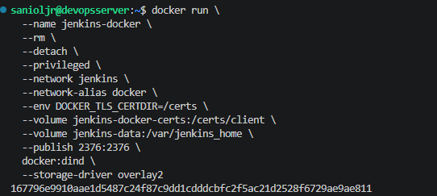

Następnie przygotowano obraz Blue Ocean na podstawie obrazu Jenkinsa, budując Dockerfile.jenkins, wykorzystany na poprzednich laboratoriach.

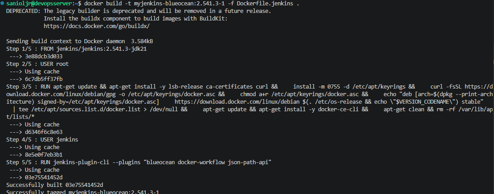

Obraz ten został uruchomiony.

Blue Ocean to zestaw pluginów na bazie standardowego Jenkinsa. Startuje z nowym UI, obsługą multibranch pipeline i lepszymi wizualizacjami. To rozszerzenie Jenkinsa, silnik i konfiguracja pozostają, dochodzi warstwa wtyczek i nowy interfejs.

Na stronie Jenkinsa, która znajduje się pod adresem **<adres_hosta>:<port>** (np. 192.168.0.212:8080), skonfigurowano tam jego instancję. Aby wydobyć hasło potrzebne do konfiguracji z logów aplikacji, wykorzystano polecenie:

        docker exec jenkins-blueocean cat /var/jenkins_home/secrets/initialAdminPassword

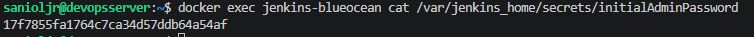

Następnie wybrano opcję **instalacji sugerowanych wtyczek**, po czym stworzono pierwszego administratora.

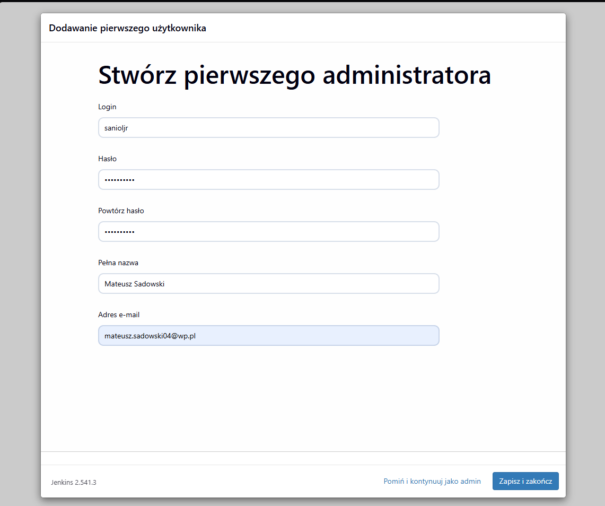

Po zakończonej konfiguracji zarchiwizowano logi aplikacji, wcześniej niewidoczne przy uruchomieniu w trybie detach. Logi domyślnie przechowuje Docker, więc zdecydowano się na ich bieżące wypisywanie do pliku poleceniem:

        nohup docker logs -f jenkins-blueocean >> jenkins_lab5.log 2>&1 &

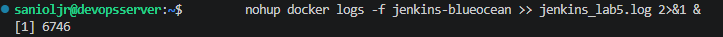

## Wstępne uruchomienie

Utworzono 2 projekty typu pipeline, pierwszy wyświetlający uname, a drugi błąd jeżeli godzina jest nieparzysta. Zrealizowano to przy pomocy skryptu Groovy:

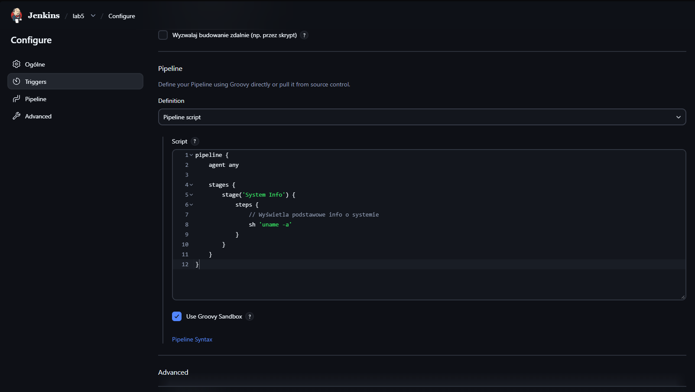

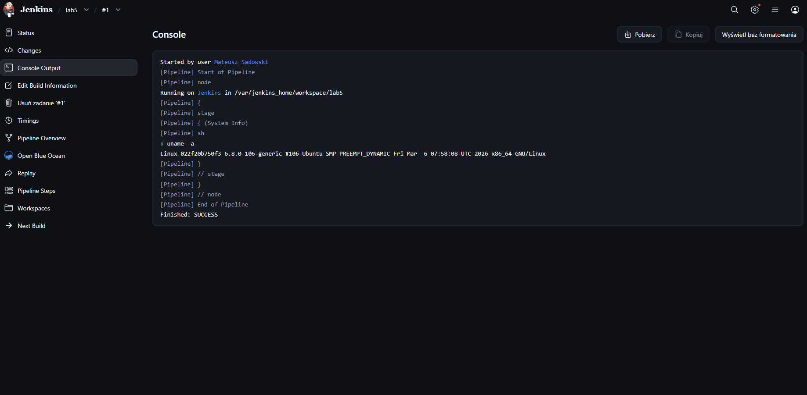

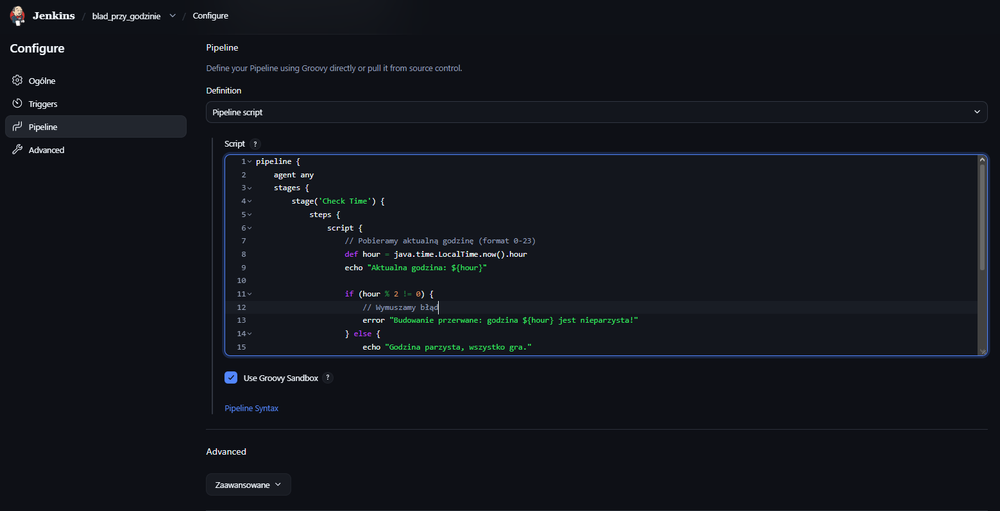

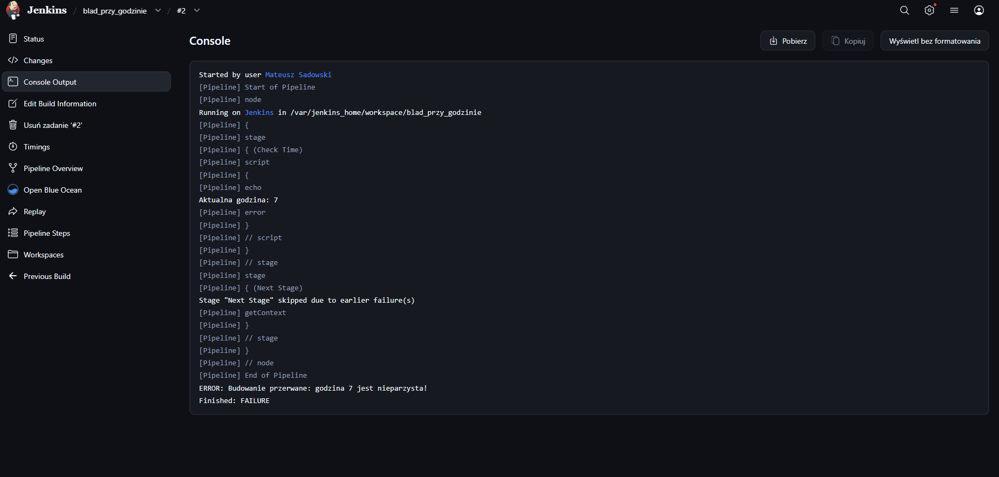

Następnie, ze względu na niepewność co do wykonania kolejnego kroku (pipeline czy cmd), poprzez polecenie Dockera uruchomiono tryb interaktywny kontenera jenkins-blueocean.

        docker exec -it jenkins-blueocean bash

Tam wpisano polecenie do pobrania obrazu w projekcie kontenera ubuntu

        docker pull ubuntu

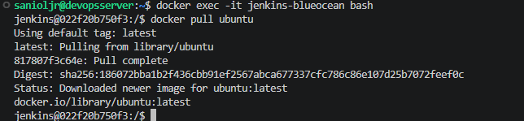

## Zadanie wstępne - obiekt typu pipeline
Utworzono nowy obiekt typu pipeline

                pipeline {
                        agent any 
                        stages {
                                stage('Klonowanie i Checkout') {
                                        steps {
                                                //chekcout mojej galezi
                                                git branch: 'MS423500', 
                                                url: 'https://github.com/InzynieriaOprogramowaniaAGH/MDO2026_ITE.git'
                                        }
                                }
                        stage('Budowanie obrazu') {
                                steps {
                                        // budowanie obrazu - folder lab5, poniewaz w lab4 Dockerfile.build mial clona z gita (zla praktyka)
                                        sh 'docker build -t obraz_lab5 -f DS423500/Sprawozdanie5/Dockerfile.build DS423500/Sprawozdanie5/'
                                        }
                                }       
                        }
                }

Obiekt ten klonuje repozytorium, robiąc checkout do Dockerfile na mojej osobistej gałęzi. Buduje Dockerfile.build zaczerpnięty z poprzedniego sprawozdania, lecz edytowany na potrzeby aktualnego. Edycja polegała na usunięciu fragmentu odpowiadającego za klonowanie repozytorium projektowego (podwójne klonowanie, raz przez pipeline, drugi raz przez Dockerfile co jest złą praktyką).
Dockerfile.build:

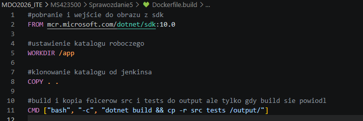

Na etapie rozwiązywania zadania wystąpiły problemy z dostępem do internetu. Maszyna wirtualna wymagała restartu i uruchomienia w szybszej sieci, na lepszym sprzęcie, co mogło skutkować brakami w logach Jenkinsa z tego etapu.

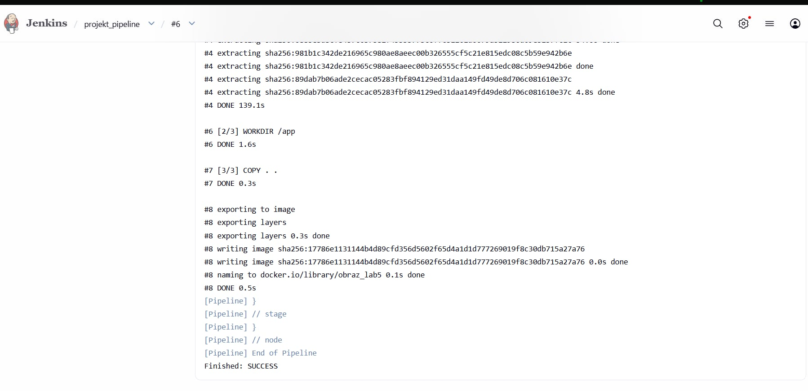

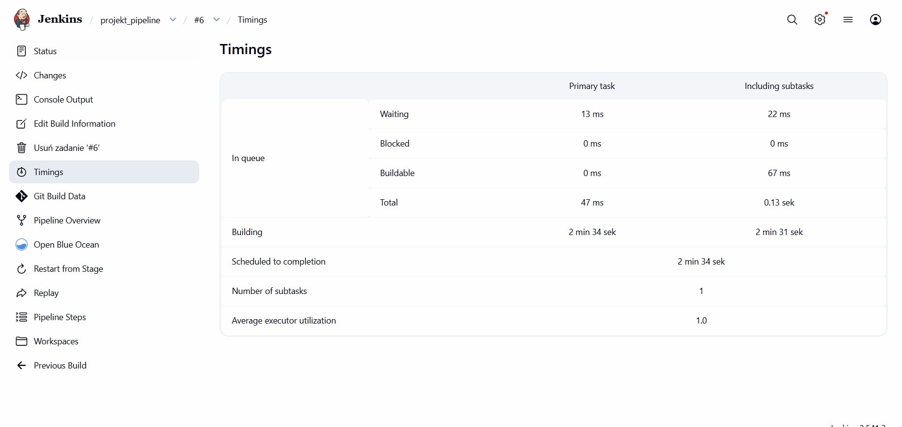

Na koniec uruchomiono ten sam pipeline drugi raz, tym razem czas jego wykonywania był znacznie szybszy (z 2.5 minuty na 11 sekund). Wynika to z rozgrzanego cache (warstwy Dockera i workspace Jenkinsa były już pobrane, więc nie trzeba ich było ponownie ściągać ani budować).

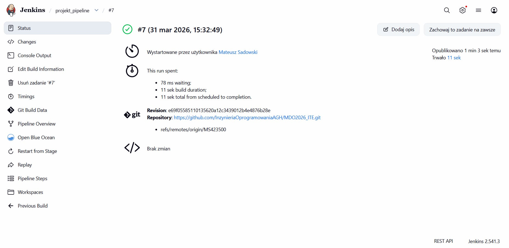

## Podsumowanie

Zbudowano i uruchomiono instancję Jenkins + Blue Ocean w trybie zagnieżdżonego Dockera, potwierdzając działanie logowaniem do UI i podstawowymi pipeline’ami; powtórne uruchomienie pipeline’u przyspieszyło dzięki cache warstw Dockera i artefaktom w workspace. Dalsze prace powinny skupić się na utrwaleniu procesów (backup konfiguracji, monitorowanie logów), automatyzacji kolejnych pipeline’ów oraz świadomym zarządzaniu cache, żeby skracać czasy buildów bez utraty spójności środowiska.

### Historia konsoli:
docker run   --name jenkins-docker   --rm   --detach   --privileged   --network jenkins   --network-alias docker   --env DOCKER_TLS_CERTDIR=/certs   --volume jenkins-docker-certs:/certs/client   --volume jenkins-data:/var/jenkins_home   --publish 2376:2376   docker:dind   --storage-driver overlay2
  630  docker build -t myjenkins-blueocean:2.541.3-1 .
  631  docker build -t myjenkins-blueocean:2.541.3-1 -f Dockerfile.jenkins .
  632  docker run   --name jenkins-blueocean   --restart=on-failure   --detach   --network jenkins   --env DOCKER_HOST=tcp://docker:2376   --env DOCKER_CERT_PATH=/certs/client   --env DOCKER_TLS_VERIFY=1   --publish 8080:8080   --publish 50000:50000   --volume jenkins-data:/var/jenkins_home   --volume jenkins-docker-certs:/certs/client:ro   myjenkins-blueocean:2.541.3-1
  633  docker rm -f jenkins-blueocean
  634  docker run   --name jenkins-blueocean   --restart=on-failure   --detach   --network jenkins   --env DOCKER_HOST=tcp://docker:2376   --env DOCKER_CERT_PATH=/certs/client   --env DOCKER_TLS_VERIFY=1   --publish 8080:8080   --publish 50000:50000   --volume jenkins-data:/var/jenkins_home   --volume jenkins-docker-certs:/certs/client:ro   myjenkins-blueocean:2.541.3-1
  635  docker exec jenkins-blueocean cat /var/jenkins_home/secrets/initialAdminPassword
  636  docker logs --tail 20 jenkins-blueocean
  637  nano jenkins_lab5
  638  nano jenkins_lab5.log
  639  docker exec -it jenkins-blueocean bash
  640  clear
  641  cd MDO*
  642  git branch
  643  git switch MS423500
  644  git add .
  645  git commit -m "usinięcie z obrazu klonowania repo"
  646  git push
  647  ip addr
  648  exit
  649  clear
  650  docker run   --name jenkins-docker   --rm   --detach   --privileged   --network jenkins   --network-alias docker   --env DOCKER_TLS_CERTDIR=/certs   --volume jenkins-docker-certs:/certs/client   --volume jenkins-data:/var/jenkins_home   --publish 2376:2376   docker:dind   --storage-driver overlay2
  651  docker run   --name jenkins-blueocean   --restart=on-failure   --detach   --network jenkins   --env DOCKER_HOST=tcp://docker:2376   --env DOCKER_CERT_PATH=/certs/client   --env DOCKER_TLS_VERIFY=1   --publish 8080:8080   --publish 50000:50000   --volume jenkins-data:/var/jenkins_home   --volume jenkins-docker-certs:/certs/client:ro   myjenkins-blueocean:2.541.3-1
  652  docker rm -f jenkins-blueocean
  653  docker run   --name jenkins-blueocean   --restart=on-failure   --detach   --network jenkins   --env DOCKER_HOST=tcp://docker:2376   --env DOCKER_CERT_PATH=/certs/client   --env DOCKER_TLS_VERIFY=1   --publish 8080:8080   --publish 50000:50000   --volume jenkins-data:/var/jenkins_home   --volume jenkins-docker-certs:/certs/client:ro   myjenkins-blueocean:2.541.3-1
  654  docker ps
  655  history

  ### Prompty do LLM
  - Jak archiwizować logi Jenkinsa do zewnętrznego pliku, gdzie one domyslnie sa przechowywane (jeśli są)?
  - Jak utworzyć w Jenkinsie projekt, wyświetlający uname?
  - Jak utworzyć w Jenkinsie projekt wyświetlający bład jeżeli godzina jest nieparzysta?
  - Jaka jest różnica pomiędzy Jenkinsem a Blue Ocean?