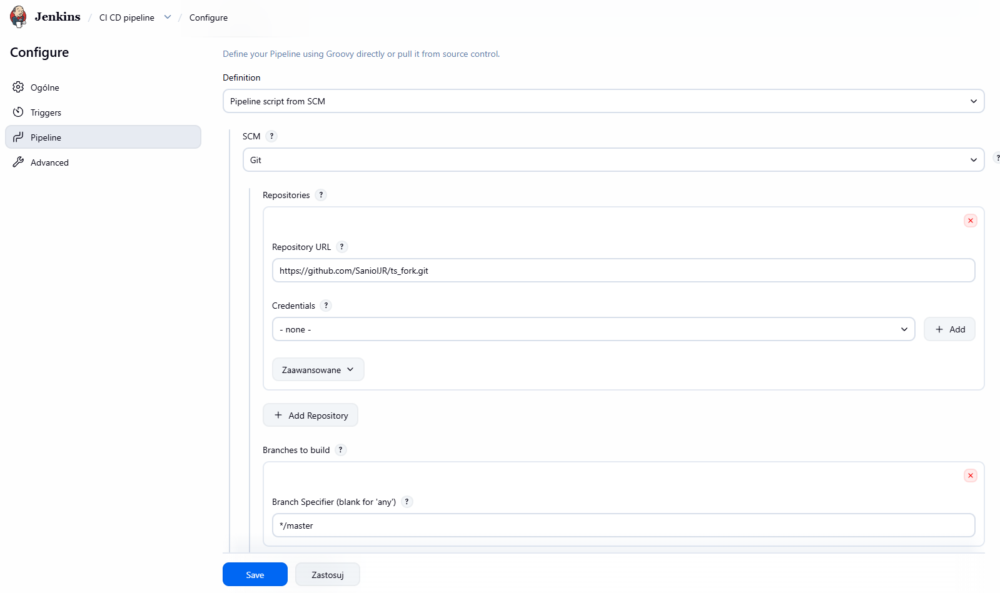
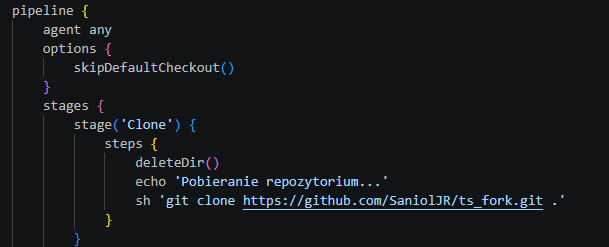
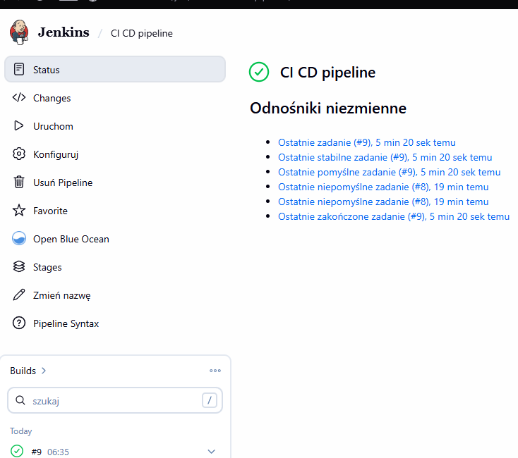
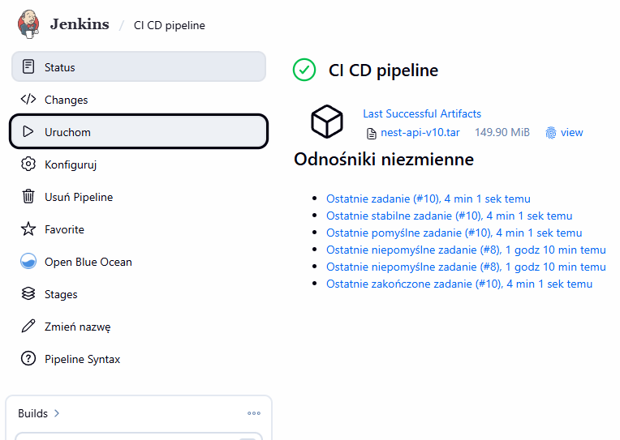
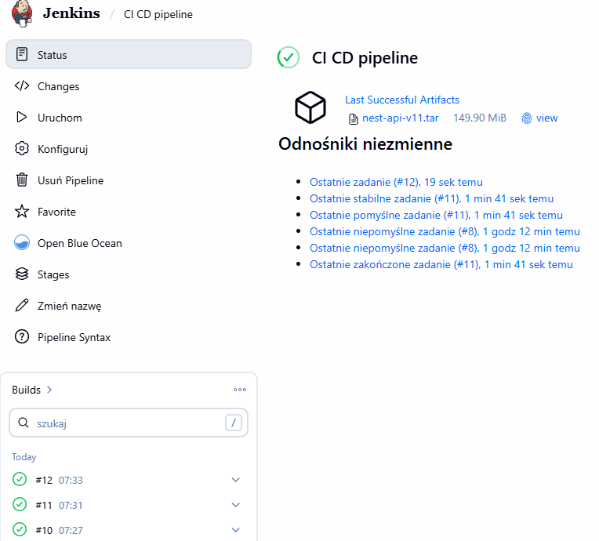
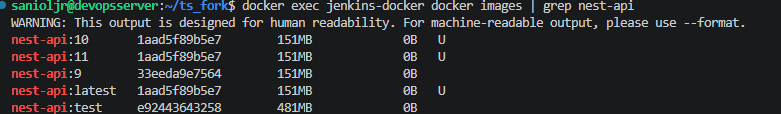

# Mateusz Sadowski - sprawozdanie z laboratoriów 7

## Środowisko wykonania

Maszyna wirtualna Oracle Virtual Box 7.2.6a z obrazem ISO Ubuntu 24.04.4 LTS. Maszyna posiada dostęp do 40 GB dostępnego obszaru na dysku, 2 rdzenie CPU oraz 4 GB pamięci RAM.
Zastosowano przekierowanie portów (port forwarding), gdzie port 2222 na maszynie fizycznej (host) przekierowuje ruch na port 22 maszyny wirtualnej (guest), na którym pracuje serwer SSH.

## Wykonanie laboratoriów

Pipeline, który był ukończony na poprzednich zajęciach, jest ujęty w sposób deklaratywny, jednak nie był on dostarczany z SCM.
Aby to zmienić należało stworzyć plik Jenkinsfile, jest to charakterystyczny dla Jenkinsa plik, gdzie za pomocą skryptu Groovy pisze się pipeline.
Plik dodano na GitHuba, na repozytorium z forkiem. W Jenkinsie zmieniono konfigurację projektu na `Pipeline script from SCM`, gdzie dodano repozytorium GitHub oraz ustawiono branch, na jakim ma pracować pipeline. Jako Script Path ustawiono plik Jenkinsfile.

W Jenkinsfile, na etapie `Clone` jest wpisane jako pierwsze polecenie

        deleteDir()

Odpowiada ono za czyszczenie i sprzątanie, usuwając całą zawartość bieżącego katalogu buildu. Dzięki temu pipeline zaczyna się od czystego katalogu przed `git clone`.

W dodatku dodano opcję odpowiadającą za pominięcie automatycznego klonowania. Celem jest to, aby Jenkins klonował kod dopiero po wyczyszczeniu folderów, co dzieje się w etapie `Clone`, jak na zrzucie ekranu poniżej.

Poniższe logi potwierdzają skuteczną zmianę na SCM po dokonanych zmianach

#### Etap budowania - obraz buildowy oraz przygotowanie artefaktu

Etap `Build` jest wykonywany po etapie `Clone`, w którym odbywa się czyszczenie repozytorium i klonowanie go z GitHuba. W związku z tym, jeżeli etap klonowania przejdzie poprawnie, to etap budowania dysponuje repozytorium oraz pobranym z niego Dockerfile.build.

W etapie budowania jest tworzony obraz buildowy Dockera na podstawie Dockerfile.build. Jest to obraz, który jest „cięższy” i służy do budowania/testów.

        sh 'docker build -f Dockerfile.build --target tester -t nest-api:test .'

Uruchamia ona polecenie budowania z pliku Dockerfile.build i wskazuje, że obraz ma zostać zbudowany do etapu `tester` (`--target tester`). Dzięki temu tworzony jest obraz testowy oparty na obrazie budowania tworzonym wcześniej, a nie obraz runtime do wdrożenia.

Następnie komenda nadaje obrazowi tag `nest-api:test`, który jest używany w kolejnym etapie do uruchomienia testów.

Kropka na końcu (`.`) oznacza kontekst budowania, czyli bieżący katalog roboczy z kodem i plikiem Dockerfile.build.

#### Testy w etapie testowym

Etap testowy jest zrealizowany jako `Run Tests`. W tym kroku uruchamiany jest kontener testowy, który przeprowadza testy aplikacji.
Kontener testowy jest uruchamiany, wykonuje testy i po zakończeniu zostaje automatycznie usunięty (`--rm`), przy pomocy polecenia:

        sh 'docker run --rm nest-api:test'

Dodatkowo, testy są też wykonywane podczas budowy etapu `tester` w Dockerfile (testy jednostkowe oraz e2e), więc weryfikacja jakości odbywa się przed wdrożeniem.

#### Przygotowanie obrazu pod wdrożenie

W pipeline obraz pod wdrożenie jest przygotowywany jako obraz runtime już w etapie deploy. Jest to obraz docelowy z odpowiednim entrypointem do uruchomienia aplikacji i oznaczeniem wersji (`${BUILD_NUMBER}` oraz `latest`).
Linijka z etapu deploy odpowiedzialna za przygotowanie obrazu i wersjonowanie:

        sh "docker build -f Dockerfile.build --target runtime -t nest-api:${BUILD_NUMBER} -t nest-api:latest ."

Uruchamia ona polecenie budowania z pliku Dockerfile.build i wskazuje, że końcowy obraz ma zostać zbudowany z etapu `runtime` (`--target runtime`). Dzięki temu otrzymujemy obraz docelowy do wdrożenia, a nie obraz buildowy.

Następnie komenda nadaje temu samemu obrazowi dwa tagi: `nest-api:${BUILD_NUMBER}` oraz `nest-api:latest`. Pierwszy tag służy do wersjonowania konkretnego buildu w Jenkinsie, a drugi wskazuje na najnowszą wersję.

Kropka na końcu (`.`) oznacza kontekst budowania, czyli bieżący katalog roboczy z kodem i plikiem Dockerfile.build.

Artefaktem dla wdrożenia jest finalny obraz runtime, więc `Deploy` nie jest wykonywany z obrazu buildowego (`BLDR`), tylko z osobnego obrazu docelowego.

#### Etap deploy - przeprowadzanie wdrożenia

Etap `Deploy` przeprowadza faktyczne wdrożenie, najpierw usuwając poprzedni kontener (jeżeli istnieje) w poleceniu

        sh 'docker rm -f my-nest-api || true'

Następnie uruchamia nowy kontener na bazie obrazu z aktualnego buildu, dokonując mapowania portu `3003:3003` w celu udostępnienia aplikacji na porcie 3003 hosta.
Mapowanie jest wymagane, ponieważ aplikacja działa wewnątrz kontenera i bez wystawienia portu nie byłaby osiągalna z zewnątrz (z hosta/Jenkinsa), a etap `Smoke Test` nie mógłby jej sprawdzić przez `http://localhost:3003`.

        sh "docker run -d -p 3003:3003 --name my-nest-api nest-api:${BUILD_NUMBER}"

Parametr `-d` uruchamia kontener w tle, a parametr `--name my-nest-api` nadaje nazwę kontenerowi, co ułatwia późniejsze zarządzanie nim w kolejnych krokach pipeline.

Oznacza to, że nowa wersja aplikacji jest rzeczywiście uruchamiana na środowisku docelowym i gotowa do dalszej weryfikacji (co potwierdza późniejszy etap `Smoke Test`).

#### Etap publish - wysyłanie obrazu docelowego

Do tej pory etap publish nie wysyłał nigdzie obrazu docelowego, zmieniono to.
W Jenkinsfile w etapie publish dodano polecenie:

        sh "docker save nest-api:${BUILD_NUMBER} -o nest-api-v${BUILD_NUMBER}.tar"

Polecenie `docker save` zapisuje gotowy obraz Dockera do pliku `.tar`, czyli eksportuje obraz z lokalnego magazynu Dockera do pliku na dysku. W tym przypadku zapisywany jest obraz `nest-api:${BUILD_NUMBER}`, czyli dokładnie ten, który został przygotowany wcześniej do wdrożenia.

Następnie wykonuje się archiwizacja:

        archiveArtifacts artifacts: "nest-api-v${BUILD_NUMBER}.tar", fingerprint: true

Polecenie `archiveArtifacts` dodaje plik `.tar` do historii builda w Jenkinsie, dzięki czemu artefakt jest dostępny po zakończeniu pipeline. Opcja `fingerprint: true` pozwala Jenkinsowi śledzić ten plik i powiązać go z konkretnym buildem.

Jak widać na poniższym zrzucie ekranu, build 10, w którym zastosowano powyższe zmiany, zawiera artefakt w formacie `.tar`.

Poniższy zrzut ekranu pokazuje historię budowania z serią kolejnych pomyślnych uruchomień rurociągu (Build #10, #11, #12), co dokumentuje stabilność i pełną powtarzalność procesu w środowisku CI. Widoczna sekcja `Last Successful Artifacts` oraz powiązany z nią plik `.tar` potwierdzają, że każda iteracja kończy się wygenerowaniem świeżego artefaktu bez błędów.

Poniższy zrzut ekranu z rejestru Dockera przedstawia unikalne obrazy dla każdej wersji buildu, co dowodzi, że proces każdorazowo tworzy nowy artefakt zamiast korzystać z nieaktualnych danych w pamięci podręcznej. Spójność tagów (np. `:9`, `:10`, `:11`) z historią w Jenkinsie oraz identyczne ID dla tagu `latest` potwierdzają, że rurociąg skutecznie izoluje i poprawnie wersjonuje każdą zmianę w kodzie.

## Wnioski

Wykonany pipeline pokazuje pełny proces CI/CD od pobrania kodu, przez budowanie i testowanie, aż po wdrożenie i zapis artefaktu końcowego. Każdy etap wykonuje tylko swoją część zadania, dzięki czemu proces jest czytelny i łatwy do sprawdzenia.

Najważniejsze było rozdzielenie odpowiedzialności pomiędzy etapy Build, Test, Deploy oraz Publish. Dzięki temu obraz testowy, obraz runtime, uruchomienie kontenera i archiwizacja artefaktu są realizowane osobno, co daje lepszą kontrolę nad całym pipeline i ułatwia jego późniejszą analizę.

## Historia konsoli
cd ts_fork
  911  git pull origin master
  912  cd 
  913  docker ps
  914  docker run --name jenkins-docker --rm --detach   --privileged --network jenkins --network-alias docker   --env DOCKER_TLS_CERTDIR=/certs   --volume jenkins-docker-certs:/certs/client   --volume jenkins-data:/var/jenkins_home   --publish 2376:2376   docker:dind --storage-driver overlay2
  915  cd ts_fork
  916  git add .
  917  git commit -m "publish poprzez archiwizacje obrazu Docker .tar"
  918  git push origin
  919  docker exec jenkins-docker docker images | grep nest-api
  920  clear
  921  history