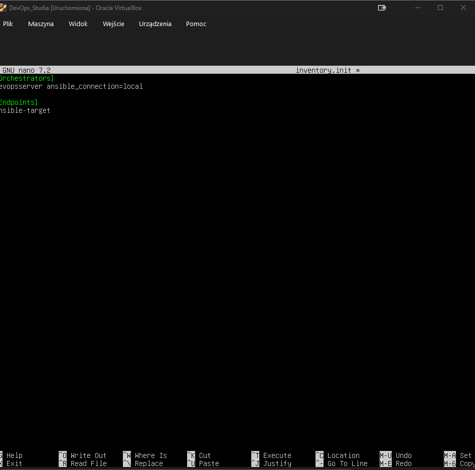
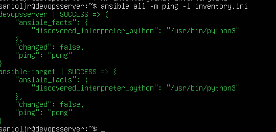
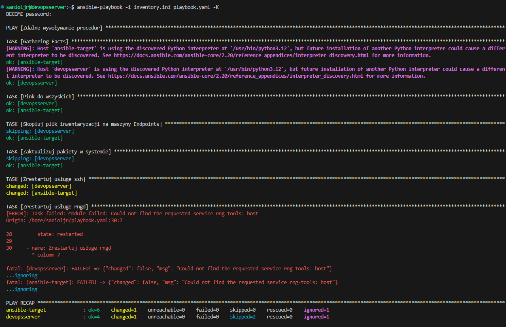
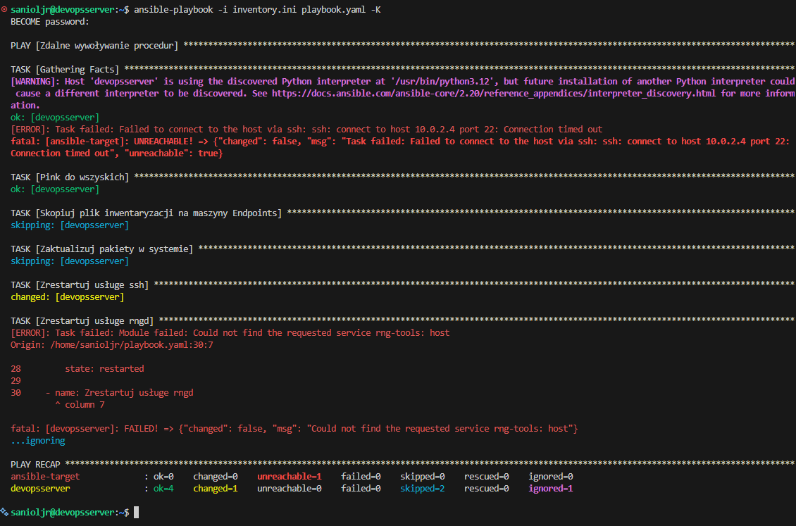

# Mateusz Sadowski - sprawozdanie z laboratoriów 8

## Środowisko wykonania

Maszyna wirtualna Oracle Virtual Box 7.2.6a z obrazem ISO Ubuntu 24.04.4 LTS. Maszyna posiada dostęp do 40 GB dostępnego obszaru na dysku, 2 rdzenie CPU oraz 4 GB pamięci RAM.
Zastosowano przekierowanie portów (port forwarding), gdzie port 2222 na maszynie fizycznej (host) przekierowuje ruch na port 22 maszyny wirtualnej (guest), na którym pracuje serwer SSH.
Ponadto przygotowano drugą maszynę wirtualną, która posiada ten sam obraz systemu operacyjnego. Maszyny zostały połączone poprzez sieć NAT.

## Instalacja zarządcy Ansible

##### Na bazowej maszynie wirtualnej zainstalowano Ansible używając poniższych poleceń:

        sudo apt update
        
        sudo apt install software-properties-common
        
        sudo add-apt-repository --yes --update ppa:ansible/ansible
        
        sudo apt install ansible

Ponadto skonfigurowano kolejną maszynę wirtualną z tym samym systemem co maszyna bazowa, upewniając się, że zainstalowane będzie program tar oraz OpenSSH.

W celu wymiany kluczy SSH oraz umożliwienia połączania pomiędzy maszynami, stworzono sieć NAT (w głownym oknie VirtualBox: plik->narzędzia-sieć->Sieci NAT).

Aby umożliwić połączenie się z maszyną wirtualną przez VS Code, ustawiono również port forwarding.

Następnie na maszynie głownej stworzono plik konfiguracyjny `~/.ssh/config`, aby zdefiniować parametry połączenia dla tego konkretnego hosta, ponieważ klasyczna próba nie zadziałała i wymagała wpisania hasła. Treść pliku:

        Host ansible-target
        HostName 10.0.2.4
        User ansible
        IdentityFile ~/.ssh/id_klucz_projekt2

Ponadto połączono nazwę z adresem IP:

        echo "10.0.2.4 ansible-target" | sudo tee -a /etc/hosts

Oraz przesłano klucz SSH

        ssh-copy-id ansible@ansible-target

Po tych operacjiach po wykonaniu `ssh ansible@ansible-target`, okno terminala przełącza się na maszynę ansible-target. Można z tej maszyny wyjść przy pomocy polecenia `exit`.

## Inwentaryzacja

Przy pomocy polecenia `sudo hostnamectl set-hostname` ustawiono odpowiednie nazwy. W dodatku dopełniono rozwiązywanie nazw DNS (które rozpoczeło się już we wcześniejszym kroku), przy pomocy polecenia:

        echo "10.0.2.3 devopsserver" | sudo tee -a /etc/hosts

##### Aby stworzyć pole inwantaryzacji na głownej maszynie stworzono plik `inventory.ini`.

                [Orchestrators]
- Nagłówek grupy [Orchestrators] - definiuje grupę hostów, którymi będzie zarządzać Ansible
                
                devopsserver ansible_connection=local

- devopsserver - nazwa hosta należącego do grupy Orchestrators
- ansible_connection=local - parametr określający sposób połączenia; "local" oznacza, że Ansible będzie
- wykonywać polecenia lokalnie na tej maszynie, bez korzystania z SSH

                [Endpoints]
- Nagłówek grupy [Endpoints] - definiuje drugą grupę hostów zarządzanych przez Ansible
                
                ansible-target
- ansible-target - nazwa hosta należącego do grupy Endpoints; Ansible będzie łączyć się z tym hostem
- przy użyciu domyślnej metody połączenia (SSH)

Aby zweryfikować łączność wysłano ping do wszystkich maszyn:

                ansible all -m ping -i inventory.ini

## Zdalne wywołanie procedur

Stworzono playbook Ansible, czyli plik `playbook.yaml`, na głownej maszynie z zawartością:

                ---
                - name: Zdalne wywoływanie procedur
                hosts: all
                become: yes
                tasks:
                - name: Pink do wszyskich
                ansible.builtin.ping:

                - name: Skopiuj plik inwentaryzacji na maszyny Endpoints
                ansible.builtin.copy:
                        src: ./inventory.ini
                        dest: /home/ansible/inventory_backup.ini
                        owner: ansible
                        mode: '0644'
                when: "'Endpoints' in group_names"

                - name: Zaktualizuj pakiety w systemie
                ansible.builtin.apt:
                        update_cache: yes
                        upgrade: safe
                        force_apt_get: yes
                when: "'Endpoints' in group_names"
                register: apt_output

                - name: Zrestartuj usługe ssh
                ansible.builtin.service:
                        name: ssh 
                        state: restarted

                - name: Zrestartuj usługe rngd
                ansible.builtin.service:
                        name: rng-tools  
                        state: restarted
                ignore_errors: yes

##### Wyjaśnienie struktury playbooky:

- `---` - początek pliku w formacie YAML
- `- name: Zdalne wywoływanie procedur` - nazwa playbooku (listy zadań do wykonania)
- `hosts: all` - określa, że playbook będzie wykonany na wszystkich hostach z inwentarza (zarówno Orchestrators jak i Endpoints)
- `become: yes` - polecenie wykonuje zadania z uprawnieniami administratora (sudo)
- `tasks:` - sekcja zawierająca listę zadań do wykonania na maszynach docelowych

##### Poszczególne zadania (tasks):

1. **ansible.builtin.ping** - wysyła ping do wszystkich hostów, aby sprawdzić, czy są dostępne
2. **ansible.builtin.copy** - kopiuje plik `inventory.ini` z maszyny lokalnej na maszyny w grupie Endpoints, tworząc kopię zapasową o nazwie `inventory_backup.ini`, natomiast `when: "'Endpoints' in group_names"` sprawdza, czy host należy do grupy Endpoints, jeśli tak, to wykonuje kopiowanie
3. **ansible.builtin.apt** - zarządza pakietami w systemie Ubuntu: `update_cache: yes` aktualizuje listę dostępnych pakietów, `upgrade: safe` aktualizuje pakiety bezpiecznie (unika usunięcia pakietów), `register: apt_output` zapisuje wynik wykonania do zmiennej
4. **ansible.builtin.service** - zarządza usługami systemowymi: restartuje usługę ssh (serwer SSH) i usługę rng-tools (generator liczb losowych); `ignore_errors: yes` powoduje, że playbook nie zatrzyma się, jeśli któryś z restartów się nie powiedzie.

Następnie wykonano playbook:

        ansible-playbook -i inventory.ini playbook.yaml -K

#### Przeprowadzenie operacji względem maszyny z wyłączonym serwerem SSH i odpiętą kartą sieciową

W terminalu maszyny ansible-target wyłączono ssh:

                sudo systemctl stop ssh

Następnie uruchomiono playbook jeszcze raz.

Jak widać na zrzucie ekranu, Ansible poprawnie zdiagnozował brak łączności w scenariuszu, gdzie zasymulowano awarię wyłączając interfejs sieciowy (polecenie `sudo ip link set enp0s3 down` oraz `sudo systemctl stop ssh` w terminalu ansible-target). Wynikiem było zwrócenie statusu UNREACHABLE i przerwanie procedury, co zostało poprawnie odnotowane w sekcji podsumowującej logi operacji.

## Wnioski

Labolatoria pokazały w praktyce, jak świetnie działa bezagentowa architektura Ansible, gdzie cała komunikacja opiera się na zwykłym SSH bez instalowania zbędnego oprogramowania na serwerach docelowych.
Genialnie sprawdziła się zasada idempotentności, dzięki której skrypt sam rozumie, co już zostało zrobione i wdraża tylko niezbędne poprawki, oszczędzając mnóstwo czasu. 
Celowe zignorowanie błędów przy brakującej usłudze rngd udowodniło elastyczność i skuteczność narzęcia.
Z kolei twardy test z odpiętą kartą sieciową pokazał, że Ansible błyskawicznie łapie brak łączności, odpowiadając statusem UNREACHABLE i sprawnie izolując problem. 

## Histora konsoli

                936  sudo apt update
                
                937  sudo apt install software-properties-common
                
                938  echo "nameserver 8.8.8.8" | sudo tee /etc/resolv.conf
                
                939  sudo apt install software-properties-common -y
                
                940  echo "nameserver 8.8.8.8" | sudo tee /etc/resolv.conf
                
                941  sudo rm -rf /var/lib/apt/lists/*
                
                942  sudo apt clean
                
                943  echo "127.0.1.1 sevopsserver" | sudo tee -a /etc/hosts
                
                944  sudo apt update
                
                945  echo "127.0.1.1 devopsserver" | sudo tee -a /etc/hosts
                
                946  sudo apt clean
                
                947  sudo apt update
                
                948  sudo ip link set dev enp0s3 mtu 1400
                
                949  sudo apt update
                
                950  sudo apt install software-properties-common -y
                
                951  sudo add-apt-repository --yes --update ppa:ansible/ansible
                
                952  sudo apt install ansible
                
                953  sudp apt-get update
                
                954  sudo apt-get update
                
                955  sudo apt install ansible
                
                956  ssh-keygen -t ed25519
                
                957  ssh-copy-id@ansible-target
                
                958  ssh-copy-id ansible@10.0.2.15
                
                959  clear
                
                960  ip addr
                
                961  cat ~/.ssh/id_ed25519.pub
                
                962  ansible-playbook -i inventory.ini playbook.yaml -K
                
                963  clear
                
                964  ansible-playbook -i inventory.ini playbook.yaml -K
                
                965  ip addr
                
                966  clear
                
                967  history

                962  ansible-playbook -i inventory.ini playbook.yaml -K
                
                963  clear
                
                964  ansible-playbook -i inventory.ini playbook.yaml -K
                
                965  ip addr
                
                966  clear
                
                967  history