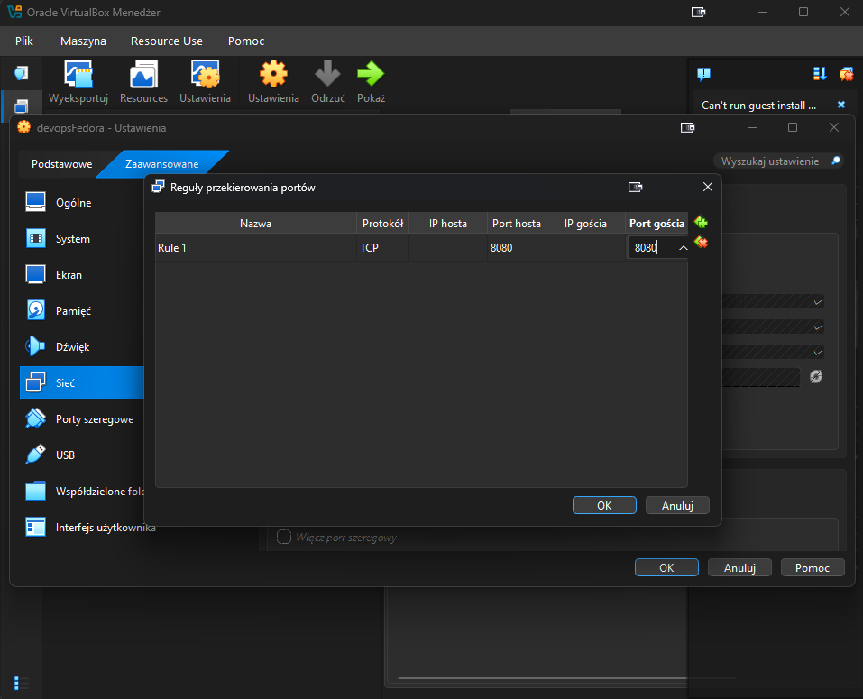
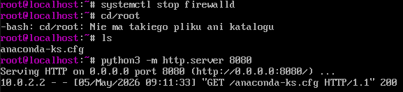
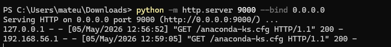
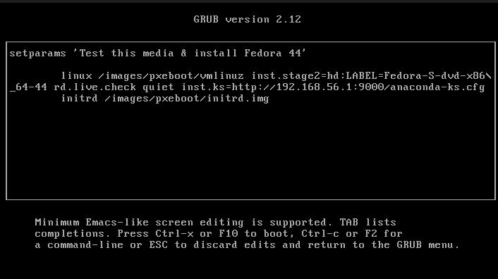
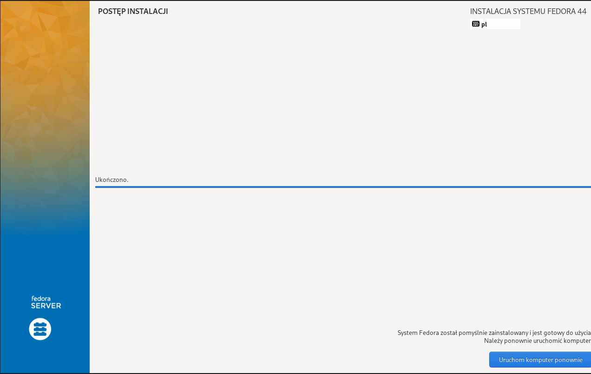
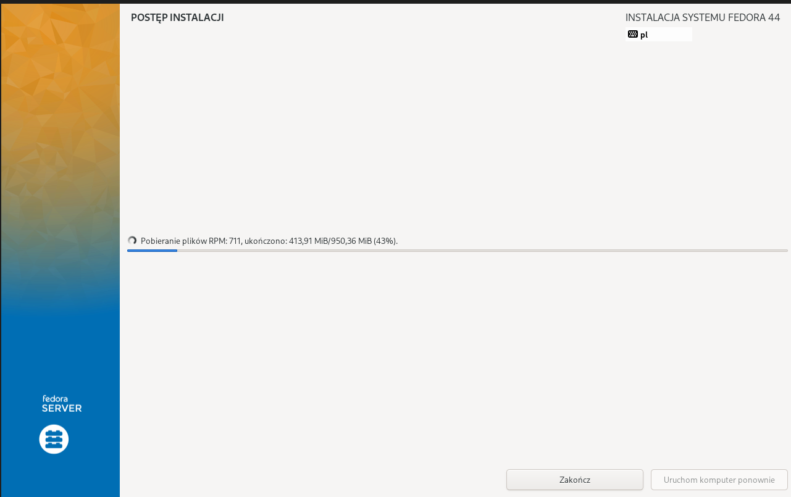
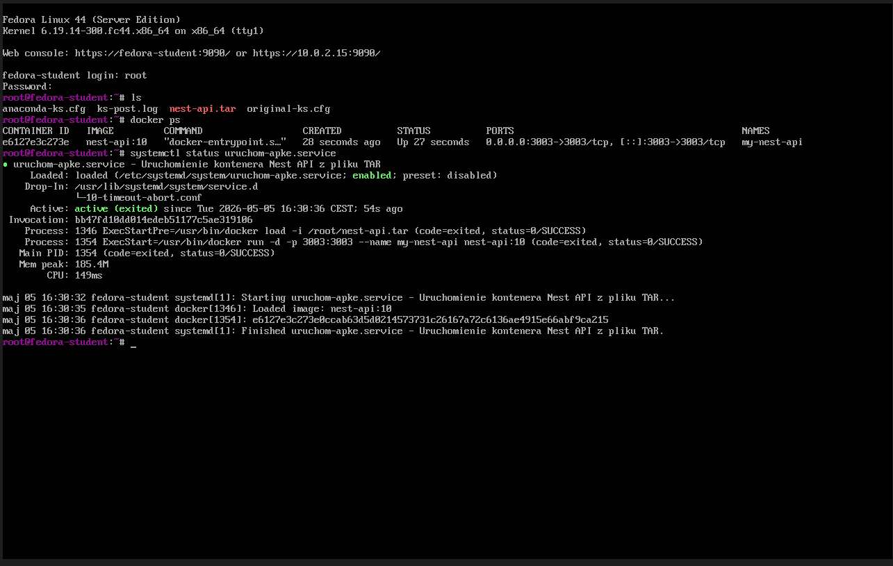

# Mateusz Sadowski - sprawozdanie z laboratoriów 9

## Środowisko wykonania

Maszyna wirtualna Oracle Virtual Box 7.2.6a z obrazem ISO Ubuntu 24.04.4 LTS jako głowna. Maszyna posiada dostęp do 40 GB dostępnego obszaru na dysku, 2 rdzenie CPU oraz 4 GB pamięci RAM.
Zastosowano przekierowanie portów (port forwarding), gdzie port 2222 na maszynie fizycznej (host) przekierowuje ruch na port 22 maszyny wirtualnej (guest), na którym pracuje serwer SSH.
Ponadto przygotowano drugą maszynę wirtualną, która posiada ten sam obraz systemu operacyjnego. Maszyny zostały połączone poprzez sieć NAT.
Poboczne maszyny, które były niezbędne do wykonania laboratorium zostały opisane poniżej, opierały się o obraz Fedory 44: Fedora-Server-netinst-x86_64-44-1.7.

## Instalacja nienadzorowana

### Pobieranie pliku anaconda-ks.cfg
Na początku skonfigurowano nową maszynę wirtualną z obrazem Fedory 44: Fedora-Server-netinst-x86_64-44-1.7. Po przejściu przez konfigurację systemu oraz interfejs instalatora, gdzie istniała możliwość stworzenia konta roota i użytkownika, w celu pobrania pliku z maszyny wirtualnej, dodano port forwarding.

Następnie uruchomiono serwer na maszynie wirtualnej, po czym na komputerze głównym wpisano w przeglądarce adres `127.0.0.1:8080/anaconda-ks.cfg`.

W ten sposób połączono się z serwerem wystawionym na udostępnienie pliku anaconda-ks.cfg i pobrano go na komputer z systemem Windows 11.

### Edycja pliku anaconda-ks.cfg

W pliku `anaconda-ks.cfg` dodano dyrektywy źródeł instalacji sieciowej. Pierwsza to źródło systemu, z którego pobierana jest bazowa Fedora 44. Druga to dodatkowe repozytorium, które umożliwia pobranie aktualizacji systemu.

                #Dyrektywy
                url --mirrorlist=http://mirrors.fedoraproject.org/mirrorlist?repo=fedora-44&arch=x86_64
                repo --name=update --mirrorlist=http://mirrors.fedoraproject.org/mirrorlist?repo=updates-released-f44&arch=x86_64

Ponadto dodano konfigurację sieci i własną nazwę hosta (hostname)

                #Konfiguracja sieci i hostname
                network --bootproto=dhcp --hostname=fedora-student
Oprócz tego ustawiono
                
                clearpart --all --initlabel 
                
w celu formatowania dysku, aby nie zabrakło miejsca przy uruchomieniu skryptu instalacji systemu oraz

                firstboot --disable

by wyłączyć kryteria pierwszej instalacji, czyli zautomatyzować proces i wyłączyć wymuszenie czekania na ręczną konfigurację w UI.

### Plik anaconda-ks.cfg

                # Generated by Anaconda 44.30
                # Keyboard layouts
                keyboard --vckeymap=pl --xlayouts='pl'
                # System language
                lang pl_PL.UTF-8

                # Repozytoria
                url --mirrorlist=http://mirrors.fedoraproject.org/mirrorlist?repo=fedora-44&arch=x86_64
                repo --name=update --mirrorlist=http://mirrors.fedoraproject.org/mirrorlist?repo=updates-released-f44&arch=x86_64

                        #Konfiguracja sieci i hostname
                        network --bootproto=dhcp --hostname=fedora-student

                        %packages
                        @^server-product-environment

                        %end

                        # System authorization information
                        authselect enable-feature with-fingerprint

                        # Run the Setup Agent on first boot
                        firstboot --disable

                        # Generated using Blivet version 3.13.2
                        ignoredisk --only-use=sda
                        autopart
                        # Partition clearing information
                        clearpart --all --initlabel

                        # System timezone
                        timezone Europe/Warsaw --utc

                        # Root password
                        rootpw --iscrypted --allow-ssh $y$j9T$a8Xo5PPXTlX2fveQmJ2JS/xA$h7zG3jDBijQY8GbuBmSqWgGd5X/RI54RWBhFpZ9Gl30

### Udostępnienie pliku i instalacja

Aby udostępnić zmieniony plik z komputera, uruchomiono serwer na Windowsie w folderze, gdzie znajdował się plik.
W dodatku ustawiono port forwarding z adresu IP hosta 127.0.0.1 i portu hosta 8000 na port gościa 8000 oraz wyłączono zaporę Windows.

Następnie w oknie maszyny wirtualnej zatwierdzono zmiany i uruchomiono konfigurację klawiszem **CTRL + X**.

Konfiguracja przeszła m.in. przez interfejs konfiguracyjny Fedory.

## Rozszerzenia anaconda-ks.cfg o uruchomienie programu z pipeline

### Rozszerzona wersja pliku:

                # Generated by Anaconda 44.30
                # Keyboard layouts
                keyboard --vckeymap=pl --xlayouts='pl'
                # System language
                lang pl_PL.UTF-8

                # Repozytoria
                url --mirrorlist=http://mirrors.fedoraproject.org/mirrorlist?repo=fedora-44&arch=x86_64
                repo --name=update --mirrorlist=http://mirrors.fedoraproject.org/mirrorlist?repo=updates-released-f44&arch=x86_64

                #Konfiguracja sieci i hostname
                network --bootproto=dhcp --hostname=fedora-student

                # Automatyczny restart po instalacji
                reboot

                %packages
                @^server-product-environment
                docker
                wget
                %end

                # System authorization information
                authselect enable-feature with-fingerprint

                # Run the Setup Agent on first boot
                firstboot --disable

                # Generated using Blivet version 3.13.2
                ignoredisk --only-use=sda
                # Partition clearing information
                zerombr
                clearpart --all --initlabel
                autopart

                # System timezone
                timezone Europe/Warsaw --utc

                # Root password
                rootpw --iscrypted --allow-ssh $y$j9T$a8Xo5PPXTlX2fveQmJ2JS/xA$h7zG3jDBijQY8GbuBmSqWgGd5X/RI54RWBhFpZ9Gl30

                %post --log=/root/ks-post.log
                # pobieranie obrazu dockera w .tar z serwera windows (uzytego w trakcie labow)
                wget http://192.168.56.1:9000/nest-api-v10.tar -O /root/nest-api.tar

                # wlaczenie dockera
                systemctl enable docker

                # tworzenie uslugi autostartu
                cat << 'EOF' > /etc/systemd/system/uruchom-apke.service
                [Unit]
                Description=Uruchomienie kontenera Nest API z pliku TAR
                After=docker.service
                Requires=docker.service

                [Service]
                Type=oneshot
                ExecStartPre=/usr/bin/docker load -i /root/nest-api.tar
                ExecStart=/usr/bin/docker run -d -p 3003:3003 --name my-nest-api nest-api:10
                RemainAfterExit=yes

                [Install]
                WantedBy=multi-user.target
                EOF

                # wlaczenie stworzonego autostartu
                systemctl enable uruchom-apke.service
                %end

### Opis rozszerzenia

Skrypt ten zapewnia automatyczny restart po instalacji poprzez polecenie `reboot` oraz pobieranie wszystkich istotnych zależności w sekcji `%packages`, potrzebnych do działania programu (m.in. Docker, wget).
Artefaktem końcowym pipeline'u z poprzednich zajęć był obraz Dockera zapisany w formacie .tar.
Dyrektywa `%post` rozpoczyna sekcję skryptu poinstalacyjnego.
Logi z tego skryptu wypisywane są do pliku `ks-post.log`, zapewniło to polecenie `--log=/root/ks-post.log`.
Artefakt jest pobierany poprzez wget z serwera, który przesyła plik `anaconda-ks.cfg` do maszyny wirtualnej. Serwer był już wcześniej wspominany na laboratoriach; artefakt znajduje się w tym samym miejscu co plik anaconda (w tym przypadku folder *Downloads*).
Następnie skrypt włącza dockera oraz tworzy usługę autostartu.
Usługa ta tworzy plik `uruchom-apke.service`, która przejmuje zadania w ramach automatyzacji:
- **[Service]**: definiuje konkretne działania usługi, ładuje i uruchamia kontener, a następnie kończy swoje zadanie (realizowane poprzez typ `oneshot`), pozostaje jednak w stanie aktywnym, aby potwierdzić sukces
- **ExecStartPre=/usr/bin/docker load -i /root/nest-api.tar**: importuje obraz Dockera z pliku .tar do lokalnego rejestru maszyny tuż przed uruchomieniem aplikacji.
- **ExecStart=/usr/bin/docker run -d -p 3003:3003 --name my-nest-api nest-api:10**: tworzy i uruchamia kontener w trybie odizolowanym, mapując porty tak, aby aplikacja była dostępna pod adresem IP maszyny na porcie 3003.
- **[Install]**: sekcja, która podpina usługę pod odpowiedni etap startu systemu.
- **[WantedBy=multi-user.target]**: zapewnia gwarancję, że usługa zostanie wywołana od razu po pierwszym uruchomieniu systemu.
Dyrektywa `%end` kończy to co zaczęła dyrektywa `%post`.

### Efekty 

W trakcie instalacji interfejs konfiguracji został pominięty, ponieważ konfiguracja odbywała się automatycznie.

Następnie dokonano restartu, jednak ze względu na ustawienia w VirtualBoxie aplikacja nie uruchomiła się automatycznie – maszyna wirtualna wybootowała się z wirtualnego napędu CD/DVD (z pliku ISO instalatora) zamiast z dysku twardego. Dlatego maszyna została zrestartowana z pozycją dysku twardego wyżej niż napędu optycznego w kolejności boot'owania.

Po restarcie maszyna wirtualna wybootowała się z dysku twardego i automatycznie, w tle, uruchomiła zaplanowaną usługę uruchom-apke.service. 
W celu weryfikacji działania całego zautomatyzowanego procesu wdrożenia, po zalogowaniu na konto root wykonano serię poleceń diagnostycznych:

- `ls`: weryfikacja plików wykazała obecność pobranego artefaktu nest-api.tar oraz pliku z logami ks-post.log, co jednoznacznie potwierdza bezbłędne wykonanie instrukcji pobierania z sekcji %post instalatora Kickstart.
- `docker ps`: polecenie udowodniło, że kontener o nazwie my-nest-api został prawidłowo zainicjowany, działa stabilnie i z powodzeniem mapuje ruch sieciowy na porcie 3003.
- `systemctl status uruchom-apke.service`: szczegółowe logi usługi systemd potwierdziły jej sukces. Usługa osiągnęła oczekiwany stan active (exited - stan prawidłowy dla zadeklarowanego wcześniej typu oneshot), a oba procesy kluczowe (ładowanie obrazu z pliku TAR oraz uruchomienie kontenera z odpowiednimi flagami) zakończyły się kodem status=0/SUCCESS.

Powyższe wyniki potwierdzają, że założenia architektoniczne laboratorium zostały w pełni zrealizowane, a aplikacja jest gotowa do obsługi ruchu sieciowego zaraz po pierwszym uruchomieniu systemu.

## Wnioski

Automatyzacja instalacji systemu operacyjnego z wykorzystaniem pliku Kickstart (anaconda-ks.cfg) pozwoliła na ujednolicenie procesu instalacji, eliminując potencjalne błędy i niespójności wynikające z ręcznej konfiguracji, co znacząco oszczędziło czas.
Zintegrowanie Dockera oraz skryptów poinstalacyjnych w jednolitym przepływie instalacji umożliwiło szybkie i powtarzalne wdrażanie aplikacji w środowisku produkcyjnym.
Usługi systemd z typem oneshot oraz parametrem RemainAfterExit=yes okazały się efektywnym rozwiązaniem do zarządzania procesami jednorazowymi, które wymagają automatycznego uruchomienia podczas startu systemu.
Mechanizm port forwardingu w VirtualBoxie, w połączeniu z lokalnym serwerem HTTP do udostępniania pliku konfiguracyjnego, stanowi praktyczne podejście do dystrybucji artefaktów instalacyjnych w środowisku testowym.
Przeprowadzone laboratorium demonstruje, że prawidłowo skonfigurowana automatyzacja dostarcza stabilny, powtarzalny i zweryfikowalny proces wdrażania, co jest kluczowe dla utrzymania spójności i niezawodności infrastruktury IT.
