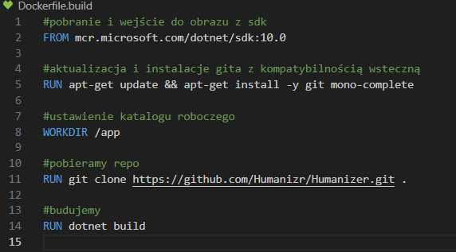
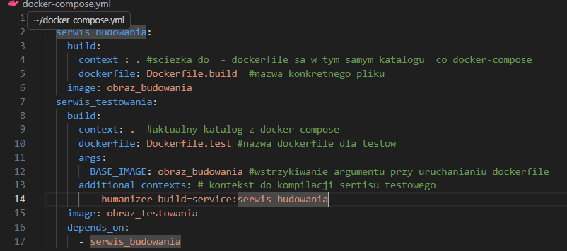

# Mateusz Sadowski - Sprawozdanie zbiorcze z laboratoriów 1-4

## Połączenia i port forwarding

Maszyna wirtualna w trakcie wykonywanych laboratoriów pracowała w dwóch trybach:

1. NAT
2. Sieć mostkowana (bridged)

**NAT** - mechanizm ten zamienia adresy prywatne na adres hosta/routera, co umożliwia łączenie z siecią bez publicznego IP. Nowe połączenia przychodzące należy jawnie przekierować za pomocą port forwardingu (przekierowanie ruchu z określonego portu jednego urządzenia na port innego urządzenia w sieci), natomiast połączenia wychodzące są zapamiętywane. Przy port forwardingu często stosuje się przekierowanie portu 2222 hosta na port 22 gościa, ponieważ port 22 na hoście bywa zajęty przez lokalny serwer SSH.

**Sieć mostkowana** - w tym trybie urządzenie otrzymuje własny adres IP i komunikuje się bezpośrednio z innymi uczestnikami sieci. Dzięki temu jest widoczne jako niezależny host w tej samej sieci lokalnej, dlatego port forwarding nie jest potrzebny. To rozwiązanie nie jest z definicji mniej bezpieczne, ale zwiększa ekspozycję urządzenia na ruch sieciowy, więc wymaga poprawnej konfiguracji zabezpieczeń (np. zapory sieciowej).

## SSH

SSH to protokół do zdalnego, szyfrowanego łączenia się z innymi urządzeniami i wykonywania na nich poleceń. Zapewnia bezpieczny dostęp administracyjny, przesył plików oraz tunelowanie ruchu, ponieważ szyfruje transmisję, zapewnia integralność danych i uwierzytelnia serwer oraz użytkownika.

**Do połączenia jest wymagany:**
- działający serwer SSH na maszynie docelowej
- zapewnienie osiągalności adresu IP lub nazwy serwera docelowego
- konto użytkownika na maszynie docelowej
- metoda logowania (hasło lub klucz SSH)
- otwarty port SSH w zaporze i po drodze w sieci (realizowane m.in. przez port forwarding)

**Połączenie realizuje się komendą**

        ssh <nazwa użytkownika na którego chcemy się zalogować>@<adres serwera z którym chcemy się podłączyć>
    
W przypadku gdy serwer SSH nie nasłuchuje na porcie 22, należy użyć flagi `-p` i podać port widoczny z perspektywy klienta (np. przy przekierowaniu portów):

        ssh -p 2222 <nazwa_użytkownika>@<adres_serwera>

**Klucz SSH** tworzy się, gdy wymagana jest bezpieczniejsza i wygodniejsza niż hasło metoda logowania. Klucz generuje się poleceniem:

            ssh-keygen -t <typ klucza> -C "<komentarz>"

W laboratoriach klucz SSH był wykorzystany do połączenia z kontem GitHub. Klucz prywatny mógł być dodatkowo chroniony hasłem (passphrase). Umożliwiło to m.in. pobieranie repozytorium składnią SSH.

Przykład klonowania repozytorium przez SSH:

        git clone git@github.com:<nazwa_użytkownika>/<nazwa_repozytorium>.git

## Git i GitHub

`Git` to rozproszony system kontroli wersji, który pozwala śledzić zmiany w kodzie, wracać do wcześniejszych wersji i wygodnie pracować zespołowo. 
`GitHub` to platforma oparta na Gicie (można ją traktować jako „nakładkę” webową i organizacyjną), która ułatwia przechowywanie repozytoriów, współpracę, przegląd zmian i automatyzację procesów.

### PAT (Personal Access Token)

`PAT` (Personal Access Token) to osobisty token dostępu, który zastępuje hasło podczas uwierzytelniania do usług GitHub przez HTTPS oraz API. Jest to bezpieczniejsza metoda niż podawanie hasła, ponieważ może być ograniczona zakresem uprawnień (np. tylko odczyt repozytoriów) i w dowolnym momencie unieważniona. Jest przydatna do automatyzacji, gdzie system musi uwierzytelnić się do GitHuba bez interaktywnego logowania.

### Podstawowe polecenia Git

- git branch     bez argumentów wyświetla listę gałęzi, a z nazwą podaną jako argument tworzy nową gałąź.
- git switch     przełącza aktualną gałąź roboczą.
- git checkout   z nazwą gałęzi (np. `git checkout main`) przełącza gałąź, a z nazwą pliku 
                 (np. `git checkout --  README.md`) przywraca plik do stanu z ostatniego commita.
- git fetch      pobiera najnowsze zmiany z repozytorium zdalnego bez łączenia ich z bieżącą gałęzią.
- git push       wysyła lokalne commity do repozytorium zdalnego.
- git pull       pobiera i od razu scala zmiany z repozytorium zdalnego z bieżącą gałęzią.
- git commit     zapisuje aktualny zestaw zmian w historii lokalnego repozytorium.
- git merge      scala historię jednej gałęzi z drugą (np. feature do main).

### Kolejność scalania zmian (merge)

1. Przełącz się na gałąź docelową, np. main.         `git switch`
2. Zaktualizuj ją z repozytorium zdalnego            `git pull`
3. Wykonaj scalanie gałęzi roboczej do docelowej     `git merge nazwa-galezi`
4. Rozwiąż konflikty i zcommituj zmiany              `git commit`
5. Wyślij wynik scalania                             `git push`

### Git hooki

Są to skrypty uruchamiane automatycznie przez Git przy wybranych akcjach (np. commit, merge, push). Pozwalają zautomatyzować kontrolę jakości kodu i ograniczyć błędy, zanim zmiany trafią do repozytorium zdalnego.

Najczęściej używane hooki:
- pre-commit        uruchamia się tuż przed commitem, np. uruchamia lint i testy
- commit-msg        sprawdza poprawność treści komunikatu commita
- pre-push          uruchamia się przed wysłaniem zmian, np. blokuje push, jeśli nie przejdą testy
- post-merge        uruchamia się po scaleniu, np. doinstalowuje zależności

W trakcie laboratoriów został utworzony hook `prepare-commit-msg`, który uruchamia się podczas tworzenia wiadomości commita przy pomocy skryptu w bashu. Hook ten nadpisywał treść commita, dodając metadane o studencie, który go tworzył.

Git hooki to pliki skryptowe. Nie muszą być napisane wyłącznie w bashu, mogą być przygotowane w różnych językach skryptowych.

Hooki muszą mieć dokładnie określone nazwy, rozpoznawane przez Git (np. pre-commit, commit-msg, prepare-commit-msg, pre-push). Jeśli nazwa będzie inna, Git nie uruchomi takiego skryptu automatycznie.

Domyślnie hooki znajdują się w katalogu `.git/hooks` w lokalnym repozytorium. Aby były wykonywane, plik hooka musi mieć odpowiednią nazwę i uprawnienia do uruchamiania.

## Docker - polecenia, koncept

Docker to platforma do uruchamiania aplikacji w kontenerach, czyli lekkich, izolowanych środowiskach. Dzięki temu aplikacja działa przewidywalnie niezależnie od systemu hosta.

### Obraz a kontener - różnice

Obraz (image) to nieruchomy szablon aplikacji, a kontener to uruchomiona instancja tego szablonu.
Z jednego obrazu można utworzyć wiele kontenerów.

- Obraz zawiera warstwy tylko do odczytu: system bazowy, zależności, pliki aplikacji, konfigurację i metadane uruchomieniowe.
- Kontener zawiera to, co jest potrzebne do działania procesu: warstwy obrazu + własną warstwę zapisu (zmiany w czasie działania), stan procesu, sieć i ewentualne woluminy.

### Operacje na kontenerach

Polecenie `docker run` tworzy i uruchamia kontener na podstawie obrazu. Kontener nie musi mieć nazwy nadanej ręcznie, ale jeśli podajemy ją w argumencie, to musi być unikalna.

        docker run [opcje] <obraz>

Opcje:
- -it           łączy tryby: `-i` (interactive) i `-t` (terminal), co pozwala pracować w kontenerze interaktywnie
- -d            uruchamia kontener w tle (detached)
- --name        nadaje nazwę kontenerowi
- -p            mapuje porty hosta i kontenera
- -v            montuje katalog/plik hosta do kontenera (woluminy)
- --mount       nowoczesna forma montowania woluminów, bardziej jawna
- --network     podłącza kontener do wskazanej sieci

Uruchomione kontenery można sprawdzić komendą:

        docker ps

Aby sprawdzić także zatrzymane kontenery, należy dodać flagę `-a`.

Ponowne uruchomienie istniejącego, zatrzymanego kontenera realizuje się komendą:

        docker start <nazwa_lub_id_kontenera>

W odróżnieniu od `docker run`, polecenie `docker start` nie tworzy nowego kontenera, tylko uruchamia wcześniej utworzony.

Wykorzystanie miejsca przez obrazy, kontenery, woluminy i cache można sprawdzić poleceniem:

        docker system df

Aby wyczyścić nieużywane zasoby, przydatne są poniższe komendy:
- usuwa nieużywane obrazy (dangling), a z `-a` także nieużywane obrazy bez kontenerów:

        docker image prune

- usuwa wskazany obraz po nazwie lub ID:

        docker rmi <image>

## Docker network

Docker network odpowiada za komunikację między kontenerami i z hostem. Domyślnie używa się sieci mostkowanej (bridge). Tworzenie sieci:

        docker network create <nazwa_sieci>

## Dockerfile

Dockerfile to plik tekstowy z instrukcjami, opisującymi, jak zbudować obraz Dockera krok po kroku. Umożliwia on automatyzację np. uruchamiania projektu.

### Dockerfile - struktura

Dockerfile to plik z instrukcjami budowania obrazu. Domyślna nazwa pliku to `Dockerfile`. Można jednak używać wielu plików, np. `Dockerfile.dev` lub `Dockerfile.prod`, i wskazać właściwy plik flagą `-f` w komendzie `docker build`. Najczęściej zawiera:
- `FROM`                        obraz bazowy
- `WORKDIR`                     katalog roboczy
- `COPY`/`ADD`                  kopiowanie plików do obrazu
- `RUN`                         wykonanie komend w konsoli podczas budowania
- `EXPOSE`                      informacja o porcie aplikacji
- `ENV`                         zmienne środowiskowe
- `CMD` lub `ENTRYPOINT`        domyślne uruchomienie kontenera
- `ARG`                         deklaruje argument budowania, opcjonalnie z wartością domyślną

Przykładowy plik:

### Uruchamianie Dockerfile

**Tworzenie obrazu na podstawie `Dockerfile` jest realizowane poprzez komendę**

        docker build [opcje] <kontekst budowania>

**Przykładowe opcje:**
- `--build-arg`     przekazuje argument budowania do instrukcji `ARG` w Dockerfile
- `-t`              nadaje nazwę i tag obrazowi (np. `moja-apka:1.0`)
- `-f`              wskazuje konkretny plik Dockerfile (np. `Dockerfile.dev`)
- `--no-cache`      buduje obraz bez użycia cache warstw

**Kontekstem budowania** jest katalog, z którego Docker ma wziąć pliki do budowy, w tym przypadku `.` oznacza bieżący katalog.

**Obraz bazowy może być dowolnym obrazem**, również własnym obrazem zbudowanym wcześniej. Nowy obraz dziedziczy warstwy obrazu bazowego, a kolejne instrukcje Dockerfile tworzą następne warstwy. Pozwala to przyspieszyć budowanie i ujednolicić środowisko. Przykładowo obraz testowy można zbudować na podstawie obrazu build, dzięki czemu nie trzeba ponownie definiować tych samych kroków.

## Docker compose

Jest to narzędzie do definiowania i uruchamiania aplikacji wielonkontenerowych, łączy ono często działanie kilku 'Dockerfile' (np. dla bazy danych, frontendu i backendu w web app). Dlatego zamiast odpalać każdy kontener ręcznie można uruchomić całość za pomocą pliku konfiguracyjnego. Plikiem konfiguracyjnym jest 'docker-compose.yml' lub 'compose.yml'. Konceptem jest traktowanie aplikacji jako zestaw współpracujących usług, a nie jako pojedynczy kontener.

Są dwie wersje polecenia, których działanie i składnia są w większości zgodne:
1. docker-compose (z myślnikiem) - starsze, osobne narzędzie/binarka (Compose v1).
2. docker compose (bez myślnika) - nowsza wersja jako plugin do głównego CLI Dockera (Compose v2), obecnie zalecana.

### Docker Compose - struktura

Docker Compose opisuje aplikację wielokontenerową w pliku `docker-compose.yml` (lub `compose.yml`). Typowa struktura:
- `services`    definicje kontenerów (np. backend, baza)
- `volumes` woluminy trwałych danych
- `networks`    sieci między usługami
- `build`   konfiguracja budowania obrazu dla usługi
- `args`    argumenty budowania przekazywane do `ARG` w Dockerfile (najczęściej w budowaniu poprzez `--build-arg`)
- `image`   nazwa obrazu używanego przez usługę, nadaje też nazwę obrazowi
- `depends_on`  określa zależności między usługami i kolejność uruchamiania (np. najpierw budowanie, potem testy)
- `context` ścieżka kontekstu budowania (katalog z plikami dla `docker build`)
- `dockerfile`  nazwa/ścieżka pliku Dockerfile używanego przy budowaniu

Kod w pliku Compose (YAML) jest wrażliwy na wcięcia, podobnie jak Python. Wcięcia muszą być konsekwentne i poprawne w całym pliku.

Przykładowy plik:

### Uruchamianie docker-compose.yml

W wersji starszej:

        docker-compose up

W wersji nowszej:

        docker compose up

Jak widać, zależnie od wersji używa się myślnika i spacji, należy więc na to zwracać uwagę, aby nie próbować operować na `docker-compose.yml` wersją, w której nie jest napisany (może np. nie rozpoznać konkretnych poleceń)

Aby zatrzymać i usunąć kontenery, sieci oraz zasoby utworzone przez `up`, korzysta się z:

        docker compose down

Jeśli doda się do tej komendy flagę `-v`, usunięte zostaną także woluminy utworzone przez Compose.

### Docker Compose - woluminy

Woluminy (volumes) i montowania (mount) w Compose służą do przechowywania oraz wymiany danych poza cyklem życia kontenera. Dzięki temu dane (np. baza danych) nie znikają po usunięciu kontenera.

#### Zapisy danych można traktować jako:
1. wejście - kontener odczytuje pliki z podłączonej ścieżki,
2. wyjście - kontener zapisuje pliki do tej ścieżki, a zmiany są widoczne na hoście lub w woluminie.

Domyślnie montowanie działa w trybie odczyt-zapis, ale można wymusić tylko odczyt (`:ro` lub `readonly`). Jest to wykorzystywane w sytuacjach, gdy np. nie chcemy, aby zapis edytował (lub usunął) ważne pliki OS.

#### **W praktyce występują dwa główne typy montowania:**

1. **Bind mount**
- mapuje konkretną ścieżkę z hosta do kontenera,
- najczęściej używany w developmentcie (praca na lokalnym kodzie),
- zmiany w plikach hosta są od razu widoczne w kontenerze i odwrotnie.

#### Można go wykorzystać na dwa sposoby:

**Schemat wykorzystania bind mount `-v`:**

        docker run -v <ścieżka_hosta>:<ścieżka_w_kontenerze> <obraz>

Przykład .NET (bind mount `-v`, development - kod z hosta widoczny od razu w kontenerze):

        docker run --rm -it -p 8080:8080 -v ${PWD}:/src -w /src mcr.microsoft.com/dotnet/sdk:8.0 dotnet watch run

**Schemat wykorzystania bind mount `--mount`:**

        docker run --mount type=bind,source=<ścieżka_hosta>,target=<ścieżka_w_kontenerze> <obraz>
        
Przykład .NET (bind mount `--mount`, to samo co wyżej, ale składnia jawna):

        docker run --rm -it -p 8080:8080 --mount type=bind,source=${PWD},target=/src -w /src mcr.microsoft.com/dotnet/sdk:8.0 dotnet watch run

2. **Volume (zarządzany przez Docker)**
- dane są przechowywane przez Dockera (nie podajesz bezpośrednio ścieżki hosta),
- najlepszy do trwałych danych aplikacji, np. baz danych,
- łatwiejszy do przenoszenia między środowiskami niż bind mount.

Podobnie jak bind mount, volume można podłączyć dwiema składniami:
**Schemat wykorzystania volume `-v`:**

        docker run -v <nazwa_volume>:<sciezka_w_kontenerze> <obraz>
        
Przykład .NET (volume `-v`, produkcyjnie - trwale klucze Data Protection):

        docker run -d --name dotnet-api -p 8080:8080 -v dpkeys:/home/app/.aspnet/DataProtection-Keys my-dotnet-api:1.0

**Schemat wykorzystania volume `--mount`:**

        docker run --mount type=volume,source=<nazwa_volume>,target=<sciezka_w_kontenerze> <obraz>
        
Przykład .NET (volume `--mount`, składnia jawna):

        docker run -d --name dotnet-api -p 8080:8080 --mount type=volume,source=dpkeys,target=/home/app/.aspnet/DataProtection-Keys my-dotnet-api:1.0

#### Kiedy co wybrać:
- Bind mount (wiązanie z hostem)        konkretny folder na komputerze hosta, najlepszy w developmentcie, przy edycji kodu lokalnie i zamiarze natychmiastowej widoczności zmian w kontenerze.
- Volume (zarządzany przez Docker)      Docker sam przechowuje dane w swoim katalogu (np. `/var/lib/docker/volumes`), nadaje im nazwę i zarządza ich cyklem życia. Używamy go do trwałych danych aplikacji (np. baza danych, klucze), szczególnie w środowiskach testowych i produkcyjnych, bo nie wymaga wskazywania ręcznej ścieżki hosta i jest łatwiejszy do przenoszenia między maszynami.

#### Doprecyzowanie flagi `-v`:
- `docker run -v ...`   oznacza podłączenie woluminu/mounta do kontenera,
- `docker compose down -v`      oznacza usunięcie woluminów utworzonych przez Compose.

#### Doprecyzowanie flagi `--mount`:
- najczęstsze typy:     `type=bind`, `type=volume`, `type=tmpfs`,
- najczęstsze opcje:    `source`/`src` (źródło), `target`/`dst` (ścieżka w kontenerze), `readonly` (tylko odczyt)

## iperf3

`iperf3` to narzędzie do aktywnego pomiaru maksymalnej osiągalnej przepustowości w sieciach IP. Umożliwia strojenie parametrów testu, m.in. czasu trwania, buforów oraz używanego protokołu (`TCP`, `UDP`, `SCTP`) dla `IPv4` i `IPv6`.

Wyniki testu zawierają m.in. przepustowość, straty pakietów (szczególnie istotne przy `UDP`) oraz dodatkowe parametry połączenia.

#### **Aby uruchomić nasłuchujący serwer `iperf3`, należy użyć polecenia:**

        iperf3 -s

**Przydatne parametry po stronie serwera:**
- `-p <port>` - port nasłuchiwania serwera (domyślnie `5201`).

#### **Aby połączyć klienta z serwerem, należy użyć:**

        iperf3 -c <adres_IP_serwera>

**Przydatne parametry po stronie klienta:**
- `-p <port>` - port, na który klient łączy się z serwerem.
- `-t <sekundy>` - czas trwania testu (np. `-t 20`).
- `-u` - test w trybie UDP (domyślnie test jest TCP).
- `-b <wartość>` - docelowa przepustowość w UDP (np. `-b 100M`).
- `-R` - test w kierunku odwrotnym (serwer wysyła dane do klienta).
- `-P <liczba>` - liczba równoległych strumieni (np. `-P 4`).
- `-i <sekundy>` - interwał raportowania wyników cząstkowych.

**Uwaga: parametr `-p` powinien być zgodny po obu stronach (serwer i klient muszą używać tego samego portu).**

Przykładowe użycie ze strony serwera:

Przykładowe użycie ze strony klienta:

## SSHD

`SSHD` (SSH Daemon) to usługa serwerowa nasłuchująca połączeń SSH. To właśnie ten proces po stronie systemu docelowego umożliwia zdalne logowanie, wykonywanie poleceń i bezpieczny transfer danych.

W praktyce najczęściej używa się implementacji OpenSSH:
- serwer: `openssh-server` (usługa `sshd`),
- klient: `openssh-client` (polecenie `ssh`).

### Podstawowe uruchomienie OpenSSH (Linux):

1. instalacja pakietu serwera:

        sudo apt install openssh-server

2. uruchomienie i włączenie usługi:

        sudo systemctl enable --now ssh

3. sprawdzenie statusu:

        sudo systemctl status ssh

Połączenie z hostem, na którym działa `sshd`:

        ssh <użytkownik>@<adres_ip>

Jeżeli usługa działa na innym porcie niż `22`, należy podać port:

        ssh -p <port> <użytkownik>@<adres_ip>

### Po co używa się SSHD:
- zdalna administracja systemem,
- wykonywanie poleceń i automatyzacja zadań,
- bezpieczna komunikacja (szyfrowanie i uwierzytelnianie),
- transfer plików (`scp`, `sftp`) i tunelowanie ruchu.

### Komunikacja z kontenerem przez SSH - zalety i wady:

**Zalety:**
- znany i wygodny sposób pracy administracyjnej,
- możliwość użycia kluczy SSH, polityk dostępu i narzędzi audytowych,
- wygodne dla scenariuszy, gdzie kontener ma działać jak "mini-host" administracyjny.

**Wady:**
- dodatkowa usługa w kontenerze zwiększa powierzchnię ataku,
- większa złożoność obrazu i konfiguracji (trzeba utrzymywać `sshd`, użytkowników i klucze),
- odejście od modelu kontenerowego "jeden proces na kontener".

### Przypadki użycia komunikacji z kontenerem z wykorzystaniem SSH:
- SSH do kontenera ma sens głównie w środowiskach szkoleniowych, laboratoryjnych lub przy starszych rozwiązaniach, ponieważ pozwala odtworzyć klasyczny model administracji serwerem i pracę znaną z maszyn wirtualnych.
- W typowej pracy z Dockerem lepiej nie uruchamiać SSH wewnątrz kontenera, ponieważ każda dodatkowa usługa zwiększa złożoność konfiguracji i powierzchnię ataku.
- Do wejścia do działającego kontenera używa się polecenia `docker exec -it <kontener> sh` (lub `bash`), ponieważ działa ono bezpośrednio przez mechanizmy Dockera i nie wymaga wystawiania portu SSH.
- To podejście jest prostsze i bezpieczniejsze, ponieważ nie trzeba instalować i utrzymywać `sshd`, kont użytkowników oraz kluczy wewnątrz kontenera.

## Jenkins

Jenkins to serwer automatyzacji CI/CD (Continuous Integration i Continuous Delivery/Deployment). Służy do uruchamiania pipeline'ów, czyli kroków takich jak: pobranie kodu, budowanie aplikacji, testy, analiza jakości, budowanie obrazu Docker i wdrożenie.

Najczęściej Jenkins działa jako kontener, a zadania wykonują agenci. Dzięki temu łatwiej odtworzyć środowisko i utrzymać ten sam proces na różnych maszynach.

### Dlaczego Jenkins łączy się z Dockerem
Pipeline często musi budować i uruchamiać kontenery. Sam kontener Jenkins nie ma domyślnie dostępu do demona Dockera, dlatego trzeba ten dostęp dostarczyć.

### Realizacja dostępu do Dockera
**1. Docker-outside-of-Docker**
- do kontenera Jenkins montuje się socket hosta (`/var/run/docker.sock`),
- Jenkins wywołuje CLI Docker, ale realnie korzysta z demona hosta,
- rozwiązanie proste i szybkie, ale daje Jenkinsowi szerokie uprawnienia na hoście.

**2. Docker-in-Docker (DinD)**
- uruchamia się osobny kontener z demonem Dockera,
- Jenkins łączy się z tym demonem i tam buduje obrazy,
- kontener DinD pełni rolę „kontrolera wykonawczego” dla operacji Docker (izoluje buildy od hosta),
- zwykle wymaga trybu uprzywilejowanego, więc jest bardziej złożone i wymaga większej ostrożności bezpieczeństwa.

**3. Zewnętrzny daemon Docker (remote)**
- Jenkins łączy się do zewnętrznego hosta Docker przez sieć,
- wygodne przy rozdzieleniu serwera CI i infrastruktury wykonawczej.

Często używa się Dockerfile, który definiuje, jak zbudować obraz aplikacji w sposób powtarzalny. Jenkins w pipeline wykonuje np. `docker build`. Bez niego nie ma jednoznacznej instrukcji budowania obrazu.

Gdy Jenkins działa w kontenerze albo na maszynie wirtualnej, jego interfejs WWW i usługi trzeba udostępnić na zewnątrz. Realizuje się to przez port-forwarding.
- najczęściej mapuje się port `8080` (panel Jenkins),
- opcjonalnie `50000` (połączenia agentów),
- przy pracy w NAT na maszynie wirtualnej potrzebny jest dodatkowy port forwarding host -> gość.

### Rola docker network
`docker network` nie zastępuje DinD ani socketu Dockera. Służy do komunikacji między kontenerami (np. Jenkins, baza testowa, serwis testowy), dzięki czemu testy integracyjne mogą działać w izolowanej sieci i łączyć się po nazwach usług.

**Podsumowanie: celem wszystkich tych podejść jest umożliwienie Jenkinsowi budowania i uruchamiania kontenerów w sposób powtarzalny i bezpieczny.**
