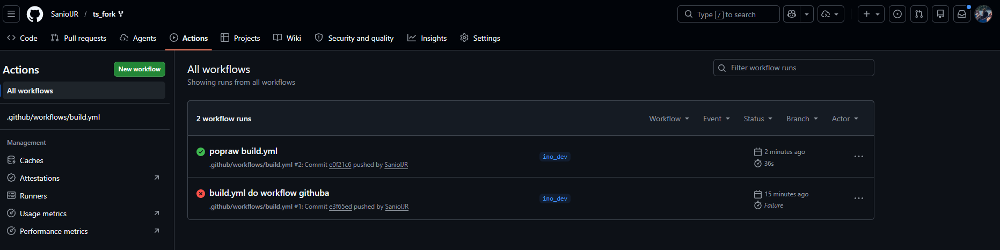
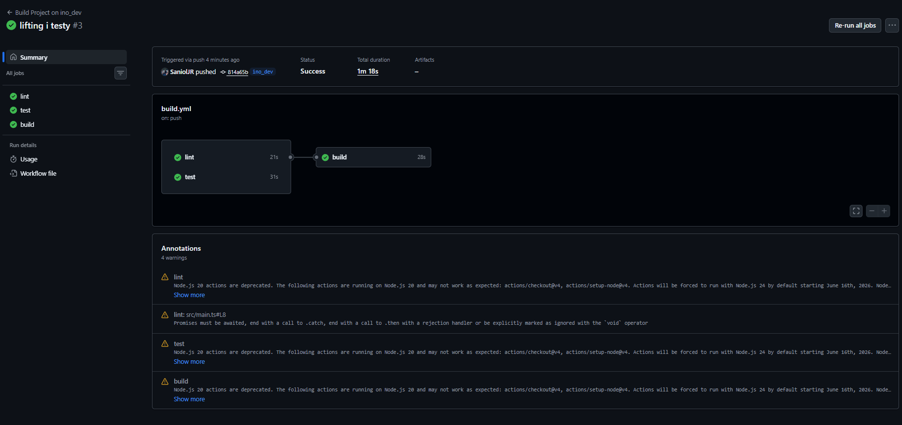
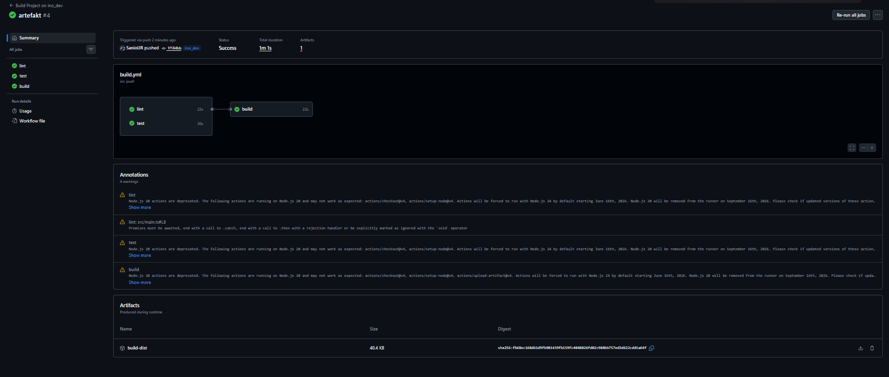

# Mateusz Sadowski - sprawozdanie z laboratoriów 12

## GitHub Actions - koncepcja

GitHub Actions to wbudowany w GitHuba system automatyzacji, który pozwala uruchamiać zadania po określonych zdarzeniach, na przykład po wysłaniu kodu do repozytorium, utworzeniu pull requesta albo ręcznym uruchomieniu workflow.

Służy przede wszystkim do ciągłej integracji i ciągłego wdrażania, czyli do automatycznego sprawdzania kodu, uruchamiania testów, budowania projektu oraz wdrażania aplikacji bez konieczności wykonywania tych czynności ręcznie.

Zadania w GitHub Actions uruchamiają się w chmurze na maszynach wirtualnych zwanych Runnerami. Z perspektywy kosztów dla właściciela repozytorium, model rozliczeń dzieli się na dwa niezależne elementy. Czas obliczeniowy (przetwarzanie pipeline'u) rozliczany jest wyłącznie w minutach pracy maszyny – od startu zadania do jego zakończenia. Natomiast jednostką w postaci GB-godzin rozliczane jest tylko i wyłącznie fizyczne przechowywanie danych (Storage), czyli np. wygenerowanych artefaktów, logów czy paczek wynikowych, które zostaną trwale zapisane na serwerach GitHuba po zakończeniu pracy zadania.

## Praktyczne wdrażanie w projekcie

### Konfiguracja repozytorium
Na laboratoriach wykorzystano repozytorium, które było sforkowane na potrzeby poprzednich laboratoriów.

URL:    https://github.com/SaniolJR/ts_fork

Na potrzeby laboratoriów stworzono gałąź `ino_dev`.

        git branch ino_dev

### Konfiguracja workflow i build

Następnie wykonano przejście do folderu `.github/workflows`. Folder ten wcześniej nie występował, gdyż jest tworzony przy pierwszym użyciu GitHub Actions.

        mkdir -p .github/workflows
        
        cd .github/workflows

Następnie stworzono plik `build.yml`.
        
        touch build.yml

name: Build Project on ino_dev

name: Build Project on ino_dev

        on:
        push:
            branches:
            - ino_dev

        jobs:
        build:
            runs-on: ubuntu-latest

            steps:
            - name: Pobranie kodu repozytorium (Checkout)
                uses: actions/checkout@v4

            - name: Konfiguracja Node.js
                uses: actions/setup-node@v4
                with:
                node-version: '20'
                cache: 'npm'

            - name: Instalacja zależności
                run: npm ci

            - name: Uruchomienie buildu
                run: npm run build

Plik ten będzie uruchamiany tylko w przypadku pusha na branch `ino_dev`, co jest zaznaczone na samym początku. Klucz `on` wskazuje jakich poleceń Gita dotyczy workflow, a następnie po każdym poleceniu można wybrać, jakiego brancha dotyczy plik.

`jobs` to z kolei zadania do wykonania. W tym przykładzie takim zadaniem jest zbudowanie aplikacji, nazwane `build`. Job ten odpali się na maszynie oznaczonej w `runs-on: ubuntu-latest`.

Następnie zdefiniowane są kroki zadania w sekcji `steps`. Każdy krok oprócz swojego identyfikatora w postaci nazwy `name` ma także pole `uses` (wskazujące jakiej akcji/narzędzia użyć) lub `run` (bezpośrednie polecenie do wykonania). Jeśli krok nie ma pola `uses`, to wykonuje się jako zwykłe polecenie shell'a, wskazane w `run`.

Potrzeba stworzenia folderu `.github/workflows` wskazuje na brak istniejących workflowów w projekcie – nie istniały one wcześniej. Jeśli jednak projekt już zawiera workflowy, można je usunąć za pomocą polecenia:

        git rm .github/workflows/*.yml

Po poprawieniu w pliku `build.yml` wersji oraz dostosowaniu go do projektu wykonano push na repozytorium. Jak widać, build (w tym przypadku już drugi) przeszedł poprawnie.

### Linting i automatyzacja testów
Jako reakcję na potrzeby CI dodano rozszerzenia workflowu — opis zmian przedstawia się następująco:

- Dodano job `lint`, który uruchamia `npm run lint` i sprawdza jakość kodu.
- Dodano job `test`, który uruchamia `npm run test` (unit) oraz `npm run test:e2e` (e2e).
- Zmieniono instalację zależności z `npm install` na `npm ci` — zapewnia to powtarzalne instalacje zgodne z `package-lock.json`.
- Dodano cache dla zależności (`cache: 'npm'`) w celu przyspieszenia kolejnych buildów.
- Job `build` został ustawiony jako zależny od `lint` i `test` (`needs: [lint, test]`), dzięki czemu budowanie wykonywane jest tylko po pomyślnym zakończeniu kontroli jakości i testów.

        name: Build Project on ino_dev

        on:
        push:
            branches:
            - ino_dev

        jobs:
        lint:
            runs-on: ubuntu-latest
            steps:
            - name: Pobranie kodu repozytorium (Checkout)
                uses: actions/checkout@v4

            - name: Konfiguracja Node.js
                uses: actions/setup-node@v4
                with:
                node-version: '20'
                cache: 'npm'

            - name: Instalacja zależności
                run: npm ci

            - name: Uruchomienie lintingu
                run: npm run lint

        test:
            runs-on: ubuntu-latest
            steps:
            - name: Pobranie kodu repozytorium (Checkout)
                uses: actions/checkout@v4

            - name: Konfiguracja Node.js
                uses: actions/setup-node@v4
                with:
                node-version: '20'
                cache: 'npm'

            - name: Instalacja zależności
                run: npm ci

            - name: Uruchomienie testów
                run: npm run test

            - name: Uruchomienie testów e2e
                run: npm run test:e2e

        build:
            runs-on: ubuntu-latest
            needs: [lint, test]
            steps:
            - name: Pobranie kodu repozytorium (Checkout)
                uses: actions/checkout@v4

            - name: Konfiguracja Node.js
                uses: actions/setup-node@v4
                with:
                node-version: '20'
                cache: 'npm'

            - name: Instalacja zależności
                run: npm ci

            - name: Uruchomienie buildu
                run: npm run build

**W celu weryfikacji zpushowano zmianę na repozytorium, poniżej widać efekt.**

Jak widać na powyższym zrzucie ekranu, proces ciągłej integracji zadziałał poprawnie.
Akcja została automatycznie wyzwolona dokładnie w momencie wypchnięcia (push) nowego commita na dedykowaną gałąź ino_dev.

Zgodnie z poleceniem, program poprawnie zbudował się wewnątrz środowiska chmurowego, co potwierdza poprawne zakończenie zadania `build`, a wcześniej także testów i sprawdzenia jakości kodu.

### Załączenie artefaktu

W celu budowy artefaktu oraz jego załączenia, na koniec pliku `build.yml` dodano:

        - name: Upload artefaktu buildu
            uses: actions/upload-artifact@v4
            with:
            name: build-dist
            path: dist/
            if-no-files-found: error

Akcja `actions/upload-artifact@v4` zapisuje wskazany katalog jako artefakt workflowu, dzięki czemu wynik budowania projektu jest dostępny po zakończeniu joba w zakładce z uruchomieniem GitHub Actions.

W tym przypadku do artefaktu trafia katalog `dist/`, czyli wynik działania polecenia `npm run build`. Nazwa artefaktu `build-dist` pozwala łatwo go rozpoznać wśród innych plików pobieranych z workflowu.

Parametr `if-no-files-found: error` powoduje, że workflow zakończy się błędem, jeśli katalog `dist/` nie zostanie utworzony lub będzie pusty. Jest to przydatne, bo od razu sygnalizuje, że build nie wygenerował oczekiwanego wyniku.

Jak widać na powyższym zdjęciu, wszystkie poprzednie etapy oraz budowa artefaktu przeszły pomyślnie, a artefakt jest gotowy do pobrania.

## Wnioski

GitHub Actions to potężne, chmurowe narzędzie CI/CD, które drastycznie optymalizuje proces dostarczania oprogramowania poprzez automatyzację weryfikacji i budowania kodu po każdym wypchnięciu zmian do repozytorium. 

Rozdzielenie przepływu pracy na równoległe zadania weryfikacyjne (linter, testy) z warunkowym uruchamianiem finalnego buildu oraz archiwizacją artefaktu stanowi rynkowy standard, minimalizujący ryzyko wdrożenia błędnego kodu na produkcję. 

Zrealizowane laboratoria udowodniły, że przeniesienie tych procesów do zarządzanego środowiska zdejmuje z inżyniera ciężar utrzymania lokalnej infrastruktury, pozwalając skupić się wyłącznie na architekturze i jakości rozwijanej aplikacji.