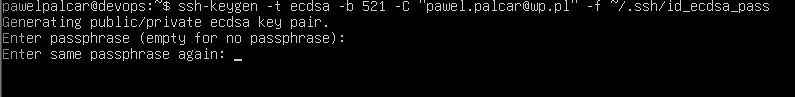
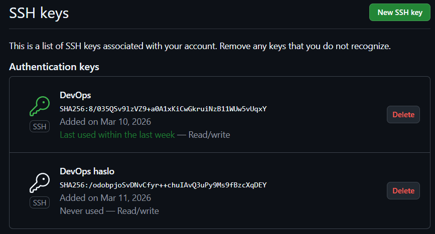
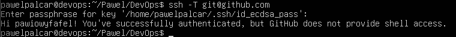
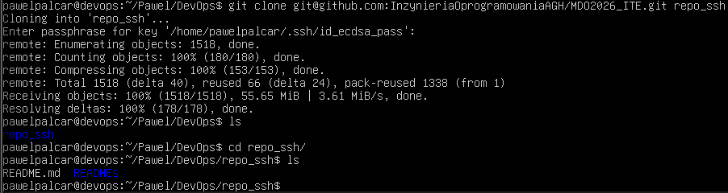
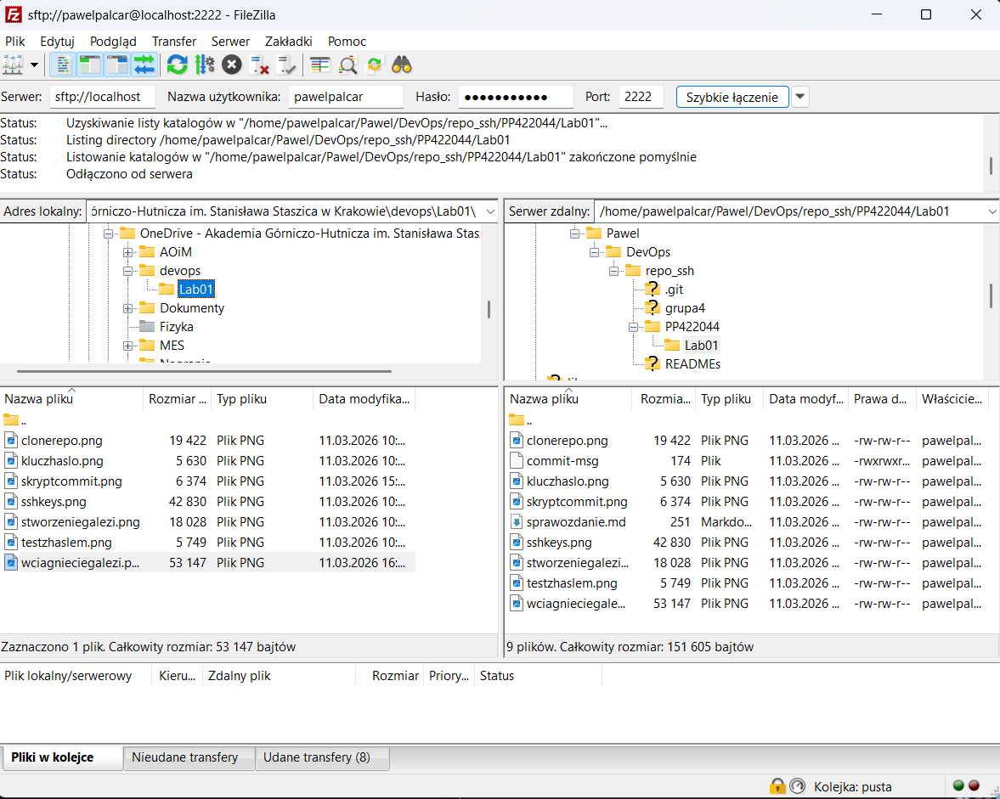
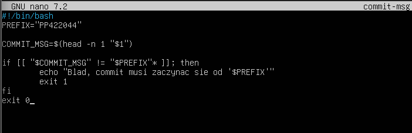
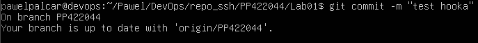
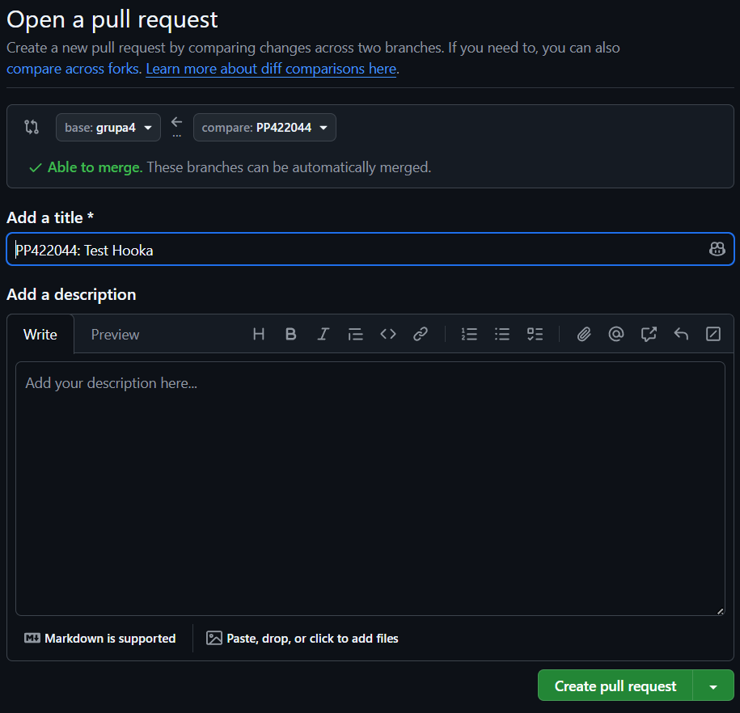

# Sprawozdanie Lab 01

##1. Utworzenie dwoch kluczy SSH

Jeden zostal utworzony bez hasla a drugi z haslem

##2. Test klucza z haslem

##3. Klonowanie repozytorium

##4. Utworzenie wlasnej galezi 

##5. FileZilla

##6. Utworzenie git hooka
Tresc skryptu

##7. Konfiguracja i test hooka

##8. Pull request

