# Sprawozdanie 2

## 1. Instalacja Dockera

	sudo apt update
	sudo apt install docker.io -y
	sudo usermod -aG docker $USER
	newgrp docker
	
	docker --version

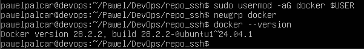

## 2. Pobranie obrazow

	docker pull hello-world

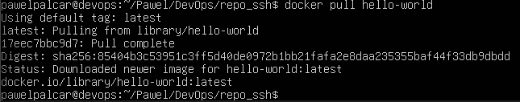

	docker pull busybox

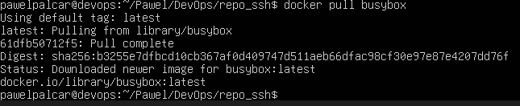

	docker pull ubuntu

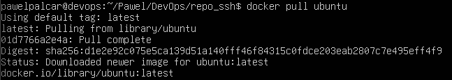

	docker pull mariadb

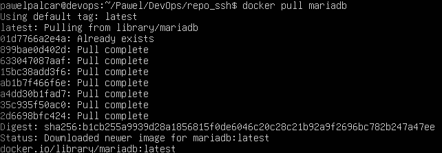

## 3. Sprawdzanie rozmiarow

	docker images

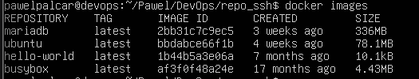

## 4. Sprawdzanie kodu wyjscia

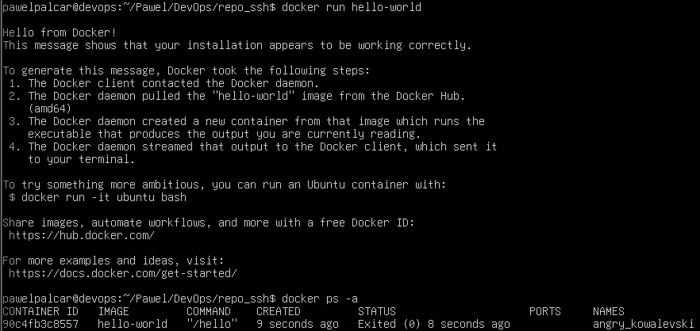

## 5. Tryb interaktywny

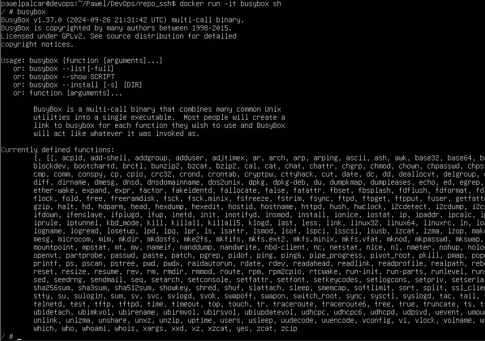

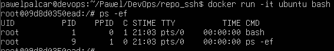

## 6. Dockerfile

	Tresc Dockerfile:

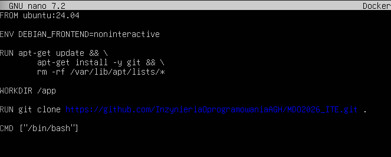

	Budowanie obrazu:
		docker build -t moje-repo-env .
		docker run -it moje-repo-env
		ls -la

## 7. Czyszczenie srodowiska

	docker ps -a
	docker container prune -f

	docker images
	docker image prune -a -f

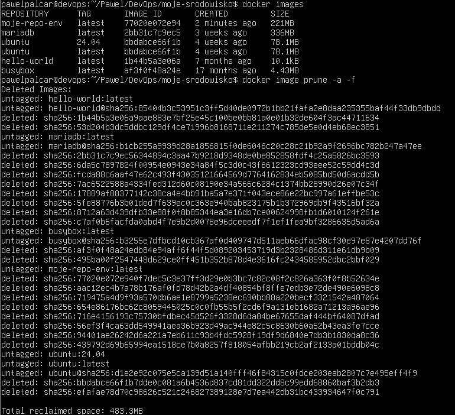

