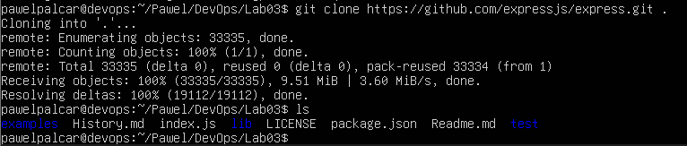
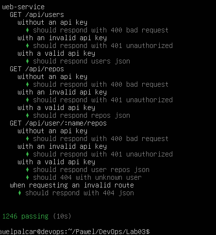
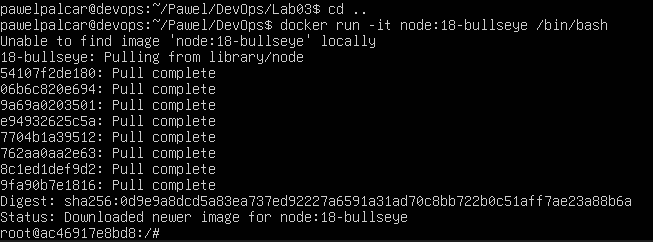
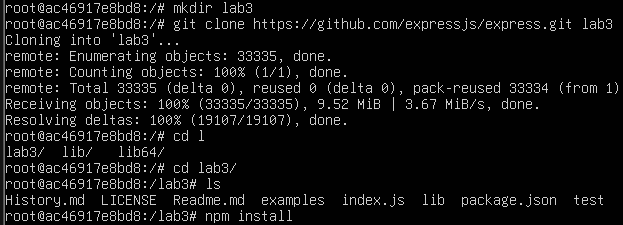
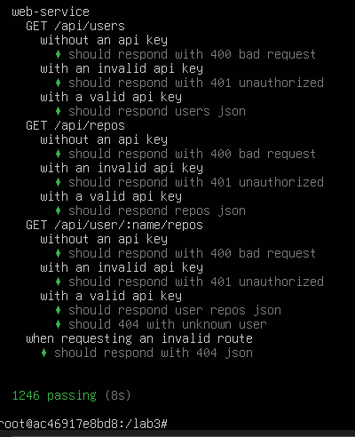
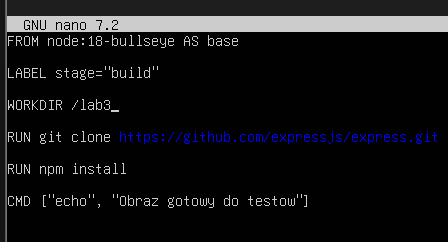
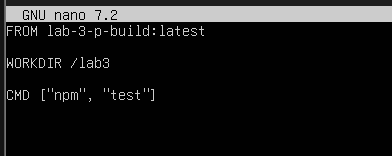
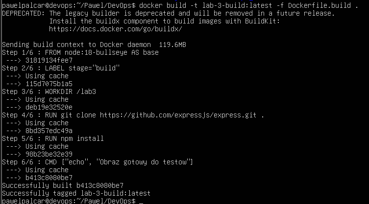
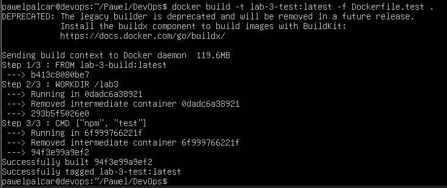
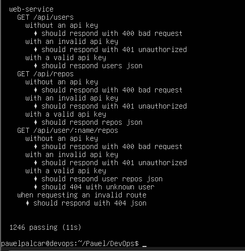

# SPRAWOZDANIE 3

## 1. Instalacja npm i klonowanie repozytorium
	
	sudo apt update
	sudo apt install -y nodejs npm
	git clone https://github.com/expressjs/express.git .

## 2. Przeprowadzenie testow

	npm test

## 3. Czysty obraz nodejs

	Uruchomienie kontenera z flaga -it, praca na terminalu wewnatrz kontenera
	docker run -it node:18-bullseye /bin/bash

## 4. Klonowanie repozytorium do obrazu

## 5. Testy w obrazie

## 6. Dockerfile

	Automatyzacja za pomoca Docker file, build zajmuje sie przygotowaniem srodowiska, a test uruchamia testy

	nano Dockerfile.build

	nano Dockerfile.test

## 7. Budowa i uruchomienie testow

	docker build tworzy obrazy, a docker run uruchamia kontener powiazany ze stworzonym obrazem

	docker build -t lab-3-build:latest -f Dockerfile.build .

	docker build -t lab-3-test:latest -f Dockerfile.test .

	docker run --rm lab-3-test:latest

