# Sprawozdanie 4

## Bind Mount

## Utworzenie woluminu

	git clone https://github.com/expressjs/express.git ./input_code
	docker volume create output_vol

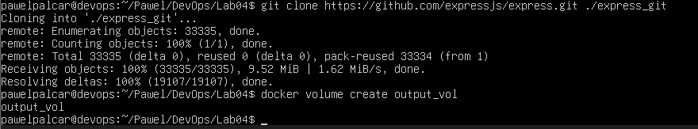

	docker run -it --rm -v$(pwd)/input_code:/app/input -v output_vol:/app/output node:18-bullseye /bin/bash
	npm install
	cp -r . /app/output/

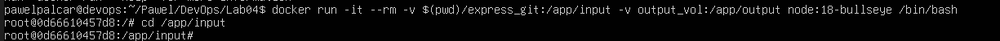

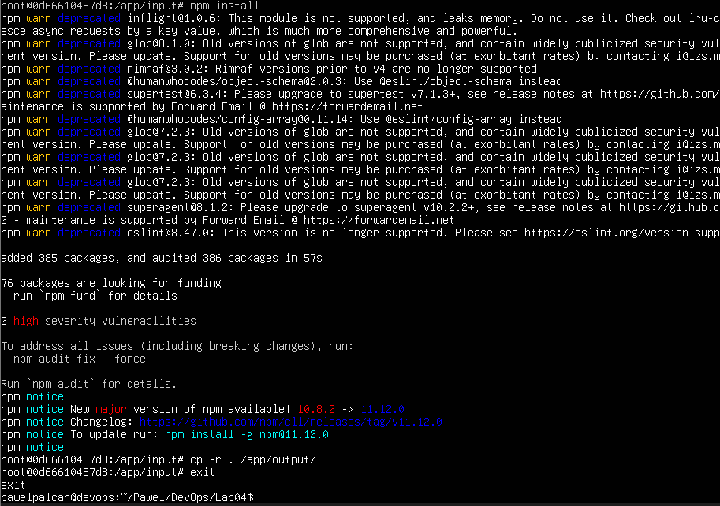

## Klonowanie wewnatrz kontenera z gitem

	docker volume create input_vol
	docker run -it --rm -v input_vol:/app/input -v output_vol:/app/output node:18-bullseye /bin/bash

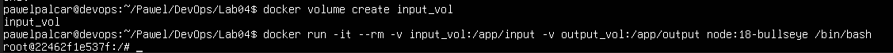

	apt-get update && apt-get install -y git
	git clone https://github.com/expressjs/express.git /app/input
	npm install 
	cp -r . /app/output/
	exit

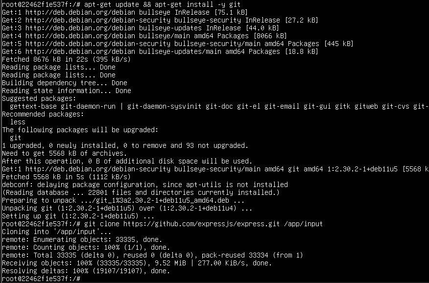

## IPerf3

	docker run -d --name iperf-server networkstatic/iperf3 -s
	docker inspect -f '{{range.Network.Settings.Networks}}{{.IPAddress}}{{end}}' iperf-server

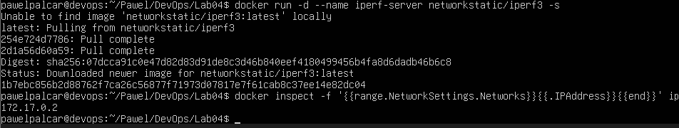

	docker run -it --rm network static/iperf3 -c 172.17.0.2

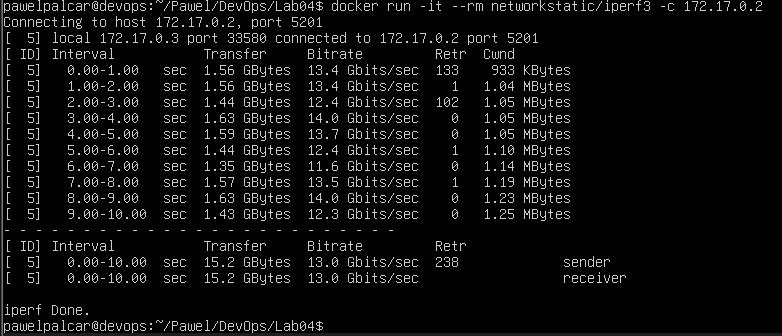

## Bridge

	docker network create lab-network1
	docker run -d --name iperf-server-net --network lab-network1 -p 5201:5201 networkstatic/iperf3 -s
	docker run -it --rm --network lab-network1 networkstatic/iperf3 -c iperf-server0net

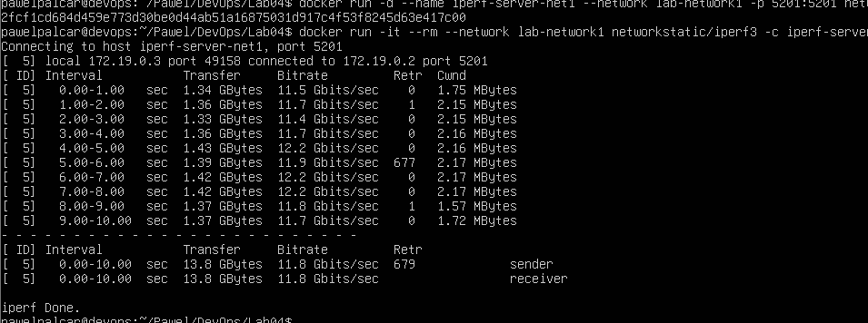

## Polaczenie spoza kontenera

	sudo apt install -y iperf3
	iperf3 -c 127.0.0.1

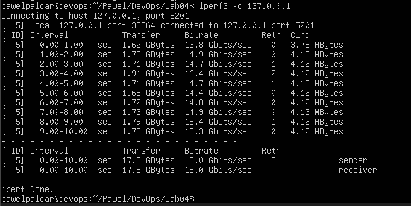

## SSHD

	docker run -d --name ssh-container -p 2222:22 ubuntu:latest sleep infinity
	docker exec -it ssh-container bash
	apt update && apt install -y openssh-server
	echo 'root:pawelpalcar' | chpasswd
	sed -i 's/#PermitRootLogin prohibit-password/PermitRootLogin yes/' 

	ssh root@localhost -p 2222

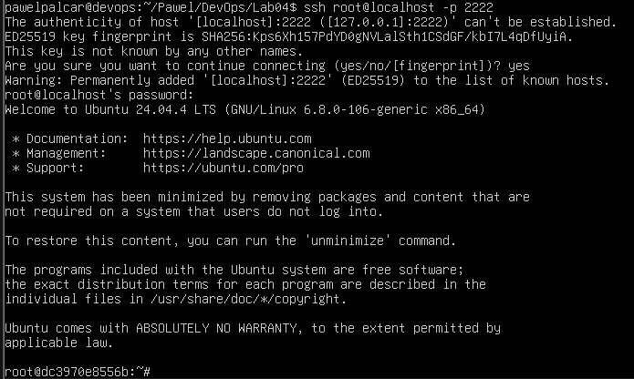

## Server Jenkins

	docker network cerate jenkins
	docker run --name jenkins-docker --rm --detach --privileged --network jenkins docker:dind
	docker run --name jenkins-blueocean --rm --detach --network jenskins --publish 8080:8080 --publish 50000:50000 jenkins/jenkins:lts-jdk17

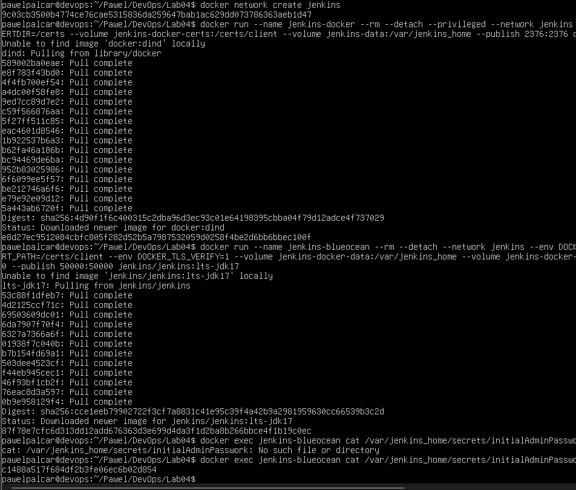

	docker ps

	Sprawdzenie w przegladarce na http://localhost:8080

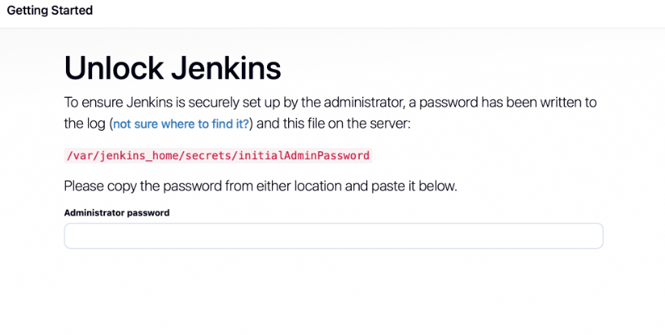
