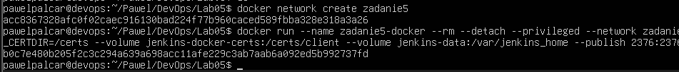
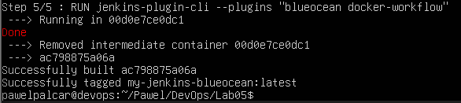
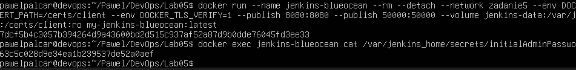
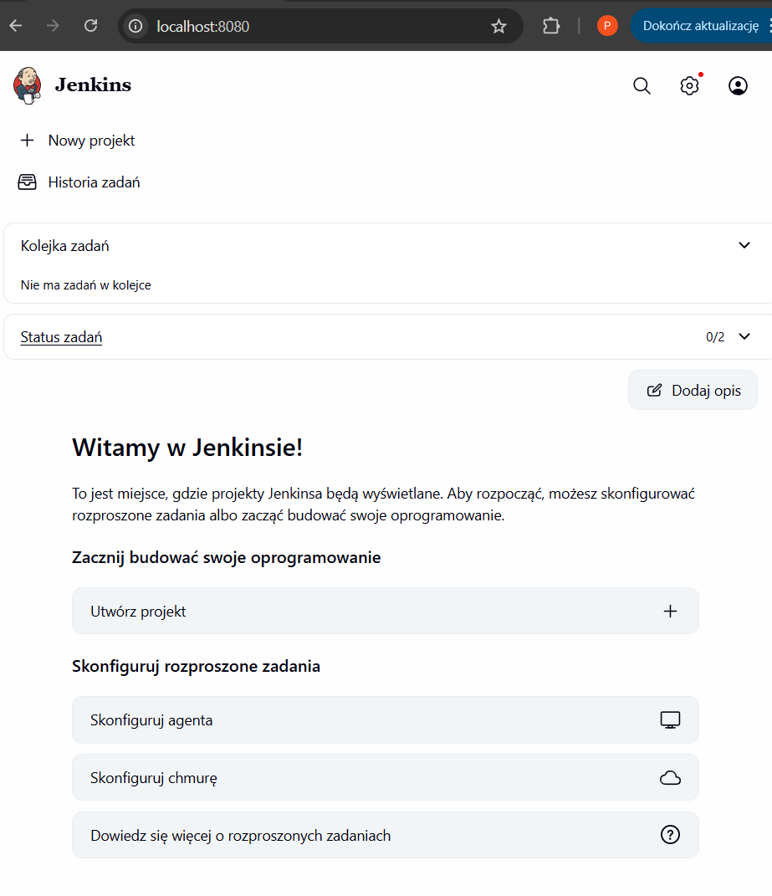

# Sprawozdanie 5

---

## Utworzenie sieci w Dockerze

```bash
docker network create zadanie5
docker run --name zadanie5-docker --rm --detach 
--privileged --network zadanie5 --network-alias docker 
--env DOCKER_TLS_CERTDIR=/certs 
--volume jenkins-docker-certs:/certs/client 
--volume jenkins-data:/var/jenkins_home 
--publish 2376:2376 
docker:dind
```



## Dockerfile.jenkins

Domyślny obraz Jenkinsa posiada tylko środowisko Javy. Aby Jenkins mógł budować kontenery, musi mieć zainstalowanego klienta Dockera (CLI), który będzie komunikował się z naszym kontenerem.

```Dockerfile
FROM jenkins/jenkins:lts
USER root
RUN apt-get update && apt-get install -y lsb-release
RUN apt-get update && apt-get install -y docker-ce-cli
USER jenkins
RUN jenkins-plugin-cli --plugins "blueocean docker-workflow"
```

```bash
docker build -t myjenkins-blueocean:latest -f Dockerfile.jenkins .
```




```bash
docker run --name jenkins-blueocean --rm --detach 
--network jenkins --env DOCKER_HOST=tcp://docker:2376 
--publish 8080:8080 --publish 50000:50000 
--volume jenkins-data:/var/jenkins_home 
--volume jenkins-docker-certs:/certs/client:ro 
myjenkins-blueocean:latest
```



## Jenkins w przegladarce



## Zadanie wstepne: uruchomnienie

```Dockerfile
pipeline {
    agent any
    stages {
        stage('Uname') {
            steps {
                sh 'uname -a'
            }
        }
        stage('Parzysta czy nieparzysta') {
            steps {
                script {
                    def hour = sh(script: "date +%H", returnStdout: true).trim()
                    echo "Aktualna godzina: ${hour}"
                    if (hour.toInteger() % 2 != 0) {
                        error("Błąd! Godzina jest nieparzysta!")
                    }
                }
            }
        }
        stage('Docker Pull') {
            steps {
                sh 'docker pull ubuntu'
            }
        }
    }
}
```


## Zadanie wstepne: obiekt typu pipeline

```Dockerfile
pipeline {
    agent any
    stages {
        stage('Pobranie repozytorium') {
            steps {
                git branch: 'PP422044', url: 'https://github.com/InzynieriaOprogramowaniaAGH/MDO2026_ITE.git'
            }
        }
        stage('Zbudowanie Dockerfile') {
            steps {
                dir('PP422044/Lab03'){
                    sh 'ls -la'
                    sh 'docker build -f Dockerfile.build -t my-app-builder .'
                }
            }
        }
    }
}
```

Dwa uruchomienia tego skryptu zwróciły poprawne wyniki lecz czasy ich wykonania znacząco się różniły.

Pierwsze wykonanie czas: **3 min 50 sek**

Drugie wykonianie czas: **7.9 sek**

Te wyniki pokazują dobrą optymalizacje i nie pobieranie wszystkiego na nowo jeżeli nic się nie zmieniło.