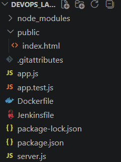
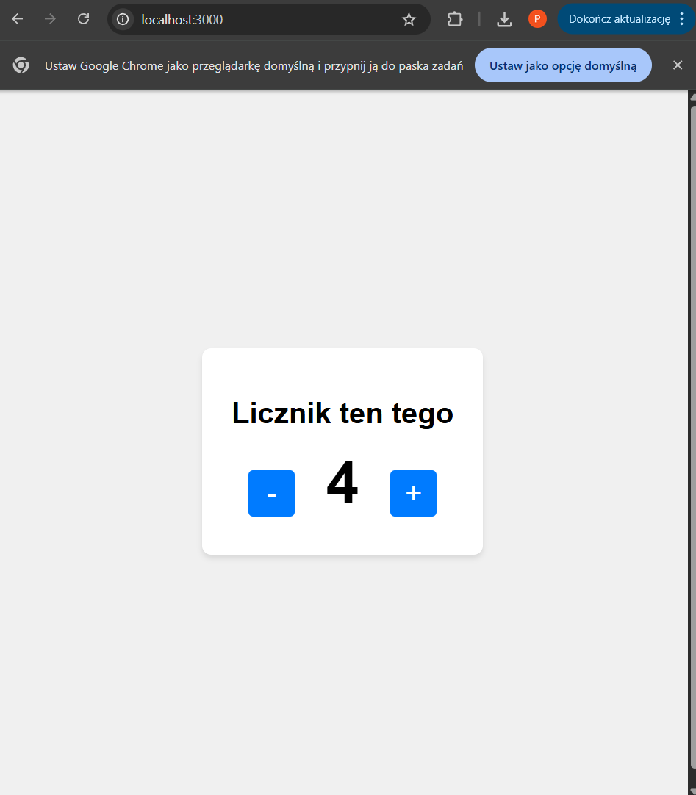
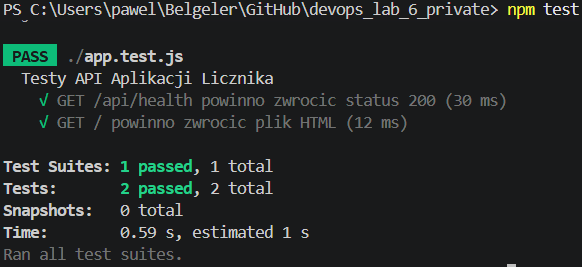
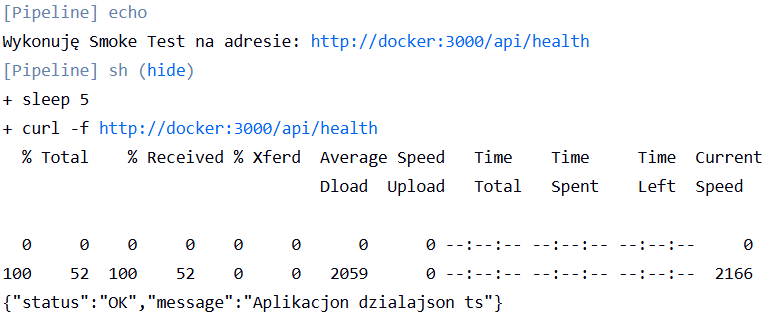
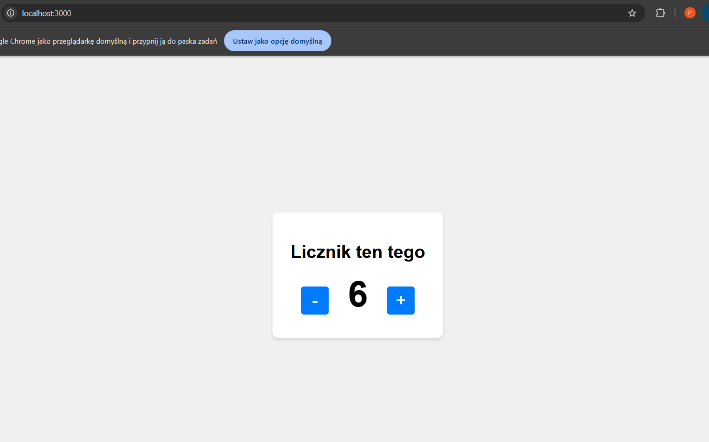
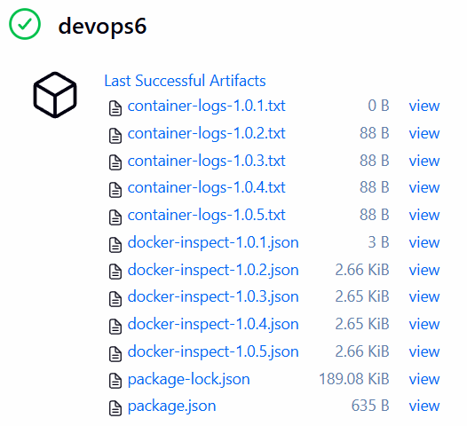

# Sprawozdanie 6

---

## Aplikacja

Aby wykonać zadanie 6, stworzyłem prostą aplikacje Node.js (Express), która pokazuje stronę z licznikiem. Aplikacja posiada również endpoint /api/health, który jest testowany za pomocą biblioteki Jest i Supertest.

### Struktura aplikacji





## Plan CI/CD

---

A[Git Push] --> B[Clone: Pobranie kodu ze SCM]
B --> C[Build Image Stage 1: Instalacja zależności]
C --> D[Test w Kontenerze: Uruchomienie testów Jest]
D --> E[Build Image Stage 2: Obraz produkcyjny]
E --> F[Publish: Tagowanie wersji i latest]
F --> G[Deploy: Uruchomienie Docker Run na maszynie]
G --> H[Smoke Test: Curl na wystawiony port]
H --> I[Post Actions: Generowanie i archiwizacja logów]

---

## Dockerfile

---

```Dockerfile
FROM node:20-alpine AS builder
WORKDIR /app
COPY package*.json ./
RUN npm install
COPY . .

FROM builder AS tester
RUN npm test

FROM node:20-alpine AS runner
WORKDIR /app
ENV NODE_ENV=production

ARG GIT_COMMIT=unknown
ARG BUILD_NUMBER=unknown
LABEL org.opencontainers.image.revision="${GIT_COMMIT}" \
      ci.build.number="${BUILD_NUMBER}"

COPY package*.json ./
RUN npm install --only=production
COPY public ./public
COPY app.js server.js ./

EXPOSE 3000
CMD ["npm", "start"]
```

Zastosowałem Multi-stage build. Pozwala to na realizację budowania, testowania i pakietyzacji w oddzielnych krokach w ramach jednego pliku.

---

## Jenkinsfile, wykorzystanie Script from SCM

---

```Dockerfile
pipeline {
    agent any

    environment {
        IMAGE_NAME = "devops-counter-app"
        VERSION    = "1.0.${BUILD_NUMBER}"
    }

    stages {
        stage('Clone') {
            steps {
                checkout scm
            }
        }

        stage('Build & Test Container') {
            steps {
                sh """
                    docker build \
                    --build-arg GIT_COMMIT=\$(git rev-parse --short HEAD) \
                    --build-arg BUILD_NUMBER=${BUILD_NUMBER} \
                    -t ${IMAGE_NAME}:${VERSION} .
                """
            }
        }

        stage('Publish Artifact') {
            steps {
                sh "docker tag ${IMAGE_NAME}:${VERSION} ${IMAGE_NAME}:latest"
                echo "Otagowano artefakt jako: ${IMAGE_NAME}:${VERSION}"
            }
        }

        stage('Deploy & Smoke Test') {
            steps {
                script {
                    def targetHost = "docker"
                    
                    sh "docker rm -f counter-container || true"
                    sh "docker run -d --name counter-container -p 3000:3000 ${IMAGE_NAME}:${VERSION}"
                    
                    echo "Wykonuję Smoke Test na adresie: http://${targetHost}:3000/api/health"
                    sh """
                        sleep 5
                        curl -f http://${targetHost}:3000/api/health || (docker logs counter-container && exit 1)
                    """
                }
            }
        }
    }
    
    post {
        always {
            script {
                sh "docker inspect ${IMAGE_NAME}:${VERSION} > docker-inspect-${VERSION}.json || true"
                sh "docker logs counter-container > container-logs-${VERSION}.txt || true"
            }
            archiveArtifacts artifacts: "*.json, *.txt", allowEmptyArchive: true
        }
    }
}
```

Zrealizowano wszystkie kroki: Clone, Build, Test (w Dockerfile uruchamianym przez Jenkinsa), Publish (tagowanie), Deploy.

Zamiast konfigurować zadania w panelu Jenkinsa, cały proces opisujemy kodem. Ułatwia to przeglądy kodu również dla spraw związanych z DevOps.
**Pełna kontrola wersji:** System Git archiwizuje pipeline. Dzięki temu cały zespół widzi, jak i dlaczego proces budowania zmieniał się w czasie.
**Bezpieczeństwo i przenaszalność:** Konfiguracja leży bezpiecznie na serwerze zdalnym. Dzięki temu odtworzenie infrastruktury CI na nowym serwerze zajmuje chwilę.


---

## Działanie

---

### Testy





### Strona działa

Można ją zobaczyć na localhost, dzięki portforwarding na porcie 3000



### Logi 



---