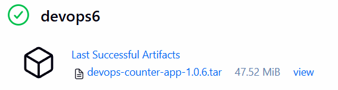
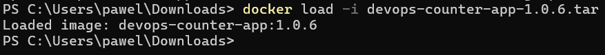
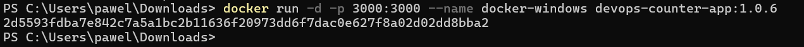
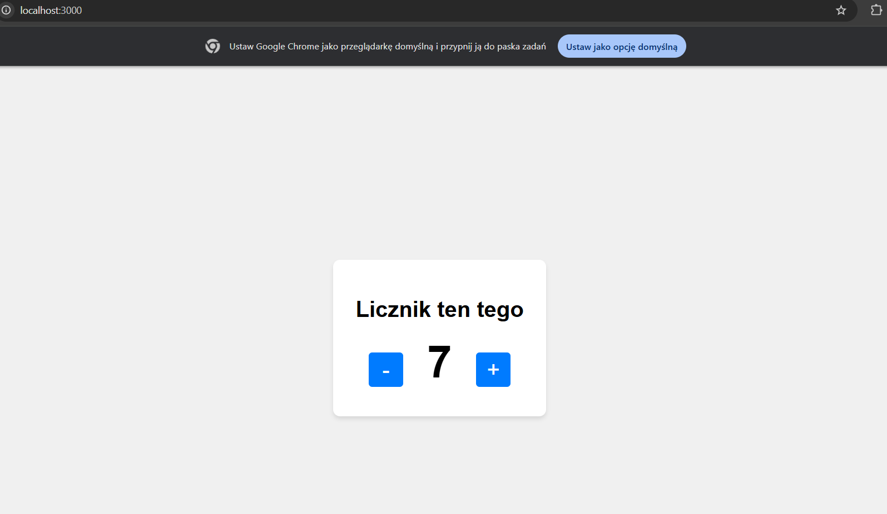
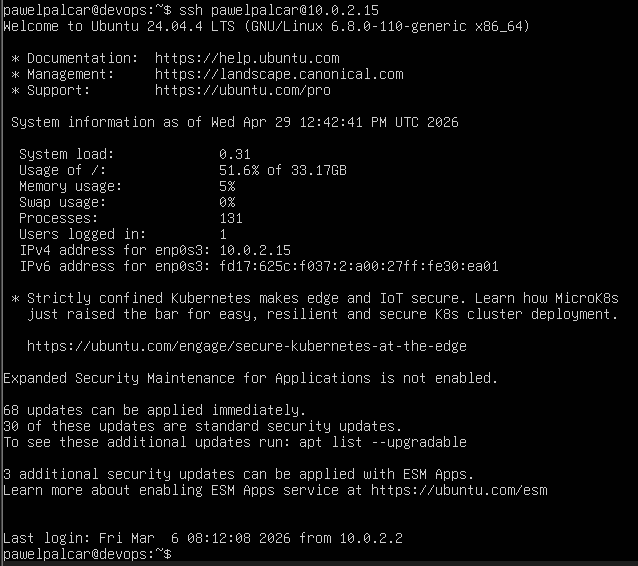
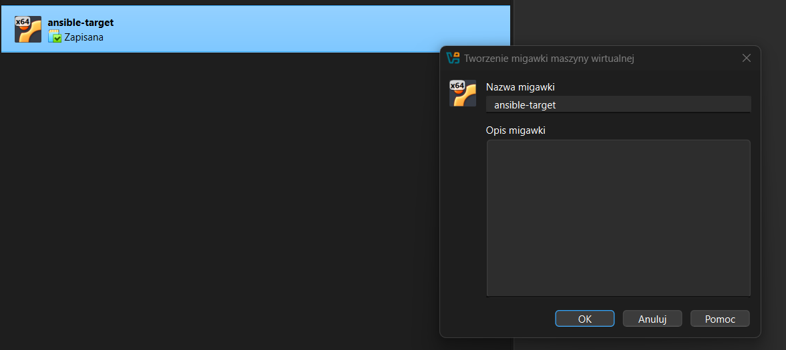

# Sprawozdanie 7

---

## Co już zostało zrobione

W laboratorium 6 zostały już zrealizowane następujące kroki z tej instrukcji:
1. Przepis z SCM - Jenkinsfile jest w repozytorium
2. Etapy build, test, deploy - Dockerfile dzięki Multi-stage robi to sam idealnie: instaluje zależności, uruchamia testy, a na końcu odrzuca śmieci i pakuje kod.
3. Etap Deploy - uruchamiamy kontener przez docker run

## Artefakt .tar gotowy do uruchomienia

Nowy Jenkinsfile pozwala wyeksportować obraz Dockera do .tar.

```Dockerfile
pipeline {
    agent any

    environment {
        IMAGE_NAME = "devops-counter-app"
        VERSION    = "1.0.${BUILD_NUMBER}"
    }
    
    options {
        skipDefaultCheckout(true)
    }

    stages {
        stage('Clean & Clone') {
            steps {
                cleanWs() 
                checkout scm
            }
        }

        stage('Build & Test') {
            steps {
                sh """
                    docker build \
                    --build-arg GIT_COMMIT=\$(git rev-parse --short HEAD) \
                    --build-arg BUILD_NUMBER=${BUILD_NUMBER} \
                    -t ${IMAGE_NAME}:${VERSION} .
                """
            }
        }

        stage('Deploy') {
            steps {
                script {
                    def targetHost = "docker"
                    
                    sh "docker rm -f counter-container || true"
                    sh "docker run -d --name counter-container -p 3000:3000 ${IMAGE_NAME}:${VERSION}"
                    
                    echo "Wykonuję Smoke Test na adresie: http://${targetHost}:3000/api/health"
                    sh """
                        sleep 5
                        curl -f http://${targetHost}:3000/api/health || (docker logs counter-container && exit 1)
                    """
                }
            }
        }

        stage('Publish') {
            steps {
                sh "docker save -o ${IMAGE_NAME}-${VERSION}.tar ${IMAGE_NAME}:${VERSION}"
                
                archiveArtifacts artifacts: "*.tar", allowEmptyArchive: false
            }
        }
    }
}
```

### Artefakt .tar



## uruchomienie artefaktu





Po załadowaniu i uruchomieniu obrazu możemy sprawdzić działanie strony w przeglądarce.



## Przygotowanie do następnych zajęć

### Tworzenie nowej maszyny wirtualnej

Instalacja potrzebnych narzędzi

```bash
sudo apt update
sudo apt install -y openssh-server tar nano
```

Sprawdzenie IP

```bash
ip a
```

### Połączenie z głownej maszyny

```bash
sudo apt install -y ansible
```

Kopiowanie klucza

```bash
ssh-copy-id pawelpalcar@10.0.2.15
```

Połączenie bez hasła

```bash
ssh pawelpalcar@10.0.2.15
```



### Zapisanie migawki

