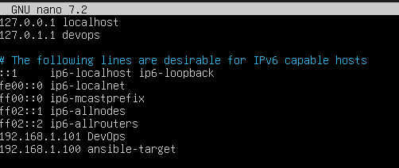
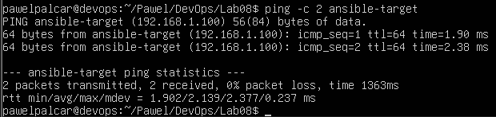
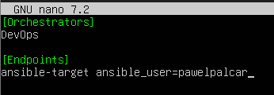
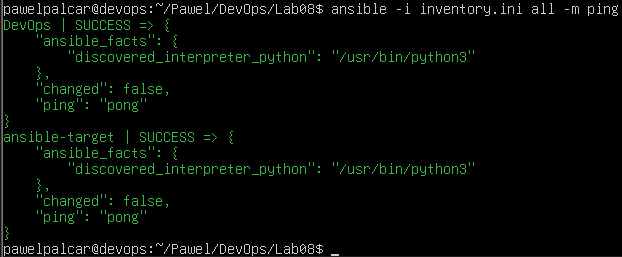
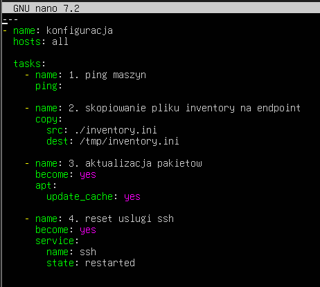
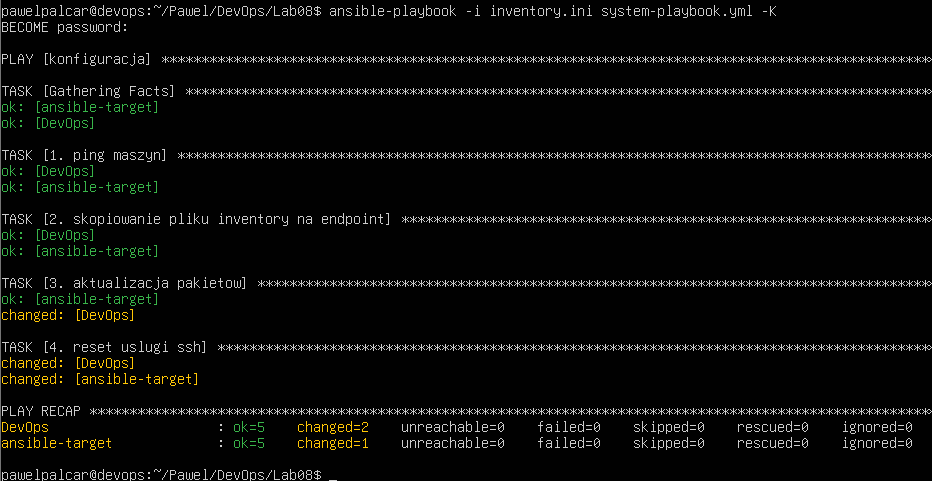
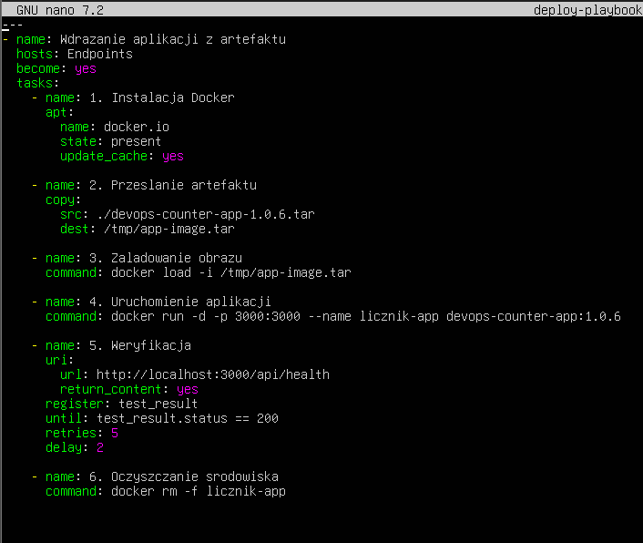
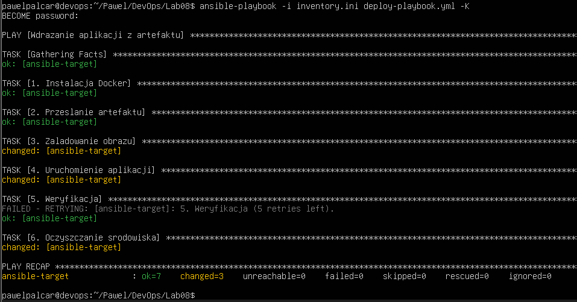

# Sprawozdanie 8

---

## Inwentaryzacja

```bash
    sudo nano /etc/hosts
```



Test działania



### Plik inventory



Weryfikacja łączności

```bash
    ansible -i inventory.ini all -m ping
```



## System playbook



Są w nim następujące kroki:
    1. Pingowanie maszyn
    2. Skopiowanie pliku inventory na endpoint
    3. Aktualizacja pakietów
    4. Reset usługi ssh

```bash
    ansible-playbook -i inventory.ini system-playbook.yml -K
```



## Deploy playbook (Wdrażanie artefaktu dockera)



Drugi playbook zawiera następujące kroki:
    1. Instalacja Dockera
    2. Przesłanie artefaktu
    3. Załadowanie obrazu
    4. Uruchomienie aplikacji
    5. Weryfikacja
    6. Oczyszczanie środowiska

```bash
    ansible-playbook -i inventory.ini deploy-playbook.yml -K
```



## Ansible Galaxy

```bash
    ansible-galaxy role init deploy_counter_role
    nano deploy_counter_role/tasks/main.yml
```

W pliku main.yml skopiowano sekcję **tasks:** z **deploy-playbook.yml**