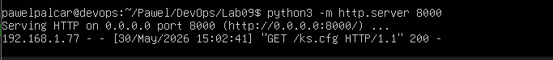
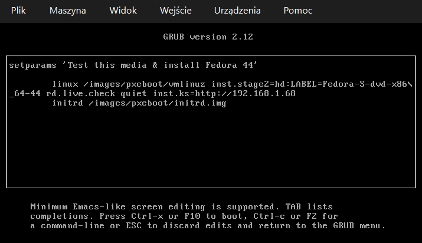
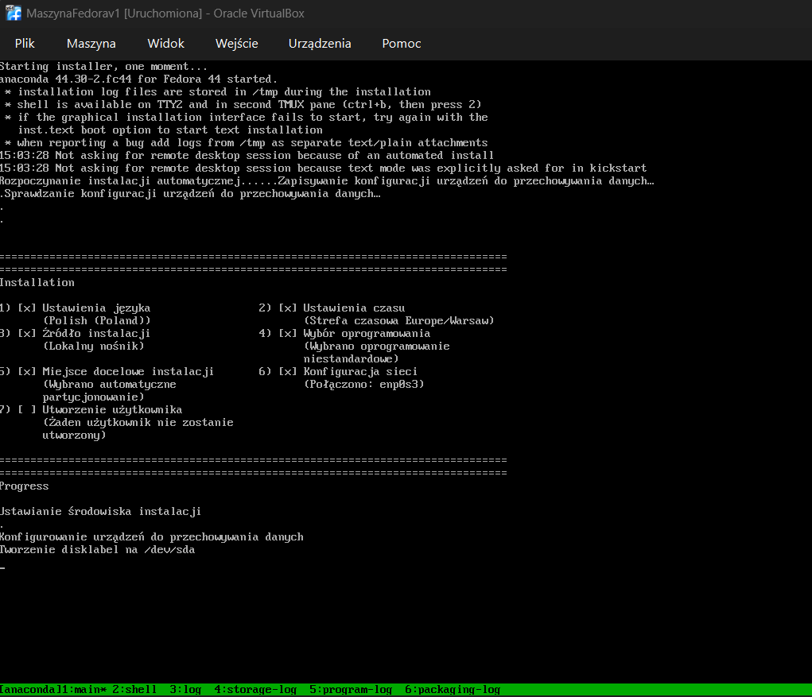
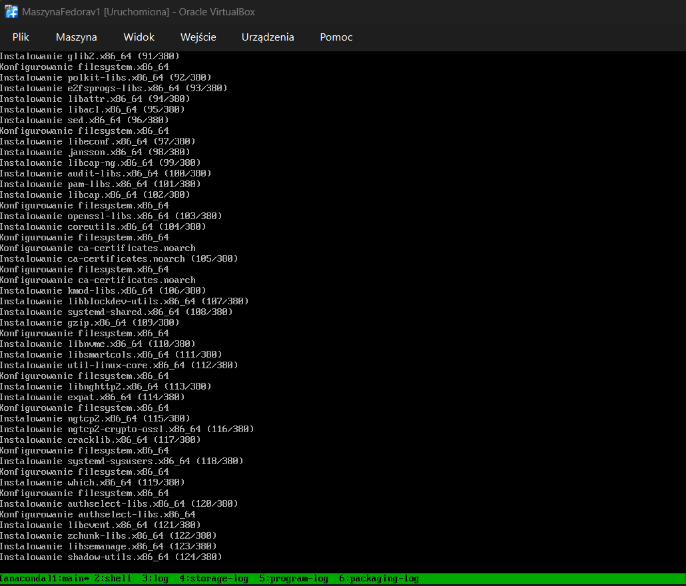

# Sprawozdanie 9

---

## Instalacja nienadzorowana systemu Fedora z plikiem Kickstart

### Czym jest instalacja nienadzorowana?

Instalacja nienadzorowana to sposób na zainstalowanie systemu operacyjnego bez żadnej interakcji ze strony użytkownika. Zamiast klikać "Dalej, Dalej, Zakończ" w graficznym instalatorze, przygotowujemy wcześniej plik odpowiedzi, który zawiera wszystkie decyzje z góry: język, strefa czasowa, partycjonowanie dysku, lista pakietów, hasło roota, a nawet skrypty uruchamiane po zakończeniu instalacji.

W praktyce DevOps takie podejście jest fundamentem automatyzacji infrastruktury – pozwala stawiać identyczne, przewidywalne środowiska bez ręcznej pracy.

---

### Plik ks.cfg

```kickstart
graphical
reboot

keyboard --vckeymap=pl --xlayouts='pl'
lang pl_PL.UTF-8
timezone Europe/Warsaw

network --bootproto=dhcp --device=link --activate --hostname=licznik-prod

rootpw --plaintext devops

ignoredisk --only-use=sda
clearpart --all --initlabel
autopart --type=lvm

%packages
@core
docker
wget
%end

%post --log=/root/ks-post.log
exec < /dev/tty3 > /dev/tty3 2>&1
chvt 3
echo "========================================="
echo " ROZPOCZYNAM KONFIGURACJE DEVOPS..."
echo "========================================="

systemctl enable docker

wget http://192.168.1.68:8000/devops-counter-app.tar -O /opt/app.tar

cat << 'EOF' > /etc/systemd/system/licznik-app.service
[Unit]
Description=Licznik DevOps Container
After=docker.service
Requires=docker.service

[Service]
Type=oneshot
RemainAfterExit=yes
ExecStartPre=/usr/bin/docker load -i /opt/app.tar
ExecStart=/usr/bin/docker run -d -p 3000:3000 --name licznik devops-counter-app:latest

[Install]
WantedBy=multi-user.target
EOF

systemctl enable licznik-app.service

echo "========================================="
echo " KONFIGURACJA ZAKONCZONA. RESTART..."
echo "========================================="
chvt 1
%end
```

#### Co robi ks.cfg

| Dyrektywa | Znaczenie |
|---|---|
| `graphical` + `reboot` | Tryb tekstowy z automatycznym restartem po zakończeniu |
| `keyboard`, `lang`, `timezone` | Polskie ustawienia regionalne |
| `network --hostname=licznik-prod` | DHCP + niestandardowy hostname |
| `rootpw --plaintext devops` | Hasło roota |
| `clearpart --all` | Kasuje cały dysk przed instalacją |
| `autopart --type=lvm` | Automatyczne partycjonowanie z LVM |
| `@core`, `docker`, `wget` | Minimalna instalacja + Docker + wget |
| `%post` | Sekcja skryptów po instalacji |

## Serwer HTTP z artefaktem

Przed uruchomieniem instalacji na głównej maszynie hostujemy artefakt Dockera prostym serwerem HTTP:

```bash
python3 -m http.server 8000
```

Instalator pobierze plik przez sieć lokalną pod adresem wskazanym w `wget`.



---

## Wskazanie pliku Kickstart instalatorowi (GRUB)

Aby instalator Anacondy użył naszego pliku odpowiedzi, podczas bootowania z ISO edytujemy linię jądra w menu GRUB i dodajemy parametr `inst.ks=`:

```
inst.ks=http://192.168.1.68/ks.cfg
```



Parametr ten mówi instalatorowi, skąd pobrać plik Kickstart.

---

## Przebieg instalacji nienadzorowanej

Po zatwierdzeniu linii bootowania Anaconda pobiera plik `ks.cfg`, odczytuje wszystkie ustawienia i rozpoczyna instalację.

### Ekran konfiguracji (odczyt pliku Kickstart)



Widoczne są odczytane ustawienia: język, strefa czasowa, źródło instalacji, wybór oprogramowania, automatyczne partycjonowanie oraz konfiguracja sieci. Wszystkie pozycje oznaczone [x] zostały skonfigurowane automatycznie z pliku odpowiedzi.

### Instalacja pakietów



System automatycznie pobiera i instaluje wszystkie pakiety. Nie jest wymagana żadna interakcja.
