# Sprawozdanie 10

---

## Wdrażanie na zarządzalne kontenery: Kubernetes (1)

### Czym jest Kubernetes?

Kubernetes to platforma do automatycznego uruchamiania, skalowania i zarządzania aplikacjami działającymi w kontenerach. Tam gdzie Docker odpowiada za uruchomienie jednego kontenera, Kubernetes zarządza całą flotą kontenerów na wielu maszynach jednocześnie.

Kilka kluczowych pojęć:

- **Pod** – najmniejsza jednostka w k8s, opakowanie dla jednego lub kilku kontenerów. Każdy pod ma własny adres IP wewnątrz klastra.
- **Deployment** – opisuje pożądany stan aplikacji: ile replik poda ma działać, jaki obraz Docker użyć. Kubernetes sam dba o to, żeby stan rzeczywisty zgadzał się z opisanym.
- **Service** – stały punkt dostępowy do podów. Pody mogą się restartować i zmieniać IP, serwis zawsze kieruje ruch do właściwych podów przez labelki.
- **ReplicaSet** – mechanizm stojący za deploymentem, pilnuje żeby zawsze działała odpowiednia liczba kopii poda.

**Minikube** to narzędzie uruchamiające jednowęzłowy klaster Kubernetes lokalnie.

---

## Instalacja narzędzi

### Instalacja Minikube i kubectl

```bash
winget install Kubernetes.minikube
winget install Kubernetes.kubectl
```

Po instalacji należy otworzyć nowy terminal, aby odświeżyć zmienne środowiskowe PATH.

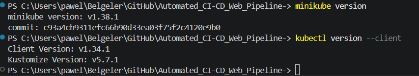

Weryfikacja instalacji:

```bash
minikube version
kubectl version --client
```

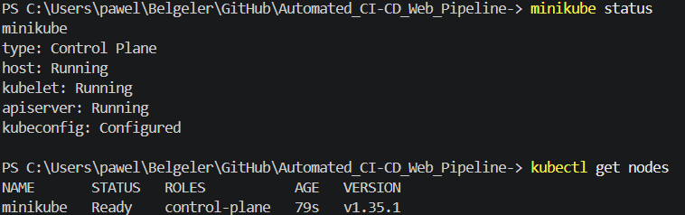

---

## Uruchomienie klastra

Minikube uruchamia klaster Kubernetes wewnątrz kontenera Docker. Sterownik docker jest zalecany na Windows z Docker Desktop:

```bash
minikube start --driver=docker
```

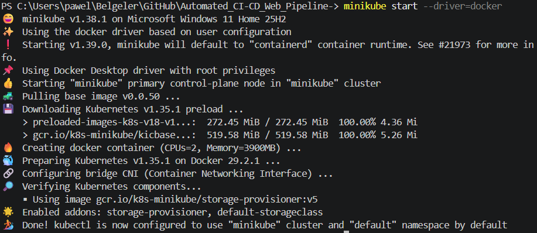

Weryfikacja stanu klastra:

```bash
minikube status
kubectl get nodes
```


### Dashboard

Dashboard to graficzny interfejs webowy klastra. Minikube uruchamia go i automatycznie otwiera w przeglądarce:

```bash
minikube dashboard
```

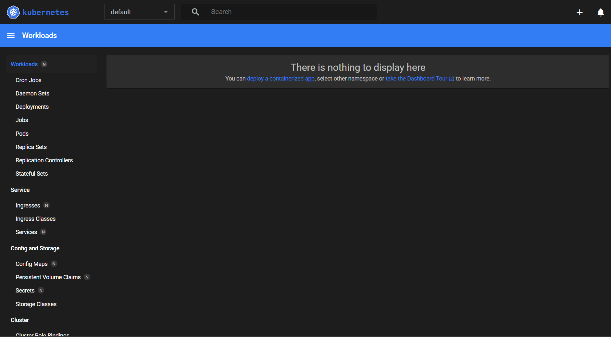

---

## Przygotowanie obrazu aplikacji

Obraz aplikacji `devops-counter-app` został wcześniej zbudowany przez pipeline Jenkinsa. Ponieważ Minikube posiada własne środowisko Docker odizolowane od systemowego, obraz musi zostać do niego załadowany.

Eksport obrazu z kontenera dind Jenkinsa:

```bash
docker exec jenkins-docker docker save devops-counter-app:1.0.4 -o /var/jenkins_home/app.tar
docker cp jenkins-docker:/var/jenkins_home/app.tar ./app.tar
```

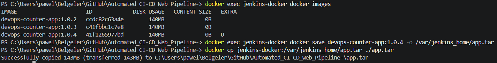

Załadowanie obrazu do Minikube:

```bash
minikube image load app.tar
minikube image ls | Select-String "devops-counter"
```

---

## Uruchomienie poda manualnie

Pod to podstawowa jednostka wdrożenia w Kubernetes. Poniższe polecenie tworzy pojedynczy pod z aplikacją:

```bash
kubectl run licznik \
  --image=devops-counter-app:1.0.4 \
  --port=3000 \
  --labels app=licznik \
  --image-pull-policy=Never
```

Flaga `--image-pull-policy=Never` nakazuje Kubernetes używać lokalnego obrazu zamiast pobierać go z Docker Hub.

Weryfikacja stanu poda:

```bash
kubectl get pods
kubectl get services
```

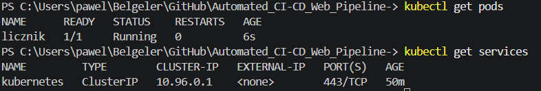

Pod `licznik` widoczny jest również w dashboardzie:

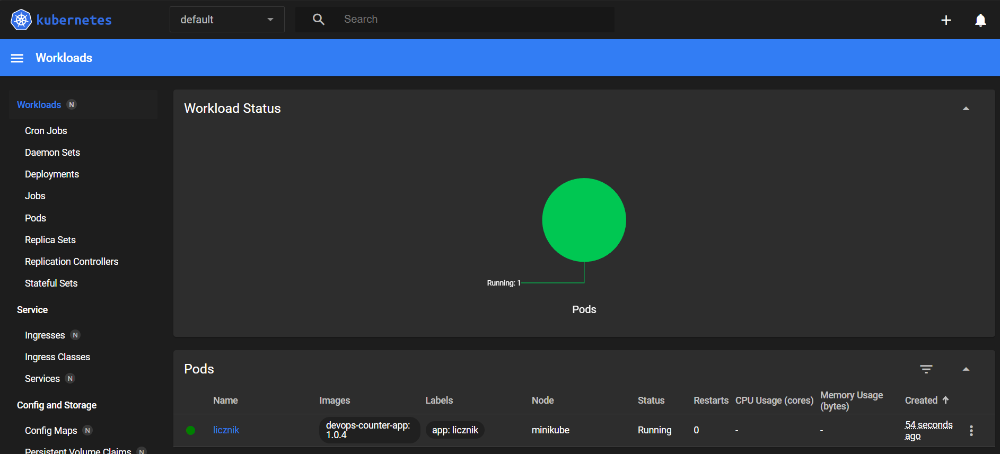

### Wyprowadzenie portu i test aplikacji

Kubernetes domyślnie izoluje pody od zewnętrznego ruchu sieciowego. Polecenie `port-forward` tworzy tunel między lokalną maszyną a podem:

```bash
kubectl port-forward pod/licznik 3000:3000
```

Test działania aplikacji:

```bash
curl http://localhost:3000/api/health
```

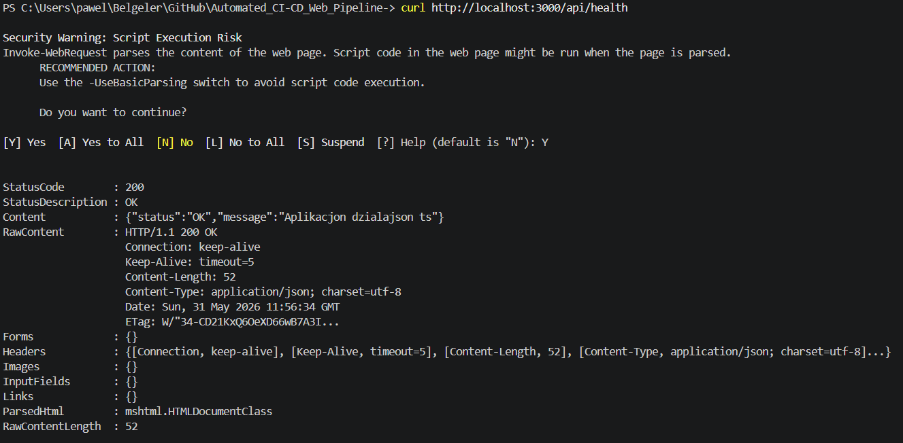

Aplikacja dostępna w przeglądarce pod adresem `http://localhost:3000`:

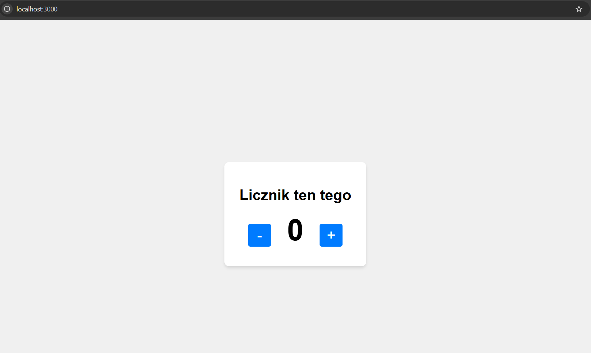

---

## Wdrożenie jako plik YAML

Ręczne tworzenie podów przez `kubectl run` jest niepraktyczne w produkcji. Docelowym podejściem jest zapis wdrożenia jako plik YAML i zarządzanie nim przez `kubectl apply`.

### Plik `k8s/deployment.yml`

```yaml
apiVersion: apps/v1
kind: Deployment
metadata:
  name: licznik-deployment
  labels:
    app: licznik
spec:
  replicas: 4
  selector:
    matchLabels:
      app: licznik
  template:
    metadata:
      labels:
        app: licznik
    spec:
      containers:
        - name: licznik
          image: devops-counter-app:1.0.4
          imagePullPolicy: Never
          ports:
            - containerPort: 3000
          resources:
            requests:
              memory: "64Mi"
              cpu: "100m"
            limits:
              memory: "128Mi"
              cpu: "200m"
```

### Plik `k8s/service.yml`

Serwis udostępnia deployment jako stabilny punkt dostępowy. Łączy się z podami przez labelkę `app: licznik`:

```yaml
apiVersion: v1
kind: Service
metadata:
  name: licznik-service
spec:
  selector:
    app: licznik
  ports:
    - protocol: TCP
      port: 80
      targetPort: 3000
  type: ClusterIP
```

### Wdrożenie

```bash
kubectl delete pod licznik

kubectl apply -f k8s/deployment.yml
kubectl apply -f k8s/service.yml
```

Śledzenie postępu wdrożenia:

```bash
kubectl rollout status deployment/licznik-deployment
```

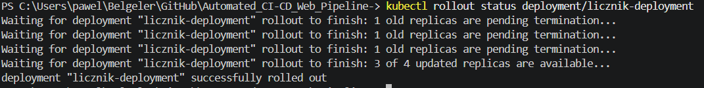

Komunikat `successfully rolled out` potwierdza pomyślne wdrożenie wszystkich 4 replik.

Weryfikacja stanu podów:

```bash
kubectl get pods
```

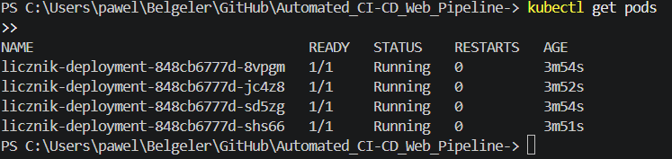

Wszystkie 4 pody w stanie `Running`. Dashboard potwierdza stan klastra:

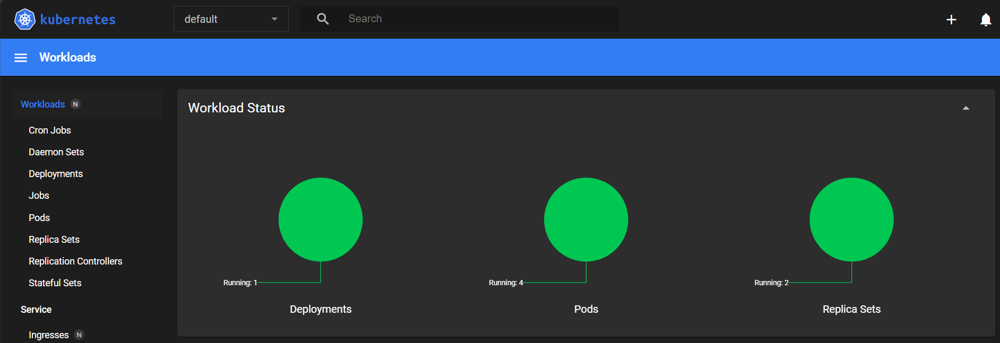

### Wyprowadzenie portu do serwisu i finalny test

```bash
kubectl port-forward service/licznik-service 3000:80
```

Test przez serwis:

```bash
curl http://localhost:3000/api/health
```

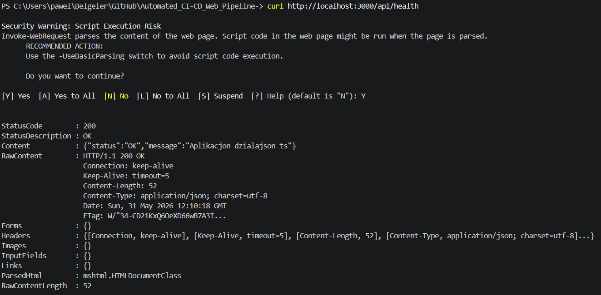

Aplikacja odpowiada poprawnie ze statusem `200 OK` i komunikatem `{"status":"OK","message":"Aplikacjon dzialajson ts"}`.
