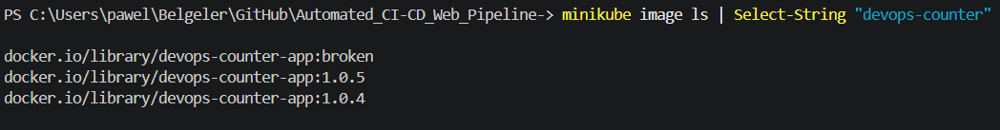
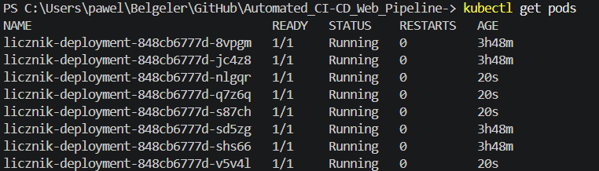
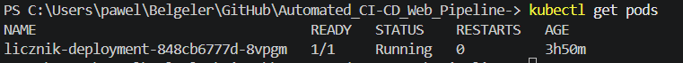
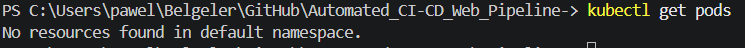
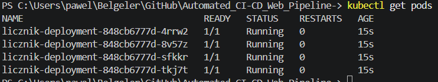
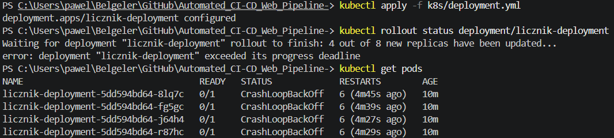
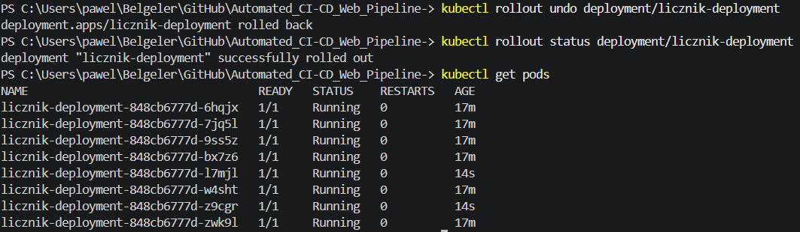
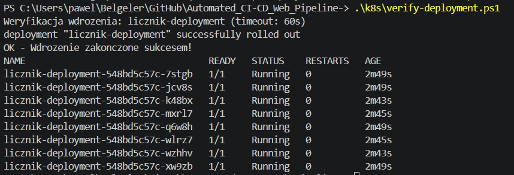

# Sprawozdanie 11

---

## Wdrażanie na zarządzalne kontenery: Kubernetes (2)

### Czym jest zarządzanie wdrożeniami w Kubernetes?

Kubernetes nie tylko uruchamia kontenery, ale też aktywnie zarządza ich cyklem życia. Jeśli pod crashuje – Kubernetes go restartuje. Jeśli wdrażamy nową wersję – Kubernetes wymienia pody stopniowo. Jeśli coś pójdzie nie tak – możemy cofnąć się do poprzedniej wersji jedną komendą.

Kluczowe mechanizmy omawiane w tym ćwiczeniu:

- **Skalowanie** – zmiana liczby replik w górę lub w dół bez przestoju aplikacji
- **Rollout** – kontrolowane wdrożenie nowej wersji obrazu
- **Rollout history** – historia wszystkich wdrożeń z możliwością cofnięcia
- **Rollout undo** – natychmiastowy powrót do poprzedniej działającej wersji
- **Strategie wdrożenia** – sposób w jaki Kubernetes wymienia stare pody na nowe

---

## Przygotowanie obrazów

Przed rozpoczęciem ćwiczenia w Minikube dostępne były trzy wersje obrazu aplikacji:

```powershell
minikube image ls | Select-String "devops-counter"
```



- `devops-counter-app:1.0.4` – stabilna wersja z poprzednich zajęć
- `devops-counter-app:1.0.5` – nowa wersja zbudowana przez pipeline Jenkinsa
- `devops-counter-app:broken` – celowo wadliwy obraz do testowania zachowania klastra

### Budowanie wadliwego obrazu

Plik `Dockerfile.broken` zawiera obraz który natychmiast kończy działanie z błędem:

```dockerfile
FROM node:20-alpine
CMD ["sh", "-c", "echo 'Blad krytyczny!' && exit 1"]
```

```powershell
minikube docker-env | Invoke-Expression
docker build -t devops-counter-app:broken -f Dockerfile.broken .
minikube docker-env -u | Invoke-Expression
```

---

## Zmiany w deploymencie

### Skalowanie do 8 replik

Zmiana wartości replicas w pliku k8s/deployment.yml z 4 na 8, następnie:

```powershell
kubectl apply -f k8s/deployment.yml
kubectl rollout status deployment/licznik-deployment
kubectl get pods
```



Kubernetes uruchomił 8 równoległych instancji aplikacji. Rolling Update dodawał nowe pody stopniowo, bez przestoju.

### Skalowanie do 1 repliki

```powershell
kubectl scale deployment licznik-deployment --replicas=1
kubectl get pods
```



Kubernetes usunął 7 podów, pozostawiając jeden działający. Polecenie kubectl scale pozwala zmieniać liczbę replik bez edytowania pliku YAML.

### Skalowanie do 0 replik

```powershell
kubectl scale deployment licznik-deployment --replicas=0
kubectl get pods
```



Wynik `No resources found in default namespace` potwierdza że wszystkie pody zostały zatrzymane. Deployment nadal istnieje – aplikacja jest wstrzymana, nie usunięta.

### Przywrócenie do 4 replik

```powershell
kubectl scale deployment licznik-deployment --replicas=4
kubectl get pods
```




---

## Aktualizacja obrazu i wadliwe wdrożenie

### Wdrożenie wadliwego obrazu

W pliku k8s/deployment.yml zmieniono tag obrazu na broken:

```powershell
kubectl apply -f k8s/deployment.yml
kubectl rollout status deployment/licznik-deployment
kubectl get pods
```



Kubernetes próbował wdrożyć nową wersję, ale pody natychmiast crashowały i przechodziły w stan CrashLoopBackOff. Rollout przekroczył deadline i zakończył się błędem, przy czym stare działające pody pozostały aktywne – aplikacja nie przestała działać w całości.

---

## Historia wdrożeń i cofanie zmian

### Historia rollout

```powershell
kubectl rollout history deployment/licznik-deployment
```

### Cofnięcie do poprzedniej wersji

Po wykryciu wadliwego wdrożenia zastosowano `rollout undo`:

```powershell
kubectl rollout undo deployment/licznik-deployment
kubectl rollout status deployment/licznik-deployment
kubectl get pods
```



Kubernetes automatycznie przywrócił poprzednią działającą wersję. Komunikat successfully rolled out i 8 podów w stanie Running potwierdzają powrót do stabilnego stanu. Cofnięcie do konkretnej rewizji możliwe jest przez:

```powershell
kubectl rollout undo deployment/licznik-deployment --to-revision=2
```

---

## Skrypt weryfikujący wdrożenie

Skrypt k8s/verify-deployment.ps1 sprawdza czy wdrożenie zakończyło się w ciągu 60 sekund:

```powershell
$DEPLOYMENT = "licznik-deployment"
$TIMEOUT = "60s"

Write-Host "Weryfikacja wdrozenia: $DEPLOYMENT (timeout: $TIMEOUT)"

kubectl rollout status deployment/$DEPLOYMENT --timeout=$TIMEOUT

if ($LASTEXITCODE -eq 0) {
    Write-Host "OK - Wdrozenie zakonczone sukcesem!"
    kubectl get pods -l app=licznik
} else {
    Write-Host "BLAD - Wdrozenie nie zakonczone w czasie!"
    kubectl get pods -l app=licznik
    kubectl describe deployment $DEPLOYMENT | Select-Object -Last 20
    exit 1
}
```



Skrypt potwierdził że deployment zakończył rollout pomyślnie i wylistował wszystkie działające pody.

---

## Strategie wdrożenia

### Strategia Recreate

Plik `k8s/deployment-recreate.yml`:

```yaml
apiVersion: apps/v1
kind: Deployment
metadata:
  name: licznik-recreate
  labels:
    app: licznik-recreate
    version: "1.0.4"
spec:
  replicas: 4
  selector:
    matchLabels:
      app: licznik-recreate
  strategy:
    type: Recreate
  template:
    metadata:
      labels:
        app: licznik-recreate
        version: "1.0.4"
    spec:
      containers:
        - name: licznik
          image: devops-counter-app:1.0.4
          imagePullPolicy: Never
          ports:
            - containerPort: 3000
```

```powershell
kubectl apply -f k8s/deployment-recreate.yml
```

Przy aktualizacji obrazu Kubernetes najpierw usuwa wszystkie stare pody, a dopiero potem tworzy nowe. Powoduje to chwilowy przestój aplikacji, ale gwarantuje że nigdy nie działają jednocześnie dwie różne wersje.

### Strategia Rolling Update

Plik `k8s/deployment-rolling.yml`:

```yaml
apiVersion: apps/v1
kind: Deployment
metadata:
  name: licznik-rolling
  labels:
    app: licznik-rolling
spec:
  replicas: 4
  selector:
    matchLabels:
      app: licznik-rolling
  strategy:
    type: RollingUpdate
    rollingUpdate:
      maxUnavailable: 2
      maxSurge: 25%
  template:
    metadata:
      labels:
        app: licznik-rolling
        version: "1.0.4"
    spec:
      containers:
        - name: licznik
          image: devops-counter-app:1.0.4
          imagePullPolicy: Never
          ports:
            - containerPort: 3000
```

```powershell
kubectl apply -f k8s/deployment-rolling.yml
kubectl rollout status deployment/licznik-rolling
```

Parametry strategii:
- maxUnavailable: 2 – podczas aktualizacji mogą być niedostępne maksymalnie 2 pody
- maxSurge: 25% – może być uruchomionych maksymalnie 25% więcej podów ponad docelową liczbę

Kubernetes wymienia pody partiami – aplikacja pozostaje dostępna przez cały czas aktualizacji.

### Strategia Canary Deployment

Canary to wzorzec gdzie nowa wersja dostaje tylko część ruchu. Realizowane przez dwa osobne deploymenty współdzielące jeden serwis przez wspólną labelkę `app: licznik-canary`.

Plik `k8s/deployment-canary-stable.yml` (stara wersja – 3 repliki, 75% ruchu):

```yaml
apiVersion: apps/v1
kind: Deployment
metadata:
  name: licznik-stable
  labels:
    app: licznik-canary
    track: stable
spec:
  replicas: 3
  selector:
    matchLabels:
      app: licznik-canary
      track: stable
  template:
    metadata:
      labels:
        app: licznik-canary
        track: stable
        version: "1.0.4"
    spec:
      containers:
        - name: licznik
          image: devops-counter-app:1.0.4
          imagePullPolicy: Never
          ports:
            - containerPort: 3000
```

Plik `k8s/deployment-canary-new.yml` (nowa wersja – 1 replika, 25% ruchu):

```yaml
apiVersion: apps/v1
kind: Deployment
metadata:
  name: licznik-canary
  labels:
    app: licznik-canary
    track: canary
spec:
  replicas: 1
  selector:
    matchLabels:
      app: licznik-canary
      track: canary
  template:
    metadata:
      labels:
        app: licznik-canary
        track: canary
        version: "1.0.5"
    spec:
      containers:
        - name: licznik
          image: devops-counter-app:1.0.5
          imagePullPolicy: Never
          ports:
            - containerPort: 3000
```

Plik `k8s/service-canary.yml` – serwis routuje ruch do obu deploymentów przez labelkę `app: licznik-canary`:

```yaml
apiVersion: v1
kind: Service
metadata:
  name: licznik-canary-service
spec:
  selector:
    app: licznik-canary
  ports:
    - protocol: TCP
      port: 80
      targetPort: 3000
  type: ClusterIP
```

```powershell
kubectl apply -f k8s/deployment-canary-stable.yml
kubectl apply -f k8s/deployment-canary-new.yml
kubectl apply -f k8s/service-canary.yml

kubectl get pods -l app=licznik-canary
```

Serwis automatycznie rozdziela ruch między 3 stare pody i 1 nowy – nowa wersja obsługuje ~25% żądań.

---

## Porównanie strategii wdrożenia

| Strategia | Przestój | Dwie wersje jednocześnie | Zastosowanie |
|---|---|---|---|
| Recreate | Tak | Nie | Środowiska testowe, bazy danych |
| Rolling Update | Nie | Chwilowo tak | Produkcja – standard |
| Canary | Nie | Tak (celowo) | Produkcja – testowanie nowej wersji |
