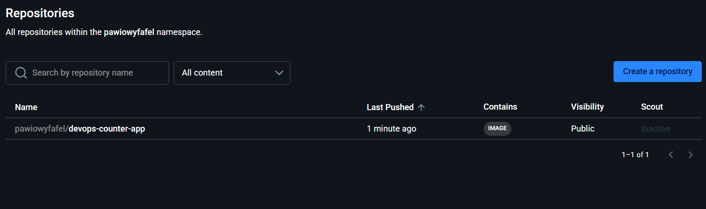
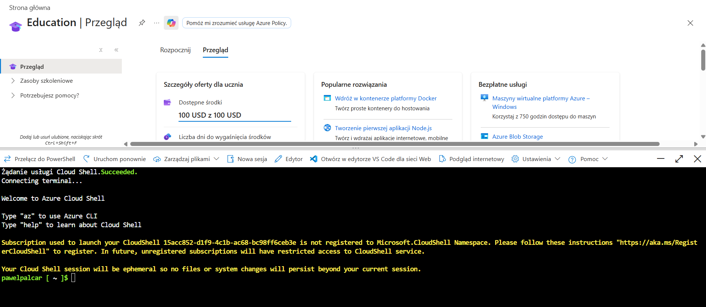
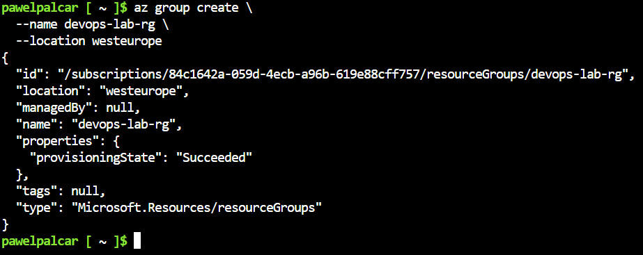
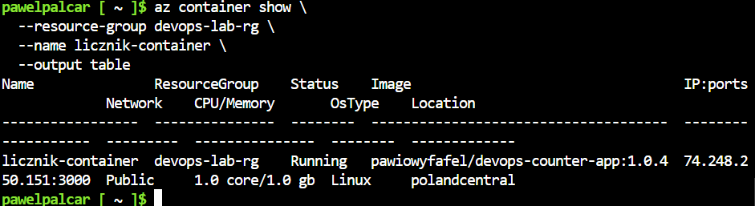
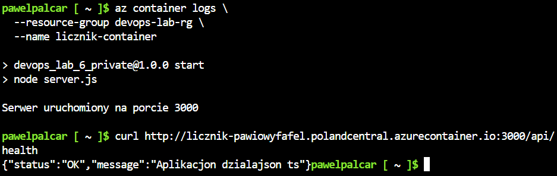
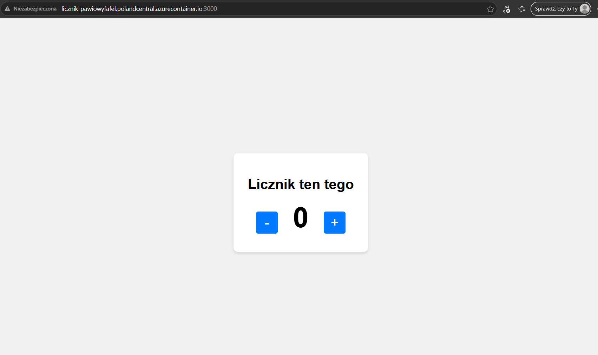
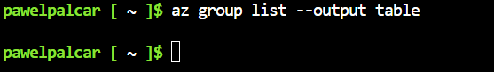

# Sprawozdanie 12

---

## Wdrażanie na zarządzalne kontenery w chmurze Azure

### Czym jest Azure Container Instances?

Azure Container Instances to usługa chmurowa Microsoftu pozwalająca uruchomić kontener Docker bezpośrednio w chmurze, bez konieczności zarządzania maszynami wirtualnymi ani klastrem Kubernetes. Kontener dostaje publiczny adres IP i domenę DNS, przez którą jest dostępny z całego internetu.

Kluczowe pojęcia:

- **Resource Group** – logiczny kontener na zasoby Azure. Wszystkie zasoby należące do jednego zadania umieszcza się w jednej grupie, żeby móc je łatwo zarządzać i usunąć jedną komendą
- **Azure Container Instances** – usługa uruchamiania kontenerów; płatność tylko za czas działania kontenera
- **Azure Cloud Shell** – terminal dostępny bezpośrednio w przeglądarce z zainstalowanym `az` CLI; nie wymaga żadnej lokalnej instalacji

---

## Przygotowanie obrazu na Docker Hub

Przed wdrożeniem w Azure obraz musi być publicznie dostępny na Docker Hub. Obraz aplikacji został wyeksportowany ze środowiska Jenkins i wypchnięty na konto:

```powershell
# Eksport obrazu z kontenera dind Jenkinsa
docker exec jenkins-docker docker save devops-counter-app:1.0.4 -o /var/jenkins_home/app.tar
docker cp jenkins-docker:/var/jenkins_home/app.tar ./app.tar
docker load -i app.tar

# Tagowanie i push na Docker Hub
docker tag devops-counter-app:1.0.4 pawiowyfafel/devops-counter-app:1.0.4
docker login
docker push pawiowyfafel/devops-counter-app:1.0.4
```

Obraz widoczny publicznie na Docker Hub:



---

## Zapoznanie z platformą Azure

Dostęp do Azure uzyskano przez subskrypcję studencką AGH. Po zalogowaniu na portal.azure.com uruchomiono Azure Cloud Shell – terminal Bash działający bezpośrednio w przeglądarce:



## Wdrożenie kontenera

### Krok 1: Utworzenie Resource Group

```bash
az group create \
  --name devops-lab-rg \
  --location polandcentral
```




### Krok 2: Wdrożenie kontenera z Docker Hub

```bash
az container create \
  --resource-group devops-lab-rg \
  --name licznik-container \
  --image pawiowyfafel/devops-counter-app:1.0.4 \
  --dns-name-label licznik-pawiowyfafel \
  --ports 3000 \
  --os-type Linux \
  --cpu 1 \
  --memory 1 \
  --location polandcentral
```

Azure pobrał obraz z Docker Hub, uruchomił kontener i przypisał mu publiczną domenę:
`licznik-pawiowyfafel.polandcentral.azurecontainer.io`

### Krok 3: Weryfikacja stanu kontenera

```bash
az container show \
  --resource-group devops-lab-rg \
  --name licznik-container \
  --output table
```



Kontener w stanie `Running`, obraz `pawiowyfafel/devops-counter-app:1.0.4`, region `polandcentral`, port 3000 otwarty publicznie.

### Krok 4: Logi kontenera i test HTTP

```bash
az container logs \
  --resource-group devops-lab-rg \
  --name licznik-container
```

```bash
curl http://licznik-pawiowyfafel.polandcentral.azurecontainer.io:3000/api/health
```




### Krok 5: Aplikacja dostępna w przeglądarce



Aplikacja licznika dostępna pod publicznym adresem `http://licznik-pawiowyfafel.polandcentral.azurecontainer.io:3000` – działająca identycznie jak lokalnie.

---

## Usunięcie zasobów

Po zakończeniu ćwiczenia kontener i resource group zostały usunięte:

```bash
az container stop \
  --resource-group devops-lab-rg \
  --name licznik-container

az container delete \
  --resource-group devops-lab-rg \
  --name licznik-container \
  --yes

az group delete \
  --name devops-lab-rg \
  --yes \
  --no-wait
```

Weryfikacja że lista resource group jest pusta:

```bash
az group list --output table
```



Pusta lista potwierdza usunięcie wszystkich zasobów i brak dalszego naliczania kosztów.
