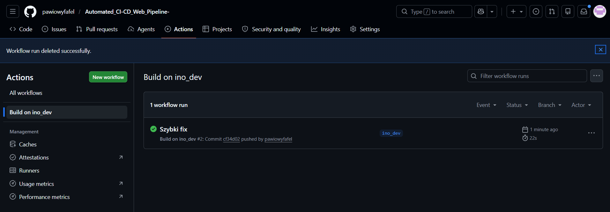

# Sprawozdanie 13

---

## Shift-left: GitHub Actions

### Czym jest GitHub Actions i podejście *shift-left*?

*Shift-left* to podejście polegające na przesuwaniu kontroli jakości (testów, budowania, analizy kodu) jak najbliżej momentu napisania kodu. GitHub Actions realizuje tę ideę wprost w repozytorium: wystarczy commitować zmiany do wskazanej gałęzi, a GitHub automatycznie uruchamia zdefiniowany proces budowania i testowania na własnych serwerach, bez potrzeby konfigurowania zewnętrznego serwera CI jak Jenkins.

Kluczowy element konfiguracji to **trigger** (sekcja `on:`) – decyduje, jakie zdarzenie w repozytorium wywołuje workflow. W tym ćwiczeniu trigger został ograniczony do push na dedykowaną gałąź `ino_dev`, co pozwala testować zmiany na osobnej gałęzi bez ryzyka wpływu na główny projekt.

---


## Konfiguracja workflow

Utworzono plik `.github/workflows/build.yaml`:

```yaml
name: Build on ino_dev

on:
  push:
    branches:
      - ino_dev

jobs:
  build:
    runs-on: ubuntu-latest

    steps:
      - name: Checkout repository
        uses: actions/checkout@v4

      - name: Setup Node.js
        uses: actions/setup-node@v4
        with:
          node-version: '20'

      - name: Install dependencies
        run: npm install

      - name: Run tests
        run: npm test

      - name: Build application
        run: |
          mkdir -p build
          cp app.js server.js build/
          cp -r public build/
          cp package*.json build/

      - name: Upload build artifact
        uses: actions/upload-artifact@v4
        with:
          name: devops-counter-app-build
          path: build/
```

### Wyjaśnienie kluczowych elementów

| Element | Znaczenie |
|---|---|
| `on: push: branches: [ino_dev]` | Trigger – workflow uruchamia się wyłącznie przy push do gałęzi `ino_dev` |
| `runs-on: ubuntu-latest` | Runner dostarczany przez GitHub – wirtualna maszyna Ubuntu |
| `actions/checkout@v4` | Pobiera kod repozytorium na runner |
| `actions/setup-node@v4` | Instaluje wskazaną wersję Node.js |
| `actions/upload-artifact@v4` | Zapisuje zbudowany artefakt – dostępny do pobrania z zakładki Actions |

---

## Pierwsze uruchomienie – napotkany błąd

Po pierwszym push do `ino_dev` workflow uruchomił się automatycznie, ale zakończył się błędem już na kroku Run tests.

### Analiza problemu

Przyczyną było to, że folder `node_modules` był zacommitowany do repozytorium. Pliki wykonywalne przesłane przez Git, zwłaszcza pochodzące z systemu Windows, często tracą metadane uprawnień Unix po sklonowaniu na runnerze Linux, stąd `Permission denied` mimo że ten sam kod działał lokalnie.

### Rozwiązanie

Usunięto `node_modules` z repozytorium i dodano go do `.gitignore`, pozwalając krokowi `npm install` zainstalować zależności od zera na każdym uruchomieniu runnera.

---

## Drugie uruchomienie – sukces

Push z poprawką automatycznie wywołał kolejny run workflow:



Build zakończył się statusem sukcesem w czasie 22 sekund, bez żadnych błędów. Świeżo zainstalowane przez `npm install` zależności na runnerze miały poprawne uprawnienia wykonywalności, dzięki czemu `npm test` przeszedł bez problemu.

---

## Wnioski

Ćwiczenie pokazało praktyczne znaczenie zasady *shift-left*, błąd w projekcie został wykryty automatycznie przy pierwszej kontrybucji do gałęzi deweloperskiej, zanim zmiana mogłaby trafić do głównej linii rozwoju projektu. Bez automatycznego workflow problem mógłby pozostać niezauważony lokalnie i ujawnić się dopiero na środowisku produkcyjnym lub u innego współpracownika.
