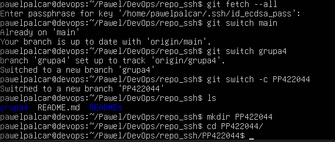
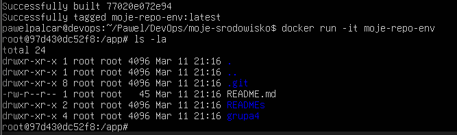
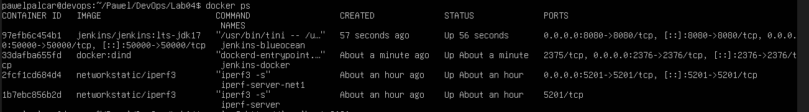
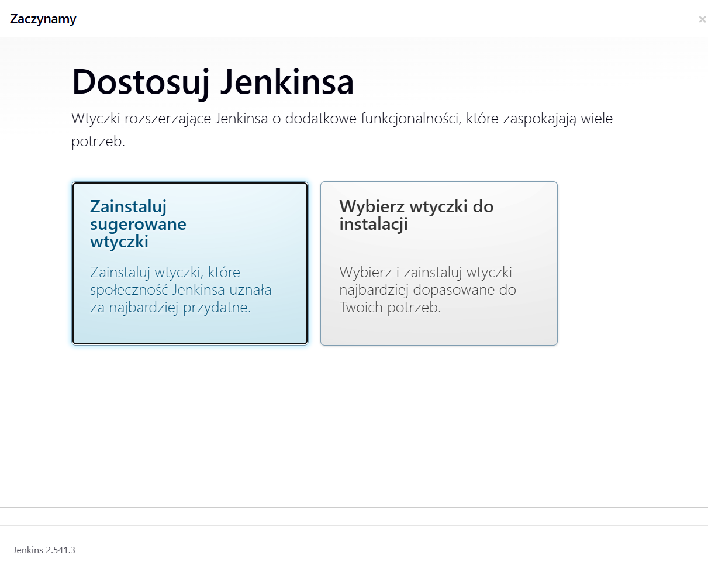

# Sprawozdanie zbiorcze — Laboratoria 1–4

---

## Laboratorium 1 — Git, SSH, gałęzie

### System kontroli wersji

Git to narzędzie, które śledzi zmiany w kodzie i pozwala wielu osobom pracować nad tym samym projektem bez nadpisywania sobie nawzajem pracy. Każda zmiana jest zapisywana jako commit z opisem, dzięki czemu zawsze można wrócić do wcześniejszej wersji.

Repozytorium można sklonować na dwa sposoby:
- **HTTPS** — wymaga podania tokena dostępu (Personal Access Token)
- **SSH** — wygodniejsze, bo nie trzeba podawać hasła przy każdej operacji

### Klucze SSH

SSH działa w oparciu o parę kluczy: publiczny (trafia na GitHub) i prywatny (zostaje na naszym komputerze). Przy połączeniu GitHub sprawdza, czy mamy pasujący klucz prywatny — jeśli tak, wpuszcza nas bez hasła.

```bash
ssh-keygen -t ed25519 -C "pawel.palcar@wp.pl" -f ~/.ssh/id_ed25519_nopass

ssh-keygen -t ecdsa -b 521 -C "pawel.palcar@wp.pl" -f ~/.ssh/id_ecdsa_pass
```


Dodatkowo skonfigurowano uwierzytelnianie dwuskładnikowe 2FA — to dodatkowa warstwa ochrony, gdzie oprócz hasła trzeba podać kod z aplikacji.

### Gałęzie

Gałęzie pozwalają pracować nad zmianami w izolacji, nie ruszając głównego kodu.

```bash
git fetch --all
git switch main
git switch grupa4
git switch -c PP422044
```



### Git Hook

Git Hook to skrypt uruchamiany automatycznie przy pewnych operacjach Gita. Zaimplementowany hook `commit-msg` sprawdza, czy każda wiadomość commita zaczyna się od wymaganego prefiksu — jeśli nie, commit jest blokowany.

```bash
#!/bin/bash
PREFIX="PP422044"
COMMIT_MSG=$(head -n 1 "$1")
if [[ "$COMMIT_MSG" != "$PREFIX"* ]]; then
  echo "Błąd: commit message musi zaczynać się od '$PREFIX'"
  exit 1
fi
exit 0
```

### Pull Request

Pull Request to prośba o włączenie zmian z naszej gałęzi do gałęzi grupowej. Zanim zmiany zostaną scalone, ktoś inny może je przejrzeć i zatwierdzić. Dzięki temu główna gałąź pozostaje czysta.


---

## Laboratorium 2 — Docker, obrazy, Dockerfile

### Konteneryzacja

Docker pozwala uruchamiać aplikacje w kontenerach — izolowanych środowiskach, które zawierają wszystko, czego aplikacja potrzebuje do działania. Dzięki temu aplikacja działa tak samo na każdej maszynie, niezależnie od tego, co jest zainstalowane na hoście.

### Instalacja

```bash
sudo apt update 
sudo apt install docker.io -y
sudo usermod -aG docker $USER
newgrp docker
docker --version
```


### Obrazy i Docker Hub

Obraz to gotowy szablon środowiska, z którego tworzymy kontenery. Docker Hub to publiczne repozytorium takich obrazów. W ramach zajęć pobrano i przetestowano m.in.:

- `hello-world` — najprostszy test działania Dockera
- `busybox` — ultralekki system z podstawowymi narzędziami
- `ubuntu` — pełne systemy linuksowe
- `mariadb` — baza danych


### Własny obraz — Dockerfile

Dockerfile to przepis na zbudowanie własnego obrazu. Każda instrukcja to jedna warstwa.

```dockerfile
FROM ubuntu:24.04

ENV DEBIAN_FRONTEND=noninteractive

RUN apt-get update
    && apt-get install -y git
    && rm -rf /var/lib/apt/lists/*

WORKDIR /app
RUN git clone https://github.com/InzynieriaOprogramowaniaAGH/MDO2026_ITE.git

CMD ["/bin/bash"]
```

```bash
docker build -t moje-repo-env .
docker run -it moje-repo-env
ls -la
```


### Zarządzanie zasobami

Po pracy z Dockerem zostają osierocone kontenery i obrazy, które zajmują miejsce na dysku.

```bash
docker ps -a                 # wszystkie kontenery
docker images                # lista obrazów
docker container prune -f    # usuń zatrzymane kontenery
docker image prune           # usuń nieużywane obrazy
```

---

## Laboratorium 3 — Dockerfile jako etapy CI

### Powtarzalność procesu budowania

W DevOps zależy nam na tym, żeby proces budowania działał identycznie na każdej maszynie. Kontenery to rozwiązują — zamiast instalować zależności na każdej maszynie osobno, pakujemy je razem z kodem w obraz.

Do zajęć wykorzystałem expressjs.

```bash
sudo apt install -y nodejs npm
git clone https://github.com/expressjs/express.git .
npm test
```

### Dwa Dockerfile: Build i Test

Proces podzielono na dwa etapy. `Dockerfile.build` kompiluje projekt, a `Dockerfile.test` bazuje na gotowym obrazie i tylko uruchamia testy — nie buduje od nowa.

**Dockerfile.build:**
```dockerfile
FROM node:18-bullseye AS base

LABEL stage="build"

WORKDIR /lab3

RUN git clone https://github.com/expressjs/express.git

RUN npm install

CMD ["echo", "Obraz gotowy do testow"]
```

**Dockerfile.test:**
```dockerfile
FROM lab-3-p-build:latest

WORKDIR /lab3

CMD ["npm", "test"]
```

---

## Laboratorium 4 — Woluminy, sieci, Jenkins

### Trwałe przechowywanie danych

Po usunięciu kontenera wszystkie dane w nim zapisane znikają. Żeby to obejść, używamy:

- Woluminów — Docker zarządza nimi sam, dane żyją niezależnie od kontenera
- Bind mountów — mapujemy konkretny katalog z hosta do kontenera

**Klonowanie repozytorium z zewnątrz kontenera (bind mount):**
```bash
git clone https://github.com/expressjs/express.git ./input_code
docker volume create output-vol

docker run -it --rm -v$(pwd)/input_code:/app/input -v output_vol:/app/output node:18-bullseye /bin/bash
npm install
cp -r . /app/output/
```

**Klonowanie wewnątrz kontenera:**
```bash
docker volume create input_vol
docker run -it --rm -v input_vol:/app/input -v output_vol:/app/output node:18-bullseye /bin/bash
apt-get update && apt-get install -y git
git clone https://github.com/expressjs/express.git /app/input
npm install 
cp -r . /app/output/
exit
```

Bind mount jest wygodniejszy przy pracy lokalnej, natomiast klonowanie wewnątrz kontenera jest bardziej przenośne.

### Sieci Docker i iPerf

W domyślnej sieci Dockera kontenery komunikują się przez adresy IP. Po stworzeniu własnej sieci mostkowej można odwoływać się do kontenerów po nazwie — jest to wygodniejsze i bezpieczniejsze.

Do przetestowania połączenia i zmierzenia przepustowości użyto narzędzia iPerf3:

```bash
docker run -d --name iperf-server networkstatic/iperf3 -s
docker inspect -f '{{range.Network.Settings.Networks}}{{.IPAddress}}{{end}}' iperf-server
docker run -it --rm network static/iperf3 -c 172.17.0.2
```


### SSHD w kontenerze

SSH umożliwia zdalne połączenie z działającym kontenerem, co przydaje się przy debugowaniu.

```bash
docker run -d --name ssh-container -p 2222:22 ubuntu:latest sleep infinity
docker exec -it ssh-container bash
apt update && apt install -y openssh-server
echo 'root:pawelpalcar' | chpasswd
sed -i 's/#PermitRootLogin prohibit-password/PermitRootLogin yes/' 

ssh root@localhost -p 2222
```


### Jenkins + Docker-in-Docker

Jenkins to serwer CI/CD — automatyzuje budowanie, testowanie i wdrażanie aplikacji po każdym commicie.


```bash
docker network cerate jenkins
docker run --name jenkins-docker --rm --detach --privileged --network jenkins docker:dind
docker run --name jenkins-blueocean --rm --detach --network jenskins --publish 8080:8080 --publish 50000:50000 jenkins/jenkins:lts-jdk17

docker ps
```

Panel Jenkinsa dostępny pod adresem `http://localhost:8080`.




