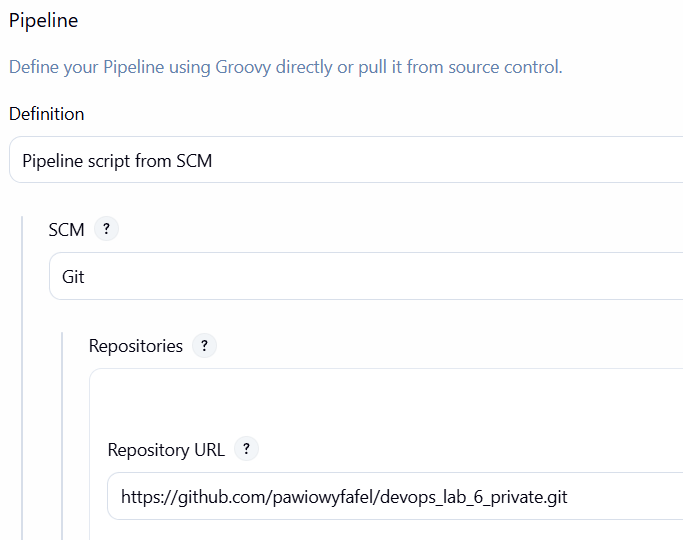

# Sprawozdanie 5-7

---

## Wstęp

Celem laboratoriów było zaprojektowanie, wdrożenie i zoptymalizowanie w pełni zautomatyzowanego procesu ciągłej integracji i ciągłego wdrażania (CI/CD). Zamiast polegać na ręcznych procesach, całe środowisko zostało zdefiniowane jako kod, od samego serwera Jenkins, poprzez definicję budowania obrazów, aż po proces testowania i wdrażania na infrastrukturę docelową.

## Jenkins w kontenerze

Zamiast instalować Jenkinsa bezpośrednio na naszym komputerze, został zamknięty w kontenerze Docker.

Jakie są tego zalety:
- Porządek: Jenkins żyje w swoim własnym, zamkniętym pudełku. Nie psuje nam niczego na głównym systemie.

- Łatwe przenoszenie: Wszystkie dane Jenkinsa takie jak ustawienia, projekty trzymamy w specjalnym katalogu (wolumenie). Jeśli chcemy przenieść Jenkinsa na inny komputer, po prostu kopiujemy ten katalog i odpalamy kontener na nowo.

- Dostęp do Dockera: Aby Jenkins mógł budować obrazy Dockerowe wewnątrz pipeline'ów, musi mieć dostęp do demona Dockera. Wdrożono rozwiązanie oparte o izolowaną sieć w Dockerze oraz mechanizm DinD.

## Multi-stage Dockerfile

Do stworzenia obrazu naszej aplikacji został użyty mechanizm Multi-stage build. Plik Dockerfile został podzielony na trzy etapy:

1. Instalacja zależności (builder) – Pobieramy wszystkie narzędzia potrzebne do zbudowania kodu.

2. Testowanie (tester) – Uruchamiamy testy. Jeśli aplikacja nie przejdzie testów, Docker przerywa pracę i zgłasza błąd.

3. Produkcja (runner) – Kopiujemy tylko gotowy kod i absolutnie niezbędne pliki uruchomieniowe.

```Dockerfile
# Instalacja i budowanie
FROM node:20-alpine AS builder
WORKDIR /app
COPY package*.json ./
RUN npm install
COPY . .

# Testowanie
FROM builder AS tester
RUN npm test

FROM node:20-alpine AS runner
WORKDIR /app
ENV NODE_ENV=production

ARG GIT_COMMIT=unknown
ARG BUILD_NUMBER=unknown
LABEL org.opencontainers.image.revision="${GIT_COMMIT}" \
      ci.build.number="${BUILD_NUMBER}"

COPY package*.json ./
RUN npm install --only=production
COPY public ./public
COPY app.js server.js ./

EXPOSE 3000
CMD ["npm", "start"]
```

## Pipeline as Code

Zamiast konfigurować kolejne kroki w graficznym interfejsie Jenkinsa, zastosowano opcje Script from SCM. Cały proces CI/CD został opisany w pliku Jenkinsfile, który znajduje się w repozytorium.

Jakie są tego zalety:
- Historia zmian: Skoro to plik tekstowy w repozytorium Git, to zawsze widzimy, kto, kiedy i dlaczego zmienił sposób budowania naszej aplikacji.

- Bezpieczeństwo: Jeśli serwer Jenkinsa eksploduje, nie tracimy naszej konfiguracji procesu, bo mamy ją bezpieczną na GitHubie.



## Etapy Pipelinu

Kiedy wrzucamy nowy kod, Jenkins odpala nasz Jenkinsfile i realizuje po kolei konkretne zadania:

1. Clone: Jenkins pobiera najświeższy kod z GitHuba.

2. Build & Test: Jenkins prosi Dockera o zbudowanie obrazu aplikacji. W trakcie budowania automatycznie odpalane są testy.

3. Deploy & Smoke Test: Jenkins uruchamia aplikację. Następnie wykonuje Smoke Test. Otwiera wirtualną przeglądarkę i sprawdza adres strony (curl http://docker:3000/api/health). Jeśli strona odpowiada, wiemy, że aplikacja działa.

4. Publish / Artefakty: Gotowy, działający obraz Dockera pakujemy do przenośnego pliku .tar.

```Dockerfile
pipeline {
    agent any

    environment {
        IMAGE_NAME = "devops-counter-app"
        VERSION    = "1.0.${BUILD_NUMBER}"
    }

    stages {
        stage('Clone') {
            steps {
                checkout scm
            }
        }

        stage('Build & Test Container') {
            steps {
                sh """
                    docker build \
                    --build-arg GIT_COMMIT=\$(git rev-parse --short HEAD) \
                    --build-arg BUILD_NUMBER=${BUILD_NUMBER} \
                    -t ${IMAGE_NAME}:${VERSION} .
                """
            }
        }

        stage('Publish Artifact') {
            steps {
                sh "docker tag ${IMAGE_NAME}:${VERSION} ${IMAGE_NAME}:latest"
                echo "Otagowano artefakt jako: ${IMAGE_NAME}:${VERSION}"
            }
        }

        stage('Deploy & Smoke Test') {
            steps {
                script {
                    def targetHost = "docker"
                    
                    sh "docker rm -f counter-container || true"
                    sh "docker run -d --name counter-container -p 3000:3000 ${IMAGE_NAME}:${VERSION}"
                    
                    echo "Wykonuję Smoke Test na adresie: http://${targetHost}:3000/api/health"
                    sh """
                        sleep 5
                        curl -f http://${targetHost}:3000/api/health || (docker logs counter-container && exit 1)
                    """
                }
            }
        }
    }
    
    post {
        always {
            script {
                sh "docker inspect ${IMAGE_NAME}:${VERSION} > docker-inspect-${VERSION}.json || true"
                sh "docker logs counter-container > container-logs-${VERSION}.txt || true"
            }
            archiveArtifacts artifacts: "*.json, *.txt", allowEmptyArchive: true
        }
    }
}
```

## Przygotowanie Ansible

Na koniec wyszliśmy poza naszego lokalnego Dockera i przygotowaliśmy Maszynę Wirtualną, by móc nią zarządzać na odległość.

- Logowanie bez hasła (Klucze SSH): Wygenerowaliśmy klucze i przesłaliśmy je na serwer docelowy. Ponieważ automatyczne boty (takie jak Jenkins czy Ansible) nie potrafią wpisywać hasła z klawiatury.


- Snapshot: Zrobiliśmy migawkę maszyny wirtualnej. Gdybyśmy zepsuli system podczas testowania automatycznych wdrożeń.

